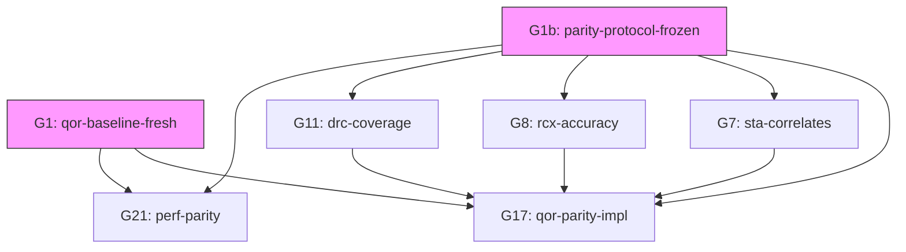

# QoR Baseline & Commercial Parity Documentation

> 此目录包含 iEDA 商业能力对标的基线数据和协议文件
>
> 生成日期：2026-07-30
> 对应主计划：`docs/ai/00-ieda-commercial-parity-master-plan-v1.1.md` §1bis, §3.4
> 门禁：G1 (qor-baseline-fresh), G1b (parity-protocol-frozen), G17 (qor-parity-impl)

## 文件清单

### 1. `parity_protocol.json`

**用途**：冻结的"苹果对苹果"对标协议，定义 iEDA 与商业工具对比的所有规则。

**状态**：已冻结 (v1.1, `aes13-commercial-parity-v1.1`)

**内容**：
- **输入等价规则**：netlist/库/约束/随机种子/设计边界/追溯性
- **流程等价规则**：主对标方（Innovus）/努力档位/报告点/指标定义/失败语义
- **判定公式**：delta 容忍度、不确定度带计算
- **默认 delta 值**：
  - 时序 (WNS/TNS): 5% 或 ≤10ps
  - 面积/利用率: 5%
  - 线长/via: 8%
  - 功耗: 5%
  - DRC: 必须同为 0
  - CTS: 5%
- **性能采集规范**：独占机器、5次重复、median/MAD、分阶段时间

**使用**：
- 所有商业对照实验必须遵循此协议
- 协议版本号变更需更新所有 baseline manifest
- G1b 门禁检查此文件存在且版本号匹配

### 2. `baseline_35pct.json`

**用途**：iEDA AES13 13个配置（70% 目标利用率，文档中称"35% baseline"）的完整 QoR 数据。

**数据来源**：
- `/benchmarks/results/aes13-final-20260724-rv2.3/` (2 designs: aes, aes_sky130_a)
- `/benchmarks/results/aes11-functional-parallel-20260725-rv2.3/` (11 designs)

**包含指标**：
- **时序**：setup/hold WNS/TNS, worst path delay, unconstrained endpoints
- **物理**：HPWL, FLUTE, EGR wirelength
- **DRC**：total count (per-category when available)
- **功耗**：total/switch/internal/leakage (当前均为 null，缺 VCD/SAIF)
- **性能**：routing runtime, iterations
- **拥塞**：horizontal/vertical/union overflow statistics
- **结构**：cell count, cell area, die/core dimensions, target utilization

**当前状态（v1.9 实测）**：
- 执行成功率：13/13 (100%)
- 质量合格率：0/13 (0%)
  - G11 (DRC clean): 13/13 fail (avg DRC = 57,692)
  - G7 (SPEF-backed STA): 13/13 fail (所有路径 net delay = 0)
  - G9 (activity-backed power): 13/13 not_run (无 VCD/SAIF)
  - GDS signoff: 13/13 fail (DRC 非零)
- **不可比性声明**：所有性能数据标记 `comparable=false`（未使用独占机器、无重复样本）

**使用**：
- G1 门禁：二进制 hash 变更后必须重新生成此文件
- G17 对比：作为 iEDA 侧指标来源
- CI 集成：`run_qor_baseline.sh` 产出此文件

### 3. `extract_baseline.py`

**用途**：从 AES13 结果目录提取 QoR 数据，生成 `baseline_35pct.json`。

**运行方式**：
```bash
cd /home/lxq/AiEDA/iEDA.ai
python3 benchmarks/qor/extract_baseline.py
```

**输入**：
- `benchmarks/results/aes13-final-20260724-rv2.3/*/quality_summary.json`
- `benchmarks/results/aes11-functional-parallel-20260725-rv2.3/*/quality_summary.json`

**输出**：
- `benchmarks/qor/baseline_35pct.json`

**特点**：
- 自动聚合 13 个配置
- 计算汇总统计量（成功率、DRC clean 率、平均值、最坏/最好值）
- 包含 provenance (binary/protocol/build/hardware SHA-256)

### 4. `../docs/ai/commercial_comparison_procedure.md`

**用途**：商业工具对照数据采集的完整操作手册。

**内容**：
- **工具清单**：Innovus/ICC2, PrimeTime, StarRC, Calibre, PTPX
- **输入准备**：netlist/约束/PDK/floorplan/seed
- **Innovus 脚本模板**：标准 P&R 流程（standard effort）
- **数据提取脚本**：从商业工具报告解析 QoR 指标
- **PrimeTime 签核 STA**：G7 相关度验证（iEDA 和 Innovus 的 DEF 都用 PT 读）
- **StarRC 寄生提取**：G8 精度验证（逐网 C/R 对比）
- **Calibre DRC**：G11 覆盖率验证（rule deck 映射）
- **性能采集**：独占机器、5次重复、median/MAD、分阶段时间
- **数据整合脚本**：对比 iEDA 和商业工具，生成 parity 报告
- **时间估算**：10-16 人天（2-3 周）

**使用场景**：
- Phase 0 商业侧数据采集
- G17/G21 验证准备
- 新 PDK/新设计接入时的对照实验

## 门禁关系



**说明**：
- **G1b** 是所有对比门禁的前置条件（协议冻结）
- **G1** 保证 baseline 随二进制更新（CI 自动化）
- **G7/G8/G11** 是签核真值源门禁，必须先于 G17 时序/功耗/DRC 行转绿
- **G17** 是 QoR 打平总门禁（逐指标独立判定）
- **G21** 是性能打平门禁（日常 ≤1.5×，大设计 ≤3×）

## 下一步工作（Phase 0 剩余任务）

根据主计划 §5 Phase 0：

- [ ] **商业侧数据采集**：按 `commercial_comparison_procedure.md` 执行 Innovus 13 配置
- [ ] **PrimeTime 对齐**：`run_pt_align.sh` 首轮 R² 产出（不要求 ≥0.98）
- [ ] **对照实验**：22/26/27/25 各自 §P0 测法（宏布局空操作/timing A/B/plateau）
- [ ] **01-baseline-report.md**：汇总数字、分项墙钟表、未验证清单前 N 条清零纪要
- [ ] **CI 集成**：二进制 hash 变 → 自动重跑 `extract_baseline.py` → G1 FAIL

## 已知限制（v1.9 诚实声明）

1. **时序数据不可信**：所有路径 net delay = 0（缺 SPEF），G7 未通过 → 时序相关的 G17 行不可宣称打平
2. **DRC 全部非零**：avg = 57,692，G11 未通过 → route-clean 是 P0 攻坚重点
3. **功耗数据缺失**：无 VCD/SAIF，G9 不可评估
4. **性能数据非对照**：未使用独占机器、无重复样本 → G21 不可比
5. **ASAP7 异常**：setup WNS = -1491.028 ns（可能是单位问题），需定位约束/SPEF 链
6. **商业侧数据未采集**：本 baseline 仅 iEDA 侧，G17/G21 判定需商业金标

## 参考资料

- 主计划：`docs/ai/00-ieda-commercial-parity-master-plan-v1.1.md`
- 技术细则：`docs/ai/04-ppa-technical-review-and-optimization-rv1.md` §2.3 (G7), §2.4 (G8), §2.6 (G21)
- 性能协议：`docs/ai/42-perf-parity.md`
- iSTA 方案：`docs/ai/27-iSTA.md` rv2.1 (PBA/MCMM/vs PT)
- iRT 方案：`docs/ai/26-iRT.md` rv2.1 (收敛/timing-driven)
- iPL 方案：`docs/ai/22-iPL.md` rv2.1 (宏/QP/拥塞/时序)

---

**维护者**：Sub-Agent F (QoR Validator 专家)
**生成日期**：2026-07-30
**版本**：1.0
**状态**：G1/G1b 数据已就绪，等待商业侧采集启动 Phase B
