# AES 12 项 @ 65% · WP-RT-01b QoR 改造后对比报告

生成时间：2026-07-31T17:54:11+08:00
数据根：`/home/lxq/AiEDA/iEDA.ai/benchmarks/results/aes13_65pct_qor_wp_rt01b_20260731_1520`
对照基线：`/home/lxq/AiEDA/iEDA.ai/benchmarks/results/aes13_65pct_trueutil_20260730_1931`（trueutil，原 [`aes12_65pct_detailed_comparison.md`](aes12_65pct_detailed_comparison.md)）
二进制：`iEDA.ai/bin/iEDA`（含 WP-RT-01b 末轮 plateau 加轮修复）
体例：对齐原 detailed_comparison（总表 / 图 / 分设计舞台图 / 空间 map）

## 0. 结论（先看）

- **DRC 相对 trueutil**：12/12 全降，Δ 约 **-4.39% ~ -1.83%**（均值 **-2.89%**）。
- **未达 ≥20% 目标**：满足 ΔDRC≤−20% 的设计数 = **0/12**。
- **杠杆确已生效**：`rule_aware_cost/enhanced_minarea/component_escalate/prl_short_repair=on`；9/12 触发 Component escalate；9/12 触发末轮加轮 append。
- **口径警告**：基线 trueutil 为 `MAX_BOXES=4`（且部分设计 `MAX_ITERATIONS=1`）；本轮 `MAX_BOXES=48`、`MAX_ITERATIONS=5`。Δ 同时含算法与预算差，**不能**把全部增益记为算法 Done。另：`BEST_EFFORT` 仍将单 box 任务数 cap 到 4，限制修复深度。

## 0.1 本次改造与跑法

| 项 | 内容 |
|---|---|
| C++ | 冲突分量 escalate；末轮 plateau **追加最多 2 轮** mild escalate；规则感知代价；PRL/short 优先修 |
| 开关 | `--rt-rule-aware-cost --rt-enhanced-minarea-repair --rt-component-escalate --rt-prl-short-repair` |
| 预算 | `MAX_ITERATIONS=5`，`MAX_BOXES=48`，`box=48`，`BEST_EFFORT=1`，jobs=4 |
| 种子 | trueutil LG DEF（重跑 routing 及之后） |
| 标签 | DRC/WL/STA/Power = **proxy**（无 SPEF 回标） |

## 0.2 vs trueutil DRC 速览

| Design | trueutil DRC | 本轮 DRC | Δ |
|---|---:|---:|---:|
| aes_sky130_a | 56737 | 55462 | -2.25% |
| aes_sky130_b | 56737 | 55462 | -2.25% |
| aes_sky130_t | 56737 | 55477 | -2.22% |
| aes_nangate45_a | 15637 | 15329 | -1.97% |
| aes_nangate45_b | 15637 | 15329 | -1.97% |
| aes_nangate45_t | 15637 | 15351 | -1.83% |
| aes_asap7_a | 49591 | 48094 | -3.02% |
| aes_asap7_b | 49591 | 48089 | -3.03% |
| aes_asap7_t | 49591 | 48094 | -3.02% |
| aes_ics55_a | 28133 | 26899 | -4.39% |
| aes_ics55_b | 28133 | 26899 | -4.39% |
| aes_ics55_t | 28133 | 26899 | -4.39% |

---

## 1. 执行结论

- 流程完成度：**12/12** 已生成 post-route DEF、GDS（及阶段报告）；可选功耗阶段在无 VCD 时使用 vectorless toggle。
- **实测 Floorplan CORE Usage**：65.0% – 65.3% （目标 65%；Die/Core 由 `cell_area/target` 严格定边，已去掉旧版 MIN_CORE_SIDE 膨胀）。
- 物理签核质量：**0/12 DRC clean**；违例总数范围 15,329 至 55,477。当前结果是流程贯通样本，不是 tapeout-ready 结果。
- 时序可信度：低。所有抽查路径的 `path net delay` 为 0，且存在未约束 I/O；正 slack 只能说明库内单元延迟下的代理检查通过。
- 功耗可信度：低。vectorless 活动率仅为代理；无 VCD/SAIF 时不能用于动态功耗决策。
- 拥塞可信度：分层判断。汇总报告的 `Average Congestion=-1` 无效；但 placement density、EGR overflow 和 early-router 逐层 map CSV 是有效空间证据，已独立统计和成图。
- IR-drop：**0/12 执行**。没有电压降数据，报告显式记为 `N/A`。

> 结论分为“流程工程完成度”和“物理签核完成度”。前者以 DEF/GDS 贯通为准；后者仍受 DRC、寄生、约束和 PDN/IR 缺失限制。

## 2. 数据口径与覆盖

| 指标 | Floorplan | Fanout | Placement | CTS | Legalization | Routing/Post-route | 口径 |
|---|---:|---:|---:|---:|---:|---:|---|
| DEF/结构/利用率 | 实测 | 实测 | 实测 | 实测 | 实测 | 实测 | iDB/DEF |
| 阶段耗时/内存 | 实测 | 实测 | 实测 | 实测 | 实测 | 实测 | stage log / db report |
| HPWL | 推导 | 推导 | 推导 | 推导 | 推导 | 推导 | 单元原点 bbox，适合趋势比较 |
| Routed wirelength | N/A | N/A | N/A | 局部可见 | 局部可见 | 推导+EGR报告 | DEF ROUTED/FIXED 路径 |
| STA | 未运行 | 未运行 | 未运行 | 未运行 | 未运行 | 实测但低置信 | 未回标 SPEF，报告 net delay 为 0 |
| Power | 未运行 | 未运行 | 未运行 | 未运行 | 未运行 | 实测但低置信 | 无 VCD/SAIF，switch power 为 0 |
| Congestion / maps | 未运行 | 未运行 | 9 类密度 CSV | 沿用布局 map | 沿用布局 map | EGR/early-router map 可用；汇总报告无效 | map 是空间原始证据；Average=-1 仅表示汇总接口不可用 |
| DRC | 不适用 | 不适用 | 不适用 | 不适用 | 不适用 | 实测 | iDRC post-route |
| IR-drop | 未运行 | 未运行 | 未运行 | 未运行 | 未运行 | 未运行 | 无 iPNP/iIR 结果，不填 0 |

`DEF HPWL` 由每个 net 的实例放置原点 bbox 推导，不含 LEF pin offset，适用于同一 PDK/网表的阶段趋势；跨 PDK 只作方向性参考。面积、功耗、DRC 规则集合也不同，跨 PDK 排名不能解释为工艺优劣。

Map 图采用 CSV 原始网格，row 0 按笛卡尔坐标显示在底部。同一 map 类型在 12 个设计间使用统一色标，DRC 违例中心密度使用统一对数色标；因此颜色可横向比较，全零图不会被自动拉伸成伪热点。

## 3. 横向总表

| Design | PDK | 状态 | Die (um) | Cells | Setup WNS (ns) | Fmax (MHz) | Power (mW) | EGR WL (um) | DRC | Route (s) | IR-drop |
|---|---|---|---:|---:|---:|---:|---:|---:|---:|---:|---|
| aes_sky130_a | sky130 | success | 404.285 | 9,434 | -2.299 | 208.4 | 62.730 | 350,639.0 | 55,462 | 4,130.7 | 未运行 |
| aes_sky130_b | sky130 | success | 404.285 | 9,434 | -2.299 | 208.4 | 62.730 | 350,639.0 | 55,462 | 4,073.3 | 未运行 |
| aes_sky130_t | sky130 | success | 404.285 | 9,434 | -2.299 | 208.4 | 62.730 | 350,639.0 | 55,477 | 4,070.5 | 未运行 |
| aes_nangate45_a | nangate45 | success | 184.875 | 9,961 | 1.380 | 892.9 | 22.690 | 153,034.0 | 15,329 | 1,560.7 | 未运行 |
| aes_nangate45_b | nangate45 | success | 184.875 | 9,961 | 1.380 | 892.9 | 22.690 | 153,034.0 | 15,329 | 1,475.0 | 未运行 |
| aes_nangate45_t | nangate45 | success | 184.875 | 9,961 | 1.380 | 892.9 | 22.690 | 153,034.0 | 15,351 | 1,693.4 | 未运行 |
| aes_asap7_a | asap7 | success | 66.621 | 19,917 | -1,491.028 | 0.7 | 39.290 | 50,440.0 | 48,094 | 2,454.8 | 未运行 |
| aes_asap7_b | asap7 | success | 66.621 | 19,917 | -1,491.028 | 0.7 | 39.290 | 50,440.0 | 48,089 | 2,387.0 | 未运行 |
| aes_asap7_t | asap7 | success | 66.621 | 19,917 | -1,491.028 | 0.7 | 39.290 | 50,440.0 | 48,094 | 2,442.4 | 未运行 |
| aes_ics55_a | ics55 | success | 213.510 | 9,453 | 0.845 | 604.3 | 190.800 | 191,812.0 | 26,899 | 1,492.7 | 未运行 |
| aes_ics55_b | ics55 | success | 213.510 | 9,453 | 0.845 | 604.3 | 190.800 | 191,812.0 | 26,899 | 1,695.7 | 未运行 |
| aes_ics55_t | ics55 | success | 213.510 | 9,453 | 0.845 | 604.3 | 190.800 | 191,812.0 | 26,899 | 1,794.3 | 未运行 |

## 4. 关键横向图

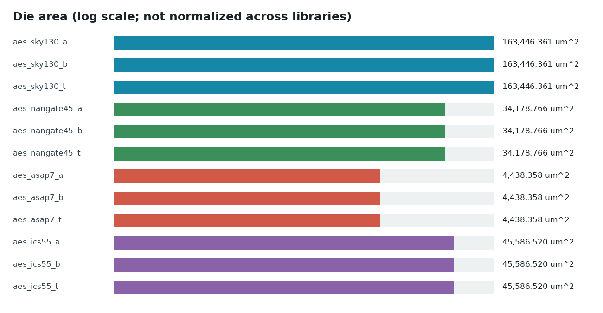

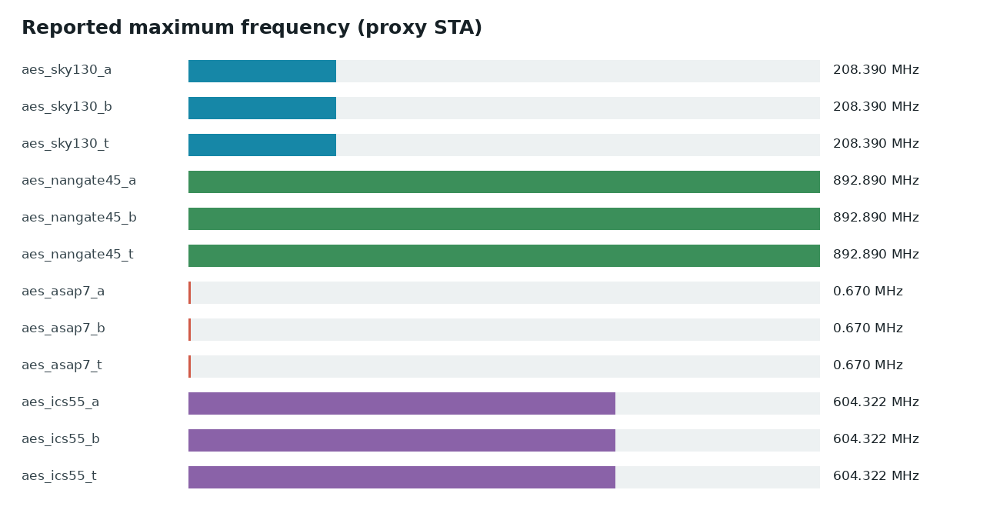

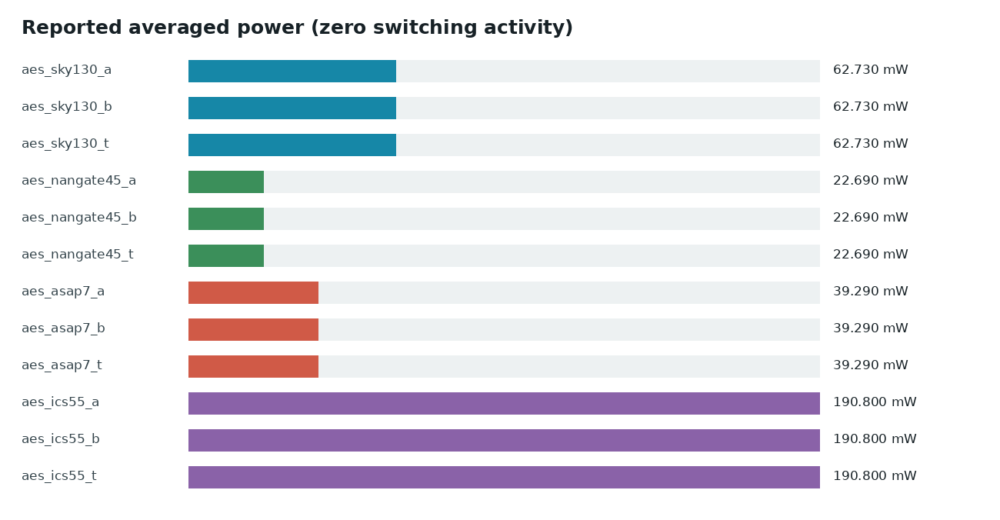

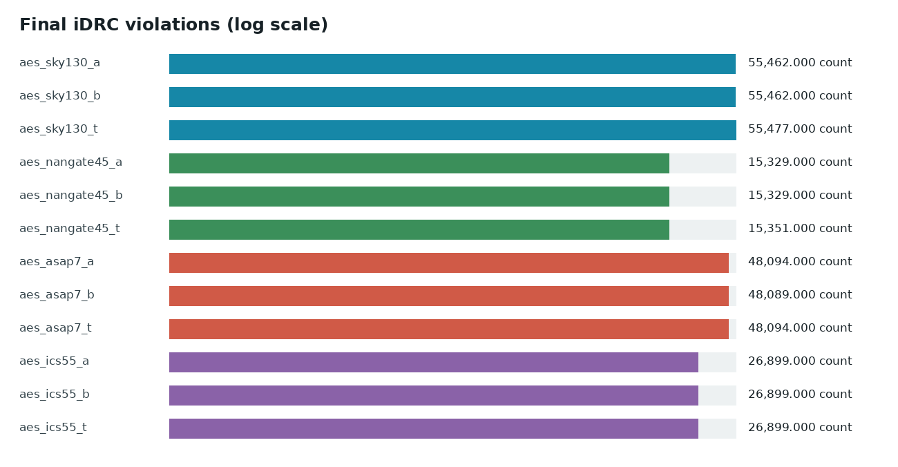

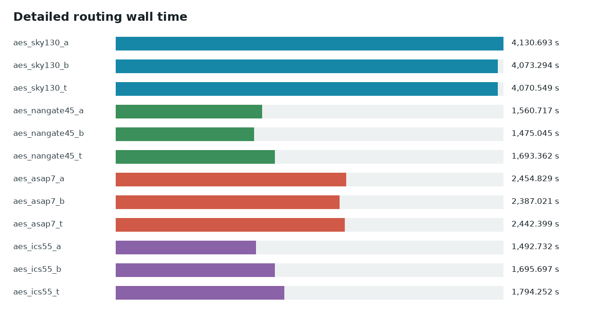

## 5. 空间 Map 横向对比

每个设计渲染 16 张代表图：9 张布局密度、3 张 EGR overflow、3 张 early-router planar、1 张 DRC 违例中心密度。所有按层 net/supply/overflow CSV 均保留在逐设计原始文件索引中。

| Design | Raw maps | Rendered | EGR union non-zero | EGR max | Planar overflow non-zero | Planar max | DRC non-zero bins | DRC bin max |
|---|---:|---:|---:|---:|---:|---:|---:|---:|
| aes_sky130_a | 34 | 16 | 47.35% | 76 | 47.35% | 76 | 13,880 | 38 |
| aes_sky130_b | 34 | 16 | 47.35% | 76 | 47.35% | 76 | 13,880 | 38 |
| aes_sky130_t | 34 | 16 | 47.35% | 76 | 47.35% | 76 | 13,880 | 38 |
| aes_nangate45_a | 46 | 16 | 9.89% | 36 | 0.89% | 10 | 5,498 | 15 |
| aes_nangate45_b | 46 | 16 | 9.89% | 36 | 0.89% | 10 | 5,498 | 15 |
| aes_nangate45_t | 46 | 16 | 9.89% | 36 | 0.89% | 10 | 5,501 | 15 |
| aes_asap7_a | 46 | 16 | 0.00% | 1 | 0.00% | 0 | 12,008 | 23 |
| aes_asap7_b | 46 | 16 | 0.00% | 1 | 0.00% | 0 | 12,011 | 23 |
| aes_asap7_t | 46 | 16 | 0.00% | 1 | 0.00% | 0 | 12,008 | 23 |
| aes_ics55_a | 37 | 16 | 25.69% | 61 | 23.90% | 58 | 11,789 | 13 |
| aes_ics55_b | 37 | 16 | 25.69% | 61 | 23.90% | 58 | 11,789 | 13 |
| aes_ics55_t | 37 | 16 | 25.69% | 61 | 23.90% | 58 | 11,789 | 13 |

- ASAP7 a/b/t 的 EGR union 与 planar overflow map 均为全零；这是原始网格的事实，但不能修复或替代 `Average Congestion=-1` 的无效汇总接口。
- Sky130 的 EGR union 非零区域最广且峰值最高；ICS55 次之；Nangate45 的 planar overflow 很稀疏。不同 PDK 的 track/layer 资源定义不同，map 只用于工艺内状态趋势和热点定位。
- DRC 图按违例矩形中心落入 180x180 网格，展示空间聚集度；它不替代按规则类型和几何面积的签核分析。

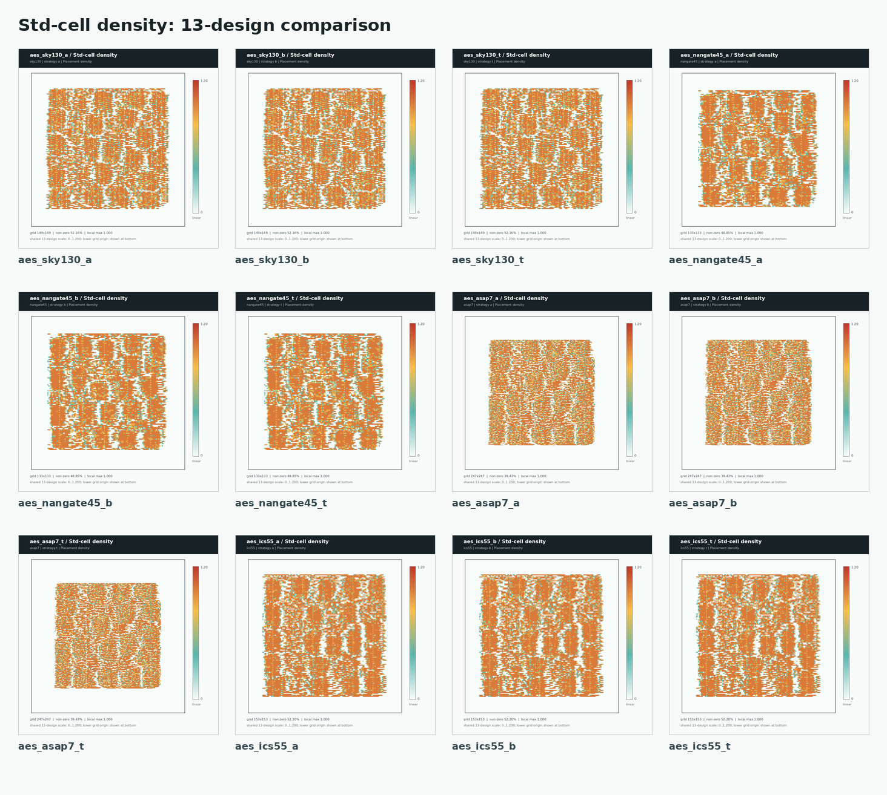

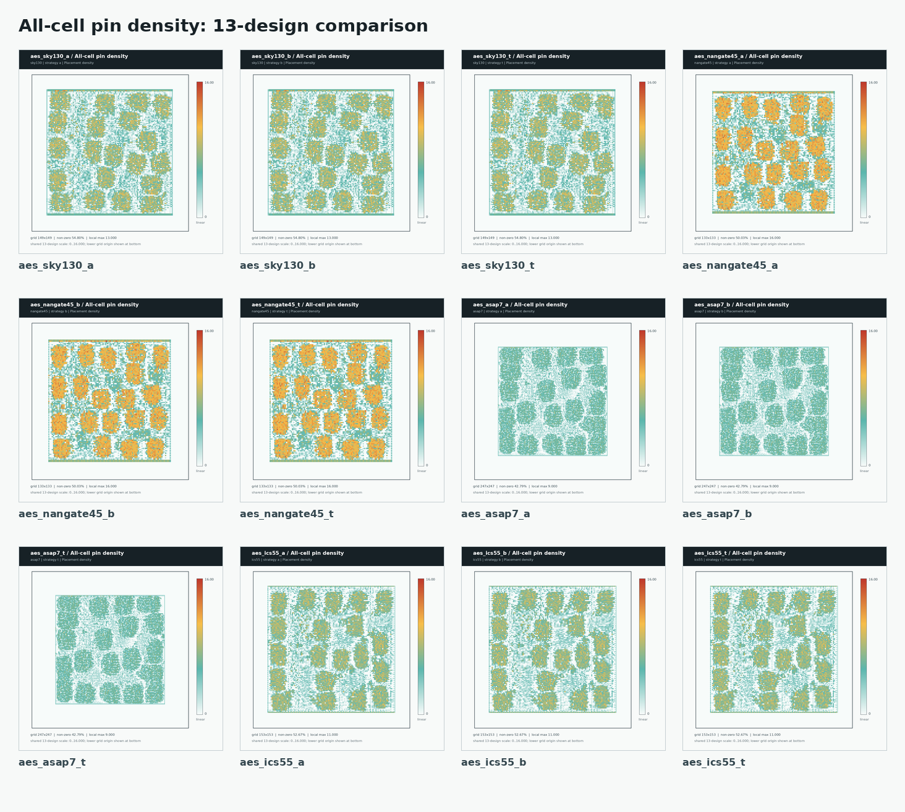

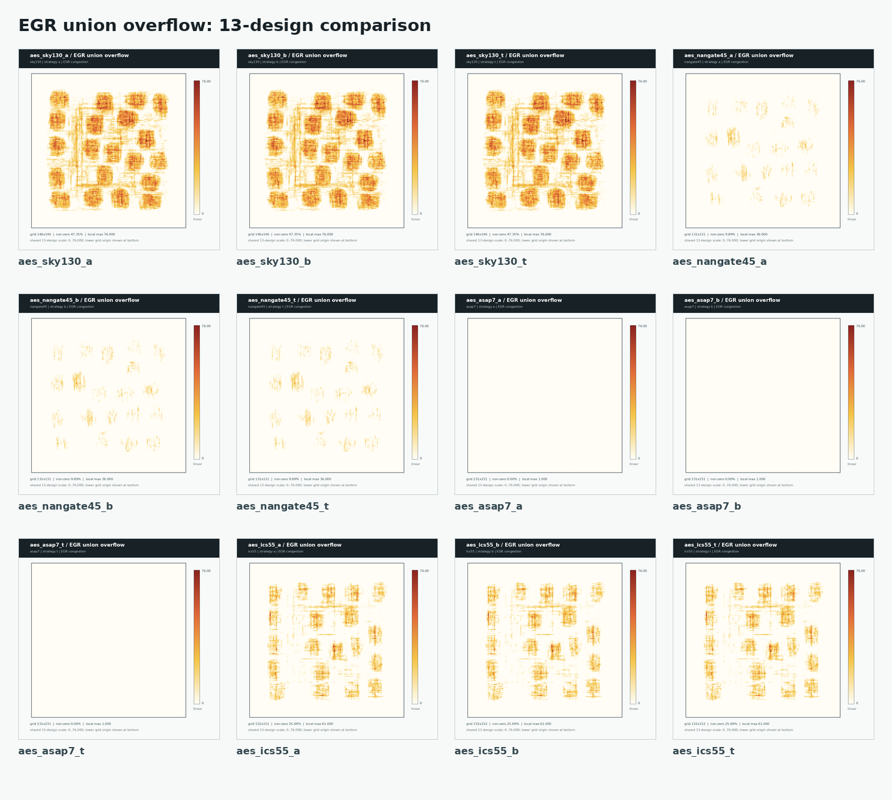

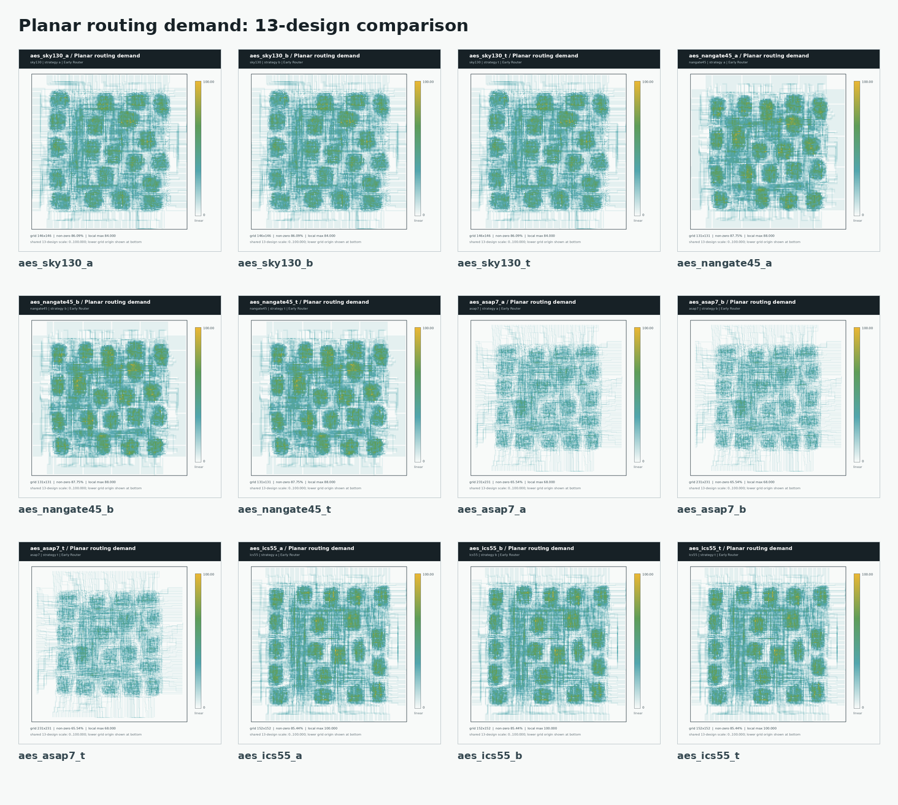

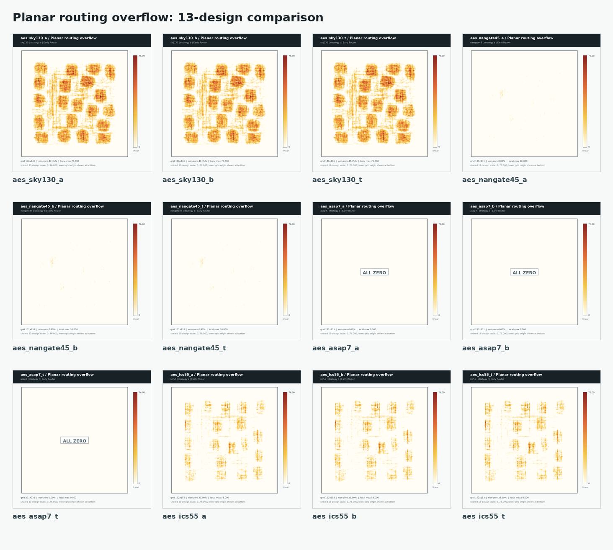

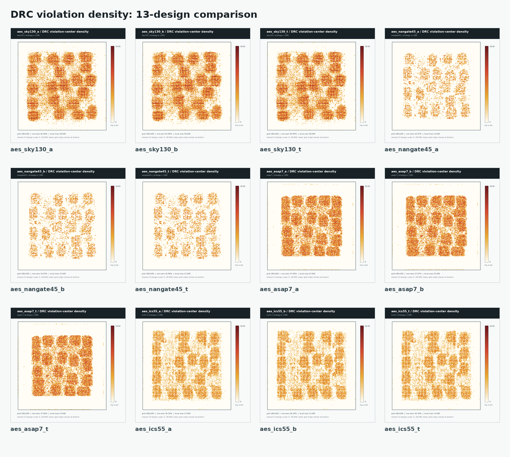

## 6. 同工艺纵向结论

- **sky130**：3/3 完成 GDS；最低 DRC 为 `aes_sky130_a` (55,462)，最快布线为 `aes_sky130_t` (4,070.5 s)。从 a(35%) 放宽到 t(25%) 后，EGR 线长增加 +0.0%，DRC 上升 0.0%（55,462 -> 55,477）。Sky130 呈现预期的密度缓解，但改善幅度仍不足以接近 clean。
- **nangate45**：3/3 完成 GDS；最低 DRC 为 `aes_nangate45_a` (15,329)，最快布线为 `aes_nangate45_b` (1,475.0 s)。从 a(35%) 放宽到 t(25%) 后，EGR 线长增加 +0.0%，DRC 上升 0.1%（15,329 -> 15,351）。更宽松的面积没有改善 DRC，说明该工艺当前的主导因素不是密度，而是规则、轨道/via 映射或路由代价。
- **asap7**：3/3 完成 GDS；最低 DRC 为 `aes_asap7_b` (48,089)，最快布线为 `aes_asap7_b` (2,387.0 s)。从 a(35%) 放宽到 t(25%) 后，EGR 线长增加 +0.0%，DRC 上升 0.0%（48,094 -> 48,094）。更宽松的面积没有改善 DRC，说明该工艺当前的主导因素不是密度，而是规则、轨道/via 映射或路由代价。
- **ics55**：3/3 完成 GDS；最低 DRC 为 `aes_ics55_a` (26,899)，最快布线为 `aes_ics55_a` (1,492.7 s)。从 a(35%) 放宽到 t(25%) 后，EGR 线长增加 +0.0%，DRC 上升 0.0%（26,899 -> 26,899）。更宽松的面积没有改善 DRC，说明该工艺当前的主导因素不是密度，而是规则、轨道/via 映射或路由代价。

- `aes` 与 `aes_sky130_b` 的目标利用率同为 30%，结果几乎一致，可视为 baseline 重复性检查；两者不能作为独立策略样本扩大统计显著性。
- a/b/t 的核心变量是目标利用率 35%/30%/25%。更大的 die 通常降低局部密度，但在当前单轮详细布线 (`IEDA_RT_MAX_ITERATIONS=1`) 下，没有形成跨工艺一致的 DRC 单调改善。
## 7. 各设计阶段纵向对比、版图与 Maps

### aes_sky130_a (sky130 / a)

| Stage | Runtime (s) | Memory (MB) | Instances | Timing inst. | Core util. | DEF HPWL (um) | Routed (um) | Setup WNS (ns) | Power (mW) | Congestion | DRC | IR-drop |
|---|---:|---:|---:|---:|---:|---:|---:|---:|---:|---|---:|---|
| Floorplan | 0.00 | 0.0 | 12,540 | 0 | 65.1% | 0.0 | 0.0 | N/A | N/A | N/A | N/A | N/A |
| Fanout | 1.61 | 3,753.4 | 12,680 | 140 | 67.1% | 0.0 | 0.0 | N/A | N/A | N/A | N/A | N/A |
| Placement | 13.09 | 960.6 | 12,680 | 140 | 67.1% | 286,166.6 | 0.0 | N/A | N/A | N/A | N/A | N/A |
| CTS | 2.53 | 198.6 | 12,701 | 161 | 67.2% | 289,344.2 | 0.0 | N/A | N/A | N/A | N/A | N/A |
| Legalization | 3.46 | 980.3 | 12,701 | 161 | 67.2% | 289,388.3 | 0.0 | N/A | N/A | N/A | N/A | N/A |
| Routing | 4,130.69 | 0.0 | 12,701 | 161 | 67.2% | 289,388.3 | 316,604.1 | -2.299 | 62.730 | N/A | 55,462 | N/A |
| Filler | 3.80 | 80.3 | 19,086 | 161 | 96.3% | 289,388.3 | 316,604.1 | N/A | N/A | N/A | N/A | N/A |

Post-route：setup WNS `-2.299 ns`，hold WNS `0.431 ns`，功耗 `62.730 mW`，DRC `55,462`。DRC 主项：parallel_run_length_spacing=35,153, minimum_area=10,113, metal_short=7,949。未约束端口 `0`，缺失 input slew pin `136`。

<table>
<tr><td><b>Floorplan</b> </td><td><b>Fanout</b> <a href="../reports/aes12_65pct_qor_wp_rt01b_comparison_assets/aes_sky130_a/fanout.png">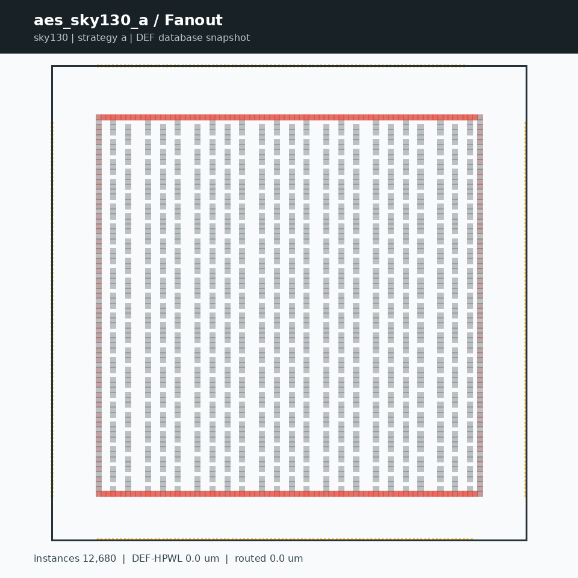</a></td><td><b>Placement</b> <a href="../reports/aes12_65pct_qor_wp_rt01b_comparison_assets/aes_sky130_a/placement.png">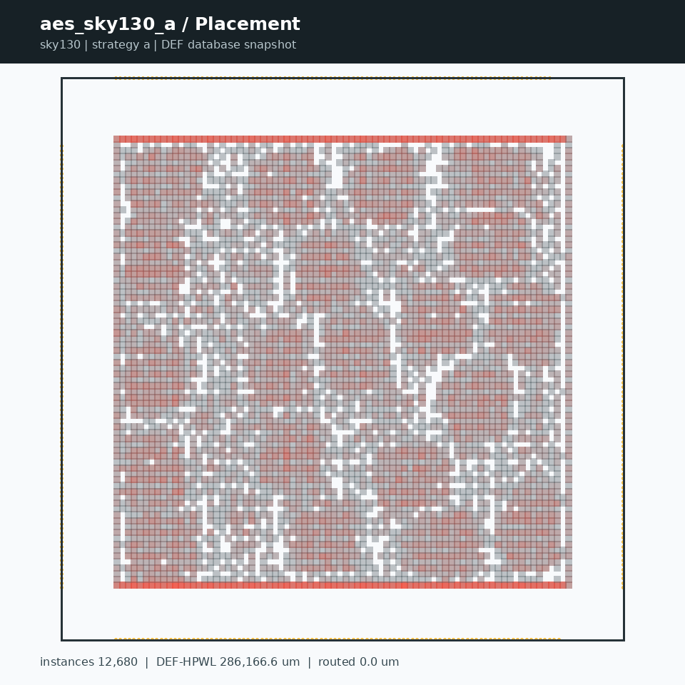</a></td><td><b>CTS</b> <a href="../reports/aes12_65pct_qor_wp_rt01b_comparison_assets/aes_sky130_a/cts.png">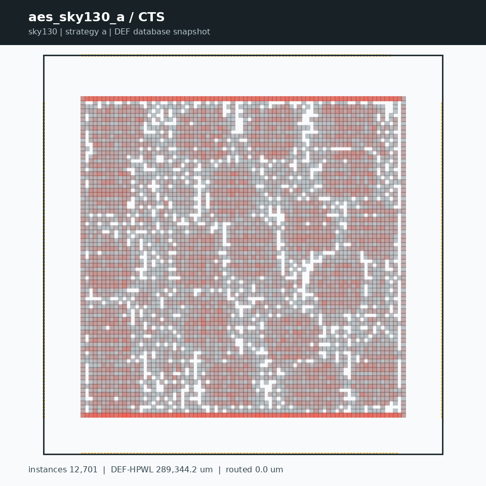</a></td></tr>
<tr><td><b>Legalization</b> </td><td><b>Routing</b> <a href="../reports/aes12_65pct_qor_wp_rt01b_comparison_assets/aes_sky130_a/routing.png">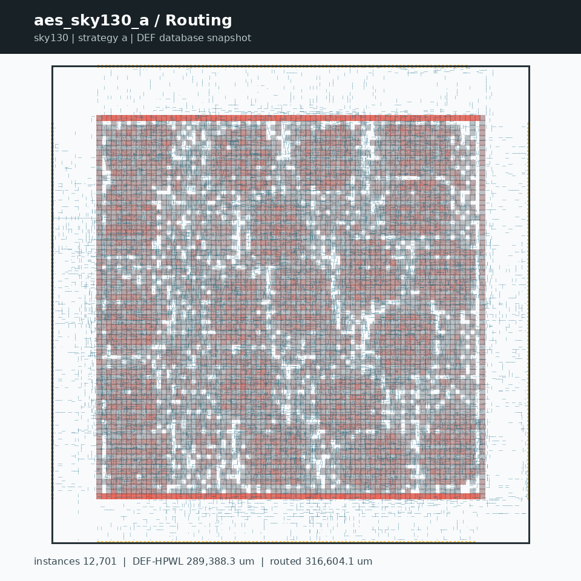</a></td><td><b>Filler</b> <a href="../reports/aes12_65pct_qor_wp_rt01b_comparison_assets/aes_sky130_a/filler.png">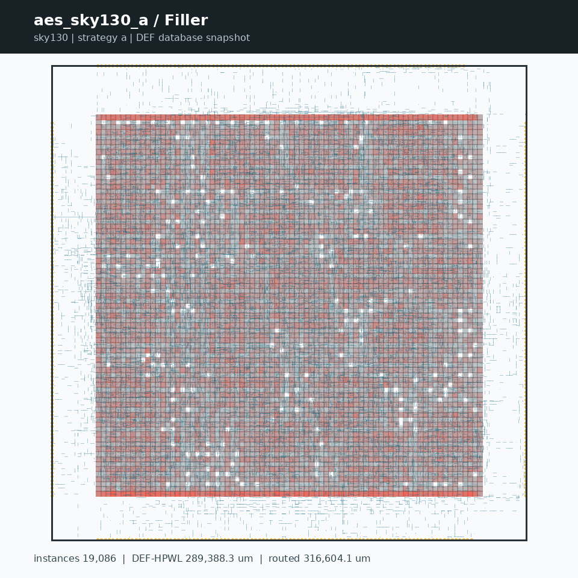</a></td><td><b>Final GDS</b> </td></tr>
</table>
CTS 专项图：[clock tree](../results/aes13_65pct_qor_wp_rt01b_20260731_1520/aes_sky130_a/workspace/result/cts/visualization/svg/cts_design.svg) / [flyline](../results/aes13_65pct_qor_wp_rt01b_20260731_1520/aes_sky130_a/workspace/result/cts/visualization/svg/cts_flyline.svg)

#### 空间 Map 证据

共发现 `34` 个原始 map 文件，渲染 `16` 张代表图。同类图使用跨 13 个设计的统一色标；DRC 使用统一对数色标。全零图保留并明确标注。

<table>
<tr><td><b>Std-cell density</b>  <small>non-zero 52.16%; max 1.000; <a href="../results/aes13_65pct_qor_wp_rt01b_20260731_1520/aes_sky130_a/workspace/result/density_map/place_stdcell_density.csv">raw</a></small></td><td><b>Macro density</b>  <small>non-zero 0.00%; max 0.000; <a href="../results/aes13_65pct_qor_wp_rt01b_20260731_1520/aes_sky130_a/workspace/result/density_map/place_macro_density.csv">raw</a></small></td><td><b>All-cell density</b>  <small>non-zero 55.98%; max 1.000; <a href="../results/aes13_65pct_qor_wp_rt01b_20260731_1520/aes_sky130_a/workspace/result/density_map/place_allcell_density.csv">raw</a></small></td><td><b>Std-cell pin density</b>  <small>non-zero 49.09%; max 11.000; <a href="../results/aes13_65pct_qor_wp_rt01b_20260731_1520/aes_sky130_a/workspace/result/density_map/place_stdcell_pin_density.csv">raw</a></small></td></tr>
<tr><td><b>Macro pin density</b>  <small>non-zero 0.00%; max 0.000; <a href="../results/aes13_65pct_qor_wp_rt01b_20260731_1520/aes_sky130_a/workspace/result/density_map/place_macro_pin_density.csv">raw</a></small></td><td><b>All-cell pin density</b>  <small>non-zero 54.80%; max 13.000; <a href="../results/aes13_65pct_qor_wp_rt01b_20260731_1520/aes_sky130_a/workspace/result/density_map/place_allcell_pin_density.csv">raw</a></small></td><td><b>Local-net density</b>  <small>non-zero 2.13%; max 2.000; <a href="../results/aes13_65pct_qor_wp_rt01b_20260731_1520/aes_sky130_a/workspace/result/density_map/place_local_net_density.csv">raw</a></small></td><td><b>Global-net density</b>  <small>non-zero 95.13%; max 143.000; <a href="../results/aes13_65pct_qor_wp_rt01b_20260731_1520/aes_sky130_a/workspace/result/density_map/place_global_net_density.csv">raw</a></small></td></tr>
<tr><td><b>All-net density</b> <a href="../reports/aes12_65pct_qor_wp_rt01b_comparison_assets/aes_sky130_a/maps/allnet_density.png">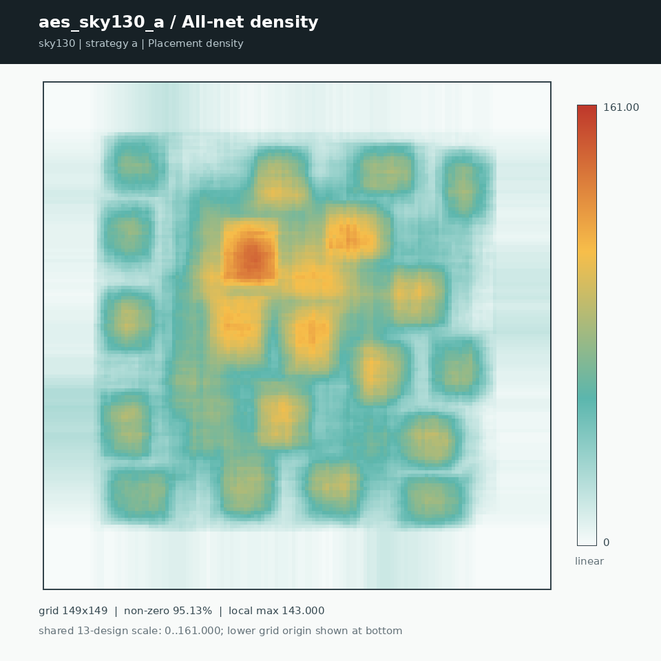</a> <small>non-zero 95.13%; max 143.000; <a href="../results/aes13_65pct_qor_wp_rt01b_20260731_1520/aes_sky130_a/workspace/result/density_map/place_allnet_density.csv">raw</a></small></td><td><b>EGR horizontal overflow</b>  <small>non-zero 39.89%; max 54.000; <a href="../results/aes13_65pct_qor_wp_rt01b_20260731_1520/aes_sky130_a/workspace/result/egr_congestion_map/place_egr_horizontal_overflow.csv">raw</a></small></td><td><b>EGR vertical overflow</b>  <small>non-zero 37.31%; max 56.000; <a href="../results/aes13_65pct_qor_wp_rt01b_20260731_1520/aes_sky130_a/workspace/result/egr_congestion_map/place_egr_vertical_overflow.csv">raw</a></small></td><td><b>EGR union overflow</b>  <small>non-zero 47.35%; max 76.000; <a href="../results/aes13_65pct_qor_wp_rt01b_20260731_1520/aes_sky130_a/workspace/result/egr_congestion_map/place_egr_union_overflow.csv">raw</a></small></td></tr>
<tr><td><b>Planar routing demand</b>  <small>non-zero 86.09%; max 84.000; <a href="../results/aes13_65pct_qor_wp_rt01b_20260731_1520/aes_sky130_a/workspace/result/rt/rt_temp_directory/early_router/net_map_planar.csv">raw</a></small></td><td><b>Planar routing supply</b> <a href="../reports/aes12_65pct_qor_wp_rt01b_comparison_assets/aes_sky130_a/maps/early_supply_planar.png">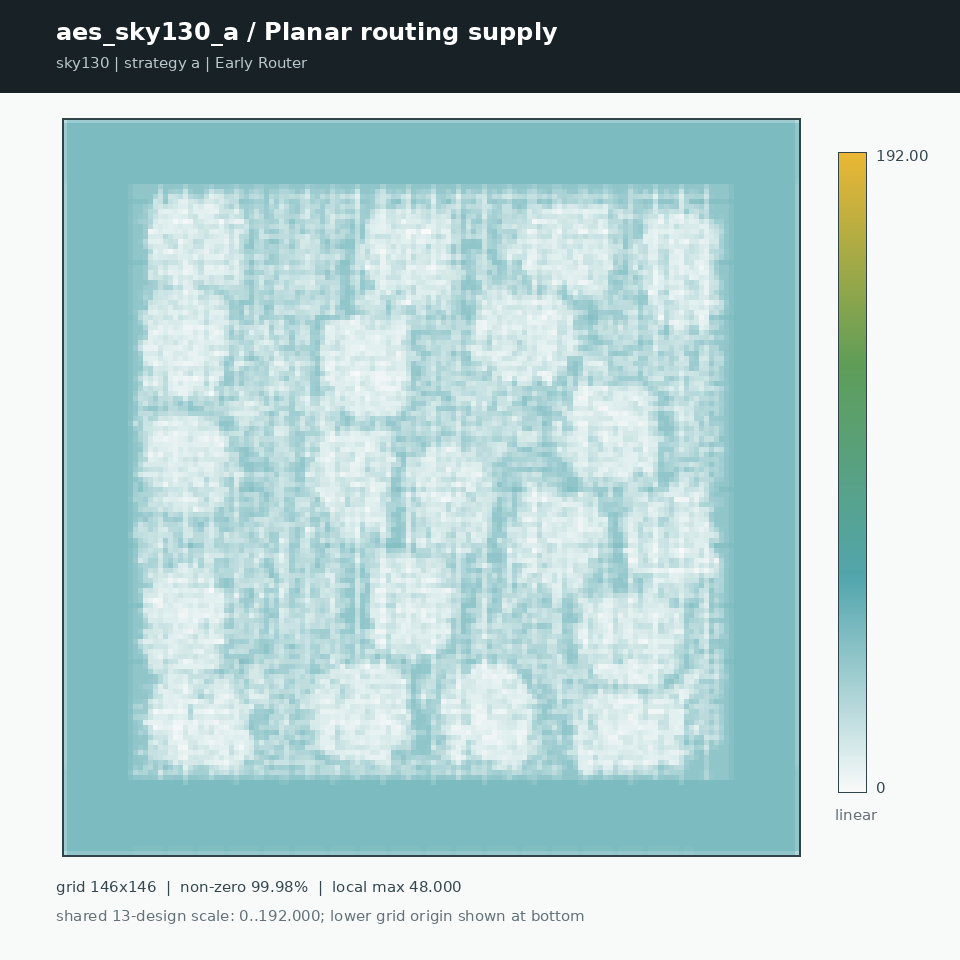</a> <small>non-zero 99.98%; max 48.000; <a href="../results/aes13_65pct_qor_wp_rt01b_20260731_1520/aes_sky130_a/workspace/result/rt/rt_temp_directory/early_router/supply_map_planar.csv">raw</a></small></td><td><b>Planar routing overflow</b> <a href="../reports/aes12_65pct_qor_wp_rt01b_comparison_assets/aes_sky130_a/maps/early_overflow_planar.png">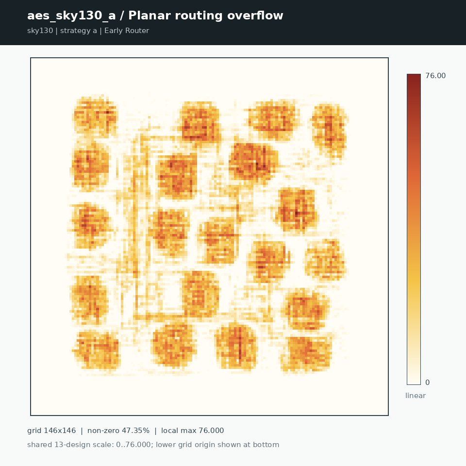</a> <small>non-zero 47.35%; max 76.000; <a href="../results/aes13_65pct_qor_wp_rt01b_20260731_1520/aes_sky130_a/workspace/result/rt/rt_temp_directory/early_router/overflow_map_planar.csv">raw</a></small></td><td><b>DRC violation-center density</b>  <small>non-zero 42.84%; max 38.000; <a href="../results/aes13_65pct_qor_wp_rt01b_20260731_1520/aes_sky130_a/workspace/drc_temp_directory/violation_map.json">raw</a></small></td></tr>
</table>

完整原始 map 文件索引

- **Placement density CSV (9)**：[place_allcell_density.csv](../results/aes13_65pct_qor_wp_rt01b_20260731_1520/aes_sky130_a/workspace/result/density_map/place_allcell_density.csv), [place_allcell_pin_density.csv](../results/aes13_65pct_qor_wp_rt01b_20260731_1520/aes_sky130_a/workspace/result/density_map/place_allcell_pin_density.csv), [place_allnet_density.csv](../results/aes13_65pct_qor_wp_rt01b_20260731_1520/aes_sky130_a/workspace/result/density_map/place_allnet_density.csv), [place_global_net_density.csv](../results/aes13_65pct_qor_wp_rt01b_20260731_1520/aes_sky130_a/workspace/result/density_map/place_global_net_density.csv), [place_local_net_density.csv](../results/aes13_65pct_qor_wp_rt01b_20260731_1520/aes_sky130_a/workspace/result/density_map/place_local_net_density.csv), [place_macro_density.csv](../results/aes13_65pct_qor_wp_rt01b_20260731_1520/aes_sky130_a/workspace/result/density_map/place_macro_density.csv), [place_macro_pin_density.csv](../results/aes13_65pct_qor_wp_rt01b_20260731_1520/aes_sky130_a/workspace/result/density_map/place_macro_pin_density.csv), [place_stdcell_density.csv](../results/aes13_65pct_qor_wp_rt01b_20260731_1520/aes_sky130_a/workspace/result/density_map/place_stdcell_density.csv), [place_stdcell_pin_density.csv](../results/aes13_65pct_qor_wp_rt01b_20260731_1520/aes_sky130_a/workspace/result/density_map/place_stdcell_pin_density.csv)
- **EGR congestion CSV (3)**：[place_egr_horizontal_overflow.csv](../results/aes13_65pct_qor_wp_rt01b_20260731_1520/aes_sky130_a/workspace/result/egr_congestion_map/place_egr_horizontal_overflow.csv), [place_egr_union_overflow.csv](../results/aes13_65pct_qor_wp_rt01b_20260731_1520/aes_sky130_a/workspace/result/egr_congestion_map/place_egr_union_overflow.csv), [place_egr_vertical_overflow.csv](../results/aes13_65pct_qor_wp_rt01b_20260731_1520/aes_sky130_a/workspace/result/egr_congestion_map/place_egr_vertical_overflow.csv)
- **Early-router layer CSV (21)**：[net_map_li1.csv](../results/aes13_65pct_qor_wp_rt01b_20260731_1520/aes_sky130_a/workspace/result/rt/rt_temp_directory/early_router/net_map_li1.csv), [net_map_met1.csv](../results/aes13_65pct_qor_wp_rt01b_20260731_1520/aes_sky130_a/workspace/result/rt/rt_temp_directory/early_router/net_map_met1.csv), [net_map_met2.csv](../results/aes13_65pct_qor_wp_rt01b_20260731_1520/aes_sky130_a/workspace/result/rt/rt_temp_directory/early_router/net_map_met2.csv), [net_map_met3.csv](../results/aes13_65pct_qor_wp_rt01b_20260731_1520/aes_sky130_a/workspace/result/rt/rt_temp_directory/early_router/net_map_met3.csv), [net_map_met4.csv](../results/aes13_65pct_qor_wp_rt01b_20260731_1520/aes_sky130_a/workspace/result/rt/rt_temp_directory/early_router/net_map_met4.csv), [net_map_met5.csv](../results/aes13_65pct_qor_wp_rt01b_20260731_1520/aes_sky130_a/workspace/result/rt/rt_temp_directory/early_router/net_map_met5.csv), [net_map_planar.csv](../results/aes13_65pct_qor_wp_rt01b_20260731_1520/aes_sky130_a/workspace/result/rt/rt_temp_directory/early_router/net_map_planar.csv), [overflow_map_li1.csv](../results/aes13_65pct_qor_wp_rt01b_20260731_1520/aes_sky130_a/workspace/result/rt/rt_temp_directory/early_router/overflow_map_li1.csv), [overflow_map_met1.csv](../results/aes13_65pct_qor_wp_rt01b_20260731_1520/aes_sky130_a/workspace/result/rt/rt_temp_directory/early_router/overflow_map_met1.csv), [overflow_map_met2.csv](../results/aes13_65pct_qor_wp_rt01b_20260731_1520/aes_sky130_a/workspace/result/rt/rt_temp_directory/early_router/overflow_map_met2.csv), [overflow_map_met3.csv](../results/aes13_65pct_qor_wp_rt01b_20260731_1520/aes_sky130_a/workspace/result/rt/rt_temp_directory/early_router/overflow_map_met3.csv), [overflow_map_met4.csv](../results/aes13_65pct_qor_wp_rt01b_20260731_1520/aes_sky130_a/workspace/result/rt/rt_temp_directory/early_router/overflow_map_met4.csv), [overflow_map_met5.csv](../results/aes13_65pct_qor_wp_rt01b_20260731_1520/aes_sky130_a/workspace/result/rt/rt_temp_directory/early_router/overflow_map_met5.csv), [overflow_map_planar.csv](../results/aes13_65pct_qor_wp_rt01b_20260731_1520/aes_sky130_a/workspace/result/rt/rt_temp_directory/early_router/overflow_map_planar.csv), [supply_map_li1.csv](../results/aes13_65pct_qor_wp_rt01b_20260731_1520/aes_sky130_a/workspace/result/rt/rt_temp_directory/early_router/supply_map_li1.csv), [supply_map_met1.csv](../results/aes13_65pct_qor_wp_rt01b_20260731_1520/aes_sky130_a/workspace/result/rt/rt_temp_directory/early_router/supply_map_met1.csv), [supply_map_met2.csv](../results/aes13_65pct_qor_wp_rt01b_20260731_1520/aes_sky130_a/workspace/result/rt/rt_temp_directory/early_router/supply_map_met2.csv), [supply_map_met3.csv](../results/aes13_65pct_qor_wp_rt01b_20260731_1520/aes_sky130_a/workspace/result/rt/rt_temp_directory/early_router/supply_map_met3.csv), [supply_map_met4.csv](../results/aes13_65pct_qor_wp_rt01b_20260731_1520/aes_sky130_a/workspace/result/rt/rt_temp_directory/early_router/supply_map_met4.csv), [supply_map_met5.csv](../results/aes13_65pct_qor_wp_rt01b_20260731_1520/aes_sky130_a/workspace/result/rt/rt_temp_directory/early_router/supply_map_met5.csv), [supply_map_planar.csv](../results/aes13_65pct_qor_wp_rt01b_20260731_1520/aes_sky130_a/workspace/result/rt/rt_temp_directory/early_router/supply_map_planar.csv)
- **DRC violation JSON (1)**：[violation_map.json](../results/aes13_65pct_qor_wp_rt01b_20260731_1520/aes_sky130_a/workspace/drc_temp_directory/violation_map.json)

### aes_sky130_b (sky130 / b)

| Stage | Runtime (s) | Memory (MB) | Instances | Timing inst. | Core util. | DEF HPWL (um) | Routed (um) | Setup WNS (ns) | Power (mW) | Congestion | DRC | IR-drop |
|---|---:|---:|---:|---:|---:|---:|---:|---:|---:|---|---:|---|
| Floorplan | 0.00 | 0.0 | 12,540 | 0 | 65.1% | 0.0 | 0.0 | N/A | N/A | N/A | N/A | N/A |
| Fanout | 1.65 | 3,753.3 | 12,680 | 140 | 67.1% | 0.0 | 0.0 | N/A | N/A | N/A | N/A | N/A |
| Placement | 11.79 | 1,009.7 | 12,680 | 140 | 67.1% | 286,166.6 | 0.0 | N/A | N/A | N/A | N/A | N/A |
| CTS | 3.34 | 199.7 | 12,701 | 161 | 67.2% | 289,344.2 | 0.0 | N/A | N/A | N/A | N/A | N/A |
| Legalization | 4.00 | 1,008.9 | 12,701 | 161 | 67.2% | 289,388.3 | 0.0 | N/A | N/A | N/A | N/A | N/A |
| Routing | 4,073.29 | 0.0 | 12,701 | 161 | 67.2% | 289,388.3 | 316,604.1 | -2.299 | 62.730 | N/A | 55,462 | N/A |
| Filler | 4.29 | 80.3 | 19,086 | 161 | 96.3% | 289,388.3 | 316,604.1 | N/A | N/A | N/A | N/A | N/A |

Post-route：setup WNS `-2.299 ns`，hold WNS `0.431 ns`，功耗 `62.730 mW`，DRC `55,462`。DRC 主项：parallel_run_length_spacing=35,153, minimum_area=10,113, metal_short=7,949。未约束端口 `5`，缺失 input slew pin `136`。

<table>
<tr><td><b>Floorplan</b> <a href="../reports/aes12_65pct_qor_wp_rt01b_comparison_assets/aes_sky130_b/floorplan.png">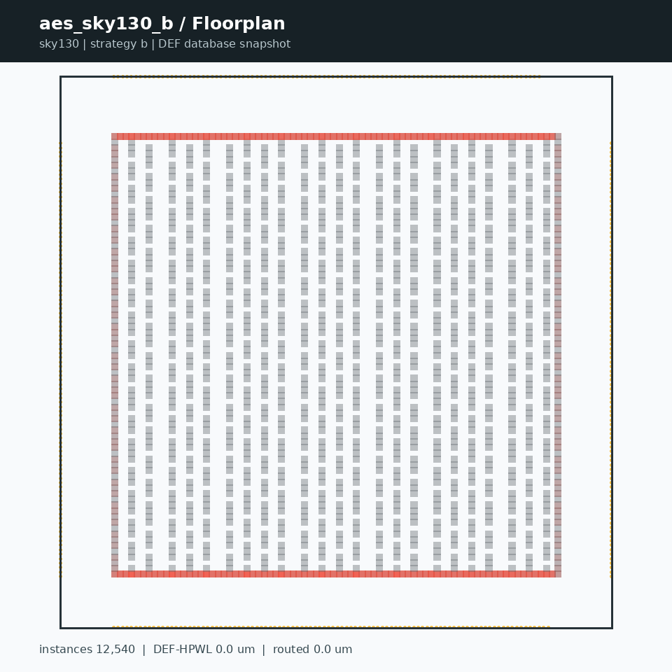</a></td><td><b>Fanout</b> </td><td><b>Placement</b> </td><td><b>CTS</b> </td></tr>
<tr><td><b>Legalization</b> <a href="../reports/aes12_65pct_qor_wp_rt01b_comparison_assets/aes_sky130_b/legalization.png">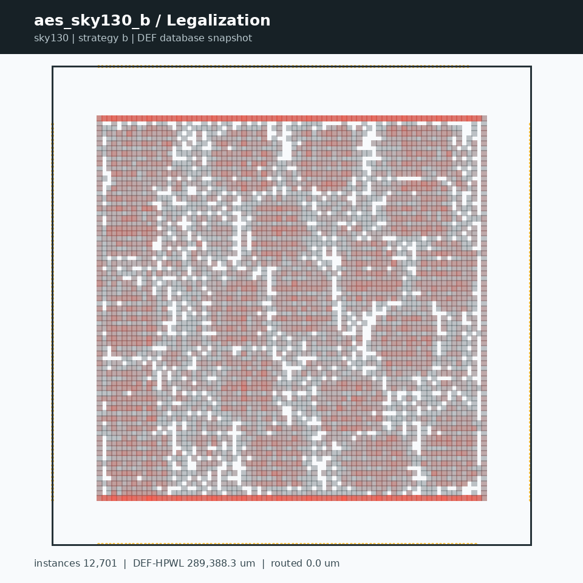</a></td><td><b>Routing</b> <a href="../reports/aes12_65pct_qor_wp_rt01b_comparison_assets/aes_sky130_b/routing.png">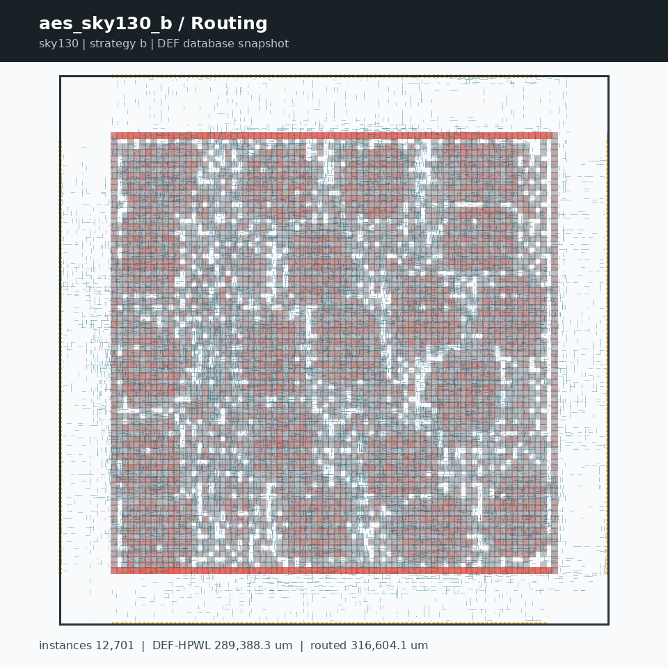</a></td><td><b>Filler</b> <a href="../reports/aes12_65pct_qor_wp_rt01b_comparison_assets/aes_sky130_b/filler.png">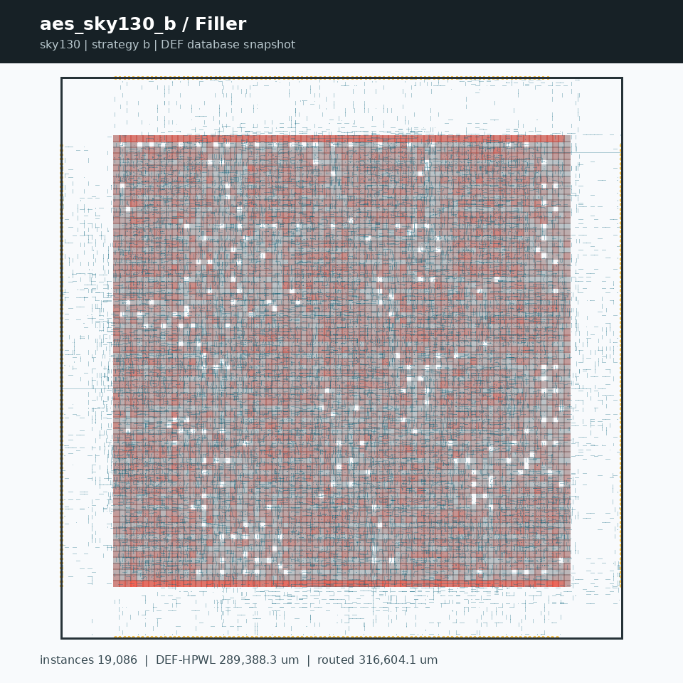</a></td><td><b>Final GDS</b> </td></tr>
</table>
CTS 专项图：[clock tree](../results/aes13_65pct_qor_wp_rt01b_20260731_1520/aes_sky130_b/workspace/result/cts/visualization/svg/cts_design.svg) / [flyline](../results/aes13_65pct_qor_wp_rt01b_20260731_1520/aes_sky130_b/workspace/result/cts/visualization/svg/cts_flyline.svg)

#### 空间 Map 证据

共发现 `34` 个原始 map 文件，渲染 `16` 张代表图。同类图使用跨 13 个设计的统一色标；DRC 使用统一对数色标。全零图保留并明确标注。

<table>
<tr><td><b>Std-cell density</b>  <small>non-zero 52.16%; max 1.000; <a href="../results/aes13_65pct_qor_wp_rt01b_20260731_1520/aes_sky130_b/workspace/result/density_map/place_stdcell_density.csv">raw</a></small></td><td><b>Macro density</b>  <small>non-zero 0.00%; max 0.000; <a href="../results/aes13_65pct_qor_wp_rt01b_20260731_1520/aes_sky130_b/workspace/result/density_map/place_macro_density.csv">raw</a></small></td><td><b>All-cell density</b> <a href="../reports/aes12_65pct_qor_wp_rt01b_comparison_assets/aes_sky130_b/maps/allcell_density.png">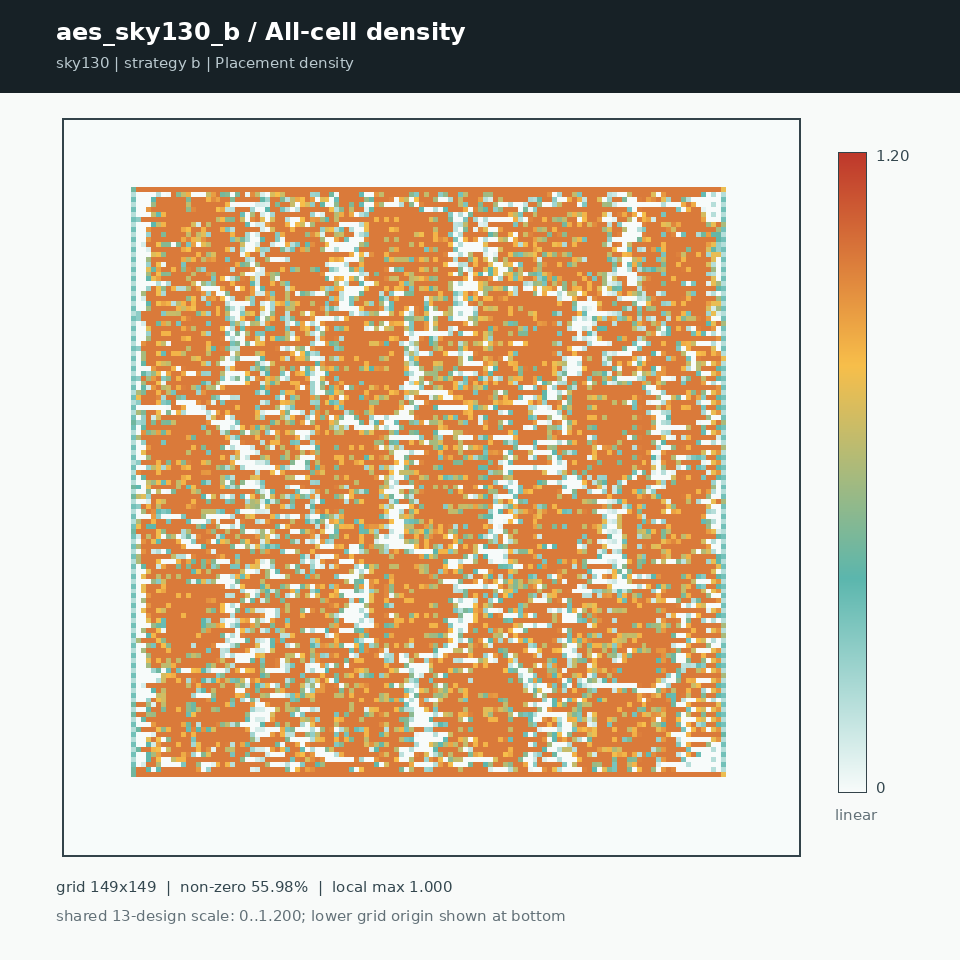</a> <small>non-zero 55.98%; max 1.000; <a href="../results/aes13_65pct_qor_wp_rt01b_20260731_1520/aes_sky130_b/workspace/result/density_map/place_allcell_density.csv">raw</a></small></td><td><b>Std-cell pin density</b> <a href="../reports/aes12_65pct_qor_wp_rt01b_comparison_assets/aes_sky130_b/maps/stdcell_pin_density.png">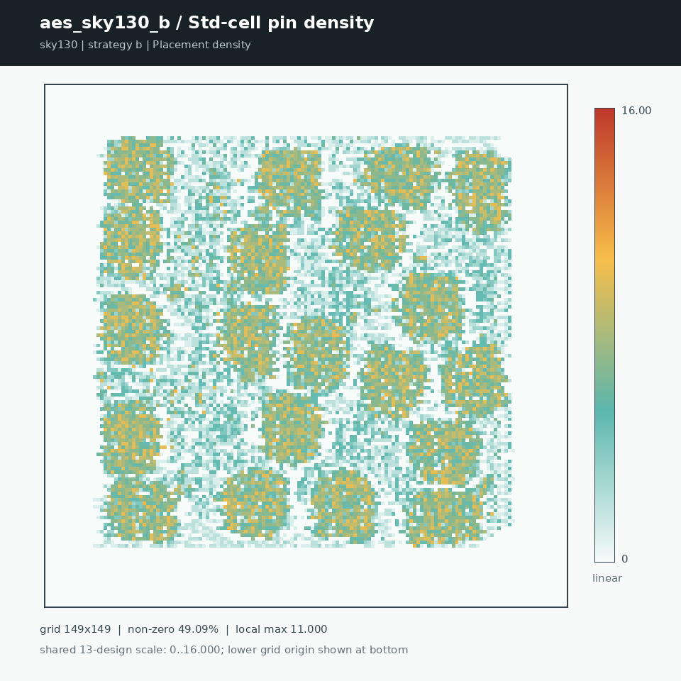</a> <small>non-zero 49.09%; max 11.000; <a href="../results/aes13_65pct_qor_wp_rt01b_20260731_1520/aes_sky130_b/workspace/result/density_map/place_stdcell_pin_density.csv">raw</a></small></td></tr>
<tr><td><b>Macro pin density</b>  <small>non-zero 0.00%; max 0.000; <a href="../results/aes13_65pct_qor_wp_rt01b_20260731_1520/aes_sky130_b/workspace/result/density_map/place_macro_pin_density.csv">raw</a></small></td><td><b>All-cell pin density</b> <a href="../reports/aes12_65pct_qor_wp_rt01b_comparison_assets/aes_sky130_b/maps/allcell_pin_density.png">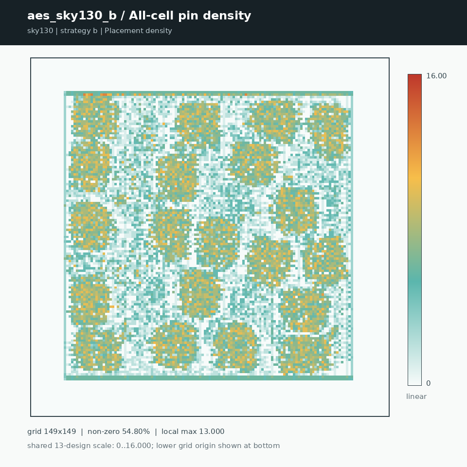</a> <small>non-zero 54.80%; max 13.000; <a href="../results/aes13_65pct_qor_wp_rt01b_20260731_1520/aes_sky130_b/workspace/result/density_map/place_allcell_pin_density.csv">raw</a></small></td><td><b>Local-net density</b> <a href="../reports/aes12_65pct_qor_wp_rt01b_comparison_assets/aes_sky130_b/maps/local_net_density.png">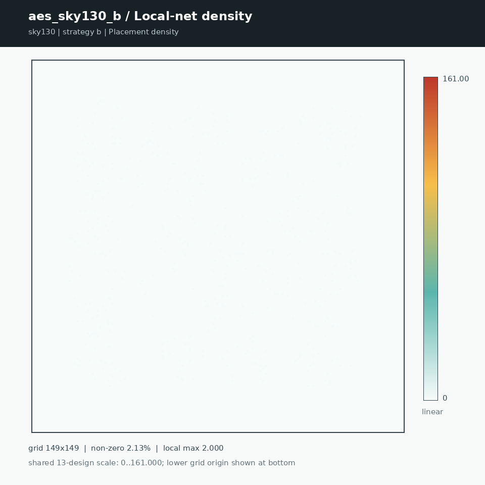</a> <small>non-zero 2.13%; max 2.000; <a href="../results/aes13_65pct_qor_wp_rt01b_20260731_1520/aes_sky130_b/workspace/result/density_map/place_local_net_density.csv">raw</a></small></td><td><b>Global-net density</b>  <small>non-zero 95.13%; max 143.000; <a href="../results/aes13_65pct_qor_wp_rt01b_20260731_1520/aes_sky130_b/workspace/result/density_map/place_global_net_density.csv">raw</a></small></td></tr>
<tr><td><b>All-net density</b>  <small>non-zero 95.13%; max 143.000; <a href="../results/aes13_65pct_qor_wp_rt01b_20260731_1520/aes_sky130_b/workspace/result/density_map/place_allnet_density.csv">raw</a></small></td><td><b>EGR horizontal overflow</b> <a href="../reports/aes12_65pct_qor_wp_rt01b_comparison_assets/aes_sky130_b/maps/egr_horizontal_overflow.png">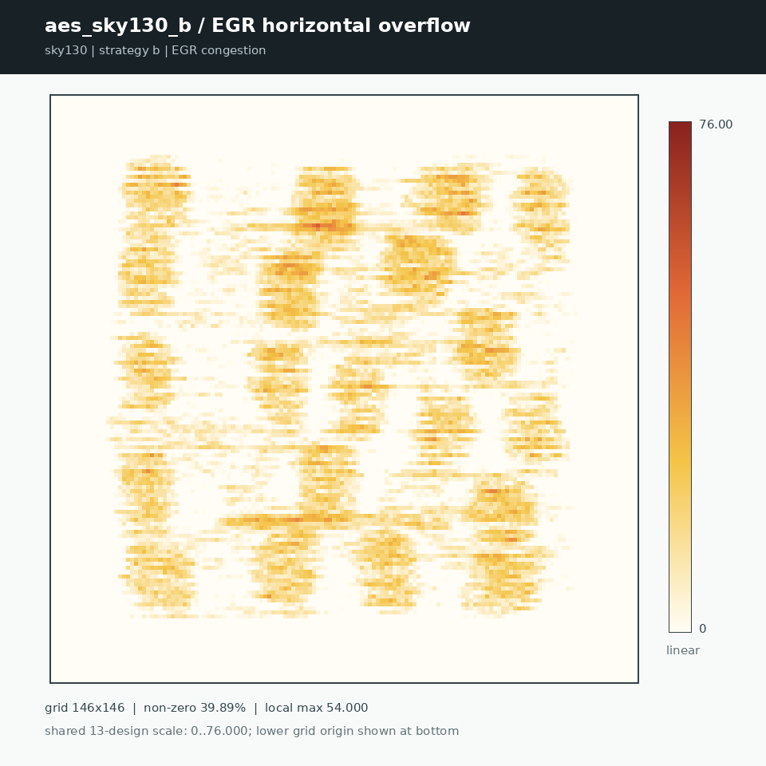</a> <small>non-zero 39.89%; max 54.000; <a href="../results/aes13_65pct_qor_wp_rt01b_20260731_1520/aes_sky130_b/workspace/result/egr_congestion_map/place_egr_horizontal_overflow.csv">raw</a></small></td><td><b>EGR vertical overflow</b>  <small>non-zero 37.31%; max 56.000; <a href="../results/aes13_65pct_qor_wp_rt01b_20260731_1520/aes_sky130_b/workspace/result/egr_congestion_map/place_egr_vertical_overflow.csv">raw</a></small></td><td><b>EGR union overflow</b>  <small>non-zero 47.35%; max 76.000; <a href="../results/aes13_65pct_qor_wp_rt01b_20260731_1520/aes_sky130_b/workspace/result/egr_congestion_map/place_egr_union_overflow.csv">raw</a></small></td></tr>
<tr><td><b>Planar routing demand</b>  <small>non-zero 86.09%; max 84.000; <a href="../results/aes13_65pct_qor_wp_rt01b_20260731_1520/aes_sky130_b/workspace/result/rt/rt_temp_directory/early_router/net_map_planar.csv">raw</a></small></td><td><b>Planar routing supply</b>  <small>non-zero 99.98%; max 48.000; <a href="../results/aes13_65pct_qor_wp_rt01b_20260731_1520/aes_sky130_b/workspace/result/rt/rt_temp_directory/early_router/supply_map_planar.csv">raw</a></small></td><td><b>Planar routing overflow</b>  <small>non-zero 47.35%; max 76.000; <a href="../results/aes13_65pct_qor_wp_rt01b_20260731_1520/aes_sky130_b/workspace/result/rt/rt_temp_directory/early_router/overflow_map_planar.csv">raw</a></small></td><td><b>DRC violation-center density</b> <a href="../reports/aes12_65pct_qor_wp_rt01b_comparison_assets/aes_sky130_b/maps/drc_violation_density.png">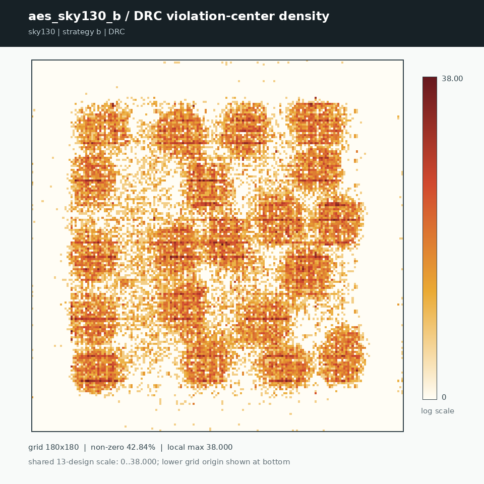</a> <small>non-zero 42.84%; max 38.000; <a href="../results/aes13_65pct_qor_wp_rt01b_20260731_1520/aes_sky130_b/workspace/drc_temp_directory/violation_map.json">raw</a></small></td></tr>
</table>

完整原始 map 文件索引

- **Placement density CSV (9)**：[place_allcell_density.csv](../results/aes13_65pct_qor_wp_rt01b_20260731_1520/aes_sky130_b/workspace/result/density_map/place_allcell_density.csv), [place_allcell_pin_density.csv](../results/aes13_65pct_qor_wp_rt01b_20260731_1520/aes_sky130_b/workspace/result/density_map/place_allcell_pin_density.csv), [place_allnet_density.csv](../results/aes13_65pct_qor_wp_rt01b_20260731_1520/aes_sky130_b/workspace/result/density_map/place_allnet_density.csv), [place_global_net_density.csv](../results/aes13_65pct_qor_wp_rt01b_20260731_1520/aes_sky130_b/workspace/result/density_map/place_global_net_density.csv), [place_local_net_density.csv](../results/aes13_65pct_qor_wp_rt01b_20260731_1520/aes_sky130_b/workspace/result/density_map/place_local_net_density.csv), [place_macro_density.csv](../results/aes13_65pct_qor_wp_rt01b_20260731_1520/aes_sky130_b/workspace/result/density_map/place_macro_density.csv), [place_macro_pin_density.csv](../results/aes13_65pct_qor_wp_rt01b_20260731_1520/aes_sky130_b/workspace/result/density_map/place_macro_pin_density.csv), [place_stdcell_density.csv](../results/aes13_65pct_qor_wp_rt01b_20260731_1520/aes_sky130_b/workspace/result/density_map/place_stdcell_density.csv), [place_stdcell_pin_density.csv](../results/aes13_65pct_qor_wp_rt01b_20260731_1520/aes_sky130_b/workspace/result/density_map/place_stdcell_pin_density.csv)
- **EGR congestion CSV (3)**：[place_egr_horizontal_overflow.csv](../results/aes13_65pct_qor_wp_rt01b_20260731_1520/aes_sky130_b/workspace/result/egr_congestion_map/place_egr_horizontal_overflow.csv), [place_egr_union_overflow.csv](../results/aes13_65pct_qor_wp_rt01b_20260731_1520/aes_sky130_b/workspace/result/egr_congestion_map/place_egr_union_overflow.csv), [place_egr_vertical_overflow.csv](../results/aes13_65pct_qor_wp_rt01b_20260731_1520/aes_sky130_b/workspace/result/egr_congestion_map/place_egr_vertical_overflow.csv)
- **Early-router layer CSV (21)**：[net_map_li1.csv](../results/aes13_65pct_qor_wp_rt01b_20260731_1520/aes_sky130_b/workspace/result/rt/rt_temp_directory/early_router/net_map_li1.csv), [net_map_met1.csv](../results/aes13_65pct_qor_wp_rt01b_20260731_1520/aes_sky130_b/workspace/result/rt/rt_temp_directory/early_router/net_map_met1.csv), [net_map_met2.csv](../results/aes13_65pct_qor_wp_rt01b_20260731_1520/aes_sky130_b/workspace/result/rt/rt_temp_directory/early_router/net_map_met2.csv), [net_map_met3.csv](../results/aes13_65pct_qor_wp_rt01b_20260731_1520/aes_sky130_b/workspace/result/rt/rt_temp_directory/early_router/net_map_met3.csv), [net_map_met4.csv](../results/aes13_65pct_qor_wp_rt01b_20260731_1520/aes_sky130_b/workspace/result/rt/rt_temp_directory/early_router/net_map_met4.csv), [net_map_met5.csv](../results/aes13_65pct_qor_wp_rt01b_20260731_1520/aes_sky130_b/workspace/result/rt/rt_temp_directory/early_router/net_map_met5.csv), [net_map_planar.csv](../results/aes13_65pct_qor_wp_rt01b_20260731_1520/aes_sky130_b/workspace/result/rt/rt_temp_directory/early_router/net_map_planar.csv), [overflow_map_li1.csv](../results/aes13_65pct_qor_wp_rt01b_20260731_1520/aes_sky130_b/workspace/result/rt/rt_temp_directory/early_router/overflow_map_li1.csv), [overflow_map_met1.csv](../results/aes13_65pct_qor_wp_rt01b_20260731_1520/aes_sky130_b/workspace/result/rt/rt_temp_directory/early_router/overflow_map_met1.csv), [overflow_map_met2.csv](../results/aes13_65pct_qor_wp_rt01b_20260731_1520/aes_sky130_b/workspace/result/rt/rt_temp_directory/early_router/overflow_map_met2.csv), [overflow_map_met3.csv](../results/aes13_65pct_qor_wp_rt01b_20260731_1520/aes_sky130_b/workspace/result/rt/rt_temp_directory/early_router/overflow_map_met3.csv), [overflow_map_met4.csv](../results/aes13_65pct_qor_wp_rt01b_20260731_1520/aes_sky130_b/workspace/result/rt/rt_temp_directory/early_router/overflow_map_met4.csv), [overflow_map_met5.csv](../results/aes13_65pct_qor_wp_rt01b_20260731_1520/aes_sky130_b/workspace/result/rt/rt_temp_directory/early_router/overflow_map_met5.csv), [overflow_map_planar.csv](../results/aes13_65pct_qor_wp_rt01b_20260731_1520/aes_sky130_b/workspace/result/rt/rt_temp_directory/early_router/overflow_map_planar.csv), [supply_map_li1.csv](../results/aes13_65pct_qor_wp_rt01b_20260731_1520/aes_sky130_b/workspace/result/rt/rt_temp_directory/early_router/supply_map_li1.csv), [supply_map_met1.csv](../results/aes13_65pct_qor_wp_rt01b_20260731_1520/aes_sky130_b/workspace/result/rt/rt_temp_directory/early_router/supply_map_met1.csv), [supply_map_met2.csv](../results/aes13_65pct_qor_wp_rt01b_20260731_1520/aes_sky130_b/workspace/result/rt/rt_temp_directory/early_router/supply_map_met2.csv), [supply_map_met3.csv](../results/aes13_65pct_qor_wp_rt01b_20260731_1520/aes_sky130_b/workspace/result/rt/rt_temp_directory/early_router/supply_map_met3.csv), [supply_map_met4.csv](../results/aes13_65pct_qor_wp_rt01b_20260731_1520/aes_sky130_b/workspace/result/rt/rt_temp_directory/early_router/supply_map_met4.csv), [supply_map_met5.csv](../results/aes13_65pct_qor_wp_rt01b_20260731_1520/aes_sky130_b/workspace/result/rt/rt_temp_directory/early_router/supply_map_met5.csv), [supply_map_planar.csv](../results/aes13_65pct_qor_wp_rt01b_20260731_1520/aes_sky130_b/workspace/result/rt/rt_temp_directory/early_router/supply_map_planar.csv)
- **DRC violation JSON (1)**：[violation_map.json](../results/aes13_65pct_qor_wp_rt01b_20260731_1520/aes_sky130_b/workspace/drc_temp_directory/violation_map.json)

### aes_sky130_t (sky130 / t)

| Stage | Runtime (s) | Memory (MB) | Instances | Timing inst. | Core util. | DEF HPWL (um) | Routed (um) | Setup WNS (ns) | Power (mW) | Congestion | DRC | IR-drop |
|---|---:|---:|---:|---:|---:|---:|---:|---:|---:|---|---:|---|
| Floorplan | 0.00 | 0.0 | 12,540 | 0 | 65.1% | 0.0 | 0.0 | N/A | N/A | N/A | N/A | N/A |
| Fanout | 1.25 | 3,816.6 | 12,680 | 140 | 67.1% | 0.0 | 0.0 | N/A | N/A | N/A | N/A | N/A |
| Placement | 11.85 | 960.6 | 12,680 | 140 | 67.1% | 286,166.6 | 0.0 | N/A | N/A | N/A | N/A | N/A |
| CTS | 3.22 | 199.7 | 12,701 | 161 | 67.2% | 289,344.2 | 0.0 | N/A | N/A | N/A | N/A | N/A |
| Legalization | 3.96 | 1,027.4 | 12,701 | 161 | 67.2% | 289,388.3 | 0.0 | N/A | N/A | N/A | N/A | N/A |
| Routing | 4,070.55 | 0.0 | 12,701 | 161 | 67.2% | 289,388.3 | 316,497.2 | -2.299 | 62.730 | N/A | 55,477 | N/A |
| Filler | 5.80 | 80.3 | 19,086 | 161 | 96.3% | 289,388.3 | 316,497.2 | N/A | N/A | N/A | N/A | N/A |

Post-route：setup WNS `-2.299 ns`，hold WNS `0.431 ns`，功耗 `62.730 mW`，DRC `55,477`。DRC 主项：parallel_run_length_spacing=35,165, minimum_area=10,120, metal_short=7,946。未约束端口 `5`，缺失 input slew pin `136`。

<table>
<tr><td><b>Floorplan</b> </td><td><b>Fanout</b> </td><td><b>Placement</b> <a href="../reports/aes12_65pct_qor_wp_rt01b_comparison_assets/aes_sky130_t/placement.png">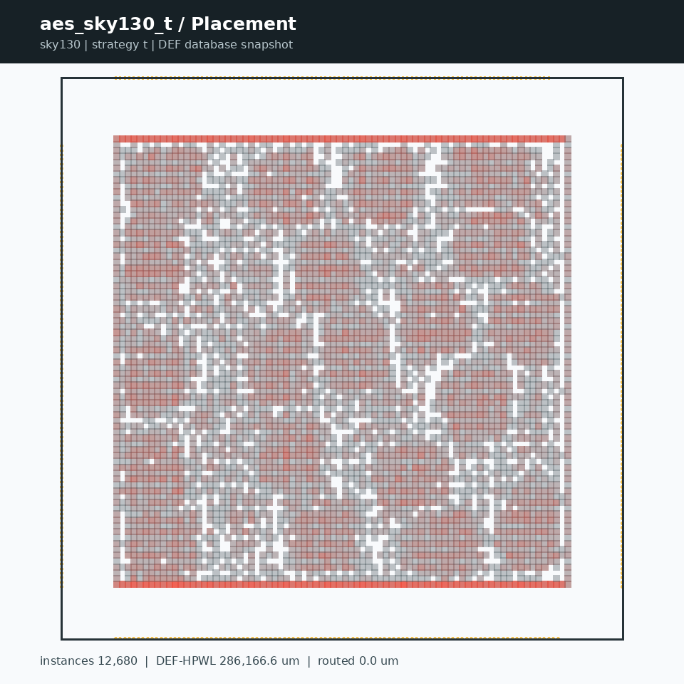</a></td><td><b>CTS</b> </td></tr>
<tr><td><b>Legalization</b> <a href="../reports/aes12_65pct_qor_wp_rt01b_comparison_assets/aes_sky130_t/legalization.png">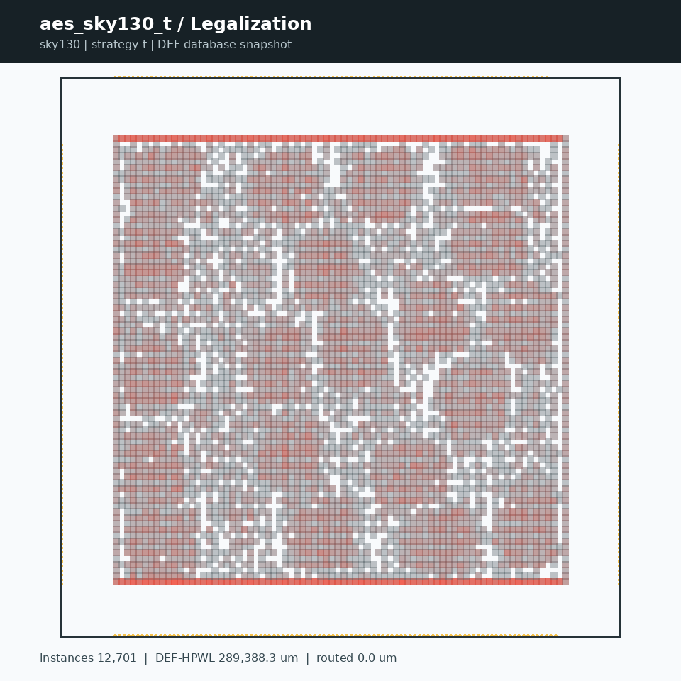</a></td><td><b>Routing</b> <a href="../reports/aes12_65pct_qor_wp_rt01b_comparison_assets/aes_sky130_t/routing.png">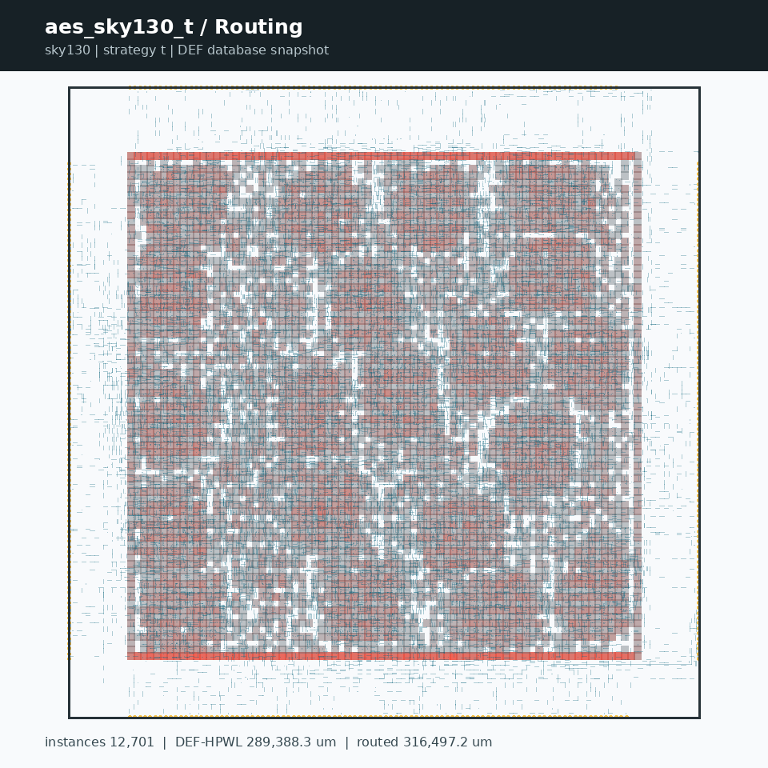</a></td><td><b>Filler</b> <a href="../reports/aes12_65pct_qor_wp_rt01b_comparison_assets/aes_sky130_t/filler.png">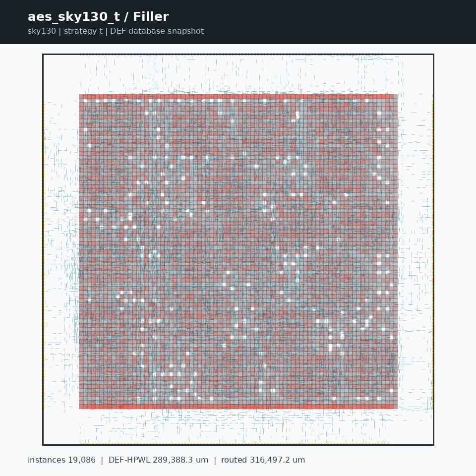</a></td><td><b>Final GDS</b> </td></tr>
</table>
CTS 专项图：[clock tree](../results/aes13_65pct_qor_wp_rt01b_20260731_1520/aes_sky130_t/workspace/result/cts/visualization/svg/cts_design.svg) / [flyline](../results/aes13_65pct_qor_wp_rt01b_20260731_1520/aes_sky130_t/workspace/result/cts/visualization/svg/cts_flyline.svg)

#### 空间 Map 证据

共发现 `34` 个原始 map 文件，渲染 `16` 张代表图。同类图使用跨 13 个设计的统一色标；DRC 使用统一对数色标。全零图保留并明确标注。

<table>
<tr><td><b>Std-cell density</b>  <small>non-zero 52.16%; max 1.000; <a href="../results/aes13_65pct_qor_wp_rt01b_20260731_1520/aes_sky130_t/workspace/result/density_map/place_stdcell_density.csv">raw</a></small></td><td><b>Macro density</b>  <small>non-zero 0.00%; max 0.000; <a href="../results/aes13_65pct_qor_wp_rt01b_20260731_1520/aes_sky130_t/workspace/result/density_map/place_macro_density.csv">raw</a></small></td><td><b>All-cell density</b>  <small>non-zero 55.98%; max 1.000; <a href="../results/aes13_65pct_qor_wp_rt01b_20260731_1520/aes_sky130_t/workspace/result/density_map/place_allcell_density.csv">raw</a></small></td><td><b>Std-cell pin density</b>  <small>non-zero 49.09%; max 11.000; <a href="../results/aes13_65pct_qor_wp_rt01b_20260731_1520/aes_sky130_t/workspace/result/density_map/place_stdcell_pin_density.csv">raw</a></small></td></tr>
<tr><td><b>Macro pin density</b>  <small>non-zero 0.00%; max 0.000; <a href="../results/aes13_65pct_qor_wp_rt01b_20260731_1520/aes_sky130_t/workspace/result/density_map/place_macro_pin_density.csv">raw</a></small></td><td><b>All-cell pin density</b>  <small>non-zero 54.80%; max 13.000; <a href="../results/aes13_65pct_qor_wp_rt01b_20260731_1520/aes_sky130_t/workspace/result/density_map/place_allcell_pin_density.csv">raw</a></small></td><td><b>Local-net density</b> <a href="../reports/aes12_65pct_qor_wp_rt01b_comparison_assets/aes_sky130_t/maps/local_net_density.png">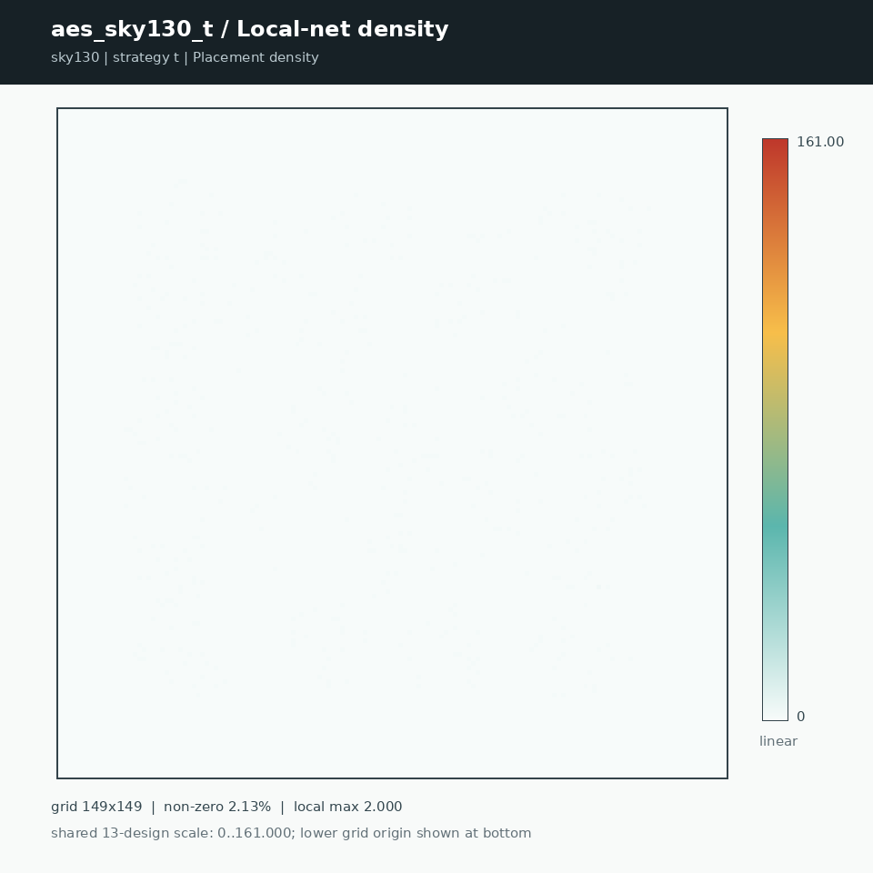</a> <small>non-zero 2.13%; max 2.000; <a href="../results/aes13_65pct_qor_wp_rt01b_20260731_1520/aes_sky130_t/workspace/result/density_map/place_local_net_density.csv">raw</a></small></td><td><b>Global-net density</b> <a href="../reports/aes12_65pct_qor_wp_rt01b_comparison_assets/aes_sky130_t/maps/global_net_density.png">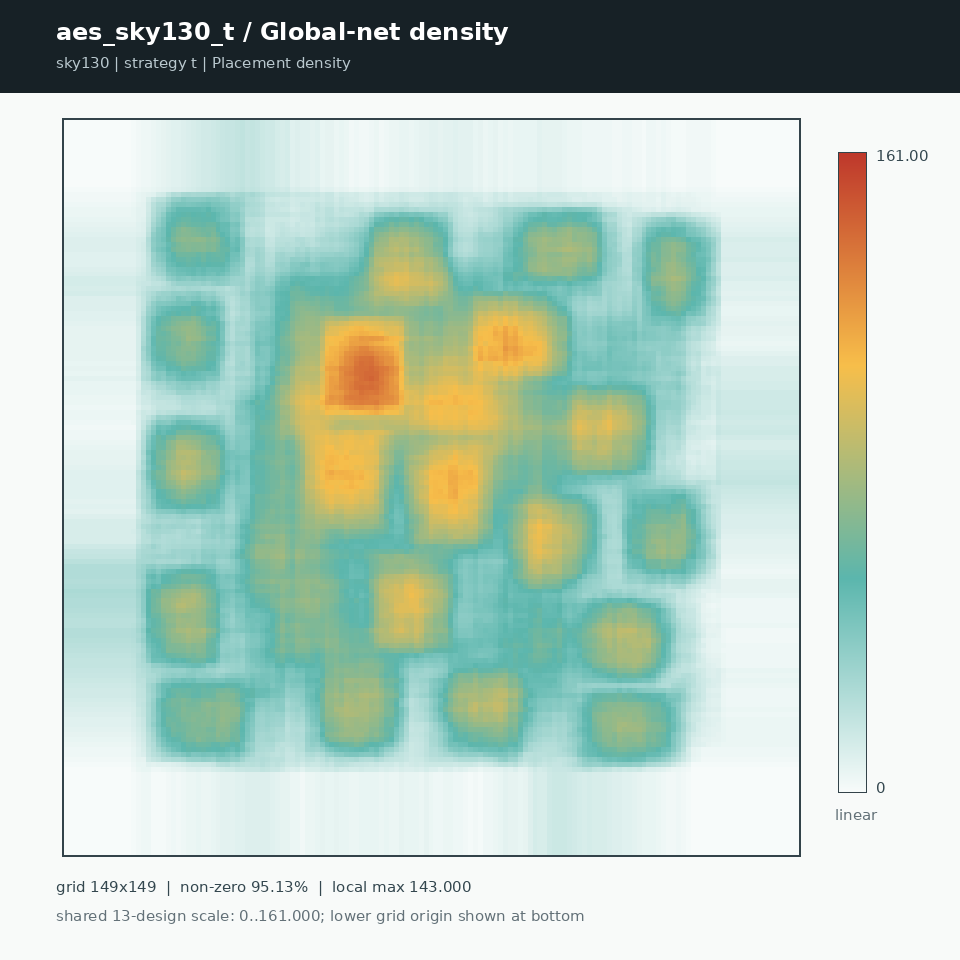</a> <small>non-zero 95.13%; max 143.000; <a href="../results/aes13_65pct_qor_wp_rt01b_20260731_1520/aes_sky130_t/workspace/result/density_map/place_global_net_density.csv">raw</a></small></td></tr>
<tr><td><b>All-net density</b> <a href="../reports/aes12_65pct_qor_wp_rt01b_comparison_assets/aes_sky130_t/maps/allnet_density.png">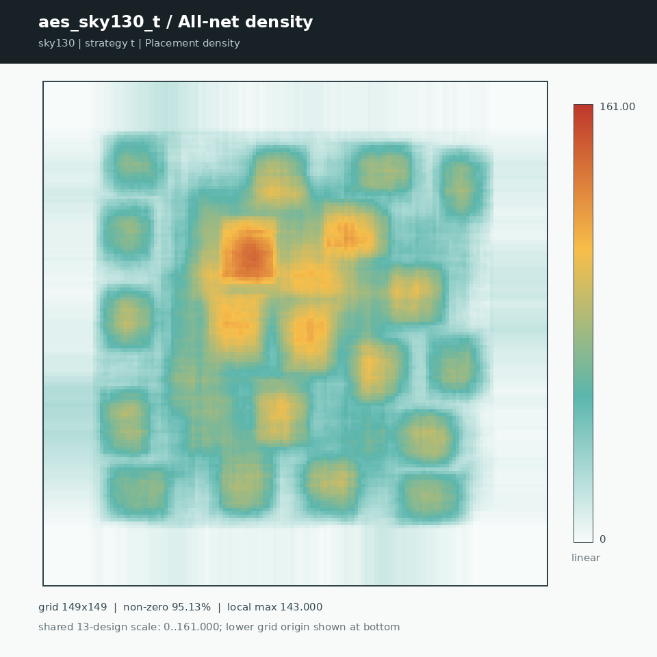</a> <small>non-zero 95.13%; max 143.000; <a href="../results/aes13_65pct_qor_wp_rt01b_20260731_1520/aes_sky130_t/workspace/result/density_map/place_allnet_density.csv">raw</a></small></td><td><b>EGR horizontal overflow</b>  <small>non-zero 39.89%; max 54.000; <a href="../results/aes13_65pct_qor_wp_rt01b_20260731_1520/aes_sky130_t/workspace/result/egr_congestion_map/place_egr_horizontal_overflow.csv">raw</a></small></td><td><b>EGR vertical overflow</b> <a href="../reports/aes12_65pct_qor_wp_rt01b_comparison_assets/aes_sky130_t/maps/egr_vertical_overflow.png">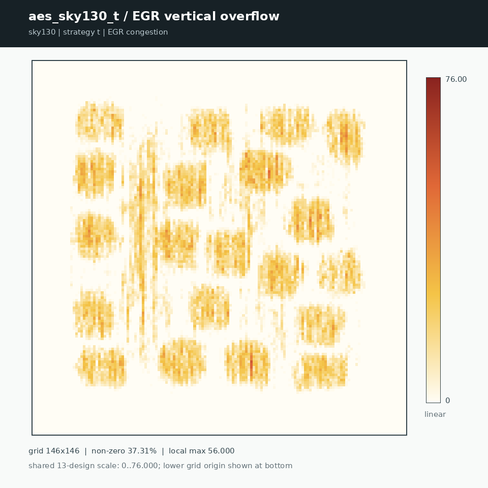</a> <small>non-zero 37.31%; max 56.000; <a href="../results/aes13_65pct_qor_wp_rt01b_20260731_1520/aes_sky130_t/workspace/result/egr_congestion_map/place_egr_vertical_overflow.csv">raw</a></small></td><td><b>EGR union overflow</b> <a href="../reports/aes12_65pct_qor_wp_rt01b_comparison_assets/aes_sky130_t/maps/egr_union_overflow.png">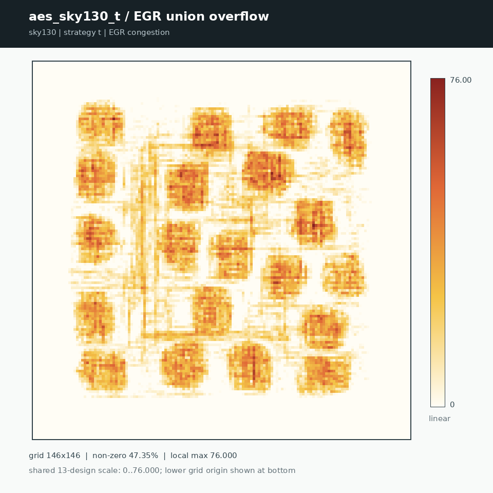</a> <small>non-zero 47.35%; max 76.000; <a href="../results/aes13_65pct_qor_wp_rt01b_20260731_1520/aes_sky130_t/workspace/result/egr_congestion_map/place_egr_union_overflow.csv">raw</a></small></td></tr>
<tr><td><b>Planar routing demand</b> <a href="../reports/aes12_65pct_qor_wp_rt01b_comparison_assets/aes_sky130_t/maps/early_net_planar.png">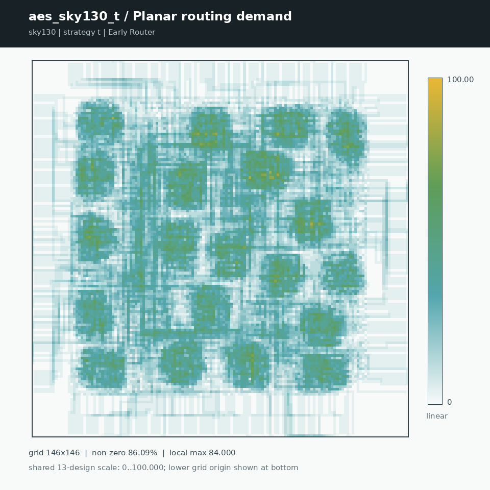</a> <small>non-zero 86.09%; max 84.000; <a href="../results/aes13_65pct_qor_wp_rt01b_20260731_1520/aes_sky130_t/workspace/result/rt/rt_temp_directory/early_router/net_map_planar.csv">raw</a></small></td><td><b>Planar routing supply</b> <a href="../reports/aes12_65pct_qor_wp_rt01b_comparison_assets/aes_sky130_t/maps/early_supply_planar.png">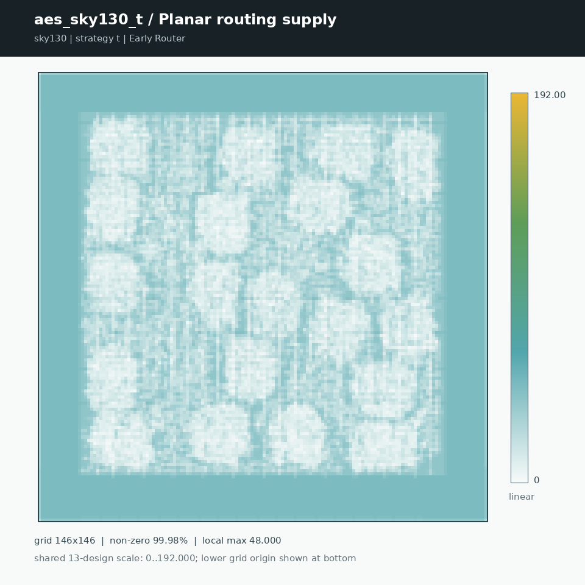</a> <small>non-zero 99.98%; max 48.000; <a href="../results/aes13_65pct_qor_wp_rt01b_20260731_1520/aes_sky130_t/workspace/result/rt/rt_temp_directory/early_router/supply_map_planar.csv">raw</a></small></td><td><b>Planar routing overflow</b> <a href="../reports/aes12_65pct_qor_wp_rt01b_comparison_assets/aes_sky130_t/maps/early_overflow_planar.png">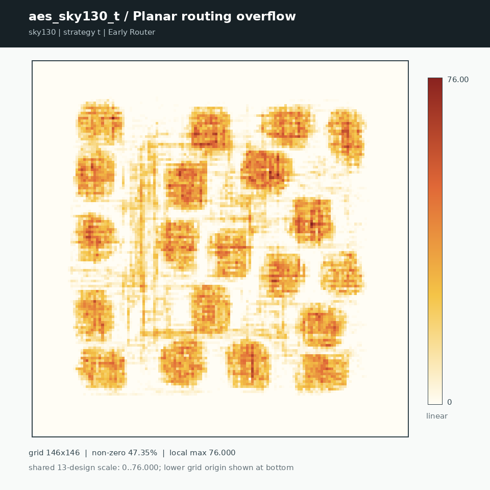</a> <small>non-zero 47.35%; max 76.000; <a href="../results/aes13_65pct_qor_wp_rt01b_20260731_1520/aes_sky130_t/workspace/result/rt/rt_temp_directory/early_router/overflow_map_planar.csv">raw</a></small></td><td><b>DRC violation-center density</b> <a href="../reports/aes12_65pct_qor_wp_rt01b_comparison_assets/aes_sky130_t/maps/drc_violation_density.png">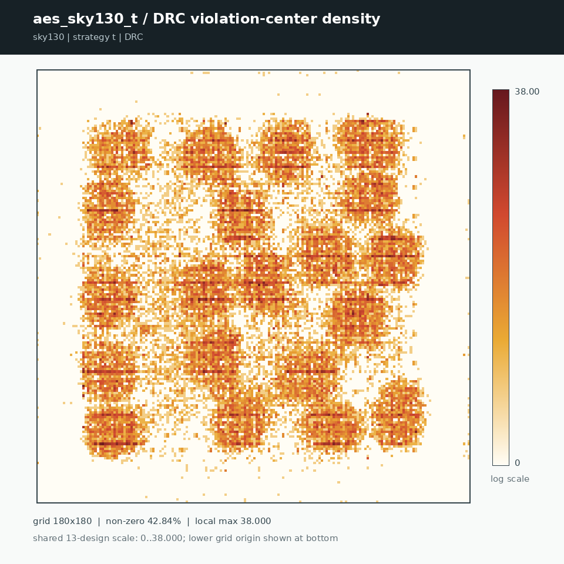</a> <small>non-zero 42.84%; max 38.000; <a href="../results/aes13_65pct_qor_wp_rt01b_20260731_1520/aes_sky130_t/workspace/drc_temp_directory/violation_map.json">raw</a></small></td></tr>
</table>

完整原始 map 文件索引

- **Placement density CSV (9)**：[place_allcell_density.csv](../results/aes13_65pct_qor_wp_rt01b_20260731_1520/aes_sky130_t/workspace/result/density_map/place_allcell_density.csv), [place_allcell_pin_density.csv](../results/aes13_65pct_qor_wp_rt01b_20260731_1520/aes_sky130_t/workspace/result/density_map/place_allcell_pin_density.csv), [place_allnet_density.csv](../results/aes13_65pct_qor_wp_rt01b_20260731_1520/aes_sky130_t/workspace/result/density_map/place_allnet_density.csv), [place_global_net_density.csv](../results/aes13_65pct_qor_wp_rt01b_20260731_1520/aes_sky130_t/workspace/result/density_map/place_global_net_density.csv), [place_local_net_density.csv](../results/aes13_65pct_qor_wp_rt01b_20260731_1520/aes_sky130_t/workspace/result/density_map/place_local_net_density.csv), [place_macro_density.csv](../results/aes13_65pct_qor_wp_rt01b_20260731_1520/aes_sky130_t/workspace/result/density_map/place_macro_density.csv), [place_macro_pin_density.csv](../results/aes13_65pct_qor_wp_rt01b_20260731_1520/aes_sky130_t/workspace/result/density_map/place_macro_pin_density.csv), [place_stdcell_density.csv](../results/aes13_65pct_qor_wp_rt01b_20260731_1520/aes_sky130_t/workspace/result/density_map/place_stdcell_density.csv), [place_stdcell_pin_density.csv](../results/aes13_65pct_qor_wp_rt01b_20260731_1520/aes_sky130_t/workspace/result/density_map/place_stdcell_pin_density.csv)
- **EGR congestion CSV (3)**：[place_egr_horizontal_overflow.csv](../results/aes13_65pct_qor_wp_rt01b_20260731_1520/aes_sky130_t/workspace/result/egr_congestion_map/place_egr_horizontal_overflow.csv), [place_egr_union_overflow.csv](../results/aes13_65pct_qor_wp_rt01b_20260731_1520/aes_sky130_t/workspace/result/egr_congestion_map/place_egr_union_overflow.csv), [place_egr_vertical_overflow.csv](../results/aes13_65pct_qor_wp_rt01b_20260731_1520/aes_sky130_t/workspace/result/egr_congestion_map/place_egr_vertical_overflow.csv)
- **Early-router layer CSV (21)**：[net_map_li1.csv](../results/aes13_65pct_qor_wp_rt01b_20260731_1520/aes_sky130_t/workspace/result/rt/rt_temp_directory/early_router/net_map_li1.csv), [net_map_met1.csv](../results/aes13_65pct_qor_wp_rt01b_20260731_1520/aes_sky130_t/workspace/result/rt/rt_temp_directory/early_router/net_map_met1.csv), [net_map_met2.csv](../results/aes13_65pct_qor_wp_rt01b_20260731_1520/aes_sky130_t/workspace/result/rt/rt_temp_directory/early_router/net_map_met2.csv), [net_map_met3.csv](../results/aes13_65pct_qor_wp_rt01b_20260731_1520/aes_sky130_t/workspace/result/rt/rt_temp_directory/early_router/net_map_met3.csv), [net_map_met4.csv](../results/aes13_65pct_qor_wp_rt01b_20260731_1520/aes_sky130_t/workspace/result/rt/rt_temp_directory/early_router/net_map_met4.csv), [net_map_met5.csv](../results/aes13_65pct_qor_wp_rt01b_20260731_1520/aes_sky130_t/workspace/result/rt/rt_temp_directory/early_router/net_map_met5.csv), [net_map_planar.csv](../results/aes13_65pct_qor_wp_rt01b_20260731_1520/aes_sky130_t/workspace/result/rt/rt_temp_directory/early_router/net_map_planar.csv), [overflow_map_li1.csv](../results/aes13_65pct_qor_wp_rt01b_20260731_1520/aes_sky130_t/workspace/result/rt/rt_temp_directory/early_router/overflow_map_li1.csv), [overflow_map_met1.csv](../results/aes13_65pct_qor_wp_rt01b_20260731_1520/aes_sky130_t/workspace/result/rt/rt_temp_directory/early_router/overflow_map_met1.csv), [overflow_map_met2.csv](../results/aes13_65pct_qor_wp_rt01b_20260731_1520/aes_sky130_t/workspace/result/rt/rt_temp_directory/early_router/overflow_map_met2.csv), [overflow_map_met3.csv](../results/aes13_65pct_qor_wp_rt01b_20260731_1520/aes_sky130_t/workspace/result/rt/rt_temp_directory/early_router/overflow_map_met3.csv), [overflow_map_met4.csv](../results/aes13_65pct_qor_wp_rt01b_20260731_1520/aes_sky130_t/workspace/result/rt/rt_temp_directory/early_router/overflow_map_met4.csv), [overflow_map_met5.csv](../results/aes13_65pct_qor_wp_rt01b_20260731_1520/aes_sky130_t/workspace/result/rt/rt_temp_directory/early_router/overflow_map_met5.csv), [overflow_map_planar.csv](../results/aes13_65pct_qor_wp_rt01b_20260731_1520/aes_sky130_t/workspace/result/rt/rt_temp_directory/early_router/overflow_map_planar.csv), [supply_map_li1.csv](../results/aes13_65pct_qor_wp_rt01b_20260731_1520/aes_sky130_t/workspace/result/rt/rt_temp_directory/early_router/supply_map_li1.csv), [supply_map_met1.csv](../results/aes13_65pct_qor_wp_rt01b_20260731_1520/aes_sky130_t/workspace/result/rt/rt_temp_directory/early_router/supply_map_met1.csv), [supply_map_met2.csv](../results/aes13_65pct_qor_wp_rt01b_20260731_1520/aes_sky130_t/workspace/result/rt/rt_temp_directory/early_router/supply_map_met2.csv), [supply_map_met3.csv](../results/aes13_65pct_qor_wp_rt01b_20260731_1520/aes_sky130_t/workspace/result/rt/rt_temp_directory/early_router/supply_map_met3.csv), [supply_map_met4.csv](../results/aes13_65pct_qor_wp_rt01b_20260731_1520/aes_sky130_t/workspace/result/rt/rt_temp_directory/early_router/supply_map_met4.csv), [supply_map_met5.csv](../results/aes13_65pct_qor_wp_rt01b_20260731_1520/aes_sky130_t/workspace/result/rt/rt_temp_directory/early_router/supply_map_met5.csv), [supply_map_planar.csv](../results/aes13_65pct_qor_wp_rt01b_20260731_1520/aes_sky130_t/workspace/result/rt/rt_temp_directory/early_router/supply_map_planar.csv)
- **DRC violation JSON (1)**：[violation_map.json](../results/aes13_65pct_qor_wp_rt01b_20260731_1520/aes_sky130_t/workspace/drc_temp_directory/violation_map.json)

### aes_nangate45_a (nangate45 / a)

| Stage | Runtime (s) | Memory (MB) | Instances | Timing inst. | Core util. | DEF HPWL (um) | Routed (um) | Setup WNS (ns) | Power (mW) | Congestion | DRC | IR-drop |
|---|---:|---:|---:|---:|---:|---:|---:|---:|---:|---|---:|---|
| Floorplan | 0.00 | 0.0 | 12,292 | 0 | 65.3% | 0.0 | 0.0 | N/A | N/A | N/A | N/A | N/A |
| Fanout | 1.28 | 3,824.2 | 12,412 | 120 | 67.3% | 0.0 | 0.0 | N/A | N/A | N/A | N/A | N/A |
| Placement | 12.70 | 1,008.6 | 12,412 | 120 | 67.3% | 127,259.8 | 0.0 | N/A | N/A | N/A | N/A | N/A |
| CTS | 2.26 | 187.4 | 12,435 | 143 | 67.4% | 128,792.6 | 0.0 | N/A | N/A | N/A | N/A | N/A |
| Legalization | 3.79 | 1,009.0 | 12,435 | 143 | 67.4% | 128,802.0 | 0.0 | N/A | N/A | N/A | N/A | N/A |
| Routing | 1,560.72 | 0.0 | 12,435 | 143 | 67.4% | 128,802.0 | 138,803.9 | 1.380 | 22.690 | N/A | 15,329 | N/A |
| Filler | 3.83 | 80.3 | 18,837 | 143 | 97.0% | 128,802.0 | 138,803.9 | N/A | N/A | N/A | N/A | N/A |

Post-route：setup WNS `1.380 ns`，hold WNS `0.086 ns`，功耗 `22.690 mW`，DRC `15,329`。DRC 主项：metal_short=7,731, parallel_run_length_spacing=7,515, nonsufficient_metal_overlap=59。未约束端口 `5`，缺失 input slew pin `226`。

<table>
<tr><td><b>Floorplan</b> </td><td><b>Fanout</b> </td><td><b>Placement</b> </td><td><b>CTS</b> <a href="../reports/aes12_65pct_qor_wp_rt01b_comparison_assets/aes_nangate45_a/cts.png">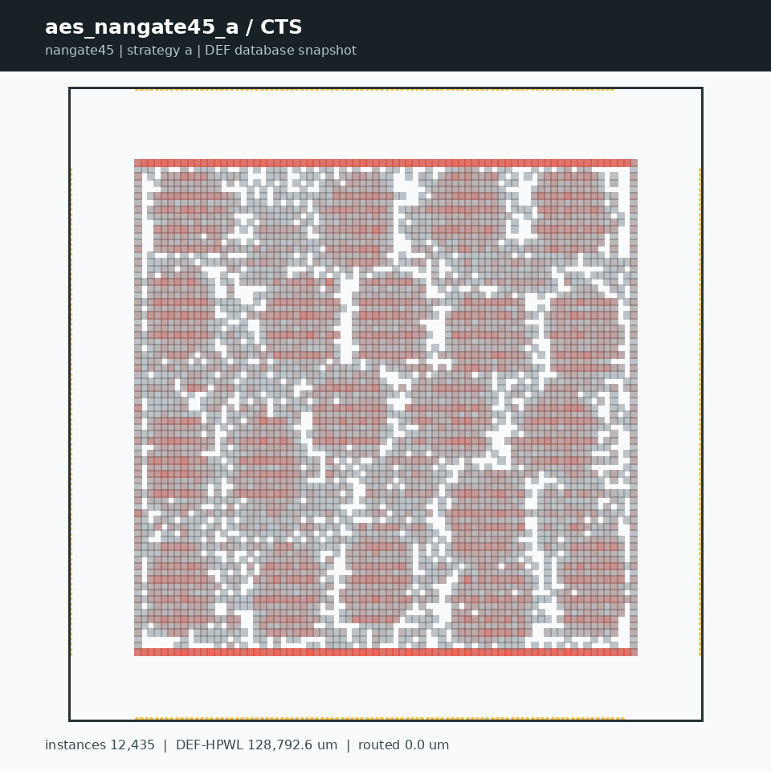</a></td></tr>
<tr><td><b>Legalization</b> <a href="../reports/aes12_65pct_qor_wp_rt01b_comparison_assets/aes_nangate45_a/legalization.png">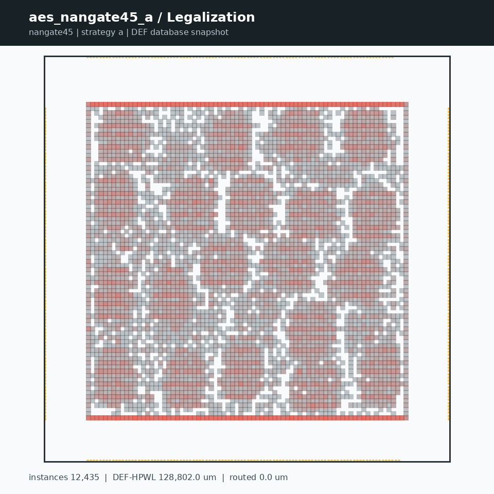</a></td><td><b>Routing</b> <a href="../reports/aes12_65pct_qor_wp_rt01b_comparison_assets/aes_nangate45_a/routing.png">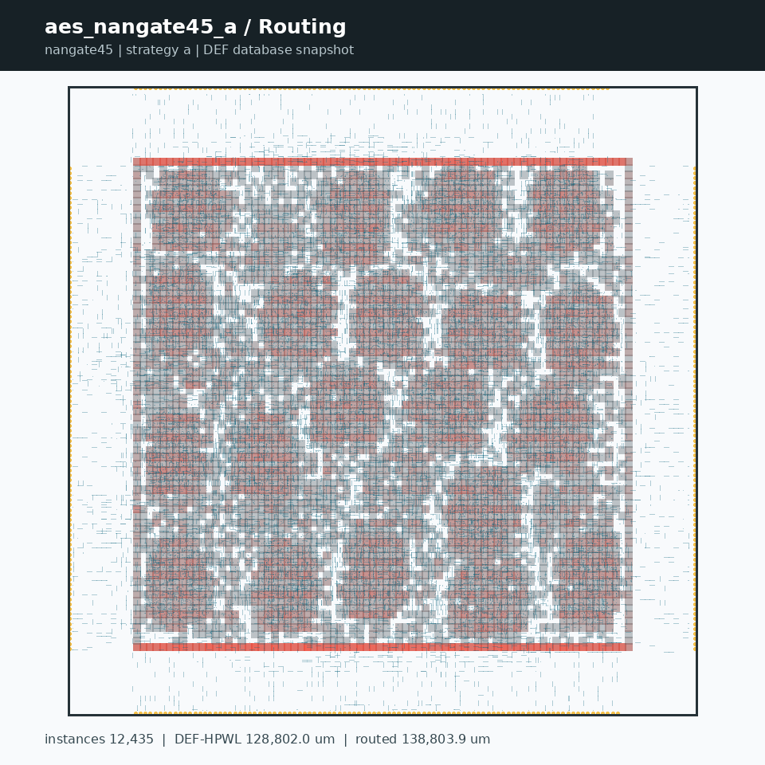</a></td><td><b>Filler</b> <a href="../reports/aes12_65pct_qor_wp_rt01b_comparison_assets/aes_nangate45_a/filler.png">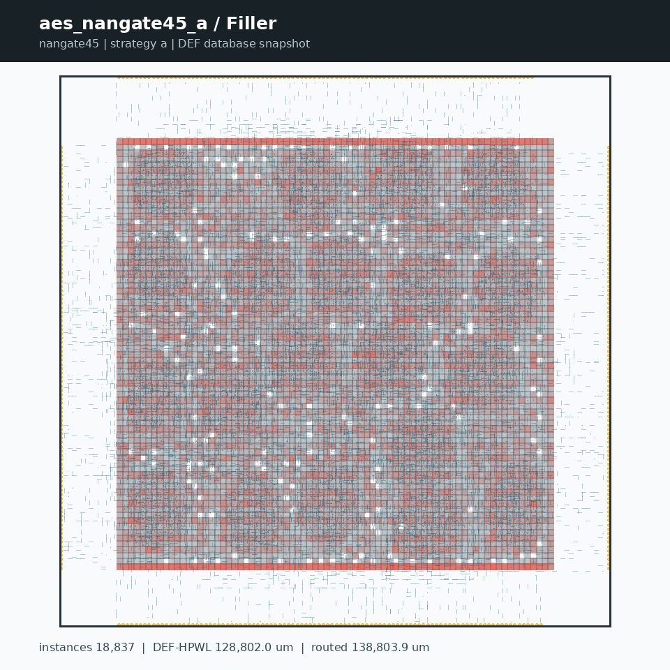</a></td><td><b>Final GDS</b> </td></tr>
</table>
CTS 专项图：[clock tree](../results/aes13_65pct_qor_wp_rt01b_20260731_1520/aes_nangate45_a/workspace/result/cts/visualization/svg/cts_design.svg) / [flyline](../results/aes13_65pct_qor_wp_rt01b_20260731_1520/aes_nangate45_a/workspace/result/cts/visualization/svg/cts_flyline.svg)

#### 空间 Map 证据

共发现 `46` 个原始 map 文件，渲染 `16` 张代表图。同类图使用跨 13 个设计的统一色标；DRC 使用统一对数色标。全零图保留并明确标注。

<table>
<tr><td><b>Std-cell density</b> <a href="../reports/aes12_65pct_qor_wp_rt01b_comparison_assets/aes_nangate45_a/maps/stdcell_density.png">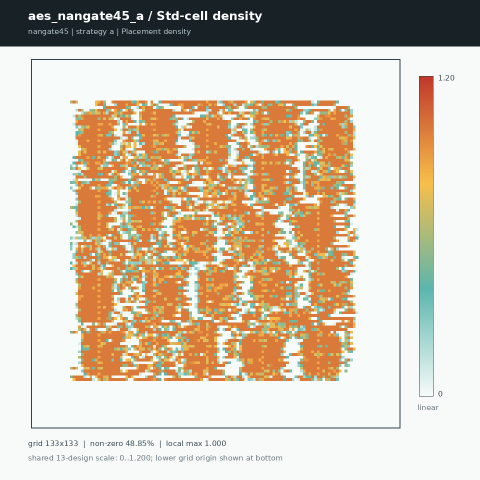</a> <small>non-zero 48.85%; max 1.000; <a href="../results/aes13_65pct_qor_wp_rt01b_20260731_1520/aes_nangate45_a/workspace/result/density_map/place_stdcell_density.csv">raw</a></small></td><td><b>Macro density</b>  <small>non-zero 0.00%; max 0.000; <a href="../results/aes13_65pct_qor_wp_rt01b_20260731_1520/aes_nangate45_a/workspace/result/density_map/place_macro_density.csv">raw</a></small></td><td><b>All-cell density</b> <a href="../reports/aes12_65pct_qor_wp_rt01b_comparison_assets/aes_nangate45_a/maps/allcell_density.png">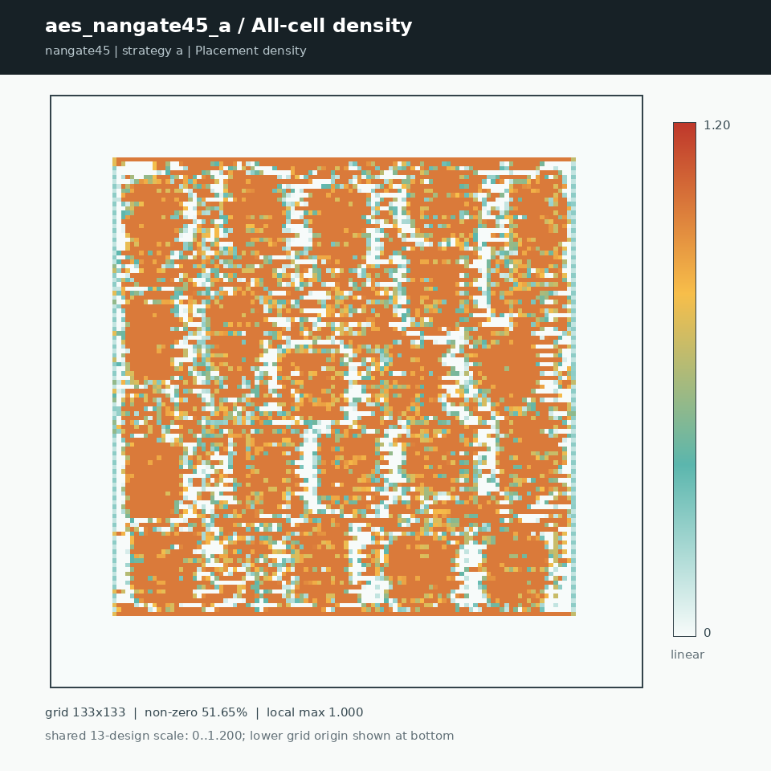</a> <small>non-zero 51.65%; max 1.000; <a href="../results/aes13_65pct_qor_wp_rt01b_20260731_1520/aes_nangate45_a/workspace/result/density_map/place_allcell_density.csv">raw</a></small></td><td><b>Std-cell pin density</b>  <small>non-zero 46.26%; max 14.000; <a href="../results/aes13_65pct_qor_wp_rt01b_20260731_1520/aes_nangate45_a/workspace/result/density_map/place_stdcell_pin_density.csv">raw</a></small></td></tr>
<tr><td><b>Macro pin density</b> <a href="../reports/aes12_65pct_qor_wp_rt01b_comparison_assets/aes_nangate45_a/maps/macro_pin_density.png">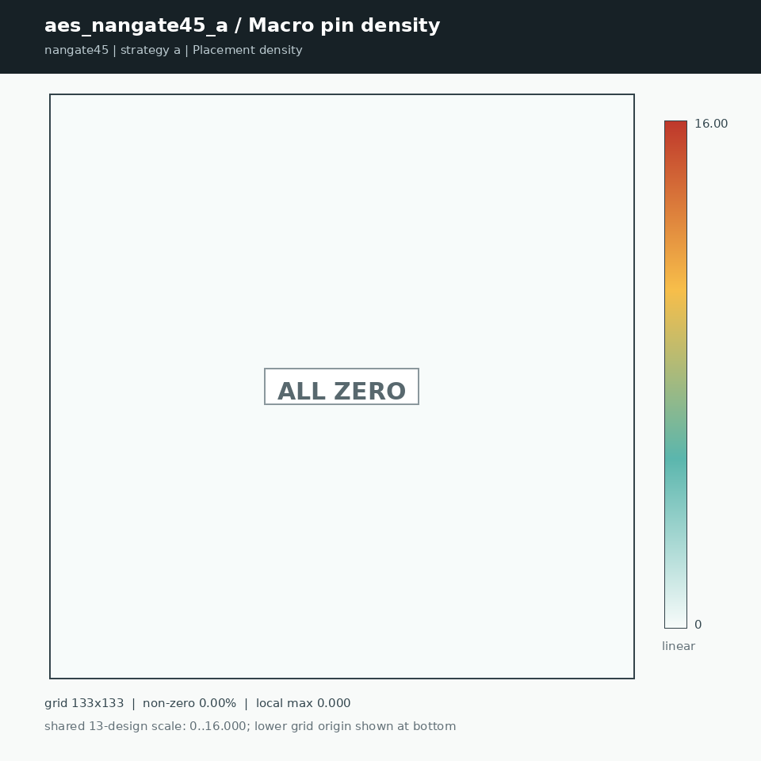</a> <small>non-zero 0.00%; max 0.000; <a href="../results/aes13_65pct_qor_wp_rt01b_20260731_1520/aes_nangate45_a/workspace/result/density_map/place_macro_pin_density.csv">raw</a></small></td><td><b>All-cell pin density</b>  <small>non-zero 50.03%; max 16.000; <a href="../results/aes13_65pct_qor_wp_rt01b_20260731_1520/aes_nangate45_a/workspace/result/density_map/place_allcell_pin_density.csv">raw</a></small></td><td><b>Local-net density</b> <a href="../reports/aes12_65pct_qor_wp_rt01b_comparison_assets/aes_nangate45_a/maps/local_net_density.png">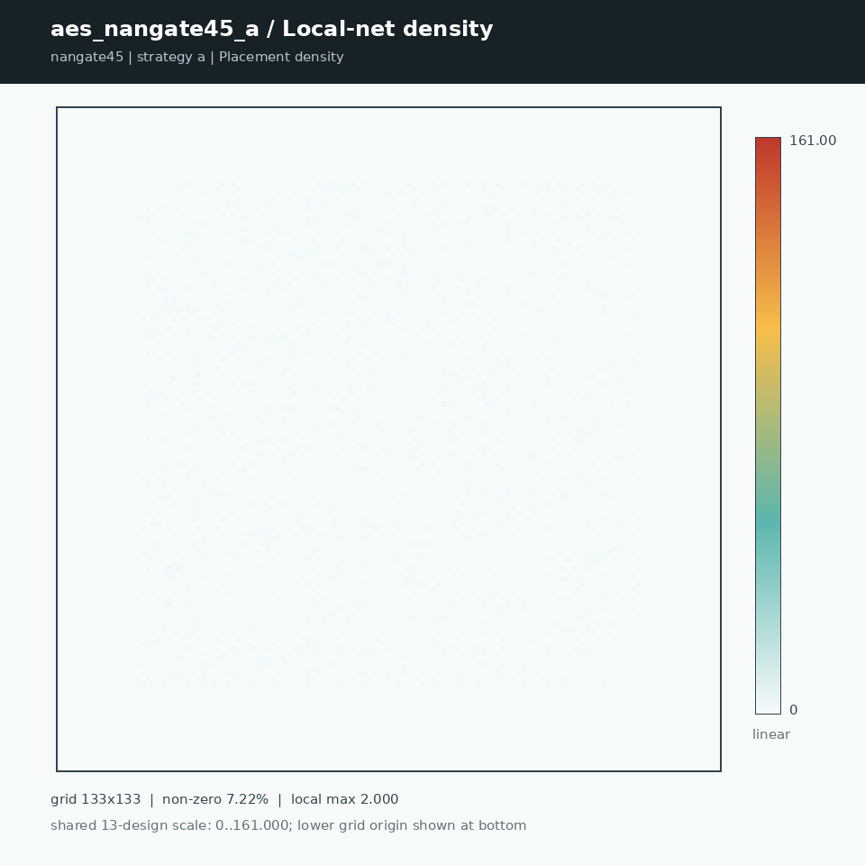</a> <small>non-zero 7.22%; max 2.000; <a href="../results/aes13_65pct_qor_wp_rt01b_20260731_1520/aes_nangate45_a/workspace/result/density_map/place_local_net_density.csv">raw</a></small></td><td><b>Global-net density</b> <a href="../reports/aes12_65pct_qor_wp_rt01b_comparison_assets/aes_nangate45_a/maps/global_net_density.png">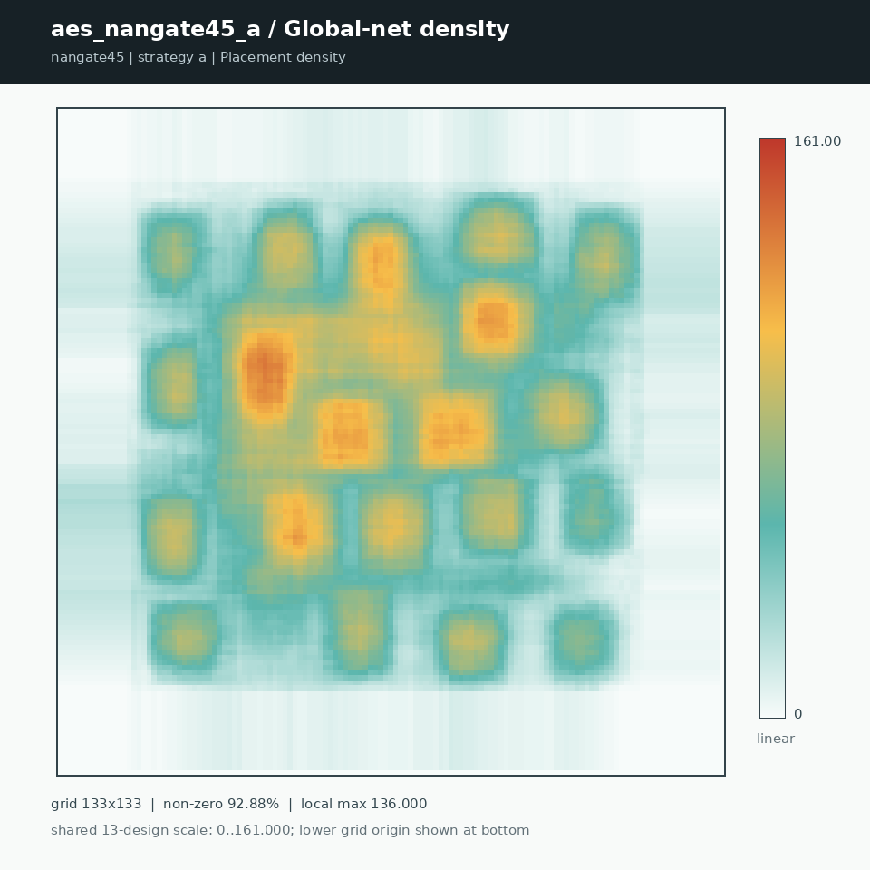</a> <small>non-zero 92.88%; max 136.000; <a href="../results/aes13_65pct_qor_wp_rt01b_20260731_1520/aes_nangate45_a/workspace/result/density_map/place_global_net_density.csv">raw</a></small></td></tr>
<tr><td><b>All-net density</b>  <small>non-zero 92.88%; max 136.000; <a href="../results/aes13_65pct_qor_wp_rt01b_20260731_1520/aes_nangate45_a/workspace/result/density_map/place_allnet_density.csv">raw</a></small></td><td><b>EGR horizontal overflow</b>  <small>non-zero 1.22%; max 17.000; <a href="../results/aes13_65pct_qor_wp_rt01b_20260731_1520/aes_nangate45_a/workspace/result/egr_congestion_map/place_egr_horizontal_overflow.csv">raw</a></small></td><td><b>EGR vertical overflow</b>  <small>non-zero 9.56%; max 31.000; <a href="../results/aes13_65pct_qor_wp_rt01b_20260731_1520/aes_nangate45_a/workspace/result/egr_congestion_map/place_egr_vertical_overflow.csv">raw</a></small></td><td><b>EGR union overflow</b> <a href="../reports/aes12_65pct_qor_wp_rt01b_comparison_assets/aes_nangate45_a/maps/egr_union_overflow.png">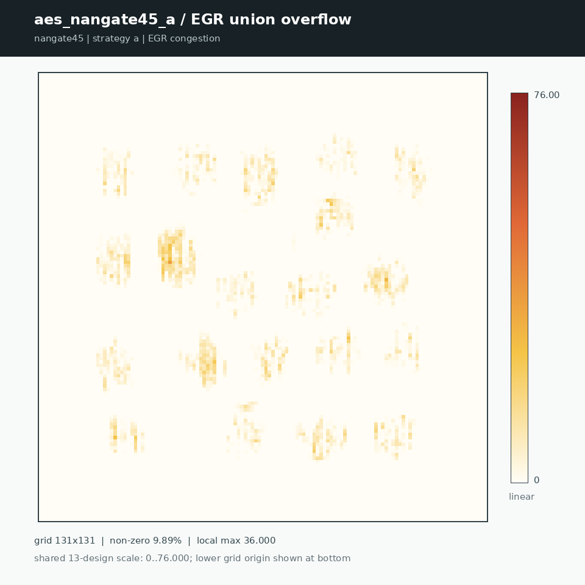</a> <small>non-zero 9.89%; max 36.000; <a href="../results/aes13_65pct_qor_wp_rt01b_20260731_1520/aes_nangate45_a/workspace/result/egr_congestion_map/place_egr_union_overflow.csv">raw</a></small></td></tr>
<tr><td><b>Planar routing demand</b>  <small>non-zero 87.75%; max 88.000; <a href="../results/aes13_65pct_qor_wp_rt01b_20260731_1520/aes_nangate45_a/workspace/result/rt/rt_temp_directory/early_router/net_map_planar.csv">raw</a></small></td><td><b>Planar routing supply</b> <a href="../reports/aes12_65pct_qor_wp_rt01b_comparison_assets/aes_nangate45_a/maps/early_supply_planar.png">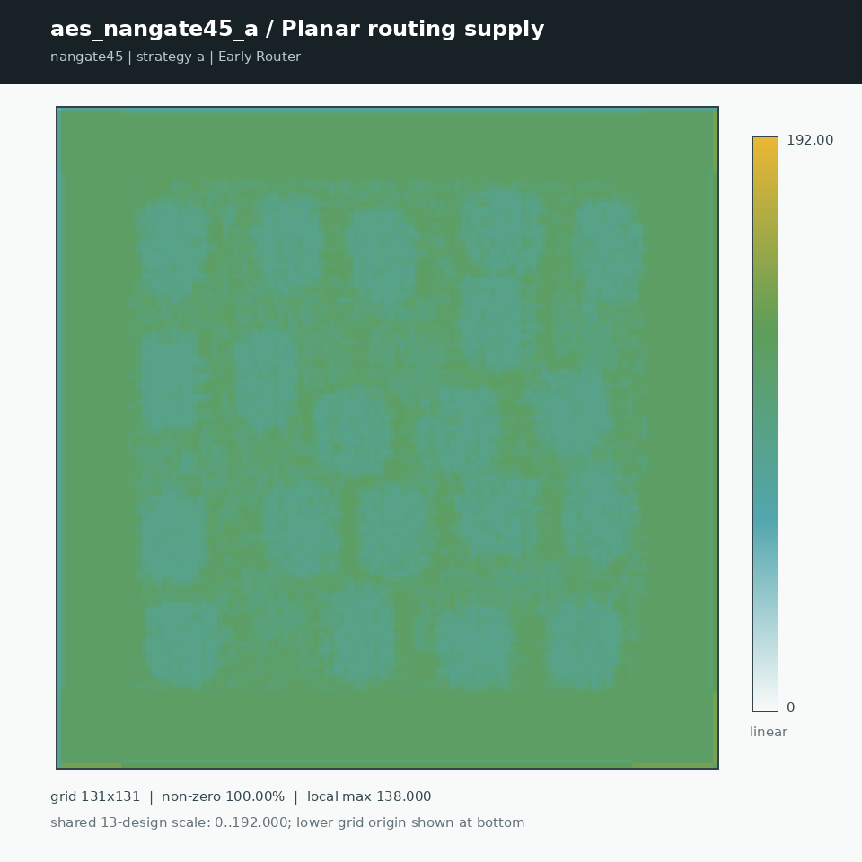</a> <small>non-zero 100.00%; max 138.000; <a href="../results/aes13_65pct_qor_wp_rt01b_20260731_1520/aes_nangate45_a/workspace/result/rt/rt_temp_directory/early_router/supply_map_planar.csv">raw</a></small></td><td><b>Planar routing overflow</b>  <small>non-zero 0.89%; max 10.000; <a href="../results/aes13_65pct_qor_wp_rt01b_20260731_1520/aes_nangate45_a/workspace/result/rt/rt_temp_directory/early_router/overflow_map_planar.csv">raw</a></small></td><td><b>DRC violation-center density</b>  <small>non-zero 16.97%; max 15.000; <a href="../results/aes13_65pct_qor_wp_rt01b_20260731_1520/aes_nangate45_a/workspace/drc_temp_directory/violation_map.json">raw</a></small></td></tr>
</table>

完整原始 map 文件索引

- **Placement density CSV (9)**：[place_allcell_density.csv](../results/aes13_65pct_qor_wp_rt01b_20260731_1520/aes_nangate45_a/workspace/result/density_map/place_allcell_density.csv), [place_allcell_pin_density.csv](../results/aes13_65pct_qor_wp_rt01b_20260731_1520/aes_nangate45_a/workspace/result/density_map/place_allcell_pin_density.csv), [place_allnet_density.csv](../results/aes13_65pct_qor_wp_rt01b_20260731_1520/aes_nangate45_a/workspace/result/density_map/place_allnet_density.csv), [place_global_net_density.csv](../results/aes13_65pct_qor_wp_rt01b_20260731_1520/aes_nangate45_a/workspace/result/density_map/place_global_net_density.csv), [place_local_net_density.csv](../results/aes13_65pct_qor_wp_rt01b_20260731_1520/aes_nangate45_a/workspace/result/density_map/place_local_net_density.csv), [place_macro_density.csv](../results/aes13_65pct_qor_wp_rt01b_20260731_1520/aes_nangate45_a/workspace/result/density_map/place_macro_density.csv), [place_macro_pin_density.csv](../results/aes13_65pct_qor_wp_rt01b_20260731_1520/aes_nangate45_a/workspace/result/density_map/place_macro_pin_density.csv), [place_stdcell_density.csv](../results/aes13_65pct_qor_wp_rt01b_20260731_1520/aes_nangate45_a/workspace/result/density_map/place_stdcell_density.csv), [place_stdcell_pin_density.csv](../results/aes13_65pct_qor_wp_rt01b_20260731_1520/aes_nangate45_a/workspace/result/density_map/place_stdcell_pin_density.csv)
- **EGR congestion CSV (3)**：[place_egr_horizontal_overflow.csv](../results/aes13_65pct_qor_wp_rt01b_20260731_1520/aes_nangate45_a/workspace/result/egr_congestion_map/place_egr_horizontal_overflow.csv), [place_egr_union_overflow.csv](../results/aes13_65pct_qor_wp_rt01b_20260731_1520/aes_nangate45_a/workspace/result/egr_congestion_map/place_egr_union_overflow.csv), [place_egr_vertical_overflow.csv](../results/aes13_65pct_qor_wp_rt01b_20260731_1520/aes_nangate45_a/workspace/result/egr_congestion_map/place_egr_vertical_overflow.csv)
- **Early-router layer CSV (33)**：[net_map_metal1.csv](../results/aes13_65pct_qor_wp_rt01b_20260731_1520/aes_nangate45_a/workspace/result/rt/rt_temp_directory/early_router/net_map_metal1.csv), [net_map_metal10.csv](../results/aes13_65pct_qor_wp_rt01b_20260731_1520/aes_nangate45_a/workspace/result/rt/rt_temp_directory/early_router/net_map_metal10.csv), [net_map_metal2.csv](../results/aes13_65pct_qor_wp_rt01b_20260731_1520/aes_nangate45_a/workspace/result/rt/rt_temp_directory/early_router/net_map_metal2.csv), [net_map_metal3.csv](../results/aes13_65pct_qor_wp_rt01b_20260731_1520/aes_nangate45_a/workspace/result/rt/rt_temp_directory/early_router/net_map_metal3.csv), [net_map_metal4.csv](../results/aes13_65pct_qor_wp_rt01b_20260731_1520/aes_nangate45_a/workspace/result/rt/rt_temp_directory/early_router/net_map_metal4.csv), [net_map_metal5.csv](../results/aes13_65pct_qor_wp_rt01b_20260731_1520/aes_nangate45_a/workspace/result/rt/rt_temp_directory/early_router/net_map_metal5.csv), [net_map_metal6.csv](../results/aes13_65pct_qor_wp_rt01b_20260731_1520/aes_nangate45_a/workspace/result/rt/rt_temp_directory/early_router/net_map_metal6.csv), [net_map_metal7.csv](../results/aes13_65pct_qor_wp_rt01b_20260731_1520/aes_nangate45_a/workspace/result/rt/rt_temp_directory/early_router/net_map_metal7.csv), [net_map_metal8.csv](../results/aes13_65pct_qor_wp_rt01b_20260731_1520/aes_nangate45_a/workspace/result/rt/rt_temp_directory/early_router/net_map_metal8.csv), [net_map_metal9.csv](../results/aes13_65pct_qor_wp_rt01b_20260731_1520/aes_nangate45_a/workspace/result/rt/rt_temp_directory/early_router/net_map_metal9.csv), [net_map_planar.csv](../results/aes13_65pct_qor_wp_rt01b_20260731_1520/aes_nangate45_a/workspace/result/rt/rt_temp_directory/early_router/net_map_planar.csv), [overflow_map_metal1.csv](../results/aes13_65pct_qor_wp_rt01b_20260731_1520/aes_nangate45_a/workspace/result/rt/rt_temp_directory/early_router/overflow_map_metal1.csv), [overflow_map_metal10.csv](../results/aes13_65pct_qor_wp_rt01b_20260731_1520/aes_nangate45_a/workspace/result/rt/rt_temp_directory/early_router/overflow_map_metal10.csv), [overflow_map_metal2.csv](../results/aes13_65pct_qor_wp_rt01b_20260731_1520/aes_nangate45_a/workspace/result/rt/rt_temp_directory/early_router/overflow_map_metal2.csv), [overflow_map_metal3.csv](../results/aes13_65pct_qor_wp_rt01b_20260731_1520/aes_nangate45_a/workspace/result/rt/rt_temp_directory/early_router/overflow_map_metal3.csv), [overflow_map_metal4.csv](../results/aes13_65pct_qor_wp_rt01b_20260731_1520/aes_nangate45_a/workspace/result/rt/rt_temp_directory/early_router/overflow_map_metal4.csv), [overflow_map_metal5.csv](../results/aes13_65pct_qor_wp_rt01b_20260731_1520/aes_nangate45_a/workspace/result/rt/rt_temp_directory/early_router/overflow_map_metal5.csv), [overflow_map_metal6.csv](../results/aes13_65pct_qor_wp_rt01b_20260731_1520/aes_nangate45_a/workspace/result/rt/rt_temp_directory/early_router/overflow_map_metal6.csv), [overflow_map_metal7.csv](../results/aes13_65pct_qor_wp_rt01b_20260731_1520/aes_nangate45_a/workspace/result/rt/rt_temp_directory/early_router/overflow_map_metal7.csv), [overflow_map_metal8.csv](../results/aes13_65pct_qor_wp_rt01b_20260731_1520/aes_nangate45_a/workspace/result/rt/rt_temp_directory/early_router/overflow_map_metal8.csv), [overflow_map_metal9.csv](../results/aes13_65pct_qor_wp_rt01b_20260731_1520/aes_nangate45_a/workspace/result/rt/rt_temp_directory/early_router/overflow_map_metal9.csv), [overflow_map_planar.csv](../results/aes13_65pct_qor_wp_rt01b_20260731_1520/aes_nangate45_a/workspace/result/rt/rt_temp_directory/early_router/overflow_map_planar.csv), [supply_map_metal1.csv](../results/aes13_65pct_qor_wp_rt01b_20260731_1520/aes_nangate45_a/workspace/result/rt/rt_temp_directory/early_router/supply_map_metal1.csv), [supply_map_metal10.csv](../results/aes13_65pct_qor_wp_rt01b_20260731_1520/aes_nangate45_a/workspace/result/rt/rt_temp_directory/early_router/supply_map_metal10.csv), [supply_map_metal2.csv](../results/aes13_65pct_qor_wp_rt01b_20260731_1520/aes_nangate45_a/workspace/result/rt/rt_temp_directory/early_router/supply_map_metal2.csv), [supply_map_metal3.csv](../results/aes13_65pct_qor_wp_rt01b_20260731_1520/aes_nangate45_a/workspace/result/rt/rt_temp_directory/early_router/supply_map_metal3.csv), [supply_map_metal4.csv](../results/aes13_65pct_qor_wp_rt01b_20260731_1520/aes_nangate45_a/workspace/result/rt/rt_temp_directory/early_router/supply_map_metal4.csv), [supply_map_metal5.csv](../results/aes13_65pct_qor_wp_rt01b_20260731_1520/aes_nangate45_a/workspace/result/rt/rt_temp_directory/early_router/supply_map_metal5.csv), [supply_map_metal6.csv](../results/aes13_65pct_qor_wp_rt01b_20260731_1520/aes_nangate45_a/workspace/result/rt/rt_temp_directory/early_router/supply_map_metal6.csv), [supply_map_metal7.csv](../results/aes13_65pct_qor_wp_rt01b_20260731_1520/aes_nangate45_a/workspace/result/rt/rt_temp_directory/early_router/supply_map_metal7.csv), [supply_map_metal8.csv](../results/aes13_65pct_qor_wp_rt01b_20260731_1520/aes_nangate45_a/workspace/result/rt/rt_temp_directory/early_router/supply_map_metal8.csv), [supply_map_metal9.csv](../results/aes13_65pct_qor_wp_rt01b_20260731_1520/aes_nangate45_a/workspace/result/rt/rt_temp_directory/early_router/supply_map_metal9.csv), [supply_map_planar.csv](../results/aes13_65pct_qor_wp_rt01b_20260731_1520/aes_nangate45_a/workspace/result/rt/rt_temp_directory/early_router/supply_map_planar.csv)
- **DRC violation JSON (1)**：[violation_map.json](../results/aes13_65pct_qor_wp_rt01b_20260731_1520/aes_nangate45_a/workspace/drc_temp_directory/violation_map.json)

### aes_nangate45_b (nangate45 / b)

| Stage | Runtime (s) | Memory (MB) | Instances | Timing inst. | Core util. | DEF HPWL (um) | Routed (um) | Setup WNS (ns) | Power (mW) | Congestion | DRC | IR-drop |
|---|---:|---:|---:|---:|---:|---:|---:|---:|---:|---|---:|---|
| Floorplan | 0.00 | 0.0 | 12,292 | 0 | 65.3% | 0.0 | 0.0 | N/A | N/A | N/A | N/A | N/A |
| Fanout | 0.97 | 3,759.8 | 12,412 | 120 | 67.3% | 0.0 | 0.0 | N/A | N/A | N/A | N/A | N/A |
| Placement | 11.46 | 1,010.6 | 12,412 | 120 | 67.3% | 127,259.8 | 0.0 | N/A | N/A | N/A | N/A | N/A |
| CTS | 2.20 | 187.4 | 12,435 | 143 | 67.4% | 128,792.6 | 0.0 | N/A | N/A | N/A | N/A | N/A |
| Legalization | 3.69 | 1,027.5 | 12,435 | 143 | 67.4% | 128,802.0 | 0.0 | N/A | N/A | N/A | N/A | N/A |
| Routing | 1,475.05 | 0.0 | 12,435 | 143 | 67.4% | 128,802.0 | 138,803.9 | 1.380 | 22.690 | N/A | 15,329 | N/A |
| Filler | 3.73 | 80.3 | 18,837 | 143 | 97.0% | 128,802.0 | 138,803.9 | N/A | N/A | N/A | N/A | N/A |

Post-route：setup WNS `1.380 ns`，hold WNS `0.086 ns`，功耗 `22.690 mW`，DRC `15,329`。DRC 主项：metal_short=7,731, parallel_run_length_spacing=7,515, nonsufficient_metal_overlap=59。未约束端口 `5`，缺失 input slew pin `226`。

<table>
<tr><td><b>Floorplan</b> <a href="../reports/aes12_65pct_qor_wp_rt01b_comparison_assets/aes_nangate45_b/floorplan.png">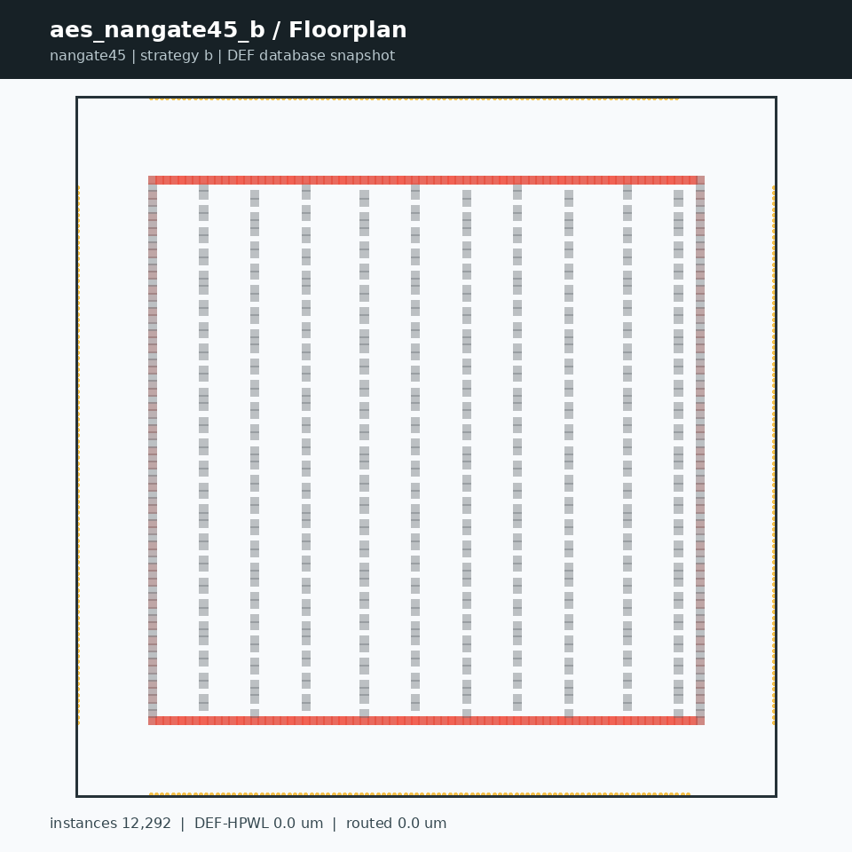</a></td><td><b>Fanout</b> </td><td><b>Placement</b> </td><td><b>CTS</b> </td></tr>
<tr><td><b>Legalization</b> </td><td><b>Routing</b> <a href="../reports/aes12_65pct_qor_wp_rt01b_comparison_assets/aes_nangate45_b/routing.png">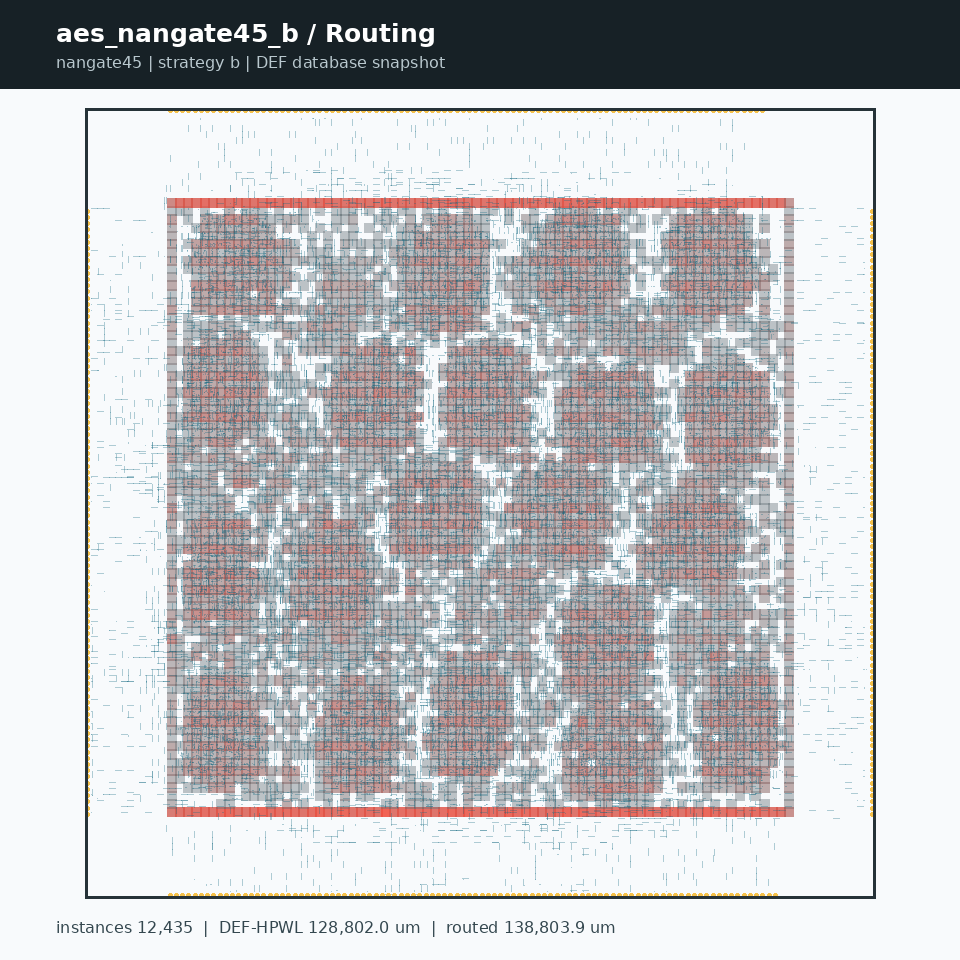</a></td><td><b>Filler</b> <a href="../reports/aes12_65pct_qor_wp_rt01b_comparison_assets/aes_nangate45_b/filler.png">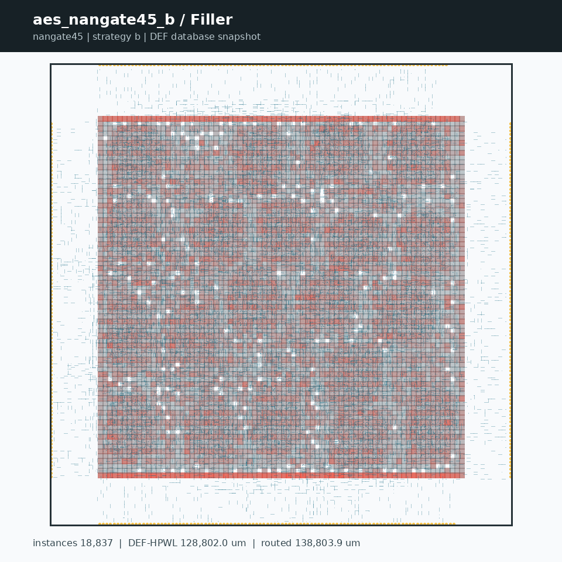</a></td><td><b>Final GDS</b> </td></tr>
</table>
CTS 专项图：[clock tree](../results/aes13_65pct_qor_wp_rt01b_20260731_1520/aes_nangate45_b/workspace/result/cts/visualization/svg/cts_design.svg) / [flyline](../results/aes13_65pct_qor_wp_rt01b_20260731_1520/aes_nangate45_b/workspace/result/cts/visualization/svg/cts_flyline.svg)

#### 空间 Map 证据

共发现 `46` 个原始 map 文件，渲染 `16` 张代表图。同类图使用跨 13 个设计的统一色标；DRC 使用统一对数色标。全零图保留并明确标注。

<table>
<tr><td><b>Std-cell density</b>  <small>non-zero 48.85%; max 1.000; <a href="../results/aes13_65pct_qor_wp_rt01b_20260731_1520/aes_nangate45_b/workspace/result/density_map/place_stdcell_density.csv">raw</a></small></td><td><b>Macro density</b> <a href="../reports/aes12_65pct_qor_wp_rt01b_comparison_assets/aes_nangate45_b/maps/macro_density.png">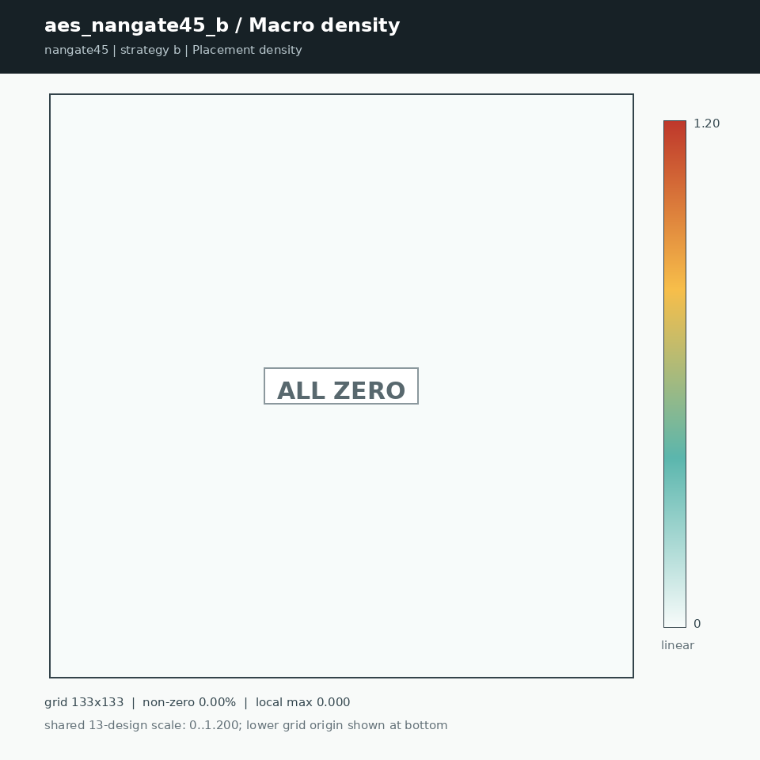</a> <small>non-zero 0.00%; max 0.000; <a href="../results/aes13_65pct_qor_wp_rt01b_20260731_1520/aes_nangate45_b/workspace/result/density_map/place_macro_density.csv">raw</a></small></td><td><b>All-cell density</b>  <small>non-zero 51.65%; max 1.000; <a href="../results/aes13_65pct_qor_wp_rt01b_20260731_1520/aes_nangate45_b/workspace/result/density_map/place_allcell_density.csv">raw</a></small></td><td><b>Std-cell pin density</b> <a href="../reports/aes12_65pct_qor_wp_rt01b_comparison_assets/aes_nangate45_b/maps/stdcell_pin_density.png">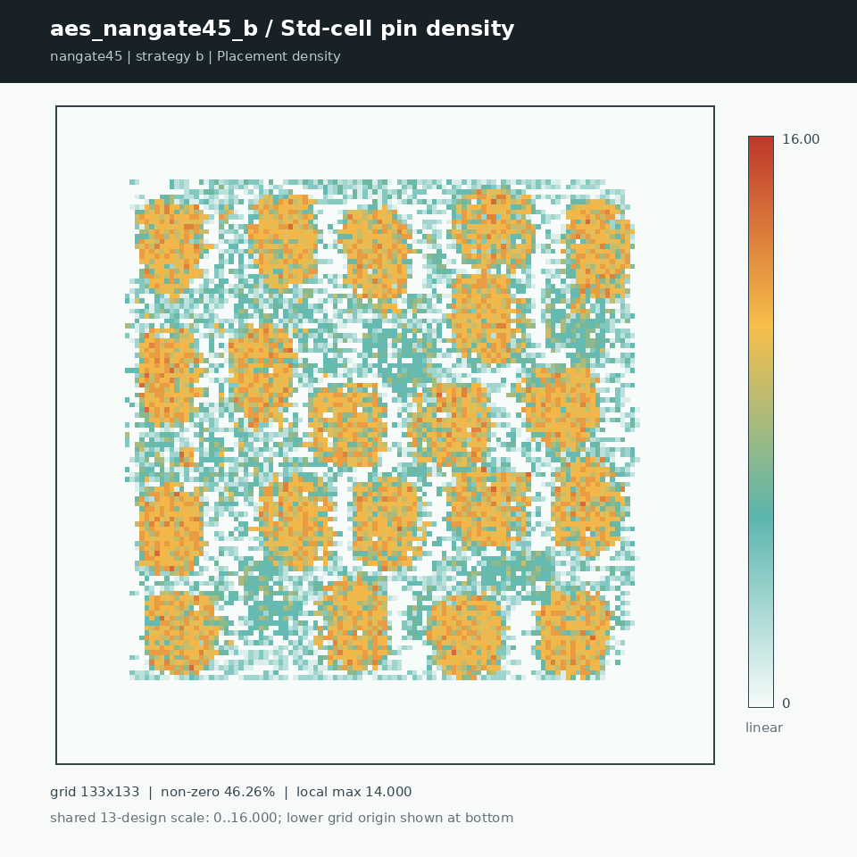</a> <small>non-zero 46.26%; max 14.000; <a href="../results/aes13_65pct_qor_wp_rt01b_20260731_1520/aes_nangate45_b/workspace/result/density_map/place_stdcell_pin_density.csv">raw</a></small></td></tr>
<tr><td><b>Macro pin density</b>  <small>non-zero 0.00%; max 0.000; <a href="../results/aes13_65pct_qor_wp_rt01b_20260731_1520/aes_nangate45_b/workspace/result/density_map/place_macro_pin_density.csv">raw</a></small></td><td><b>All-cell pin density</b> <a href="../reports/aes12_65pct_qor_wp_rt01b_comparison_assets/aes_nangate45_b/maps/allcell_pin_density.png">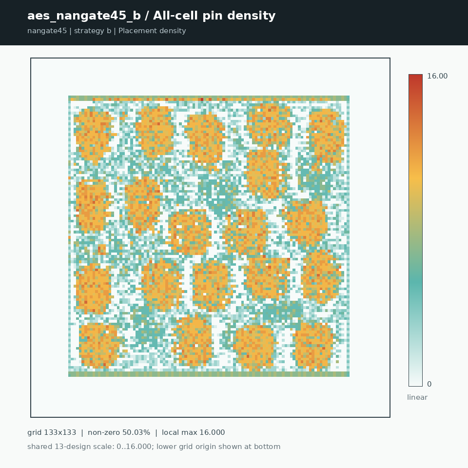</a> <small>non-zero 50.03%; max 16.000; <a href="../results/aes13_65pct_qor_wp_rt01b_20260731_1520/aes_nangate45_b/workspace/result/density_map/place_allcell_pin_density.csv">raw</a></small></td><td><b>Local-net density</b>  <small>non-zero 7.22%; max 2.000; <a href="../results/aes13_65pct_qor_wp_rt01b_20260731_1520/aes_nangate45_b/workspace/result/density_map/place_local_net_density.csv">raw</a></small></td><td><b>Global-net density</b>  <small>non-zero 92.88%; max 136.000; <a href="../results/aes13_65pct_qor_wp_rt01b_20260731_1520/aes_nangate45_b/workspace/result/density_map/place_global_net_density.csv">raw</a></small></td></tr>
<tr><td><b>All-net density</b> <a href="../reports/aes12_65pct_qor_wp_rt01b_comparison_assets/aes_nangate45_b/maps/allnet_density.png">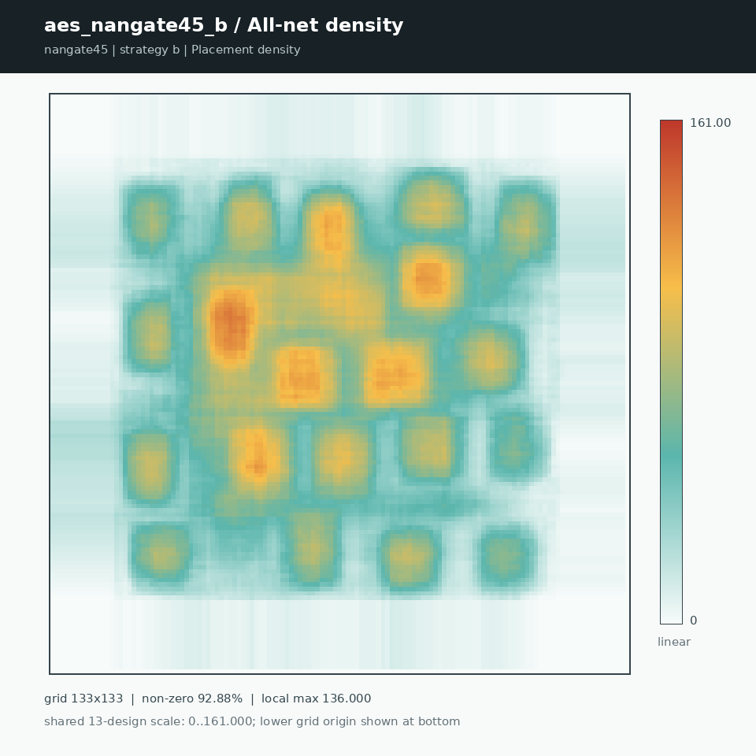</a> <small>non-zero 92.88%; max 136.000; <a href="../results/aes13_65pct_qor_wp_rt01b_20260731_1520/aes_nangate45_b/workspace/result/density_map/place_allnet_density.csv">raw</a></small></td><td><b>EGR horizontal overflow</b>  <small>non-zero 1.22%; max 17.000; <a href="../results/aes13_65pct_qor_wp_rt01b_20260731_1520/aes_nangate45_b/workspace/result/egr_congestion_map/place_egr_horizontal_overflow.csv">raw</a></small></td><td><b>EGR vertical overflow</b> <a href="../reports/aes12_65pct_qor_wp_rt01b_comparison_assets/aes_nangate45_b/maps/egr_vertical_overflow.png">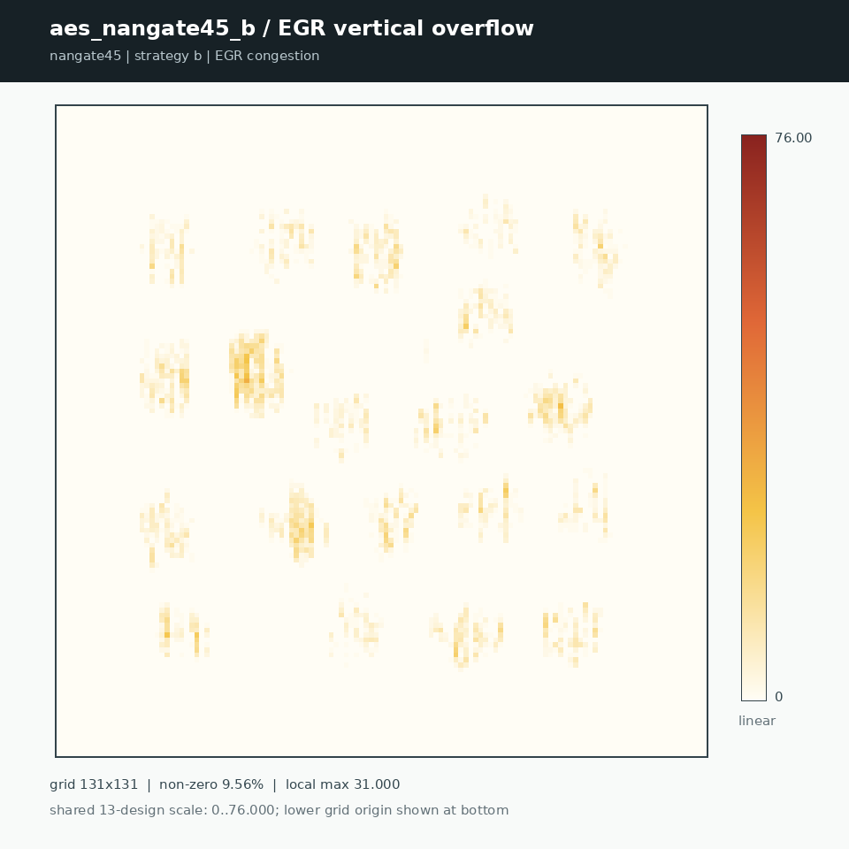</a> <small>non-zero 9.56%; max 31.000; <a href="../results/aes13_65pct_qor_wp_rt01b_20260731_1520/aes_nangate45_b/workspace/result/egr_congestion_map/place_egr_vertical_overflow.csv">raw</a></small></td><td><b>EGR union overflow</b>  <small>non-zero 9.89%; max 36.000; <a href="../results/aes13_65pct_qor_wp_rt01b_20260731_1520/aes_nangate45_b/workspace/result/egr_congestion_map/place_egr_union_overflow.csv">raw</a></small></td></tr>
<tr><td><b>Planar routing demand</b> <a href="../reports/aes12_65pct_qor_wp_rt01b_comparison_assets/aes_nangate45_b/maps/early_net_planar.png">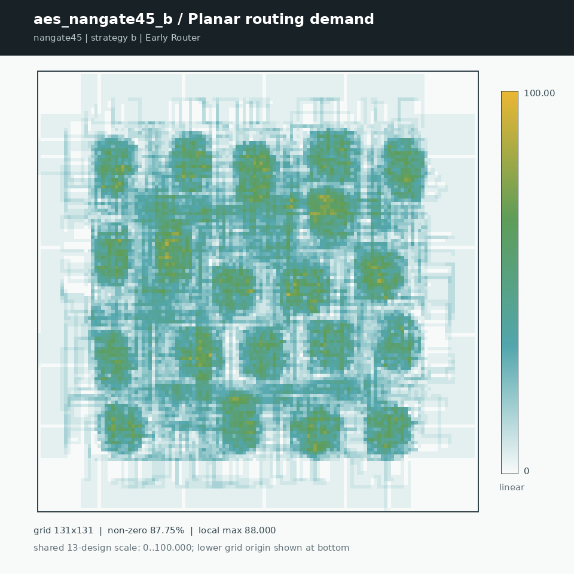</a> <small>non-zero 87.75%; max 88.000; <a href="../results/aes13_65pct_qor_wp_rt01b_20260731_1520/aes_nangate45_b/workspace/result/rt/rt_temp_directory/early_router/net_map_planar.csv">raw</a></small></td><td><b>Planar routing supply</b>  <small>non-zero 100.00%; max 138.000; <a href="../results/aes13_65pct_qor_wp_rt01b_20260731_1520/aes_nangate45_b/workspace/result/rt/rt_temp_directory/early_router/supply_map_planar.csv">raw</a></small></td><td><b>Planar routing overflow</b>  <small>non-zero 0.89%; max 10.000; <a href="../results/aes13_65pct_qor_wp_rt01b_20260731_1520/aes_nangate45_b/workspace/result/rt/rt_temp_directory/early_router/overflow_map_planar.csv">raw</a></small></td><td><b>DRC violation-center density</b> <a href="../reports/aes12_65pct_qor_wp_rt01b_comparison_assets/aes_nangate45_b/maps/drc_violation_density.png">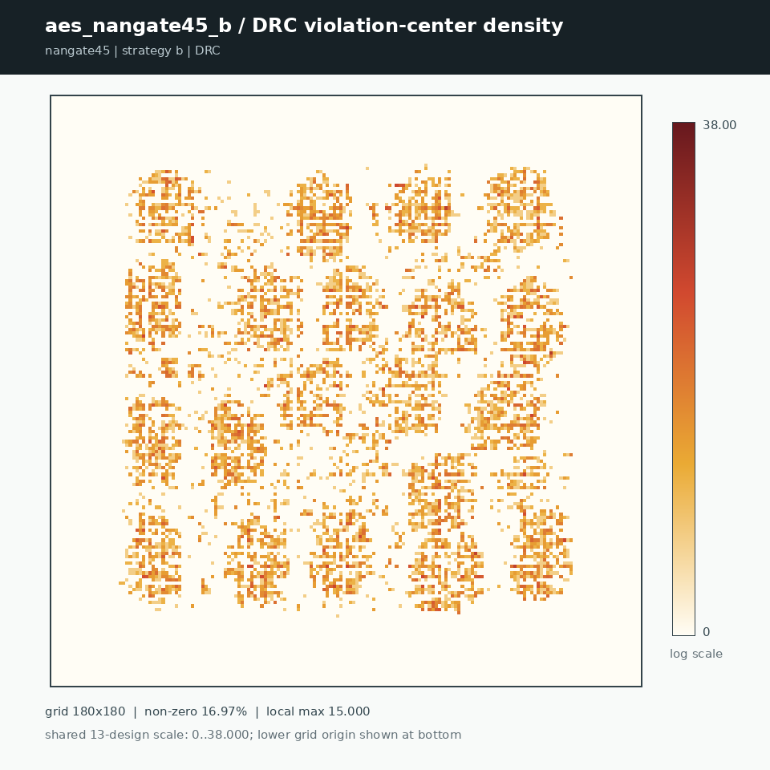</a> <small>non-zero 16.97%; max 15.000; <a href="../results/aes13_65pct_qor_wp_rt01b_20260731_1520/aes_nangate45_b/workspace/drc_temp_directory/violation_map.json">raw</a></small></td></tr>
</table>

完整原始 map 文件索引

- **Placement density CSV (9)**：[place_allcell_density.csv](../results/aes13_65pct_qor_wp_rt01b_20260731_1520/aes_nangate45_b/workspace/result/density_map/place_allcell_density.csv), [place_allcell_pin_density.csv](../results/aes13_65pct_qor_wp_rt01b_20260731_1520/aes_nangate45_b/workspace/result/density_map/place_allcell_pin_density.csv), [place_allnet_density.csv](../results/aes13_65pct_qor_wp_rt01b_20260731_1520/aes_nangate45_b/workspace/result/density_map/place_allnet_density.csv), [place_global_net_density.csv](../results/aes13_65pct_qor_wp_rt01b_20260731_1520/aes_nangate45_b/workspace/result/density_map/place_global_net_density.csv), [place_local_net_density.csv](../results/aes13_65pct_qor_wp_rt01b_20260731_1520/aes_nangate45_b/workspace/result/density_map/place_local_net_density.csv), [place_macro_density.csv](../results/aes13_65pct_qor_wp_rt01b_20260731_1520/aes_nangate45_b/workspace/result/density_map/place_macro_density.csv), [place_macro_pin_density.csv](../results/aes13_65pct_qor_wp_rt01b_20260731_1520/aes_nangate45_b/workspace/result/density_map/place_macro_pin_density.csv), [place_stdcell_density.csv](../results/aes13_65pct_qor_wp_rt01b_20260731_1520/aes_nangate45_b/workspace/result/density_map/place_stdcell_density.csv), [place_stdcell_pin_density.csv](../results/aes13_65pct_qor_wp_rt01b_20260731_1520/aes_nangate45_b/workspace/result/density_map/place_stdcell_pin_density.csv)
- **EGR congestion CSV (3)**：[place_egr_horizontal_overflow.csv](../results/aes13_65pct_qor_wp_rt01b_20260731_1520/aes_nangate45_b/workspace/result/egr_congestion_map/place_egr_horizontal_overflow.csv), [place_egr_union_overflow.csv](../results/aes13_65pct_qor_wp_rt01b_20260731_1520/aes_nangate45_b/workspace/result/egr_congestion_map/place_egr_union_overflow.csv), [place_egr_vertical_overflow.csv](../results/aes13_65pct_qor_wp_rt01b_20260731_1520/aes_nangate45_b/workspace/result/egr_congestion_map/place_egr_vertical_overflow.csv)
- **Early-router layer CSV (33)**：[net_map_metal1.csv](../results/aes13_65pct_qor_wp_rt01b_20260731_1520/aes_nangate45_b/workspace/result/rt/rt_temp_directory/early_router/net_map_metal1.csv), [net_map_metal10.csv](../results/aes13_65pct_qor_wp_rt01b_20260731_1520/aes_nangate45_b/workspace/result/rt/rt_temp_directory/early_router/net_map_metal10.csv), [net_map_metal2.csv](../results/aes13_65pct_qor_wp_rt01b_20260731_1520/aes_nangate45_b/workspace/result/rt/rt_temp_directory/early_router/net_map_metal2.csv), [net_map_metal3.csv](../results/aes13_65pct_qor_wp_rt01b_20260731_1520/aes_nangate45_b/workspace/result/rt/rt_temp_directory/early_router/net_map_metal3.csv), [net_map_metal4.csv](../results/aes13_65pct_qor_wp_rt01b_20260731_1520/aes_nangate45_b/workspace/result/rt/rt_temp_directory/early_router/net_map_metal4.csv), [net_map_metal5.csv](../results/aes13_65pct_qor_wp_rt01b_20260731_1520/aes_nangate45_b/workspace/result/rt/rt_temp_directory/early_router/net_map_metal5.csv), [net_map_metal6.csv](../results/aes13_65pct_qor_wp_rt01b_20260731_1520/aes_nangate45_b/workspace/result/rt/rt_temp_directory/early_router/net_map_metal6.csv), [net_map_metal7.csv](../results/aes13_65pct_qor_wp_rt01b_20260731_1520/aes_nangate45_b/workspace/result/rt/rt_temp_directory/early_router/net_map_metal7.csv), [net_map_metal8.csv](../results/aes13_65pct_qor_wp_rt01b_20260731_1520/aes_nangate45_b/workspace/result/rt/rt_temp_directory/early_router/net_map_metal8.csv), [net_map_metal9.csv](../results/aes13_65pct_qor_wp_rt01b_20260731_1520/aes_nangate45_b/workspace/result/rt/rt_temp_directory/early_router/net_map_metal9.csv), [net_map_planar.csv](../results/aes13_65pct_qor_wp_rt01b_20260731_1520/aes_nangate45_b/workspace/result/rt/rt_temp_directory/early_router/net_map_planar.csv), [overflow_map_metal1.csv](../results/aes13_65pct_qor_wp_rt01b_20260731_1520/aes_nangate45_b/workspace/result/rt/rt_temp_directory/early_router/overflow_map_metal1.csv), [overflow_map_metal10.csv](../results/aes13_65pct_qor_wp_rt01b_20260731_1520/aes_nangate45_b/workspace/result/rt/rt_temp_directory/early_router/overflow_map_metal10.csv), [overflow_map_metal2.csv](../results/aes13_65pct_qor_wp_rt01b_20260731_1520/aes_nangate45_b/workspace/result/rt/rt_temp_directory/early_router/overflow_map_metal2.csv), [overflow_map_metal3.csv](../results/aes13_65pct_qor_wp_rt01b_20260731_1520/aes_nangate45_b/workspace/result/rt/rt_temp_directory/early_router/overflow_map_metal3.csv), [overflow_map_metal4.csv](../results/aes13_65pct_qor_wp_rt01b_20260731_1520/aes_nangate45_b/workspace/result/rt/rt_temp_directory/early_router/overflow_map_metal4.csv), [overflow_map_metal5.csv](../results/aes13_65pct_qor_wp_rt01b_20260731_1520/aes_nangate45_b/workspace/result/rt/rt_temp_directory/early_router/overflow_map_metal5.csv), [overflow_map_metal6.csv](../results/aes13_65pct_qor_wp_rt01b_20260731_1520/aes_nangate45_b/workspace/result/rt/rt_temp_directory/early_router/overflow_map_metal6.csv), [overflow_map_metal7.csv](../results/aes13_65pct_qor_wp_rt01b_20260731_1520/aes_nangate45_b/workspace/result/rt/rt_temp_directory/early_router/overflow_map_metal7.csv), [overflow_map_metal8.csv](../results/aes13_65pct_qor_wp_rt01b_20260731_1520/aes_nangate45_b/workspace/result/rt/rt_temp_directory/early_router/overflow_map_metal8.csv), [overflow_map_metal9.csv](../results/aes13_65pct_qor_wp_rt01b_20260731_1520/aes_nangate45_b/workspace/result/rt/rt_temp_directory/early_router/overflow_map_metal9.csv), [overflow_map_planar.csv](../results/aes13_65pct_qor_wp_rt01b_20260731_1520/aes_nangate45_b/workspace/result/rt/rt_temp_directory/early_router/overflow_map_planar.csv), [supply_map_metal1.csv](../results/aes13_65pct_qor_wp_rt01b_20260731_1520/aes_nangate45_b/workspace/result/rt/rt_temp_directory/early_router/supply_map_metal1.csv), [supply_map_metal10.csv](../results/aes13_65pct_qor_wp_rt01b_20260731_1520/aes_nangate45_b/workspace/result/rt/rt_temp_directory/early_router/supply_map_metal10.csv), [supply_map_metal2.csv](../results/aes13_65pct_qor_wp_rt01b_20260731_1520/aes_nangate45_b/workspace/result/rt/rt_temp_directory/early_router/supply_map_metal2.csv), [supply_map_metal3.csv](../results/aes13_65pct_qor_wp_rt01b_20260731_1520/aes_nangate45_b/workspace/result/rt/rt_temp_directory/early_router/supply_map_metal3.csv), [supply_map_metal4.csv](../results/aes13_65pct_qor_wp_rt01b_20260731_1520/aes_nangate45_b/workspace/result/rt/rt_temp_directory/early_router/supply_map_metal4.csv), [supply_map_metal5.csv](../results/aes13_65pct_qor_wp_rt01b_20260731_1520/aes_nangate45_b/workspace/result/rt/rt_temp_directory/early_router/supply_map_metal5.csv), [supply_map_metal6.csv](../results/aes13_65pct_qor_wp_rt01b_20260731_1520/aes_nangate45_b/workspace/result/rt/rt_temp_directory/early_router/supply_map_metal6.csv), [supply_map_metal7.csv](../results/aes13_65pct_qor_wp_rt01b_20260731_1520/aes_nangate45_b/workspace/result/rt/rt_temp_directory/early_router/supply_map_metal7.csv), [supply_map_metal8.csv](../results/aes13_65pct_qor_wp_rt01b_20260731_1520/aes_nangate45_b/workspace/result/rt/rt_temp_directory/early_router/supply_map_metal8.csv), [supply_map_metal9.csv](../results/aes13_65pct_qor_wp_rt01b_20260731_1520/aes_nangate45_b/workspace/result/rt/rt_temp_directory/early_router/supply_map_metal9.csv), [supply_map_planar.csv](../results/aes13_65pct_qor_wp_rt01b_20260731_1520/aes_nangate45_b/workspace/result/rt/rt_temp_directory/early_router/supply_map_planar.csv)
- **DRC violation JSON (1)**：[violation_map.json](../results/aes13_65pct_qor_wp_rt01b_20260731_1520/aes_nangate45_b/workspace/drc_temp_directory/violation_map.json)

### aes_nangate45_t (nangate45 / t)

| Stage | Runtime (s) | Memory (MB) | Instances | Timing inst. | Core util. | DEF HPWL (um) | Routed (um) | Setup WNS (ns) | Power (mW) | Congestion | DRC | IR-drop |
|---|---:|---:|---:|---:|---:|---:|---:|---:|---:|---|---:|---|
| Floorplan | 0.00 | 0.0 | 12,292 | 0 | 65.3% | 0.0 | 0.0 | N/A | N/A | N/A | N/A | N/A |
| Fanout | 0.94 | 4,997.3 | 12,412 | 120 | 67.3% | 0.0 | 0.0 | N/A | N/A | N/A | N/A | N/A |
| Placement | 11.33 | 1,008.6 | 12,412 | 120 | 67.3% | 127,259.8 | 0.0 | N/A | N/A | N/A | N/A | N/A |
| CTS | 2.21 | 187.4 | 12,435 | 143 | 67.4% | 128,792.6 | 0.0 | N/A | N/A | N/A | N/A | N/A |
| Legalization | 3.81 | 1,027.5 | 12,435 | 143 | 67.4% | 128,802.0 | 0.0 | N/A | N/A | N/A | N/A | N/A |
| Routing | 1,693.36 | 0.0 | 12,435 | 143 | 67.4% | 128,802.0 | 138,709.6 | 1.380 | 22.690 | N/A | 15,351 | N/A |
| Filler | 3.69 | 80.3 | 18,837 | 143 | 97.0% | 128,802.0 | 138,709.6 | N/A | N/A | N/A | N/A | N/A |

Post-route：setup WNS `1.380 ns`，hold WNS `0.086 ns`，功耗 `22.690 mW`，DRC `15,351`。DRC 主项：metal_short=7,743, parallel_run_length_spacing=7,526, nonsufficient_metal_overlap=59。未约束端口 `5`，缺失 input slew pin `226`。

<table>
<tr><td><b>Floorplan</b> </td><td><b>Fanout</b> <a href="../reports/aes12_65pct_qor_wp_rt01b_comparison_assets/aes_nangate45_t/fanout.png">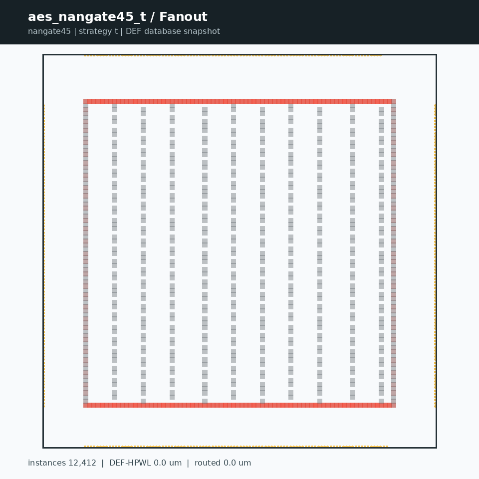</a></td><td><b>Placement</b> <a href="../reports/aes12_65pct_qor_wp_rt01b_comparison_assets/aes_nangate45_t/placement.png">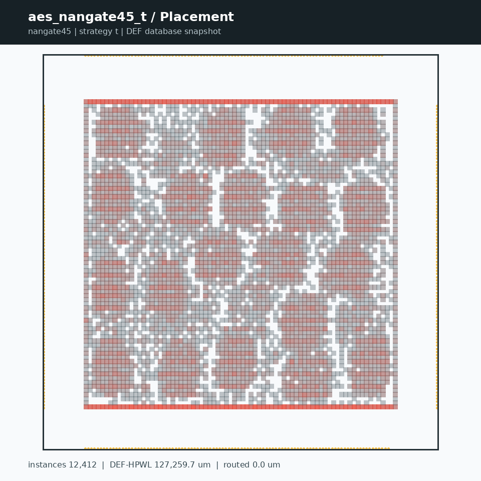</a></td><td><b>CTS</b> <a href="../reports/aes12_65pct_qor_wp_rt01b_comparison_assets/aes_nangate45_t/cts.png">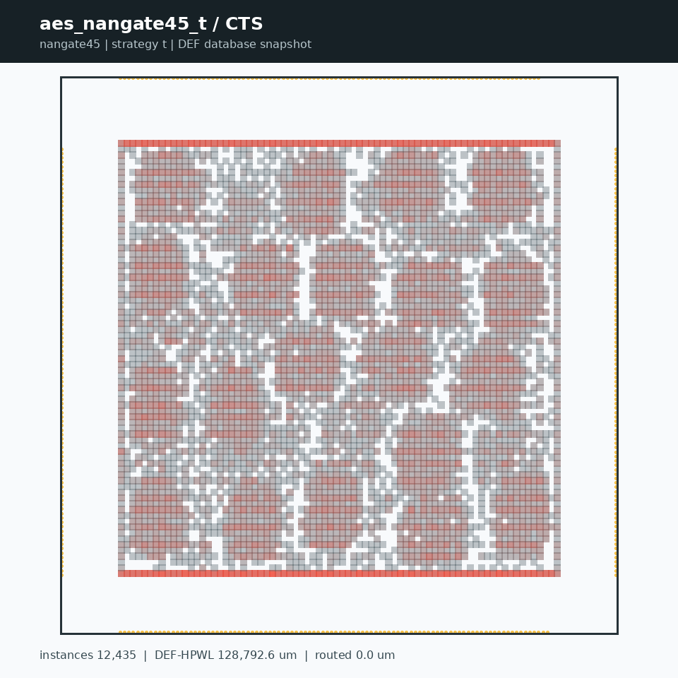</a></td></tr>
<tr><td><b>Legalization</b> </td><td><b>Routing</b> <a href="../reports/aes12_65pct_qor_wp_rt01b_comparison_assets/aes_nangate45_t/routing.png">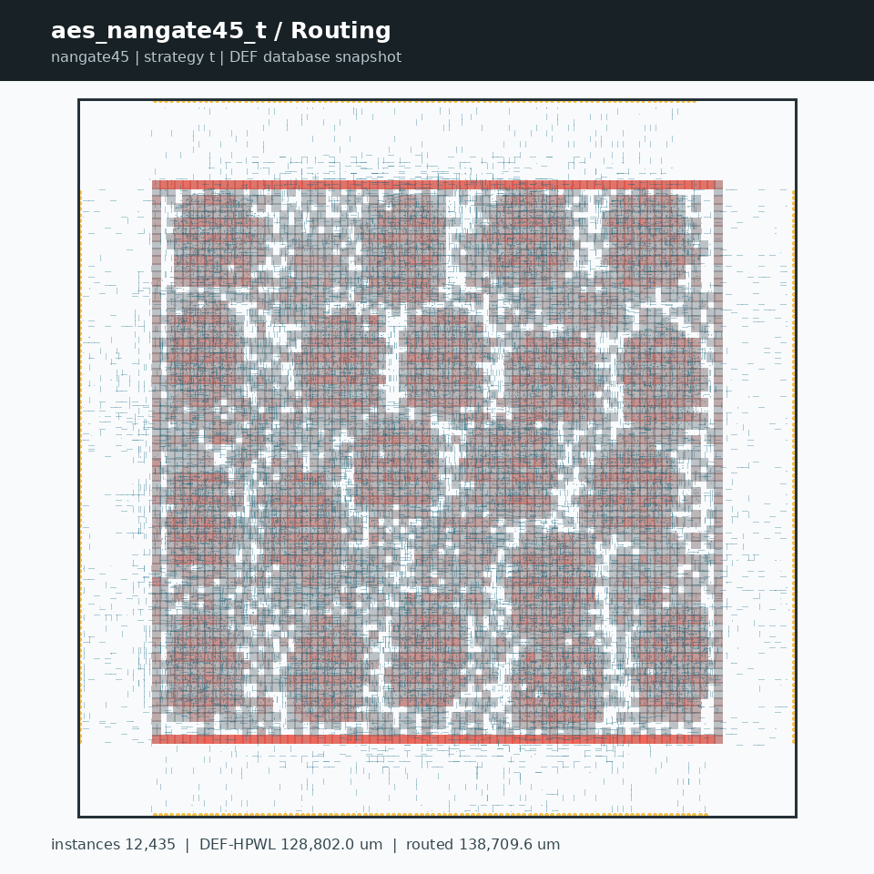</a></td><td><b>Filler</b> <a href="../reports/aes12_65pct_qor_wp_rt01b_comparison_assets/aes_nangate45_t/filler.png">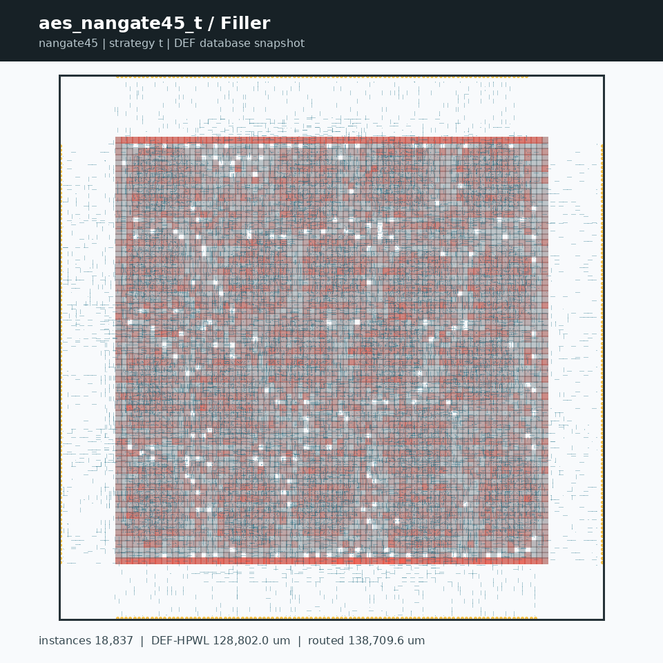</a></td><td><b>Final GDS</b> </td></tr>
</table>
CTS 专项图：[clock tree](../results/aes13_65pct_qor_wp_rt01b_20260731_1520/aes_nangate45_t/workspace/result/cts/visualization/svg/cts_design.svg) / [flyline](../results/aes13_65pct_qor_wp_rt01b_20260731_1520/aes_nangate45_t/workspace/result/cts/visualization/svg/cts_flyline.svg)

#### 空间 Map 证据

共发现 `46` 个原始 map 文件，渲染 `16` 张代表图。同类图使用跨 13 个设计的统一色标；DRC 使用统一对数色标。全零图保留并明确标注。

<table>
<tr><td><b>Std-cell density</b>  <small>non-zero 48.85%; max 1.000; <a href="../results/aes13_65pct_qor_wp_rt01b_20260731_1520/aes_nangate45_t/workspace/result/density_map/place_stdcell_density.csv">raw</a></small></td><td><b>Macro density</b>  <small>non-zero 0.00%; max 0.000; <a href="../results/aes13_65pct_qor_wp_rt01b_20260731_1520/aes_nangate45_t/workspace/result/density_map/place_macro_density.csv">raw</a></small></td><td><b>All-cell density</b> <a href="../reports/aes12_65pct_qor_wp_rt01b_comparison_assets/aes_nangate45_t/maps/allcell_density.png">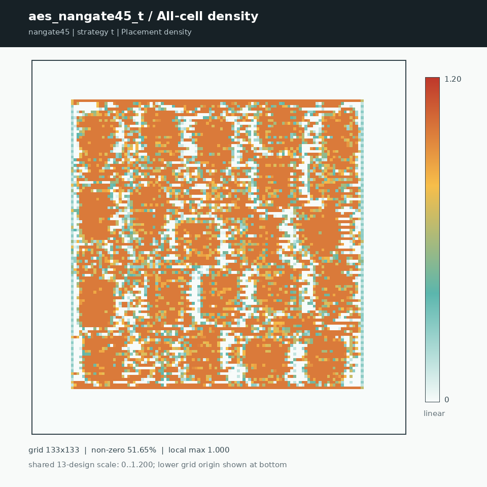</a> <small>non-zero 51.65%; max 1.000; <a href="../results/aes13_65pct_qor_wp_rt01b_20260731_1520/aes_nangate45_t/workspace/result/density_map/place_allcell_density.csv">raw</a></small></td><td><b>Std-cell pin density</b> <a href="../reports/aes12_65pct_qor_wp_rt01b_comparison_assets/aes_nangate45_t/maps/stdcell_pin_density.png">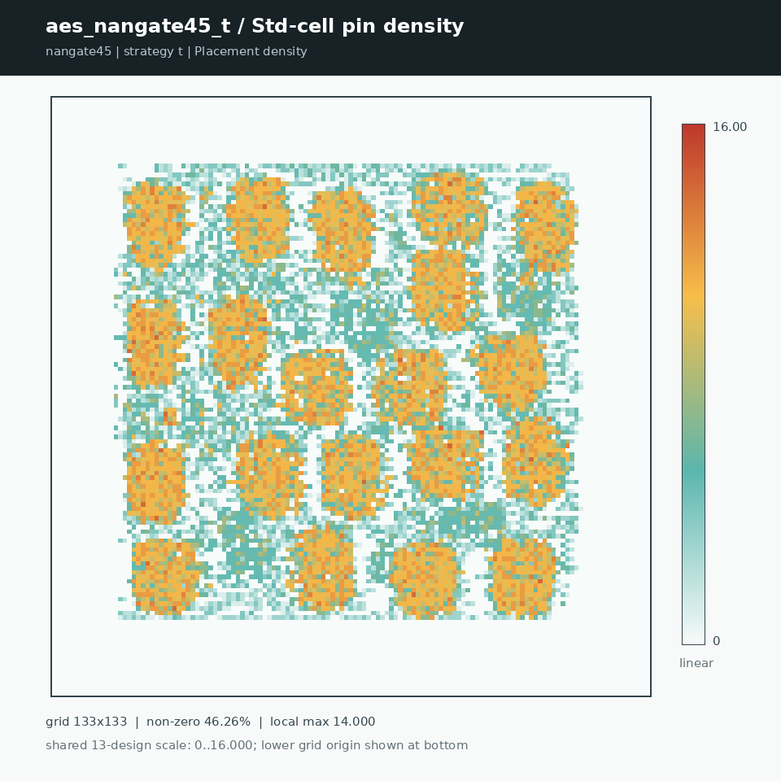</a> <small>non-zero 46.26%; max 14.000; <a href="../results/aes13_65pct_qor_wp_rt01b_20260731_1520/aes_nangate45_t/workspace/result/density_map/place_stdcell_pin_density.csv">raw</a></small></td></tr>
<tr><td><b>Macro pin density</b>  <small>non-zero 0.00%; max 0.000; <a href="../results/aes13_65pct_qor_wp_rt01b_20260731_1520/aes_nangate45_t/workspace/result/density_map/place_macro_pin_density.csv">raw</a></small></td><td><b>All-cell pin density</b> <a href="../reports/aes12_65pct_qor_wp_rt01b_comparison_assets/aes_nangate45_t/maps/allcell_pin_density.png">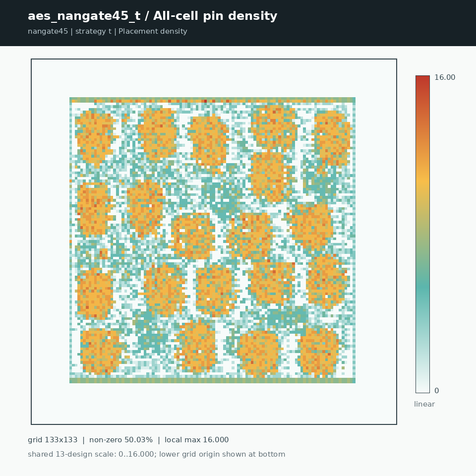</a> <small>non-zero 50.03%; max 16.000; <a href="../results/aes13_65pct_qor_wp_rt01b_20260731_1520/aes_nangate45_t/workspace/result/density_map/place_allcell_pin_density.csv">raw</a></small></td><td><b>Local-net density</b>  <small>non-zero 7.22%; max 2.000; <a href="../results/aes13_65pct_qor_wp_rt01b_20260731_1520/aes_nangate45_t/workspace/result/density_map/place_local_net_density.csv">raw</a></small></td><td><b>Global-net density</b>  <small>non-zero 92.88%; max 136.000; <a href="../results/aes13_65pct_qor_wp_rt01b_20260731_1520/aes_nangate45_t/workspace/result/density_map/place_global_net_density.csv">raw</a></small></td></tr>
<tr><td><b>All-net density</b> <a href="../reports/aes12_65pct_qor_wp_rt01b_comparison_assets/aes_nangate45_t/maps/allnet_density.png">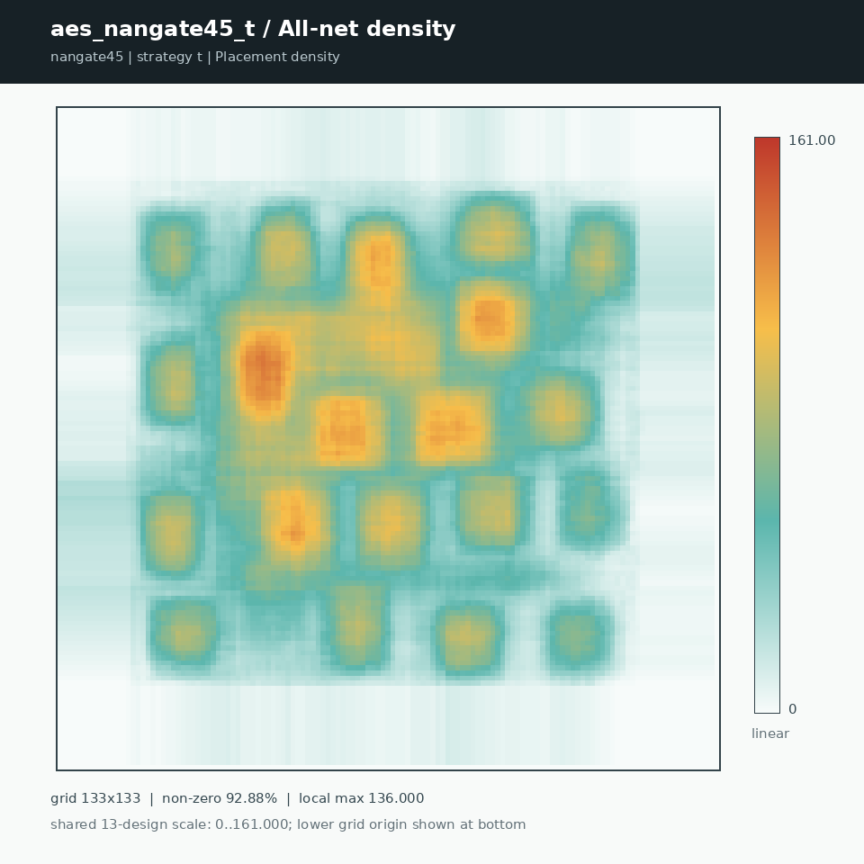</a> <small>non-zero 92.88%; max 136.000; <a href="../results/aes13_65pct_qor_wp_rt01b_20260731_1520/aes_nangate45_t/workspace/result/density_map/place_allnet_density.csv">raw</a></small></td><td><b>EGR horizontal overflow</b> <a href="../reports/aes12_65pct_qor_wp_rt01b_comparison_assets/aes_nangate45_t/maps/egr_horizontal_overflow.png">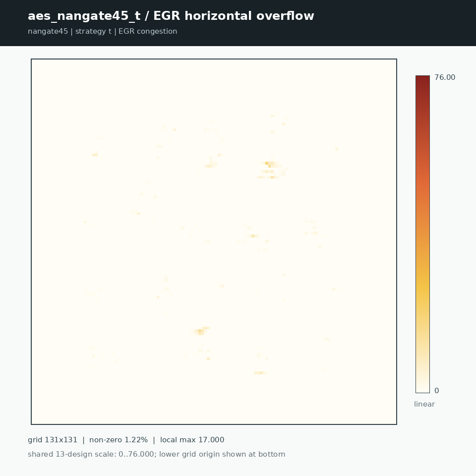</a> <small>non-zero 1.22%; max 17.000; <a href="../results/aes13_65pct_qor_wp_rt01b_20260731_1520/aes_nangate45_t/workspace/result/egr_congestion_map/place_egr_horizontal_overflow.csv">raw</a></small></td><td><b>EGR vertical overflow</b>  <small>non-zero 9.56%; max 31.000; <a href="../results/aes13_65pct_qor_wp_rt01b_20260731_1520/aes_nangate45_t/workspace/result/egr_congestion_map/place_egr_vertical_overflow.csv">raw</a></small></td><td><b>EGR union overflow</b> <a href="../reports/aes12_65pct_qor_wp_rt01b_comparison_assets/aes_nangate45_t/maps/egr_union_overflow.png">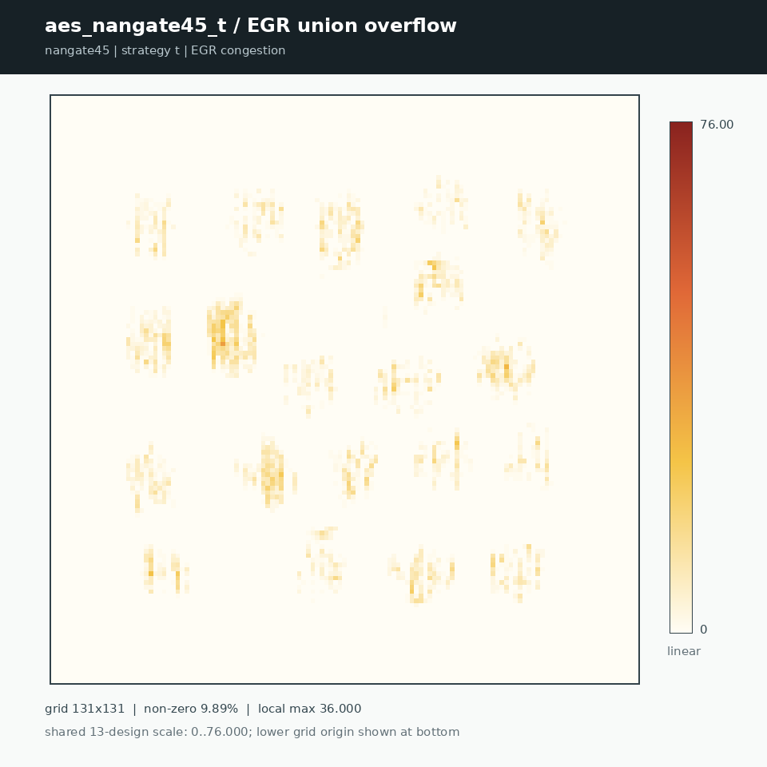</a> <small>non-zero 9.89%; max 36.000; <a href="../results/aes13_65pct_qor_wp_rt01b_20260731_1520/aes_nangate45_t/workspace/result/egr_congestion_map/place_egr_union_overflow.csv">raw</a></small></td></tr>
<tr><td><b>Planar routing demand</b>  <small>non-zero 87.75%; max 88.000; <a href="../results/aes13_65pct_qor_wp_rt01b_20260731_1520/aes_nangate45_t/workspace/result/rt/rt_temp_directory/early_router/net_map_planar.csv">raw</a></small></td><td><b>Planar routing supply</b>  <small>non-zero 100.00%; max 138.000; <a href="../results/aes13_65pct_qor_wp_rt01b_20260731_1520/aes_nangate45_t/workspace/result/rt/rt_temp_directory/early_router/supply_map_planar.csv">raw</a></small></td><td><b>Planar routing overflow</b> <a href="../reports/aes12_65pct_qor_wp_rt01b_comparison_assets/aes_nangate45_t/maps/early_overflow_planar.png">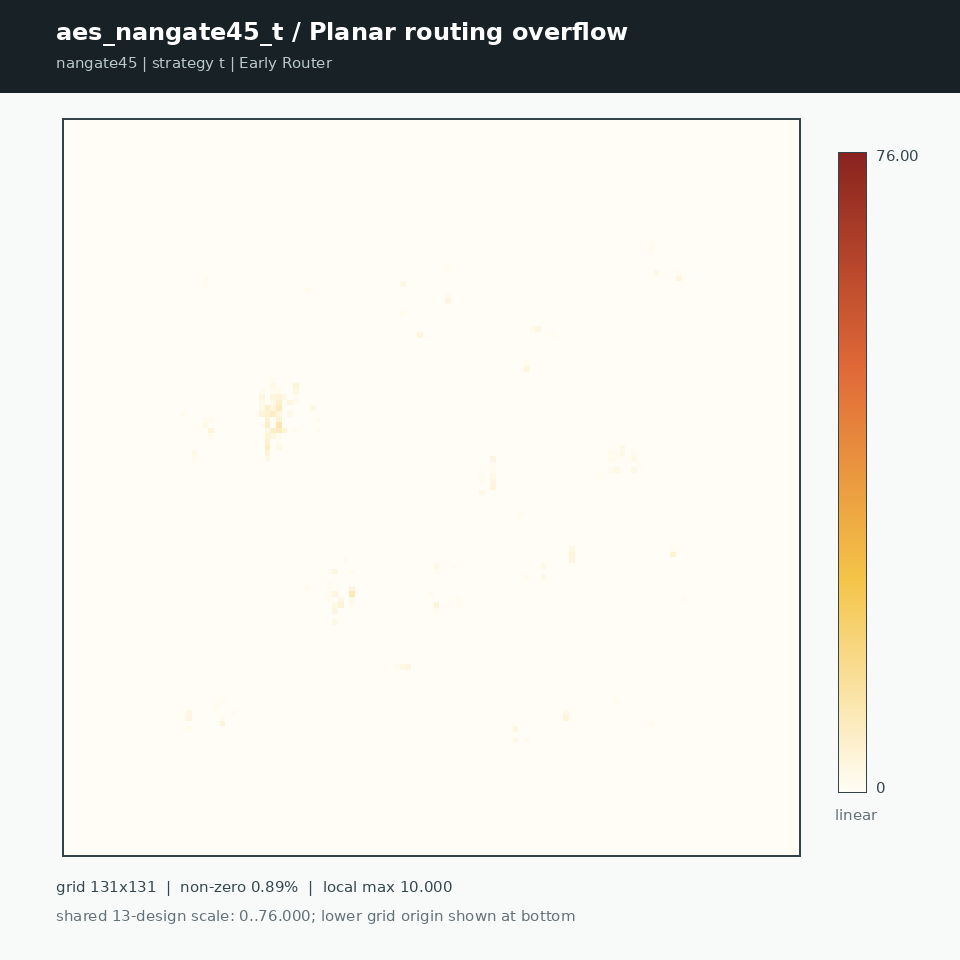</a> <small>non-zero 0.89%; max 10.000; <a href="../results/aes13_65pct_qor_wp_rt01b_20260731_1520/aes_nangate45_t/workspace/result/rt/rt_temp_directory/early_router/overflow_map_planar.csv">raw</a></small></td><td><b>DRC violation-center density</b>  <small>non-zero 16.98%; max 15.000; <a href="../results/aes13_65pct_qor_wp_rt01b_20260731_1520/aes_nangate45_t/workspace/drc_temp_directory/violation_map.json">raw</a></small></td></tr>
</table>

完整原始 map 文件索引

- **Placement density CSV (9)**：[place_allcell_density.csv](../results/aes13_65pct_qor_wp_rt01b_20260731_1520/aes_nangate45_t/workspace/result/density_map/place_allcell_density.csv), [place_allcell_pin_density.csv](../results/aes13_65pct_qor_wp_rt01b_20260731_1520/aes_nangate45_t/workspace/result/density_map/place_allcell_pin_density.csv), [place_allnet_density.csv](../results/aes13_65pct_qor_wp_rt01b_20260731_1520/aes_nangate45_t/workspace/result/density_map/place_allnet_density.csv), [place_global_net_density.csv](../results/aes13_65pct_qor_wp_rt01b_20260731_1520/aes_nangate45_t/workspace/result/density_map/place_global_net_density.csv), [place_local_net_density.csv](../results/aes13_65pct_qor_wp_rt01b_20260731_1520/aes_nangate45_t/workspace/result/density_map/place_local_net_density.csv), [place_macro_density.csv](../results/aes13_65pct_qor_wp_rt01b_20260731_1520/aes_nangate45_t/workspace/result/density_map/place_macro_density.csv), [place_macro_pin_density.csv](../results/aes13_65pct_qor_wp_rt01b_20260731_1520/aes_nangate45_t/workspace/result/density_map/place_macro_pin_density.csv), [place_stdcell_density.csv](../results/aes13_65pct_qor_wp_rt01b_20260731_1520/aes_nangate45_t/workspace/result/density_map/place_stdcell_density.csv), [place_stdcell_pin_density.csv](../results/aes13_65pct_qor_wp_rt01b_20260731_1520/aes_nangate45_t/workspace/result/density_map/place_stdcell_pin_density.csv)
- **EGR congestion CSV (3)**：[place_egr_horizontal_overflow.csv](../results/aes13_65pct_qor_wp_rt01b_20260731_1520/aes_nangate45_t/workspace/result/egr_congestion_map/place_egr_horizontal_overflow.csv), [place_egr_union_overflow.csv](../results/aes13_65pct_qor_wp_rt01b_20260731_1520/aes_nangate45_t/workspace/result/egr_congestion_map/place_egr_union_overflow.csv), [place_egr_vertical_overflow.csv](../results/aes13_65pct_qor_wp_rt01b_20260731_1520/aes_nangate45_t/workspace/result/egr_congestion_map/place_egr_vertical_overflow.csv)
- **Early-router layer CSV (33)**：[net_map_metal1.csv](../results/aes13_65pct_qor_wp_rt01b_20260731_1520/aes_nangate45_t/workspace/result/rt/rt_temp_directory/early_router/net_map_metal1.csv), [net_map_metal10.csv](../results/aes13_65pct_qor_wp_rt01b_20260731_1520/aes_nangate45_t/workspace/result/rt/rt_temp_directory/early_router/net_map_metal10.csv), [net_map_metal2.csv](../results/aes13_65pct_qor_wp_rt01b_20260731_1520/aes_nangate45_t/workspace/result/rt/rt_temp_directory/early_router/net_map_metal2.csv), [net_map_metal3.csv](../results/aes13_65pct_qor_wp_rt01b_20260731_1520/aes_nangate45_t/workspace/result/rt/rt_temp_directory/early_router/net_map_metal3.csv), [net_map_metal4.csv](../results/aes13_65pct_qor_wp_rt01b_20260731_1520/aes_nangate45_t/workspace/result/rt/rt_temp_directory/early_router/net_map_metal4.csv), [net_map_metal5.csv](../results/aes13_65pct_qor_wp_rt01b_20260731_1520/aes_nangate45_t/workspace/result/rt/rt_temp_directory/early_router/net_map_metal5.csv), [net_map_metal6.csv](../results/aes13_65pct_qor_wp_rt01b_20260731_1520/aes_nangate45_t/workspace/result/rt/rt_temp_directory/early_router/net_map_metal6.csv), [net_map_metal7.csv](../results/aes13_65pct_qor_wp_rt01b_20260731_1520/aes_nangate45_t/workspace/result/rt/rt_temp_directory/early_router/net_map_metal7.csv), [net_map_metal8.csv](../results/aes13_65pct_qor_wp_rt01b_20260731_1520/aes_nangate45_t/workspace/result/rt/rt_temp_directory/early_router/net_map_metal8.csv), [net_map_metal9.csv](../results/aes13_65pct_qor_wp_rt01b_20260731_1520/aes_nangate45_t/workspace/result/rt/rt_temp_directory/early_router/net_map_metal9.csv), [net_map_planar.csv](../results/aes13_65pct_qor_wp_rt01b_20260731_1520/aes_nangate45_t/workspace/result/rt/rt_temp_directory/early_router/net_map_planar.csv), [overflow_map_metal1.csv](../results/aes13_65pct_qor_wp_rt01b_20260731_1520/aes_nangate45_t/workspace/result/rt/rt_temp_directory/early_router/overflow_map_metal1.csv), [overflow_map_metal10.csv](../results/aes13_65pct_qor_wp_rt01b_20260731_1520/aes_nangate45_t/workspace/result/rt/rt_temp_directory/early_router/overflow_map_metal10.csv), [overflow_map_metal2.csv](../results/aes13_65pct_qor_wp_rt01b_20260731_1520/aes_nangate45_t/workspace/result/rt/rt_temp_directory/early_router/overflow_map_metal2.csv), [overflow_map_metal3.csv](../results/aes13_65pct_qor_wp_rt01b_20260731_1520/aes_nangate45_t/workspace/result/rt/rt_temp_directory/early_router/overflow_map_metal3.csv), [overflow_map_metal4.csv](../results/aes13_65pct_qor_wp_rt01b_20260731_1520/aes_nangate45_t/workspace/result/rt/rt_temp_directory/early_router/overflow_map_metal4.csv), [overflow_map_metal5.csv](../results/aes13_65pct_qor_wp_rt01b_20260731_1520/aes_nangate45_t/workspace/result/rt/rt_temp_directory/early_router/overflow_map_metal5.csv), [overflow_map_metal6.csv](../results/aes13_65pct_qor_wp_rt01b_20260731_1520/aes_nangate45_t/workspace/result/rt/rt_temp_directory/early_router/overflow_map_metal6.csv), [overflow_map_metal7.csv](../results/aes13_65pct_qor_wp_rt01b_20260731_1520/aes_nangate45_t/workspace/result/rt/rt_temp_directory/early_router/overflow_map_metal7.csv), [overflow_map_metal8.csv](../results/aes13_65pct_qor_wp_rt01b_20260731_1520/aes_nangate45_t/workspace/result/rt/rt_temp_directory/early_router/overflow_map_metal8.csv), [overflow_map_metal9.csv](../results/aes13_65pct_qor_wp_rt01b_20260731_1520/aes_nangate45_t/workspace/result/rt/rt_temp_directory/early_router/overflow_map_metal9.csv), [overflow_map_planar.csv](../results/aes13_65pct_qor_wp_rt01b_20260731_1520/aes_nangate45_t/workspace/result/rt/rt_temp_directory/early_router/overflow_map_planar.csv), [supply_map_metal1.csv](../results/aes13_65pct_qor_wp_rt01b_20260731_1520/aes_nangate45_t/workspace/result/rt/rt_temp_directory/early_router/supply_map_metal1.csv), [supply_map_metal10.csv](../results/aes13_65pct_qor_wp_rt01b_20260731_1520/aes_nangate45_t/workspace/result/rt/rt_temp_directory/early_router/supply_map_metal10.csv), [supply_map_metal2.csv](../results/aes13_65pct_qor_wp_rt01b_20260731_1520/aes_nangate45_t/workspace/result/rt/rt_temp_directory/early_router/supply_map_metal2.csv), [supply_map_metal3.csv](../results/aes13_65pct_qor_wp_rt01b_20260731_1520/aes_nangate45_t/workspace/result/rt/rt_temp_directory/early_router/supply_map_metal3.csv), [supply_map_metal4.csv](../results/aes13_65pct_qor_wp_rt01b_20260731_1520/aes_nangate45_t/workspace/result/rt/rt_temp_directory/early_router/supply_map_metal4.csv), [supply_map_metal5.csv](../results/aes13_65pct_qor_wp_rt01b_20260731_1520/aes_nangate45_t/workspace/result/rt/rt_temp_directory/early_router/supply_map_metal5.csv), [supply_map_metal6.csv](../results/aes13_65pct_qor_wp_rt01b_20260731_1520/aes_nangate45_t/workspace/result/rt/rt_temp_directory/early_router/supply_map_metal6.csv), [supply_map_metal7.csv](../results/aes13_65pct_qor_wp_rt01b_20260731_1520/aes_nangate45_t/workspace/result/rt/rt_temp_directory/early_router/supply_map_metal7.csv), [supply_map_metal8.csv](../results/aes13_65pct_qor_wp_rt01b_20260731_1520/aes_nangate45_t/workspace/result/rt/rt_temp_directory/early_router/supply_map_metal8.csv), [supply_map_metal9.csv](../results/aes13_65pct_qor_wp_rt01b_20260731_1520/aes_nangate45_t/workspace/result/rt/rt_temp_directory/early_router/supply_map_metal9.csv), [supply_map_planar.csv](../results/aes13_65pct_qor_wp_rt01b_20260731_1520/aes_nangate45_t/workspace/result/rt/rt_temp_directory/early_router/supply_map_planar.csv)
- **DRC violation JSON (1)**：[violation_map.json](../results/aes13_65pct_qor_wp_rt01b_20260731_1520/aes_nangate45_t/workspace/drc_temp_directory/violation_map.json)

### aes_asap7_a (asap7 / a)

| Stage | Runtime (s) | Memory (MB) | Instances | Timing inst. | Core util. | DEF HPWL (um) | Routed (um) | Setup WNS (ns) | Power (mW) | Congestion | DRC | IR-drop |
|---|---:|---:|---:|---:|---:|---:|---:|---:|---:|---|---:|---|
| Floorplan | 0.00 | 0.0 | 21,546 | 0 | 65.2% | 0.0 | 0.0 | N/A | N/A | N/A | N/A | N/A |
| Fanout | 0.95 | 3,869.3 | 21,852 | 306 | 67.7% | 0.0 | 0.0 | N/A | N/A | N/A | N/A | N/A |
| Placement | 26.15 | 1,040.2 | 21,852 | 306 | 67.7% | 42,739.3 | 0.0 | N/A | N/A | N/A | N/A | N/A |
| CTS | 1.76 | 59.1 | 21,871 | 325 | 67.8% | 43,144.1 | 0.0 | N/A | N/A | N/A | N/A | N/A |
| Legalization | 9.77 | 1,063.2 | 21,871 | 325 | 67.8% | 43,148.3 | 0.0 | N/A | N/A | N/A | N/A | N/A |
| Routing | 2,454.83 | 0.0 | 21,871 | 325 | 67.8% | 43,148.3 | 40,426.3 | -1,491.028 | 39.290 | N/A | 48,094 | N/A |
| Filler | 7.30 | 178.1 | 67,158 | 325 | 128.8% | 43,148.3 | 40,426.3 | N/A | N/A | N/A | N/A | N/A |

Post-route：setup WNS `-1,491.028 ns`，hold WNS `-819.752 ns`，功耗 `39.290 mW`，DRC `48,094`。DRC 主项：minimum_area=20,531, metal_short=12,788, parallel_run_length_spacing=9,324。未约束端口 `5`，缺失 input slew pin `426`。

<table>
<tr><td><b>Floorplan</b> <a href="../reports/aes12_65pct_qor_wp_rt01b_comparison_assets/aes_asap7_a/floorplan.png">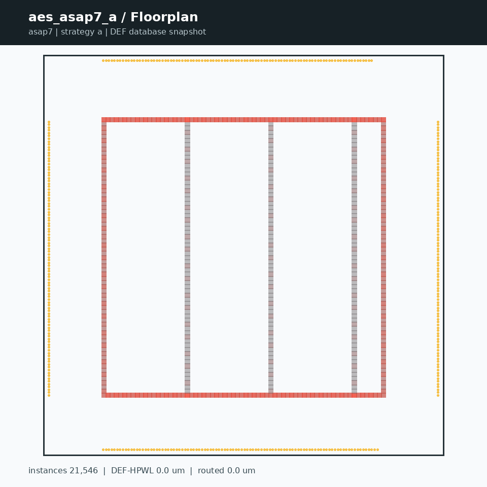</a></td><td><b>Fanout</b> <a href="../reports/aes12_65pct_qor_wp_rt01b_comparison_assets/aes_asap7_a/fanout.png">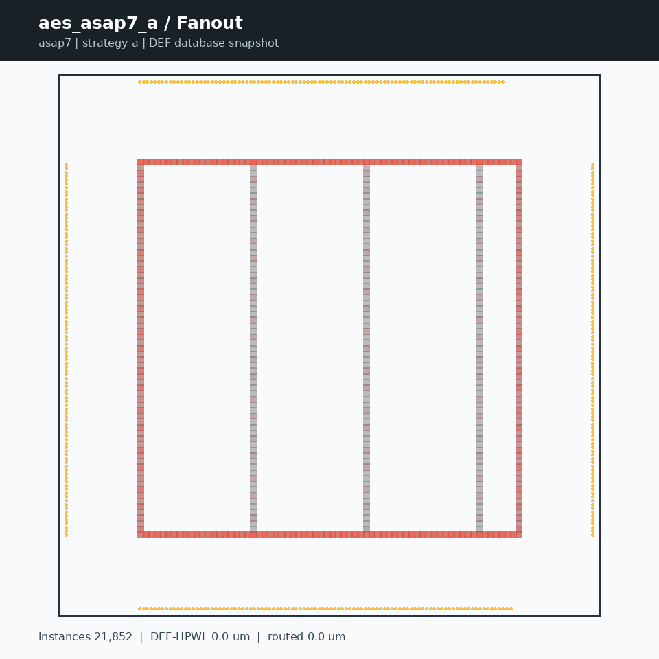</a></td><td><b>Placement</b> </td><td><b>CTS</b> <a href="../reports/aes12_65pct_qor_wp_rt01b_comparison_assets/aes_asap7_a/cts.png">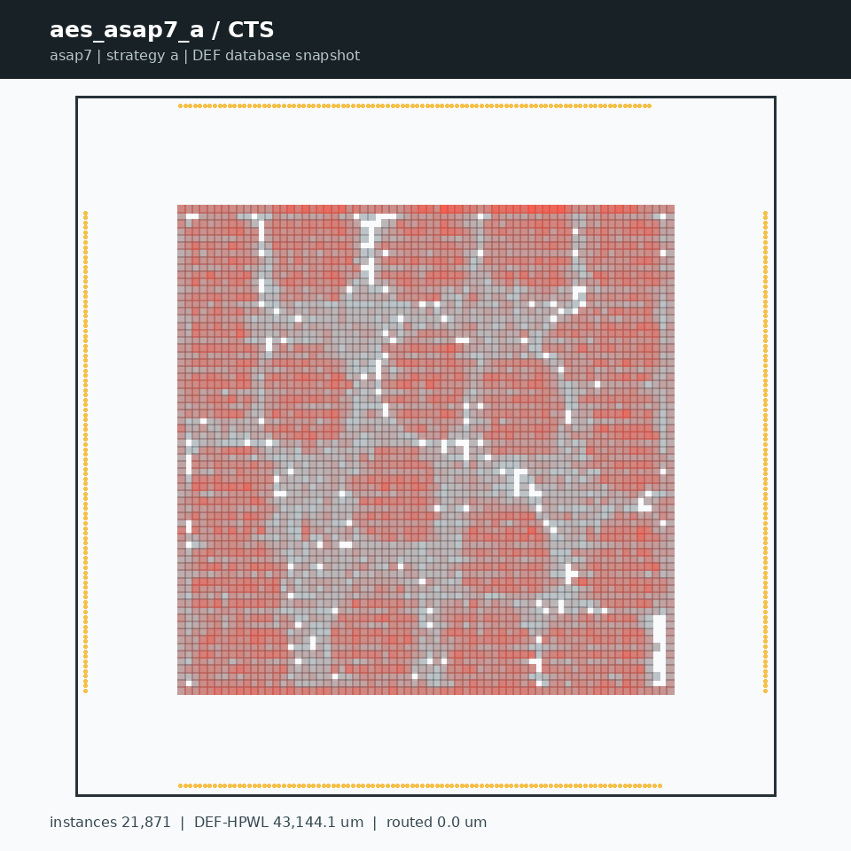</a></td></tr>
<tr><td><b>Legalization</b> </td><td><b>Routing</b> </td><td><b>Filler</b> <a href="../reports/aes12_65pct_qor_wp_rt01b_comparison_assets/aes_asap7_a/filler.png">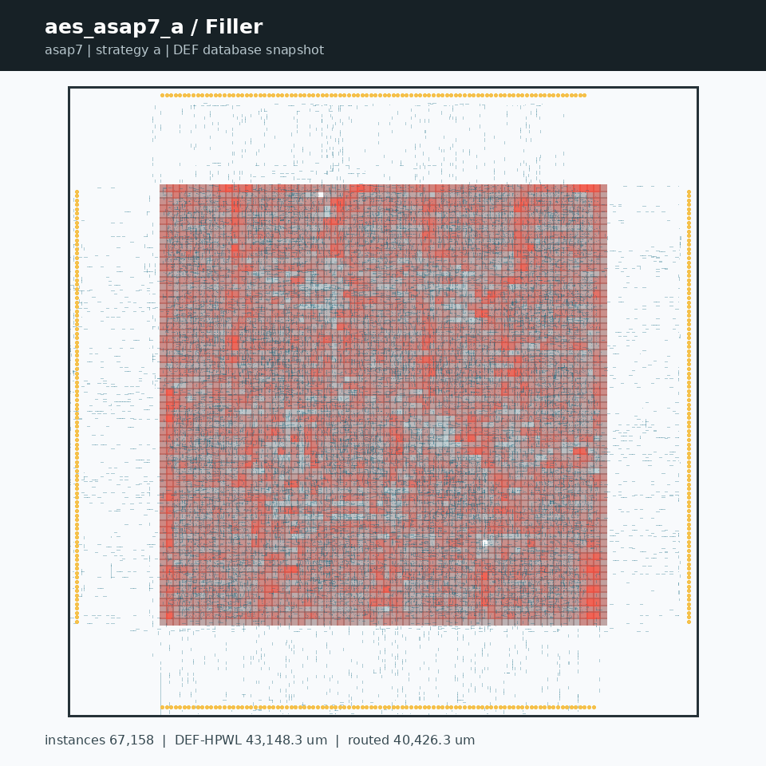</a></td><td><b>Final GDS</b> </td></tr>
</table>
CTS 专项图：[clock tree](../results/aes13_65pct_qor_wp_rt01b_20260731_1520/aes_asap7_a/workspace/result/cts/visualization/svg/cts_design.svg) / [flyline](../results/aes13_65pct_qor_wp_rt01b_20260731_1520/aes_asap7_a/workspace/result/cts/visualization/svg/cts_flyline.svg)

#### 空间 Map 证据

共发现 `46` 个原始 map 文件，渲染 `16` 张代表图。同类图使用跨 13 个设计的统一色标；DRC 使用统一对数色标。全零图保留并明确标注。

<table>
<tr><td><b>Std-cell density</b>  <small>non-zero 39.43%; max 1.000; <a href="../results/aes13_65pct_qor_wp_rt01b_20260731_1520/aes_asap7_a/workspace/result/density_map/place_stdcell_density.csv">raw</a></small></td><td><b>Macro density</b>  <small>non-zero 0.00%; max 0.000; <a href="../results/aes13_65pct_qor_wp_rt01b_20260731_1520/aes_asap7_a/workspace/result/density_map/place_macro_density.csv">raw</a></small></td><td><b>All-cell density</b> <a href="../reports/aes12_65pct_qor_wp_rt01b_comparison_assets/aes_asap7_a/maps/allcell_density.png">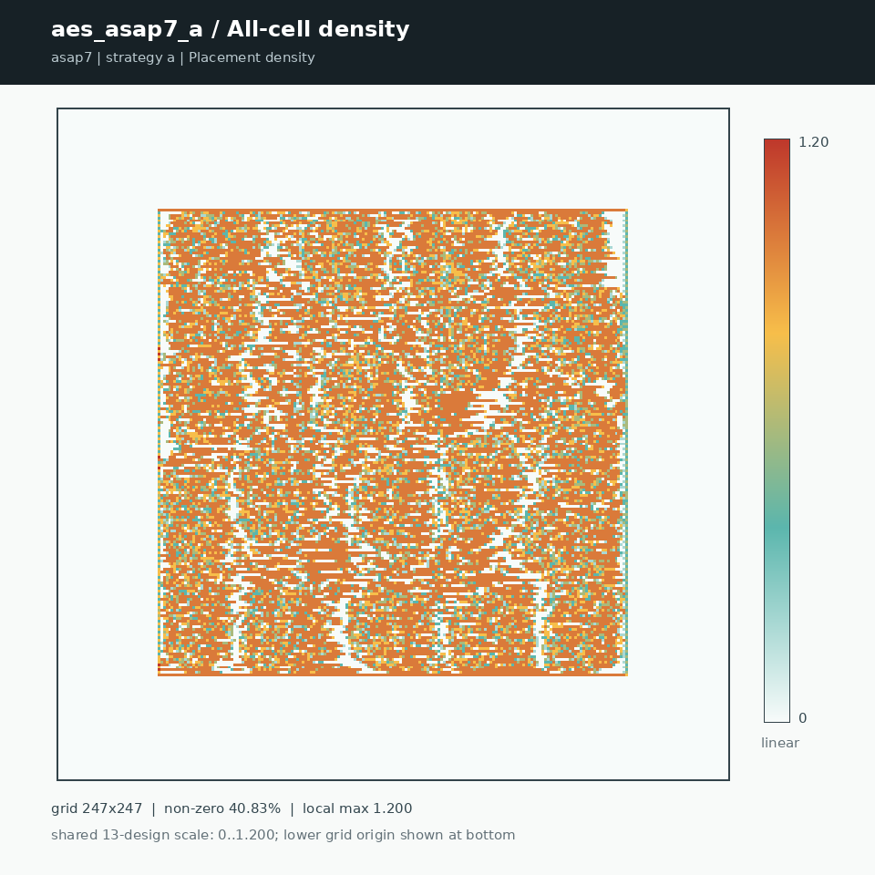</a> <small>non-zero 40.83%; max 1.200; <a href="../results/aes13_65pct_qor_wp_rt01b_20260731_1520/aes_asap7_a/workspace/result/density_map/place_allcell_density.csv">raw</a></small></td><td><b>Std-cell pin density</b>  <small>non-zero 41.28%; max 8.000; <a href="../results/aes13_65pct_qor_wp_rt01b_20260731_1520/aes_asap7_a/workspace/result/density_map/place_stdcell_pin_density.csv">raw</a></small></td></tr>
<tr><td><b>Macro pin density</b>  <small>non-zero 0.00%; max 0.000; <a href="../results/aes13_65pct_qor_wp_rt01b_20260731_1520/aes_asap7_a/workspace/result/density_map/place_macro_pin_density.csv">raw</a></small></td><td><b>All-cell pin density</b> <a href="../reports/aes12_65pct_qor_wp_rt01b_comparison_assets/aes_asap7_a/maps/allcell_pin_density.png">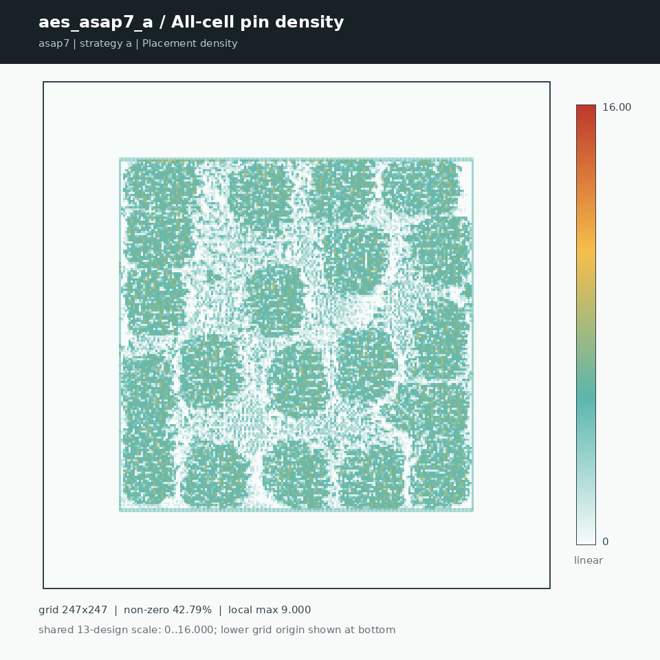</a> <small>non-zero 42.79%; max 9.000; <a href="../results/aes13_65pct_qor_wp_rt01b_20260731_1520/aes_asap7_a/workspace/result/density_map/place_allcell_pin_density.csv">raw</a></small></td><td><b>Local-net density</b>  <small>non-zero 4.08%; max 1.000; <a href="../results/aes13_65pct_qor_wp_rt01b_20260731_1520/aes_asap7_a/workspace/result/density_map/place_local_net_density.csv">raw</a></small></td><td><b>Global-net density</b> <a href="../reports/aes12_65pct_qor_wp_rt01b_comparison_assets/aes_asap7_a/maps/global_net_density.png">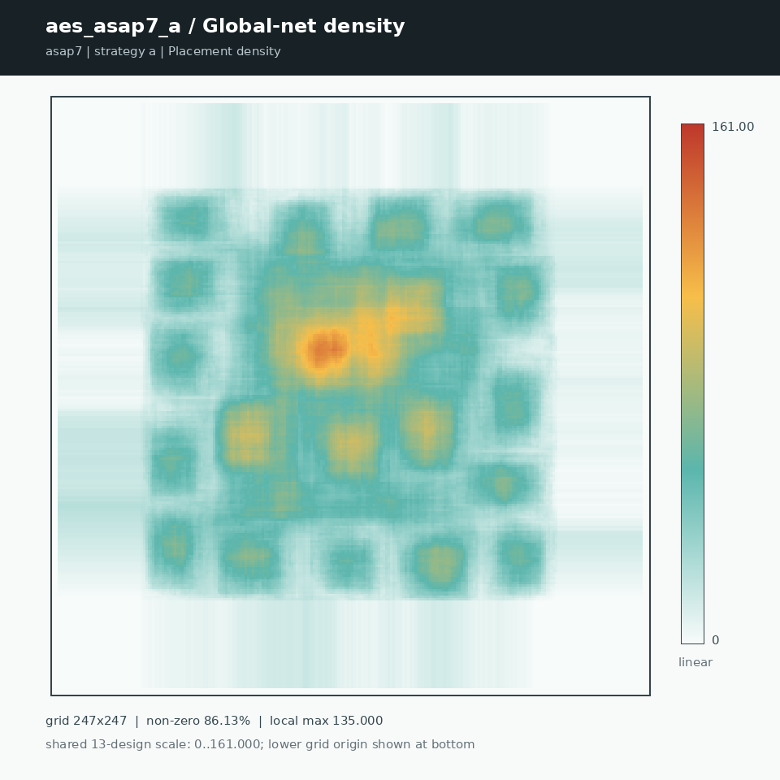</a> <small>non-zero 86.13%; max 135.000; <a href="../results/aes13_65pct_qor_wp_rt01b_20260731_1520/aes_asap7_a/workspace/result/density_map/place_global_net_density.csv">raw</a></small></td></tr>
<tr><td><b>All-net density</b>  <small>non-zero 86.13%; max 135.000; <a href="../results/aes13_65pct_qor_wp_rt01b_20260731_1520/aes_asap7_a/workspace/result/density_map/place_allnet_density.csv">raw</a></small></td><td><b>EGR horizontal overflow</b>  <small>non-zero 0.00%; max 0.000; <a href="../results/aes13_65pct_qor_wp_rt01b_20260731_1520/aes_asap7_a/workspace/result/egr_congestion_map/place_egr_horizontal_overflow.csv">raw</a></small></td><td><b>EGR vertical overflow</b>  <small>non-zero 0.00%; max 1.000; <a href="../results/aes13_65pct_qor_wp_rt01b_20260731_1520/aes_asap7_a/workspace/result/egr_congestion_map/place_egr_vertical_overflow.csv">raw</a></small></td><td><b>EGR union overflow</b> <a href="../reports/aes12_65pct_qor_wp_rt01b_comparison_assets/aes_asap7_a/maps/egr_union_overflow.png">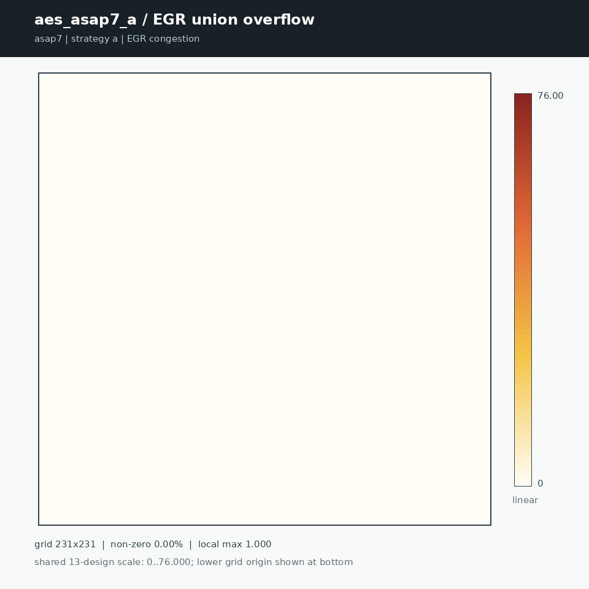</a> <small>non-zero 0.00%; max 1.000; <a href="../results/aes13_65pct_qor_wp_rt01b_20260731_1520/aes_asap7_a/workspace/result/egr_congestion_map/place_egr_union_overflow.csv">raw</a></small></td></tr>
<tr><td><b>Planar routing demand</b> <a href="../reports/aes12_65pct_qor_wp_rt01b_comparison_assets/aes_asap7_a/maps/early_net_planar.png">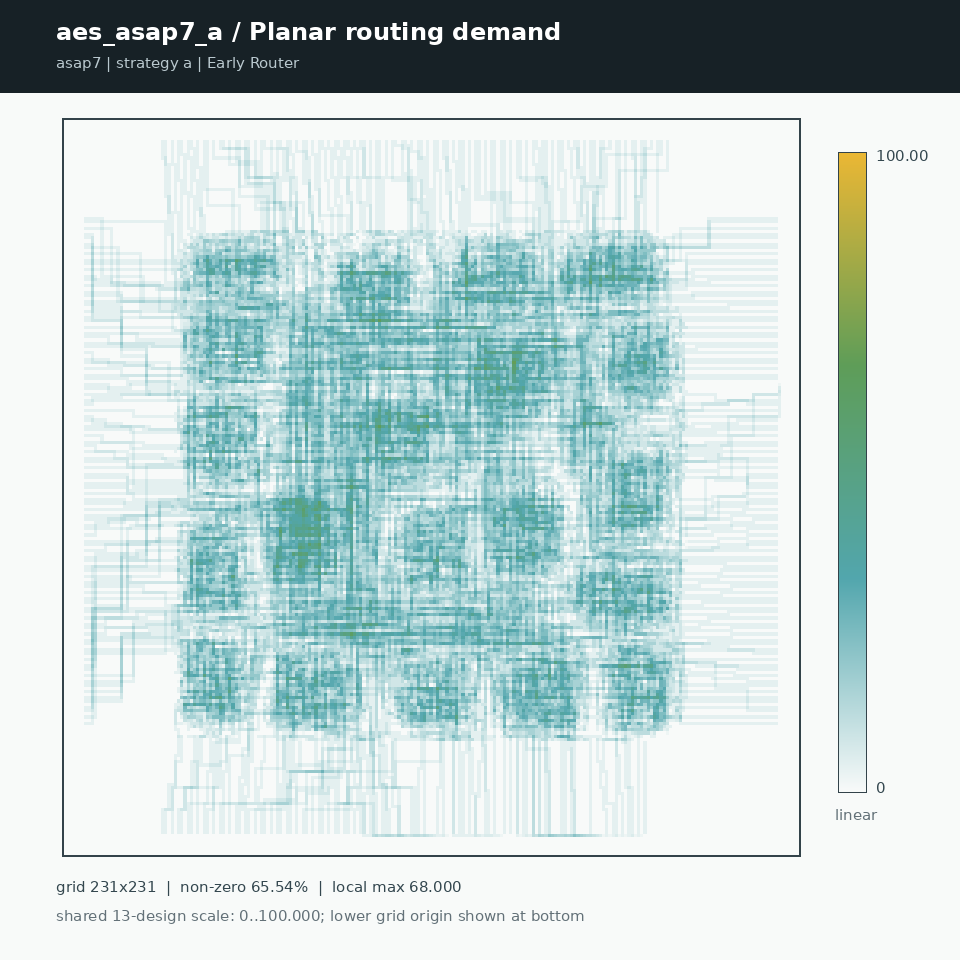</a> <small>non-zero 65.54%; max 68.000; <a href="../results/aes13_65pct_qor_wp_rt01b_20260731_1520/aes_asap7_a/workspace/result/rt/rt_temp_directory/early_router/net_map_planar.csv">raw</a></small></td><td><b>Planar routing supply</b> <a href="../reports/aes12_65pct_qor_wp_rt01b_comparison_assets/aes_asap7_a/maps/early_supply_planar.png">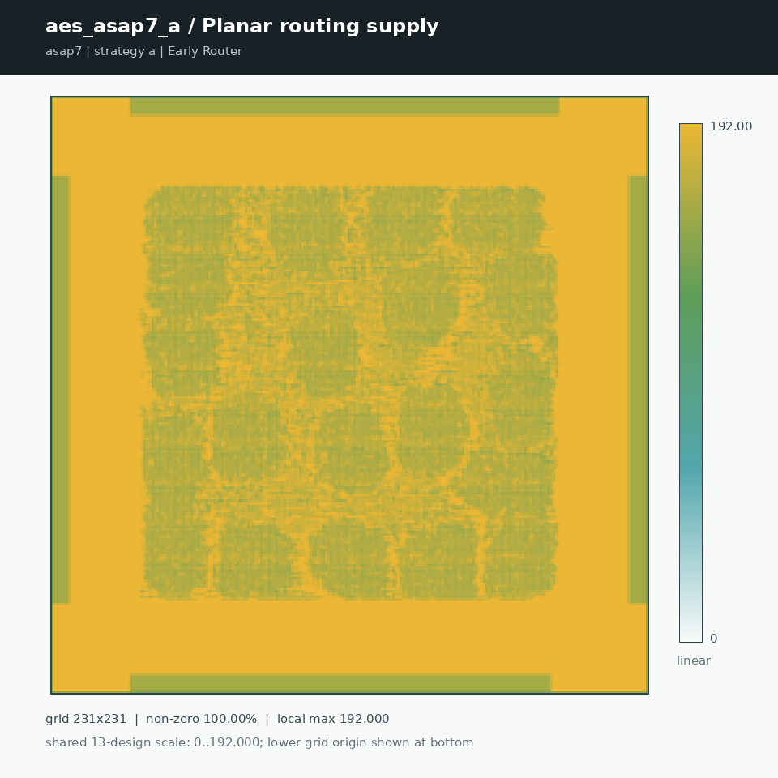</a> <small>non-zero 100.00%; max 192.000; <a href="../results/aes13_65pct_qor_wp_rt01b_20260731_1520/aes_asap7_a/workspace/result/rt/rt_temp_directory/early_router/supply_map_planar.csv">raw</a></small></td><td><b>Planar routing overflow</b> <a href="../reports/aes12_65pct_qor_wp_rt01b_comparison_assets/aes_asap7_a/maps/early_overflow_planar.png">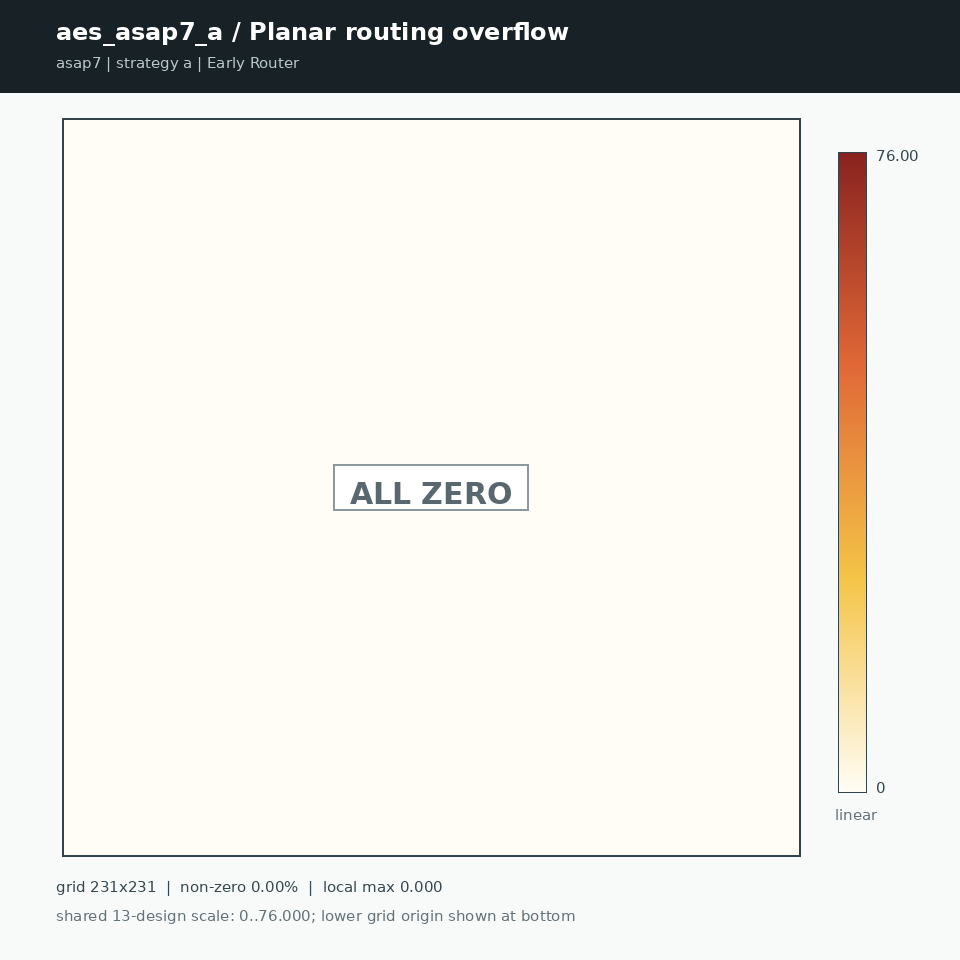</a> <small>non-zero 0.00%; max 0.000; <a href="../results/aes13_65pct_qor_wp_rt01b_20260731_1520/aes_asap7_a/workspace/result/rt/rt_temp_directory/early_router/overflow_map_planar.csv">raw</a></small></td><td><b>DRC violation-center density</b>  <small>non-zero 37.06%; max 23.000; <a href="../results/aes13_65pct_qor_wp_rt01b_20260731_1520/aes_asap7_a/workspace/drc_temp_directory/violation_map.json">raw</a></small></td></tr>
</table>

完整原始 map 文件索引

- **Placement density CSV (9)**：[place_allcell_density.csv](../results/aes13_65pct_qor_wp_rt01b_20260731_1520/aes_asap7_a/workspace/result/density_map/place_allcell_density.csv), [place_allcell_pin_density.csv](../results/aes13_65pct_qor_wp_rt01b_20260731_1520/aes_asap7_a/workspace/result/density_map/place_allcell_pin_density.csv), [place_allnet_density.csv](../results/aes13_65pct_qor_wp_rt01b_20260731_1520/aes_asap7_a/workspace/result/density_map/place_allnet_density.csv), [place_global_net_density.csv](../results/aes13_65pct_qor_wp_rt01b_20260731_1520/aes_asap7_a/workspace/result/density_map/place_global_net_density.csv), [place_local_net_density.csv](../results/aes13_65pct_qor_wp_rt01b_20260731_1520/aes_asap7_a/workspace/result/density_map/place_local_net_density.csv), [place_macro_density.csv](../results/aes13_65pct_qor_wp_rt01b_20260731_1520/aes_asap7_a/workspace/result/density_map/place_macro_density.csv), [place_macro_pin_density.csv](../results/aes13_65pct_qor_wp_rt01b_20260731_1520/aes_asap7_a/workspace/result/density_map/place_macro_pin_density.csv), [place_stdcell_density.csv](../results/aes13_65pct_qor_wp_rt01b_20260731_1520/aes_asap7_a/workspace/result/density_map/place_stdcell_density.csv), [place_stdcell_pin_density.csv](../results/aes13_65pct_qor_wp_rt01b_20260731_1520/aes_asap7_a/workspace/result/density_map/place_stdcell_pin_density.csv)
- **EGR congestion CSV (3)**：[place_egr_horizontal_overflow.csv](../results/aes13_65pct_qor_wp_rt01b_20260731_1520/aes_asap7_a/workspace/result/egr_congestion_map/place_egr_horizontal_overflow.csv), [place_egr_union_overflow.csv](../results/aes13_65pct_qor_wp_rt01b_20260731_1520/aes_asap7_a/workspace/result/egr_congestion_map/place_egr_union_overflow.csv), [place_egr_vertical_overflow.csv](../results/aes13_65pct_qor_wp_rt01b_20260731_1520/aes_asap7_a/workspace/result/egr_congestion_map/place_egr_vertical_overflow.csv)
- **Early-router layer CSV (33)**：[net_map_M1.csv](../results/aes13_65pct_qor_wp_rt01b_20260731_1520/aes_asap7_a/workspace/result/rt/rt_temp_directory/early_router/net_map_M1.csv), [net_map_M2.csv](../results/aes13_65pct_qor_wp_rt01b_20260731_1520/aes_asap7_a/workspace/result/rt/rt_temp_directory/early_router/net_map_M2.csv), [net_map_M3.csv](../results/aes13_65pct_qor_wp_rt01b_20260731_1520/aes_asap7_a/workspace/result/rt/rt_temp_directory/early_router/net_map_M3.csv), [net_map_M4.csv](../results/aes13_65pct_qor_wp_rt01b_20260731_1520/aes_asap7_a/workspace/result/rt/rt_temp_directory/early_router/net_map_M4.csv), [net_map_M5.csv](../results/aes13_65pct_qor_wp_rt01b_20260731_1520/aes_asap7_a/workspace/result/rt/rt_temp_directory/early_router/net_map_M5.csv), [net_map_M6.csv](../results/aes13_65pct_qor_wp_rt01b_20260731_1520/aes_asap7_a/workspace/result/rt/rt_temp_directory/early_router/net_map_M6.csv), [net_map_M7.csv](../results/aes13_65pct_qor_wp_rt01b_20260731_1520/aes_asap7_a/workspace/result/rt/rt_temp_directory/early_router/net_map_M7.csv), [net_map_M8.csv](../results/aes13_65pct_qor_wp_rt01b_20260731_1520/aes_asap7_a/workspace/result/rt/rt_temp_directory/early_router/net_map_M8.csv), [net_map_M9.csv](../results/aes13_65pct_qor_wp_rt01b_20260731_1520/aes_asap7_a/workspace/result/rt/rt_temp_directory/early_router/net_map_M9.csv), [net_map_Pad.csv](../results/aes13_65pct_qor_wp_rt01b_20260731_1520/aes_asap7_a/workspace/result/rt/rt_temp_directory/early_router/net_map_Pad.csv), [net_map_planar.csv](../results/aes13_65pct_qor_wp_rt01b_20260731_1520/aes_asap7_a/workspace/result/rt/rt_temp_directory/early_router/net_map_planar.csv), [overflow_map_M1.csv](../results/aes13_65pct_qor_wp_rt01b_20260731_1520/aes_asap7_a/workspace/result/rt/rt_temp_directory/early_router/overflow_map_M1.csv), [overflow_map_M2.csv](../results/aes13_65pct_qor_wp_rt01b_20260731_1520/aes_asap7_a/workspace/result/rt/rt_temp_directory/early_router/overflow_map_M2.csv), [overflow_map_M3.csv](../results/aes13_65pct_qor_wp_rt01b_20260731_1520/aes_asap7_a/workspace/result/rt/rt_temp_directory/early_router/overflow_map_M3.csv), [overflow_map_M4.csv](../results/aes13_65pct_qor_wp_rt01b_20260731_1520/aes_asap7_a/workspace/result/rt/rt_temp_directory/early_router/overflow_map_M4.csv), [overflow_map_M5.csv](../results/aes13_65pct_qor_wp_rt01b_20260731_1520/aes_asap7_a/workspace/result/rt/rt_temp_directory/early_router/overflow_map_M5.csv), [overflow_map_M6.csv](../results/aes13_65pct_qor_wp_rt01b_20260731_1520/aes_asap7_a/workspace/result/rt/rt_temp_directory/early_router/overflow_map_M6.csv), [overflow_map_M7.csv](../results/aes13_65pct_qor_wp_rt01b_20260731_1520/aes_asap7_a/workspace/result/rt/rt_temp_directory/early_router/overflow_map_M7.csv), [overflow_map_M8.csv](../results/aes13_65pct_qor_wp_rt01b_20260731_1520/aes_asap7_a/workspace/result/rt/rt_temp_directory/early_router/overflow_map_M8.csv), [overflow_map_M9.csv](../results/aes13_65pct_qor_wp_rt01b_20260731_1520/aes_asap7_a/workspace/result/rt/rt_temp_directory/early_router/overflow_map_M9.csv), [overflow_map_Pad.csv](../results/aes13_65pct_qor_wp_rt01b_20260731_1520/aes_asap7_a/workspace/result/rt/rt_temp_directory/early_router/overflow_map_Pad.csv), [overflow_map_planar.csv](../results/aes13_65pct_qor_wp_rt01b_20260731_1520/aes_asap7_a/workspace/result/rt/rt_temp_directory/early_router/overflow_map_planar.csv), [supply_map_M1.csv](../results/aes13_65pct_qor_wp_rt01b_20260731_1520/aes_asap7_a/workspace/result/rt/rt_temp_directory/early_router/supply_map_M1.csv), [supply_map_M2.csv](../results/aes13_65pct_qor_wp_rt01b_20260731_1520/aes_asap7_a/workspace/result/rt/rt_temp_directory/early_router/supply_map_M2.csv), [supply_map_M3.csv](../results/aes13_65pct_qor_wp_rt01b_20260731_1520/aes_asap7_a/workspace/result/rt/rt_temp_directory/early_router/supply_map_M3.csv), [supply_map_M4.csv](../results/aes13_65pct_qor_wp_rt01b_20260731_1520/aes_asap7_a/workspace/result/rt/rt_temp_directory/early_router/supply_map_M4.csv), [supply_map_M5.csv](../results/aes13_65pct_qor_wp_rt01b_20260731_1520/aes_asap7_a/workspace/result/rt/rt_temp_directory/early_router/supply_map_M5.csv), [supply_map_M6.csv](../results/aes13_65pct_qor_wp_rt01b_20260731_1520/aes_asap7_a/workspace/result/rt/rt_temp_directory/early_router/supply_map_M6.csv), [supply_map_M7.csv](../results/aes13_65pct_qor_wp_rt01b_20260731_1520/aes_asap7_a/workspace/result/rt/rt_temp_directory/early_router/supply_map_M7.csv), [supply_map_M8.csv](../results/aes13_65pct_qor_wp_rt01b_20260731_1520/aes_asap7_a/workspace/result/rt/rt_temp_directory/early_router/supply_map_M8.csv), [supply_map_M9.csv](../results/aes13_65pct_qor_wp_rt01b_20260731_1520/aes_asap7_a/workspace/result/rt/rt_temp_directory/early_router/supply_map_M9.csv), [supply_map_Pad.csv](../results/aes13_65pct_qor_wp_rt01b_20260731_1520/aes_asap7_a/workspace/result/rt/rt_temp_directory/early_router/supply_map_Pad.csv), [supply_map_planar.csv](../results/aes13_65pct_qor_wp_rt01b_20260731_1520/aes_asap7_a/workspace/result/rt/rt_temp_directory/early_router/supply_map_planar.csv)
- **DRC violation JSON (1)**：[violation_map.json](../results/aes13_65pct_qor_wp_rt01b_20260731_1520/aes_asap7_a/workspace/drc_temp_directory/violation_map.json)

### aes_asap7_b (asap7 / b)

| Stage | Runtime (s) | Memory (MB) | Instances | Timing inst. | Core util. | DEF HPWL (um) | Routed (um) | Setup WNS (ns) | Power (mW) | Congestion | DRC | IR-drop |
|---|---:|---:|---:|---:|---:|---:|---:|---:|---:|---|---:|---|
| Floorplan | 0.00 | 0.0 | 21,546 | 0 | 65.2% | 0.0 | 0.0 | N/A | N/A | N/A | N/A | N/A |
| Fanout | 0.85 | 5,063.0 | 21,852 | 306 | 67.7% | 0.0 | 0.0 | N/A | N/A | N/A | N/A | N/A |
| Placement | 26.46 | 1,040.2 | 21,852 | 306 | 67.7% | 42,739.3 | 0.0 | N/A | N/A | N/A | N/A | N/A |
| CTS | 1.73 | 59.1 | 21,871 | 325 | 67.8% | 43,144.1 | 0.0 | N/A | N/A | N/A | N/A | N/A |
| Legalization | 9.83 | 1,063.2 | 21,871 | 325 | 67.8% | 43,148.3 | 0.0 | N/A | N/A | N/A | N/A | N/A |
| Routing | 2,387.02 | 0.0 | 21,871 | 325 | 67.8% | 43,148.3 | 40,435.5 | -1,491.028 | 39.290 | N/A | 48,089 | N/A |
| Filler | 7.73 | 178.1 | 67,158 | 325 | 128.8% | 43,148.3 | 40,435.5 | N/A | N/A | N/A | N/A | N/A |

Post-route：setup WNS `-1,491.028 ns`，hold WNS `-819.752 ns`，功耗 `39.290 mW`，DRC `48,089`。DRC 主项：minimum_area=20,533, metal_short=12,787, parallel_run_length_spacing=9,320。未约束端口 `5`，缺失 input slew pin `426`。

<table>
<tr><td><b>Floorplan</b> </td><td><b>Fanout</b> <a href="../reports/aes12_65pct_qor_wp_rt01b_comparison_assets/aes_asap7_b/fanout.png">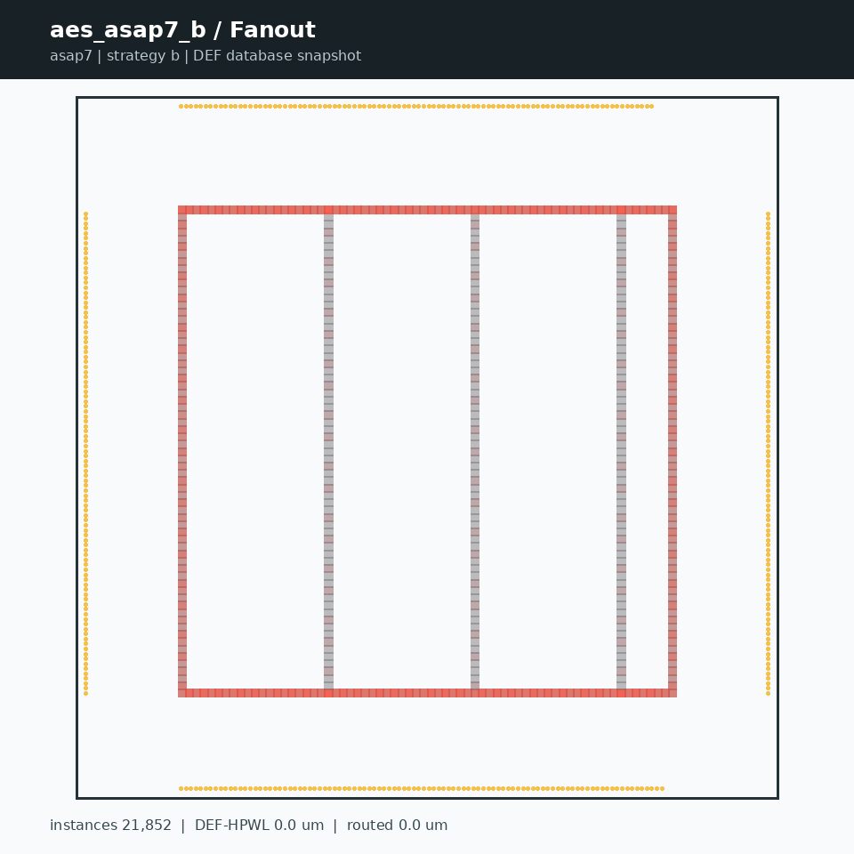</a></td><td><b>Placement</b> </td><td><b>CTS</b> </td></tr>
<tr><td><b>Legalization</b> </td><td><b>Routing</b> <a href="../reports/aes12_65pct_qor_wp_rt01b_comparison_assets/aes_asap7_b/routing.png">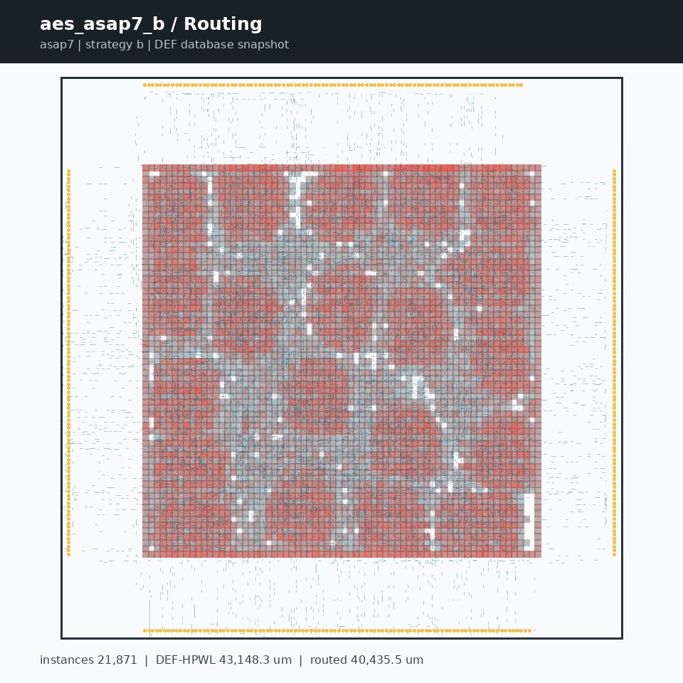</a></td><td><b>Filler</b> </td><td><b>Final GDS</b> </td></tr>
</table>
CTS 专项图：[clock tree](../results/aes13_65pct_qor_wp_rt01b_20260731_1520/aes_asap7_b/workspace/result/cts/visualization/svg/cts_design.svg) / [flyline](../results/aes13_65pct_qor_wp_rt01b_20260731_1520/aes_asap7_b/workspace/result/cts/visualization/svg/cts_flyline.svg)

#### 空间 Map 证据

共发现 `46` 个原始 map 文件，渲染 `16` 张代表图。同类图使用跨 13 个设计的统一色标；DRC 使用统一对数色标。全零图保留并明确标注。

<table>
<tr><td><b>Std-cell density</b> <a href="../reports/aes12_65pct_qor_wp_rt01b_comparison_assets/aes_asap7_b/maps/stdcell_density.png">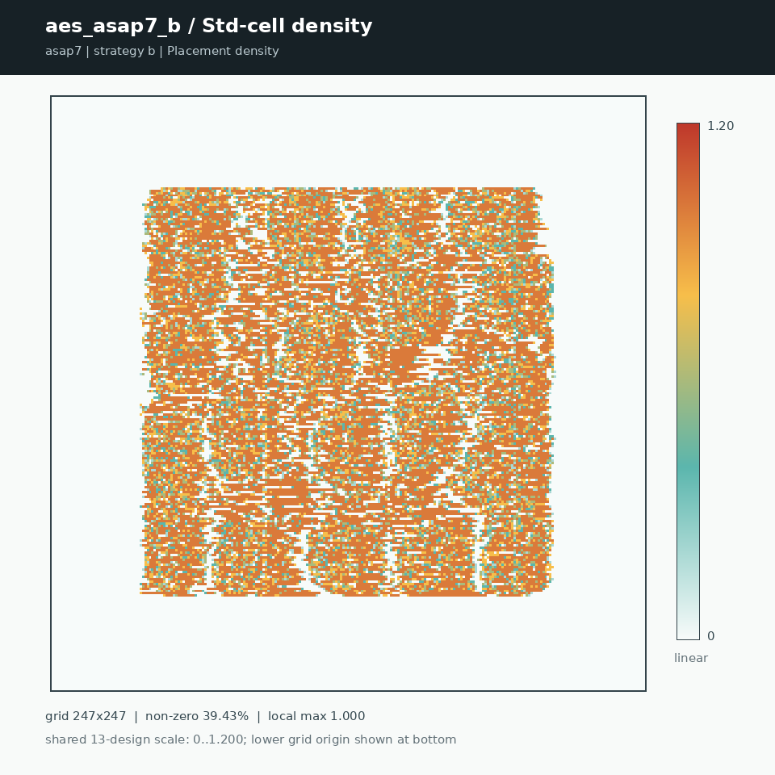</a> <small>non-zero 39.43%; max 1.000; <a href="../results/aes13_65pct_qor_wp_rt01b_20260731_1520/aes_asap7_b/workspace/result/density_map/place_stdcell_density.csv">raw</a></small></td><td><b>Macro density</b>  <small>non-zero 0.00%; max 0.000; <a href="../results/aes13_65pct_qor_wp_rt01b_20260731_1520/aes_asap7_b/workspace/result/density_map/place_macro_density.csv">raw</a></small></td><td><b>All-cell density</b>  <small>non-zero 40.83%; max 1.200; <a href="../results/aes13_65pct_qor_wp_rt01b_20260731_1520/aes_asap7_b/workspace/result/density_map/place_allcell_density.csv">raw</a></small></td><td><b>Std-cell pin density</b> <a href="../reports/aes12_65pct_qor_wp_rt01b_comparison_assets/aes_asap7_b/maps/stdcell_pin_density.png">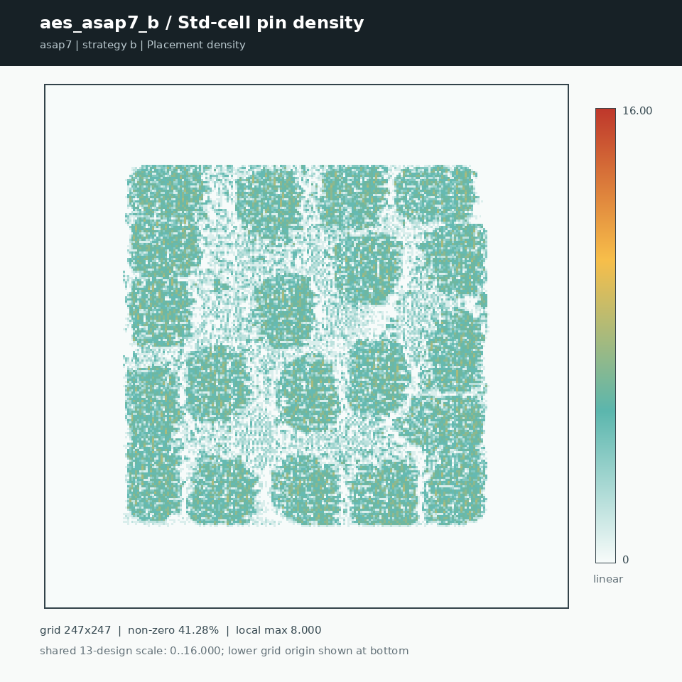</a> <small>non-zero 41.28%; max 8.000; <a href="../results/aes13_65pct_qor_wp_rt01b_20260731_1520/aes_asap7_b/workspace/result/density_map/place_stdcell_pin_density.csv">raw</a></small></td></tr>
<tr><td><b>Macro pin density</b>  <small>non-zero 0.00%; max 0.000; <a href="../results/aes13_65pct_qor_wp_rt01b_20260731_1520/aes_asap7_b/workspace/result/density_map/place_macro_pin_density.csv">raw</a></small></td><td><b>All-cell pin density</b>  <small>non-zero 42.79%; max 9.000; <a href="../results/aes13_65pct_qor_wp_rt01b_20260731_1520/aes_asap7_b/workspace/result/density_map/place_allcell_pin_density.csv">raw</a></small></td><td><b>Local-net density</b>  <small>non-zero 4.08%; max 1.000; <a href="../results/aes13_65pct_qor_wp_rt01b_20260731_1520/aes_asap7_b/workspace/result/density_map/place_local_net_density.csv">raw</a></small></td><td><b>Global-net density</b>  <small>non-zero 86.13%; max 135.000; <a href="../results/aes13_65pct_qor_wp_rt01b_20260731_1520/aes_asap7_b/workspace/result/density_map/place_global_net_density.csv">raw</a></small></td></tr>
<tr><td><b>All-net density</b>  <small>non-zero 86.13%; max 135.000; <a href="../results/aes13_65pct_qor_wp_rt01b_20260731_1520/aes_asap7_b/workspace/result/density_map/place_allnet_density.csv">raw</a></small></td><td><b>EGR horizontal overflow</b>  <small>non-zero 0.00%; max 0.000; <a href="../results/aes13_65pct_qor_wp_rt01b_20260731_1520/aes_asap7_b/workspace/result/egr_congestion_map/place_egr_horizontal_overflow.csv">raw</a></small></td><td><b>EGR vertical overflow</b>  <small>non-zero 0.00%; max 1.000; <a href="../results/aes13_65pct_qor_wp_rt01b_20260731_1520/aes_asap7_b/workspace/result/egr_congestion_map/place_egr_vertical_overflow.csv">raw</a></small></td><td><b>EGR union overflow</b>  <small>non-zero 0.00%; max 1.000; <a href="../results/aes13_65pct_qor_wp_rt01b_20260731_1520/aes_asap7_b/workspace/result/egr_congestion_map/place_egr_union_overflow.csv">raw</a></small></td></tr>
<tr><td><b>Planar routing demand</b>  <small>non-zero 65.54%; max 68.000; <a href="../results/aes13_65pct_qor_wp_rt01b_20260731_1520/aes_asap7_b/workspace/result/rt/rt_temp_directory/early_router/net_map_planar.csv">raw</a></small></td><td><b>Planar routing supply</b> <a href="../reports/aes12_65pct_qor_wp_rt01b_comparison_assets/aes_asap7_b/maps/early_supply_planar.png">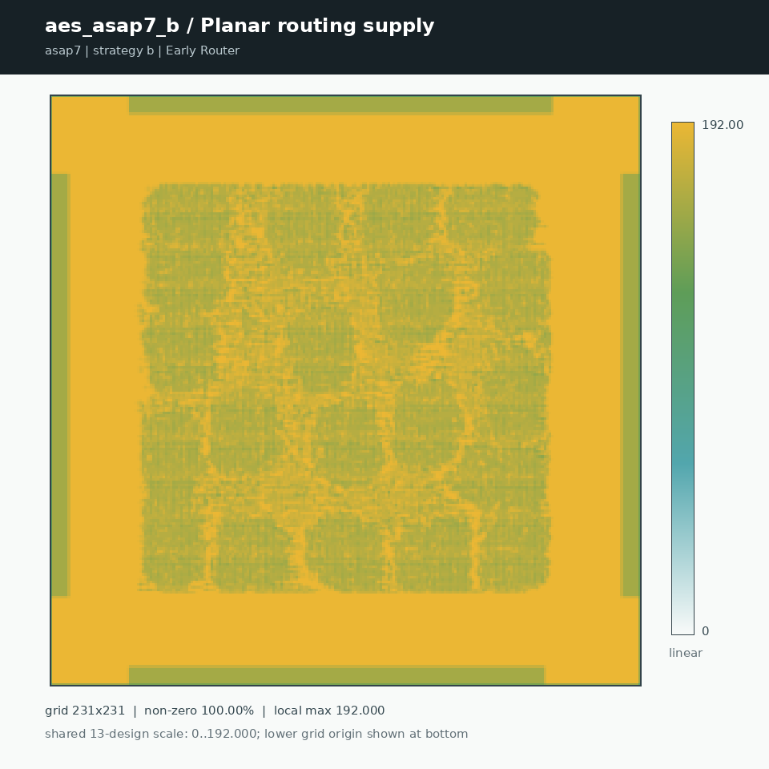</a> <small>non-zero 100.00%; max 192.000; <a href="../results/aes13_65pct_qor_wp_rt01b_20260731_1520/aes_asap7_b/workspace/result/rt/rt_temp_directory/early_router/supply_map_planar.csv">raw</a></small></td><td><b>Planar routing overflow</b>  <small>non-zero 0.00%; max 0.000; <a href="../results/aes13_65pct_qor_wp_rt01b_20260731_1520/aes_asap7_b/workspace/result/rt/rt_temp_directory/early_router/overflow_map_planar.csv">raw</a></small></td><td><b>DRC violation-center density</b> <a href="../reports/aes12_65pct_qor_wp_rt01b_comparison_assets/aes_asap7_b/maps/drc_violation_density.png">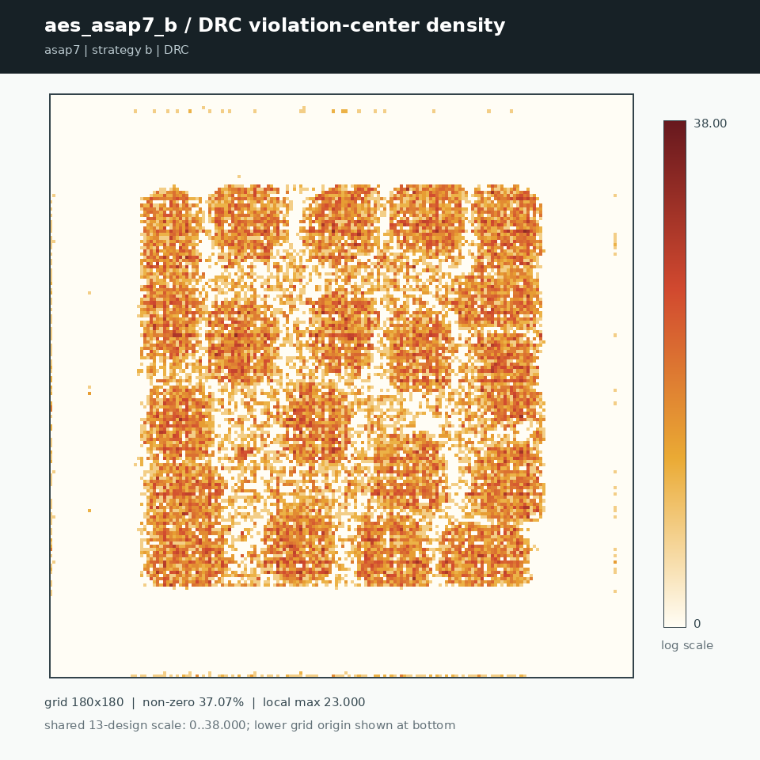</a> <small>non-zero 37.07%; max 23.000; <a href="../results/aes13_65pct_qor_wp_rt01b_20260731_1520/aes_asap7_b/workspace/drc_temp_directory/violation_map.json">raw</a></small></td></tr>
</table>

完整原始 map 文件索引

- **Placement density CSV (9)**：[place_allcell_density.csv](../results/aes13_65pct_qor_wp_rt01b_20260731_1520/aes_asap7_b/workspace/result/density_map/place_allcell_density.csv), [place_allcell_pin_density.csv](../results/aes13_65pct_qor_wp_rt01b_20260731_1520/aes_asap7_b/workspace/result/density_map/place_allcell_pin_density.csv), [place_allnet_density.csv](../results/aes13_65pct_qor_wp_rt01b_20260731_1520/aes_asap7_b/workspace/result/density_map/place_allnet_density.csv), [place_global_net_density.csv](../results/aes13_65pct_qor_wp_rt01b_20260731_1520/aes_asap7_b/workspace/result/density_map/place_global_net_density.csv), [place_local_net_density.csv](../results/aes13_65pct_qor_wp_rt01b_20260731_1520/aes_asap7_b/workspace/result/density_map/place_local_net_density.csv), [place_macro_density.csv](../results/aes13_65pct_qor_wp_rt01b_20260731_1520/aes_asap7_b/workspace/result/density_map/place_macro_density.csv), [place_macro_pin_density.csv](../results/aes13_65pct_qor_wp_rt01b_20260731_1520/aes_asap7_b/workspace/result/density_map/place_macro_pin_density.csv), [place_stdcell_density.csv](../results/aes13_65pct_qor_wp_rt01b_20260731_1520/aes_asap7_b/workspace/result/density_map/place_stdcell_density.csv), [place_stdcell_pin_density.csv](../results/aes13_65pct_qor_wp_rt01b_20260731_1520/aes_asap7_b/workspace/result/density_map/place_stdcell_pin_density.csv)
- **EGR congestion CSV (3)**：[place_egr_horizontal_overflow.csv](../results/aes13_65pct_qor_wp_rt01b_20260731_1520/aes_asap7_b/workspace/result/egr_congestion_map/place_egr_horizontal_overflow.csv), [place_egr_union_overflow.csv](../results/aes13_65pct_qor_wp_rt01b_20260731_1520/aes_asap7_b/workspace/result/egr_congestion_map/place_egr_union_overflow.csv), [place_egr_vertical_overflow.csv](../results/aes13_65pct_qor_wp_rt01b_20260731_1520/aes_asap7_b/workspace/result/egr_congestion_map/place_egr_vertical_overflow.csv)
- **Early-router layer CSV (33)**：[net_map_M1.csv](../results/aes13_65pct_qor_wp_rt01b_20260731_1520/aes_asap7_b/workspace/result/rt/rt_temp_directory/early_router/net_map_M1.csv), [net_map_M2.csv](../results/aes13_65pct_qor_wp_rt01b_20260731_1520/aes_asap7_b/workspace/result/rt/rt_temp_directory/early_router/net_map_M2.csv), [net_map_M3.csv](../results/aes13_65pct_qor_wp_rt01b_20260731_1520/aes_asap7_b/workspace/result/rt/rt_temp_directory/early_router/net_map_M3.csv), [net_map_M4.csv](../results/aes13_65pct_qor_wp_rt01b_20260731_1520/aes_asap7_b/workspace/result/rt/rt_temp_directory/early_router/net_map_M4.csv), [net_map_M5.csv](../results/aes13_65pct_qor_wp_rt01b_20260731_1520/aes_asap7_b/workspace/result/rt/rt_temp_directory/early_router/net_map_M5.csv), [net_map_M6.csv](../results/aes13_65pct_qor_wp_rt01b_20260731_1520/aes_asap7_b/workspace/result/rt/rt_temp_directory/early_router/net_map_M6.csv), [net_map_M7.csv](../results/aes13_65pct_qor_wp_rt01b_20260731_1520/aes_asap7_b/workspace/result/rt/rt_temp_directory/early_router/net_map_M7.csv), [net_map_M8.csv](../results/aes13_65pct_qor_wp_rt01b_20260731_1520/aes_asap7_b/workspace/result/rt/rt_temp_directory/early_router/net_map_M8.csv), [net_map_M9.csv](../results/aes13_65pct_qor_wp_rt01b_20260731_1520/aes_asap7_b/workspace/result/rt/rt_temp_directory/early_router/net_map_M9.csv), [net_map_Pad.csv](../results/aes13_65pct_qor_wp_rt01b_20260731_1520/aes_asap7_b/workspace/result/rt/rt_temp_directory/early_router/net_map_Pad.csv), [net_map_planar.csv](../results/aes13_65pct_qor_wp_rt01b_20260731_1520/aes_asap7_b/workspace/result/rt/rt_temp_directory/early_router/net_map_planar.csv), [overflow_map_M1.csv](../results/aes13_65pct_qor_wp_rt01b_20260731_1520/aes_asap7_b/workspace/result/rt/rt_temp_directory/early_router/overflow_map_M1.csv), [overflow_map_M2.csv](../results/aes13_65pct_qor_wp_rt01b_20260731_1520/aes_asap7_b/workspace/result/rt/rt_temp_directory/early_router/overflow_map_M2.csv), [overflow_map_M3.csv](../results/aes13_65pct_qor_wp_rt01b_20260731_1520/aes_asap7_b/workspace/result/rt/rt_temp_directory/early_router/overflow_map_M3.csv), [overflow_map_M4.csv](../results/aes13_65pct_qor_wp_rt01b_20260731_1520/aes_asap7_b/workspace/result/rt/rt_temp_directory/early_router/overflow_map_M4.csv), [overflow_map_M5.csv](../results/aes13_65pct_qor_wp_rt01b_20260731_1520/aes_asap7_b/workspace/result/rt/rt_temp_directory/early_router/overflow_map_M5.csv), [overflow_map_M6.csv](../results/aes13_65pct_qor_wp_rt01b_20260731_1520/aes_asap7_b/workspace/result/rt/rt_temp_directory/early_router/overflow_map_M6.csv), [overflow_map_M7.csv](../results/aes13_65pct_qor_wp_rt01b_20260731_1520/aes_asap7_b/workspace/result/rt/rt_temp_directory/early_router/overflow_map_M7.csv), [overflow_map_M8.csv](../results/aes13_65pct_qor_wp_rt01b_20260731_1520/aes_asap7_b/workspace/result/rt/rt_temp_directory/early_router/overflow_map_M8.csv), [overflow_map_M9.csv](../results/aes13_65pct_qor_wp_rt01b_20260731_1520/aes_asap7_b/workspace/result/rt/rt_temp_directory/early_router/overflow_map_M9.csv), [overflow_map_Pad.csv](../results/aes13_65pct_qor_wp_rt01b_20260731_1520/aes_asap7_b/workspace/result/rt/rt_temp_directory/early_router/overflow_map_Pad.csv), [overflow_map_planar.csv](../results/aes13_65pct_qor_wp_rt01b_20260731_1520/aes_asap7_b/workspace/result/rt/rt_temp_directory/early_router/overflow_map_planar.csv), [supply_map_M1.csv](../results/aes13_65pct_qor_wp_rt01b_20260731_1520/aes_asap7_b/workspace/result/rt/rt_temp_directory/early_router/supply_map_M1.csv), [supply_map_M2.csv](../results/aes13_65pct_qor_wp_rt01b_20260731_1520/aes_asap7_b/workspace/result/rt/rt_temp_directory/early_router/supply_map_M2.csv), [supply_map_M3.csv](../results/aes13_65pct_qor_wp_rt01b_20260731_1520/aes_asap7_b/workspace/result/rt/rt_temp_directory/early_router/supply_map_M3.csv), [supply_map_M4.csv](../results/aes13_65pct_qor_wp_rt01b_20260731_1520/aes_asap7_b/workspace/result/rt/rt_temp_directory/early_router/supply_map_M4.csv), [supply_map_M5.csv](../results/aes13_65pct_qor_wp_rt01b_20260731_1520/aes_asap7_b/workspace/result/rt/rt_temp_directory/early_router/supply_map_M5.csv), [supply_map_M6.csv](../results/aes13_65pct_qor_wp_rt01b_20260731_1520/aes_asap7_b/workspace/result/rt/rt_temp_directory/early_router/supply_map_M6.csv), [supply_map_M7.csv](../results/aes13_65pct_qor_wp_rt01b_20260731_1520/aes_asap7_b/workspace/result/rt/rt_temp_directory/early_router/supply_map_M7.csv), [supply_map_M8.csv](../results/aes13_65pct_qor_wp_rt01b_20260731_1520/aes_asap7_b/workspace/result/rt/rt_temp_directory/early_router/supply_map_M8.csv), [supply_map_M9.csv](../results/aes13_65pct_qor_wp_rt01b_20260731_1520/aes_asap7_b/workspace/result/rt/rt_temp_directory/early_router/supply_map_M9.csv), [supply_map_Pad.csv](../results/aes13_65pct_qor_wp_rt01b_20260731_1520/aes_asap7_b/workspace/result/rt/rt_temp_directory/early_router/supply_map_Pad.csv), [supply_map_planar.csv](../results/aes13_65pct_qor_wp_rt01b_20260731_1520/aes_asap7_b/workspace/result/rt/rt_temp_directory/early_router/supply_map_planar.csv)
- **DRC violation JSON (1)**：[violation_map.json](../results/aes13_65pct_qor_wp_rt01b_20260731_1520/aes_asap7_b/workspace/drc_temp_directory/violation_map.json)

### aes_asap7_t (asap7 / t)

| Stage | Runtime (s) | Memory (MB) | Instances | Timing inst. | Core util. | DEF HPWL (um) | Routed (um) | Setup WNS (ns) | Power (mW) | Congestion | DRC | IR-drop |
|---|---:|---:|---:|---:|---:|---:|---:|---:|---:|---|---:|---|
| Floorplan | 0.00 | 0.0 | 21,546 | 0 | 65.2% | 0.0 | 0.0 | N/A | N/A | N/A | N/A | N/A |
| Fanout | 0.92 | 3,869.3 | 21,852 | 306 | 67.7% | 0.0 | 0.0 | N/A | N/A | N/A | N/A | N/A |
| Placement | 26.23 | 974.6 | 21,852 | 306 | 67.7% | 42,739.3 | 0.0 | N/A | N/A | N/A | N/A | N/A |
| CTS | 1.77 | 59.1 | 21,871 | 325 | 67.8% | 43,144.1 | 0.0 | N/A | N/A | N/A | N/A | N/A |
| Legalization | 9.79 | 1,063.2 | 21,871 | 325 | 67.8% | 43,148.3 | 0.0 | N/A | N/A | N/A | N/A | N/A |
| Routing | 2,442.40 | 0.0 | 21,871 | 325 | 67.8% | 43,148.3 | 40,426.3 | -1,491.028 | 39.290 | N/A | 48,094 | N/A |
| Filler | 14.86 | 178.1 | 67,158 | 325 | 128.8% | 43,148.3 | 40,426.3 | N/A | N/A | N/A | N/A | N/A |

Post-route：setup WNS `-1,491.028 ns`，hold WNS `-819.752 ns`，功耗 `39.290 mW`，DRC `48,094`。DRC 主项：minimum_area=20,531, metal_short=12,788, parallel_run_length_spacing=9,324。未约束端口 `5`，缺失 input slew pin `426`。

<table>
<tr><td><b>Floorplan</b> </td><td><b>Fanout</b> </td><td><b>Placement</b> <a href="../reports/aes12_65pct_qor_wp_rt01b_comparison_assets/aes_asap7_t/placement.png">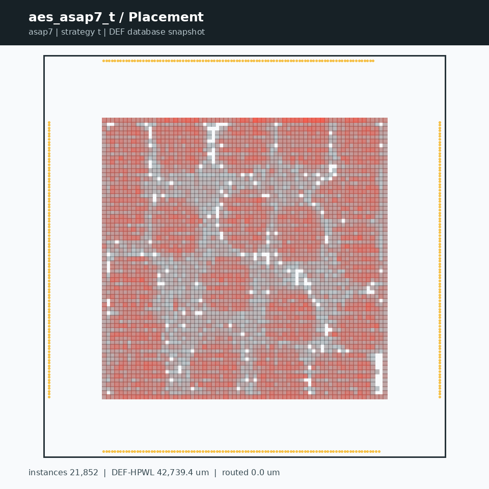</a></td><td><b>CTS</b> </td></tr>
<tr><td><b>Legalization</b> <a href="../reports/aes12_65pct_qor_wp_rt01b_comparison_assets/aes_asap7_t/legalization.png">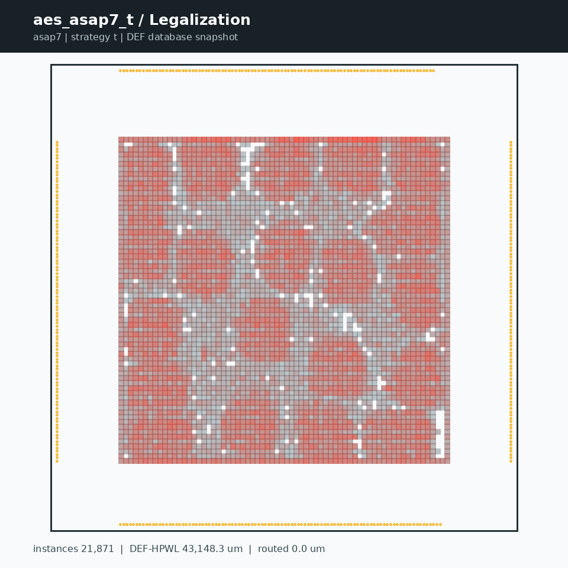</a></td><td><b>Routing</b> <a href="../reports/aes12_65pct_qor_wp_rt01b_comparison_assets/aes_asap7_t/routing.png">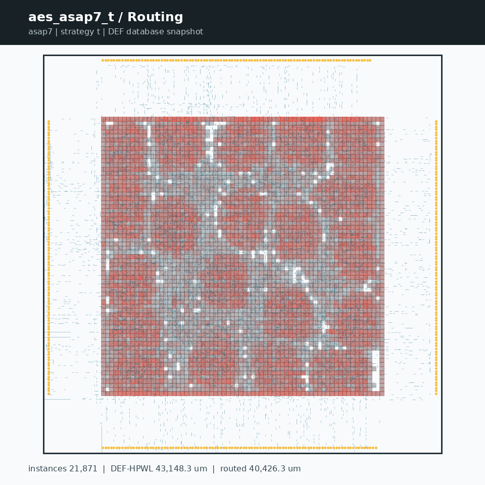</a></td><td><b>Filler</b> <a href="../reports/aes12_65pct_qor_wp_rt01b_comparison_assets/aes_asap7_t/filler.png">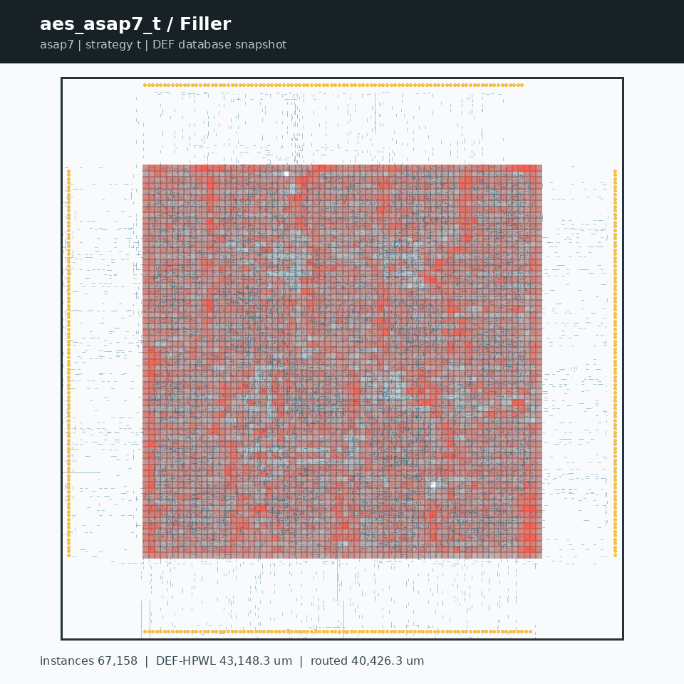</a></td><td><b>Final GDS</b> </td></tr>
</table>
CTS 专项图：[clock tree](../results/aes13_65pct_qor_wp_rt01b_20260731_1520/aes_asap7_t/workspace/result/cts/visualization/svg/cts_design.svg) / [flyline](../results/aes13_65pct_qor_wp_rt01b_20260731_1520/aes_asap7_t/workspace/result/cts/visualization/svg/cts_flyline.svg)

#### 空间 Map 证据

共发现 `46` 个原始 map 文件，渲染 `16` 张代表图。同类图使用跨 13 个设计的统一色标；DRC 使用统一对数色标。全零图保留并明确标注。

<table>
<tr><td><b>Std-cell density</b>  <small>non-zero 39.43%; max 1.000; <a href="../results/aes13_65pct_qor_wp_rt01b_20260731_1520/aes_asap7_t/workspace/result/density_map/place_stdcell_density.csv">raw</a></small></td><td><b>Macro density</b>  <small>non-zero 0.00%; max 0.000; <a href="../results/aes13_65pct_qor_wp_rt01b_20260731_1520/aes_asap7_t/workspace/result/density_map/place_macro_density.csv">raw</a></small></td><td><b>All-cell density</b> <a href="../reports/aes12_65pct_qor_wp_rt01b_comparison_assets/aes_asap7_t/maps/allcell_density.png">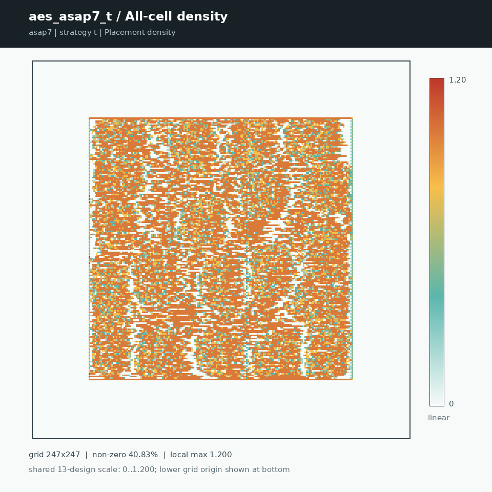</a> <small>non-zero 40.83%; max 1.200; <a href="../results/aes13_65pct_qor_wp_rt01b_20260731_1520/aes_asap7_t/workspace/result/density_map/place_allcell_density.csv">raw</a></small></td><td><b>Std-cell pin density</b>  <small>non-zero 41.28%; max 8.000; <a href="../results/aes13_65pct_qor_wp_rt01b_20260731_1520/aes_asap7_t/workspace/result/density_map/place_stdcell_pin_density.csv">raw</a></small></td></tr>
<tr><td><b>Macro pin density</b>  <small>non-zero 0.00%; max 0.000; <a href="../results/aes13_65pct_qor_wp_rt01b_20260731_1520/aes_asap7_t/workspace/result/density_map/place_macro_pin_density.csv">raw</a></small></td><td><b>All-cell pin density</b>  <small>non-zero 42.79%; max 9.000; <a href="../results/aes13_65pct_qor_wp_rt01b_20260731_1520/aes_asap7_t/workspace/result/density_map/place_allcell_pin_density.csv">raw</a></small></td><td><b>Local-net density</b> <a href="../reports/aes12_65pct_qor_wp_rt01b_comparison_assets/aes_asap7_t/maps/local_net_density.png">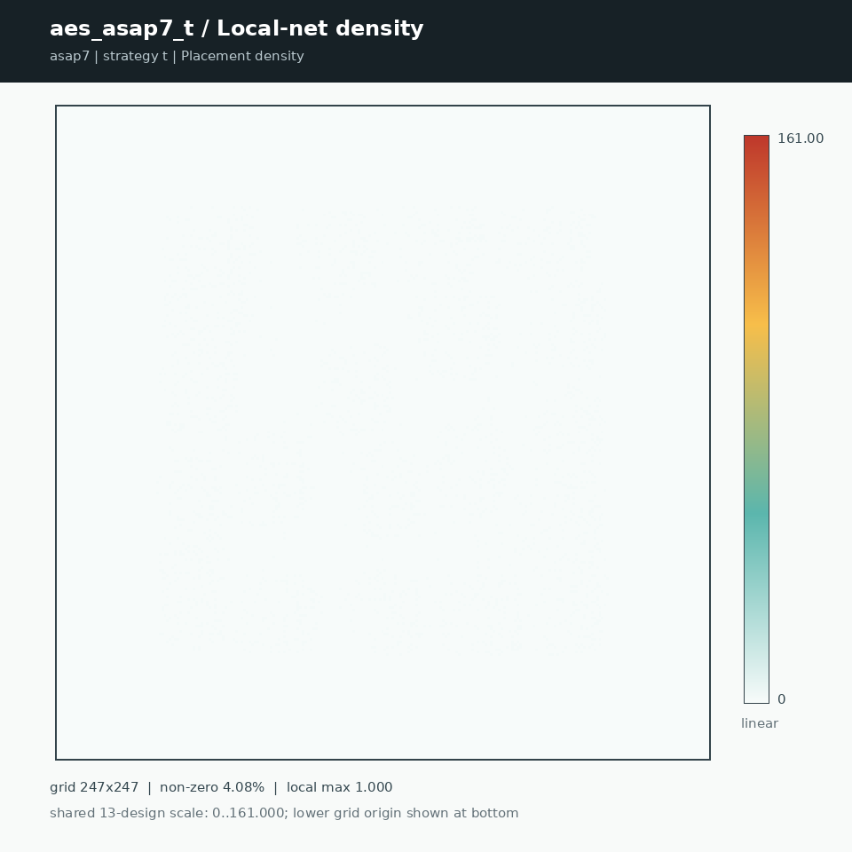</a> <small>non-zero 4.08%; max 1.000; <a href="../results/aes13_65pct_qor_wp_rt01b_20260731_1520/aes_asap7_t/workspace/result/density_map/place_local_net_density.csv">raw</a></small></td><td><b>Global-net density</b>  <small>non-zero 86.13%; max 135.000; <a href="../results/aes13_65pct_qor_wp_rt01b_20260731_1520/aes_asap7_t/workspace/result/density_map/place_global_net_density.csv">raw</a></small></td></tr>
<tr><td><b>All-net density</b> <a href="../reports/aes12_65pct_qor_wp_rt01b_comparison_assets/aes_asap7_t/maps/allnet_density.png">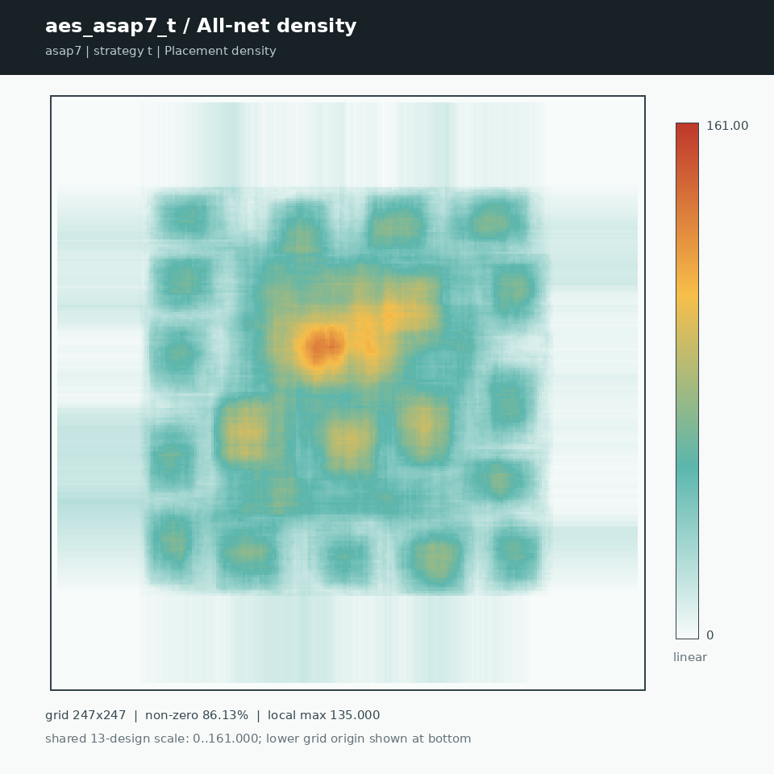</a> <small>non-zero 86.13%; max 135.000; <a href="../results/aes13_65pct_qor_wp_rt01b_20260731_1520/aes_asap7_t/workspace/result/density_map/place_allnet_density.csv">raw</a></small></td><td><b>EGR horizontal overflow</b>  <small>non-zero 0.00%; max 0.000; <a href="../results/aes13_65pct_qor_wp_rt01b_20260731_1520/aes_asap7_t/workspace/result/egr_congestion_map/place_egr_horizontal_overflow.csv">raw</a></small></td><td><b>EGR vertical overflow</b>  <small>non-zero 0.00%; max 1.000; <a href="../results/aes13_65pct_qor_wp_rt01b_20260731_1520/aes_asap7_t/workspace/result/egr_congestion_map/place_egr_vertical_overflow.csv">raw</a></small></td><td><b>EGR union overflow</b>  <small>non-zero 0.00%; max 1.000; <a href="../results/aes13_65pct_qor_wp_rt01b_20260731_1520/aes_asap7_t/workspace/result/egr_congestion_map/place_egr_union_overflow.csv">raw</a></small></td></tr>
<tr><td><b>Planar routing demand</b>  <small>non-zero 65.54%; max 68.000; <a href="../results/aes13_65pct_qor_wp_rt01b_20260731_1520/aes_asap7_t/workspace/result/rt/rt_temp_directory/early_router/net_map_planar.csv">raw</a></small></td><td><b>Planar routing supply</b>  <small>non-zero 100.00%; max 192.000; <a href="../results/aes13_65pct_qor_wp_rt01b_20260731_1520/aes_asap7_t/workspace/result/rt/rt_temp_directory/early_router/supply_map_planar.csv">raw</a></small></td><td><b>Planar routing overflow</b> <a href="../reports/aes12_65pct_qor_wp_rt01b_comparison_assets/aes_asap7_t/maps/early_overflow_planar.png">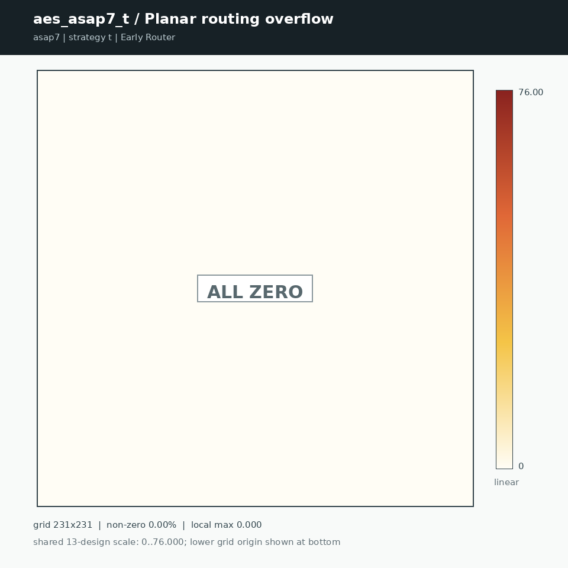</a> <small>non-zero 0.00%; max 0.000; <a href="../results/aes13_65pct_qor_wp_rt01b_20260731_1520/aes_asap7_t/workspace/result/rt/rt_temp_directory/early_router/overflow_map_planar.csv">raw</a></small></td><td><b>DRC violation-center density</b>  <small>non-zero 37.06%; max 23.000; <a href="../results/aes13_65pct_qor_wp_rt01b_20260731_1520/aes_asap7_t/workspace/drc_temp_directory/violation_map.json">raw</a></small></td></tr>
</table>

完整原始 map 文件索引

- **Placement density CSV (9)**：[place_allcell_density.csv](../results/aes13_65pct_qor_wp_rt01b_20260731_1520/aes_asap7_t/workspace/result/density_map/place_allcell_density.csv), [place_allcell_pin_density.csv](../results/aes13_65pct_qor_wp_rt01b_20260731_1520/aes_asap7_t/workspace/result/density_map/place_allcell_pin_density.csv), [place_allnet_density.csv](../results/aes13_65pct_qor_wp_rt01b_20260731_1520/aes_asap7_t/workspace/result/density_map/place_allnet_density.csv), [place_global_net_density.csv](../results/aes13_65pct_qor_wp_rt01b_20260731_1520/aes_asap7_t/workspace/result/density_map/place_global_net_density.csv), [place_local_net_density.csv](../results/aes13_65pct_qor_wp_rt01b_20260731_1520/aes_asap7_t/workspace/result/density_map/place_local_net_density.csv), [place_macro_density.csv](../results/aes13_65pct_qor_wp_rt01b_20260731_1520/aes_asap7_t/workspace/result/density_map/place_macro_density.csv), [place_macro_pin_density.csv](../results/aes13_65pct_qor_wp_rt01b_20260731_1520/aes_asap7_t/workspace/result/density_map/place_macro_pin_density.csv), [place_stdcell_density.csv](../results/aes13_65pct_qor_wp_rt01b_20260731_1520/aes_asap7_t/workspace/result/density_map/place_stdcell_density.csv), [place_stdcell_pin_density.csv](../results/aes13_65pct_qor_wp_rt01b_20260731_1520/aes_asap7_t/workspace/result/density_map/place_stdcell_pin_density.csv)
- **EGR congestion CSV (3)**：[place_egr_horizontal_overflow.csv](../results/aes13_65pct_qor_wp_rt01b_20260731_1520/aes_asap7_t/workspace/result/egr_congestion_map/place_egr_horizontal_overflow.csv), [place_egr_union_overflow.csv](../results/aes13_65pct_qor_wp_rt01b_20260731_1520/aes_asap7_t/workspace/result/egr_congestion_map/place_egr_union_overflow.csv), [place_egr_vertical_overflow.csv](../results/aes13_65pct_qor_wp_rt01b_20260731_1520/aes_asap7_t/workspace/result/egr_congestion_map/place_egr_vertical_overflow.csv)
- **Early-router layer CSV (33)**：[net_map_M1.csv](../results/aes13_65pct_qor_wp_rt01b_20260731_1520/aes_asap7_t/workspace/result/rt/rt_temp_directory/early_router/net_map_M1.csv), [net_map_M2.csv](../results/aes13_65pct_qor_wp_rt01b_20260731_1520/aes_asap7_t/workspace/result/rt/rt_temp_directory/early_router/net_map_M2.csv), [net_map_M3.csv](../results/aes13_65pct_qor_wp_rt01b_20260731_1520/aes_asap7_t/workspace/result/rt/rt_temp_directory/early_router/net_map_M3.csv), [net_map_M4.csv](../results/aes13_65pct_qor_wp_rt01b_20260731_1520/aes_asap7_t/workspace/result/rt/rt_temp_directory/early_router/net_map_M4.csv), [net_map_M5.csv](../results/aes13_65pct_qor_wp_rt01b_20260731_1520/aes_asap7_t/workspace/result/rt/rt_temp_directory/early_router/net_map_M5.csv), [net_map_M6.csv](../results/aes13_65pct_qor_wp_rt01b_20260731_1520/aes_asap7_t/workspace/result/rt/rt_temp_directory/early_router/net_map_M6.csv), [net_map_M7.csv](../results/aes13_65pct_qor_wp_rt01b_20260731_1520/aes_asap7_t/workspace/result/rt/rt_temp_directory/early_router/net_map_M7.csv), [net_map_M8.csv](../results/aes13_65pct_qor_wp_rt01b_20260731_1520/aes_asap7_t/workspace/result/rt/rt_temp_directory/early_router/net_map_M8.csv), [net_map_M9.csv](../results/aes13_65pct_qor_wp_rt01b_20260731_1520/aes_asap7_t/workspace/result/rt/rt_temp_directory/early_router/net_map_M9.csv), [net_map_Pad.csv](../results/aes13_65pct_qor_wp_rt01b_20260731_1520/aes_asap7_t/workspace/result/rt/rt_temp_directory/early_router/net_map_Pad.csv), [net_map_planar.csv](../results/aes13_65pct_qor_wp_rt01b_20260731_1520/aes_asap7_t/workspace/result/rt/rt_temp_directory/early_router/net_map_planar.csv), [overflow_map_M1.csv](../results/aes13_65pct_qor_wp_rt01b_20260731_1520/aes_asap7_t/workspace/result/rt/rt_temp_directory/early_router/overflow_map_M1.csv), [overflow_map_M2.csv](../results/aes13_65pct_qor_wp_rt01b_20260731_1520/aes_asap7_t/workspace/result/rt/rt_temp_directory/early_router/overflow_map_M2.csv), [overflow_map_M3.csv](../results/aes13_65pct_qor_wp_rt01b_20260731_1520/aes_asap7_t/workspace/result/rt/rt_temp_directory/early_router/overflow_map_M3.csv), [overflow_map_M4.csv](../results/aes13_65pct_qor_wp_rt01b_20260731_1520/aes_asap7_t/workspace/result/rt/rt_temp_directory/early_router/overflow_map_M4.csv), [overflow_map_M5.csv](../results/aes13_65pct_qor_wp_rt01b_20260731_1520/aes_asap7_t/workspace/result/rt/rt_temp_directory/early_router/overflow_map_M5.csv), [overflow_map_M6.csv](../results/aes13_65pct_qor_wp_rt01b_20260731_1520/aes_asap7_t/workspace/result/rt/rt_temp_directory/early_router/overflow_map_M6.csv), [overflow_map_M7.csv](../results/aes13_65pct_qor_wp_rt01b_20260731_1520/aes_asap7_t/workspace/result/rt/rt_temp_directory/early_router/overflow_map_M7.csv), [overflow_map_M8.csv](../results/aes13_65pct_qor_wp_rt01b_20260731_1520/aes_asap7_t/workspace/result/rt/rt_temp_directory/early_router/overflow_map_M8.csv), [overflow_map_M9.csv](../results/aes13_65pct_qor_wp_rt01b_20260731_1520/aes_asap7_t/workspace/result/rt/rt_temp_directory/early_router/overflow_map_M9.csv), [overflow_map_Pad.csv](../results/aes13_65pct_qor_wp_rt01b_20260731_1520/aes_asap7_t/workspace/result/rt/rt_temp_directory/early_router/overflow_map_Pad.csv), [overflow_map_planar.csv](../results/aes13_65pct_qor_wp_rt01b_20260731_1520/aes_asap7_t/workspace/result/rt/rt_temp_directory/early_router/overflow_map_planar.csv), [supply_map_M1.csv](../results/aes13_65pct_qor_wp_rt01b_20260731_1520/aes_asap7_t/workspace/result/rt/rt_temp_directory/early_router/supply_map_M1.csv), [supply_map_M2.csv](../results/aes13_65pct_qor_wp_rt01b_20260731_1520/aes_asap7_t/workspace/result/rt/rt_temp_directory/early_router/supply_map_M2.csv), [supply_map_M3.csv](../results/aes13_65pct_qor_wp_rt01b_20260731_1520/aes_asap7_t/workspace/result/rt/rt_temp_directory/early_router/supply_map_M3.csv), [supply_map_M4.csv](../results/aes13_65pct_qor_wp_rt01b_20260731_1520/aes_asap7_t/workspace/result/rt/rt_temp_directory/early_router/supply_map_M4.csv), [supply_map_M5.csv](../results/aes13_65pct_qor_wp_rt01b_20260731_1520/aes_asap7_t/workspace/result/rt/rt_temp_directory/early_router/supply_map_M5.csv), [supply_map_M6.csv](../results/aes13_65pct_qor_wp_rt01b_20260731_1520/aes_asap7_t/workspace/result/rt/rt_temp_directory/early_router/supply_map_M6.csv), [supply_map_M7.csv](../results/aes13_65pct_qor_wp_rt01b_20260731_1520/aes_asap7_t/workspace/result/rt/rt_temp_directory/early_router/supply_map_M7.csv), [supply_map_M8.csv](../results/aes13_65pct_qor_wp_rt01b_20260731_1520/aes_asap7_t/workspace/result/rt/rt_temp_directory/early_router/supply_map_M8.csv), [supply_map_M9.csv](../results/aes13_65pct_qor_wp_rt01b_20260731_1520/aes_asap7_t/workspace/result/rt/rt_temp_directory/early_router/supply_map_M9.csv), [supply_map_Pad.csv](../results/aes13_65pct_qor_wp_rt01b_20260731_1520/aes_asap7_t/workspace/result/rt/rt_temp_directory/early_router/supply_map_Pad.csv), [supply_map_planar.csv](../results/aes13_65pct_qor_wp_rt01b_20260731_1520/aes_asap7_t/workspace/result/rt/rt_temp_directory/early_router/supply_map_planar.csv)
- **DRC violation JSON (1)**：[violation_map.json](../results/aes13_65pct_qor_wp_rt01b_20260731_1520/aes_asap7_t/workspace/drc_temp_directory/violation_map.json)

### aes_ics55_a (ics55 / a)

| Stage | Runtime (s) | Memory (MB) | Instances | Timing inst. | Core util. | DEF HPWL (um) | Routed (um) | Setup WNS (ns) | Power (mW) | Congestion | DRC | IR-drop |
|---|---:|---:|---:|---:|---:|---:|---:|---:|---:|---|---:|---|
| Floorplan | 0.21 | 0.0 | 11,419 | 0 | 65.0% | 0.0 | 0.0 | N/A | N/A | N/A | N/A | N/A |
| Fanout | 6.01 | 4,473.9 | 11,834 | 415 | 68.9% | 0.0 | 0.0 | N/A | N/A | N/A | N/A | N/A |
| Placement | 8.80 | N/A | 11,834 | N/A | N/A | 162,780.5 | 0.0 | N/A | N/A | N/A | N/A | N/A |
| CTS | 6.81 | 808.1 | 11,855 | 436 | 69.0% | 164,423.9 | 0.0 | N/A | N/A | N/A | N/A | N/A |
| Legalization | 3.61 | N/A | 11,855 | N/A | N/A | 164,447.1 | 0.0 | N/A | N/A | N/A | N/A | N/A |
| Routing | 1,492.73 | 0.0 | 11,855 | 436 | 69.0% | 164,447.1 | 166,248.5 | 0.845 | 190.800 | N/A | 26,899 | N/A |
| Filler | 3.62 | 83.1 | 18,112 | 436 | 97.8% | 164,447.1 | 166,248.5 | N/A | N/A | N/A | N/A | N/A |

Post-route：setup WNS `0.845 ns`，hold WNS `0.130 ns`，功耗 `190.800 mW`，DRC `26,899`。DRC 主项：minimum_area=21,723, metal_short=2,900, parallel_run_length_spacing=2,239。未约束端口 `5`，缺失 input slew pin `426`。

<table>
<tr><td><b>Floorplan</b> </td><td><b>Fanout</b> <a href="../reports/aes12_65pct_qor_wp_rt01b_comparison_assets/aes_ics55_a/fanout.png">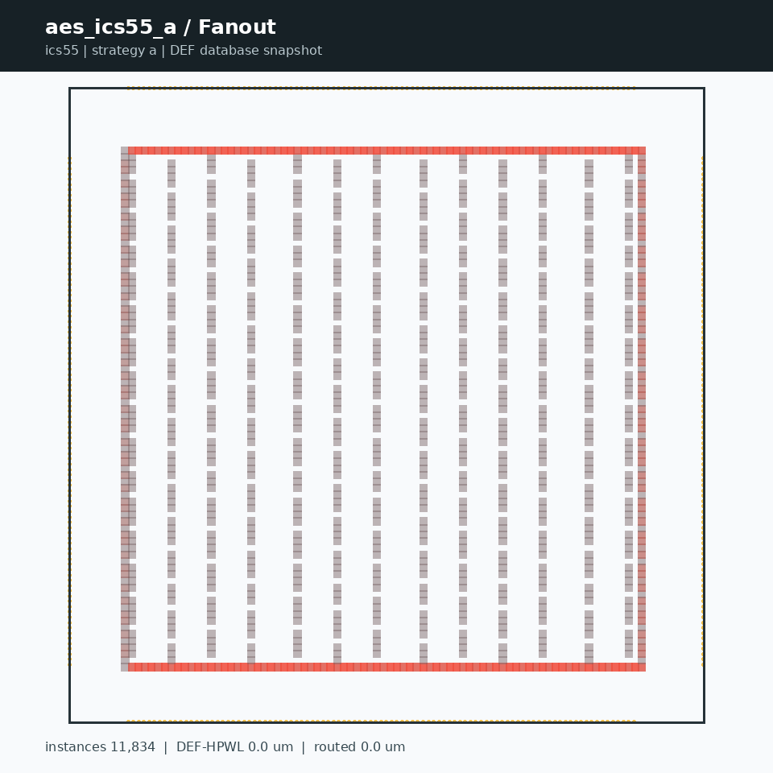</a></td><td><b>Placement</b> </td><td><b>CTS</b> </td></tr>
<tr><td><b>Legalization</b> <a href="../reports/aes12_65pct_qor_wp_rt01b_comparison_assets/aes_ics55_a/legalization.png">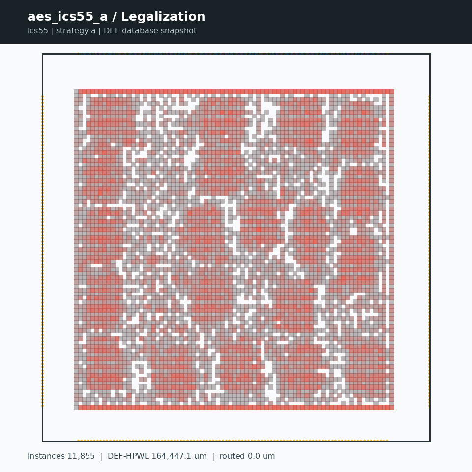</a></td><td><b>Routing</b> <a href="../reports/aes12_65pct_qor_wp_rt01b_comparison_assets/aes_ics55_a/routing.png">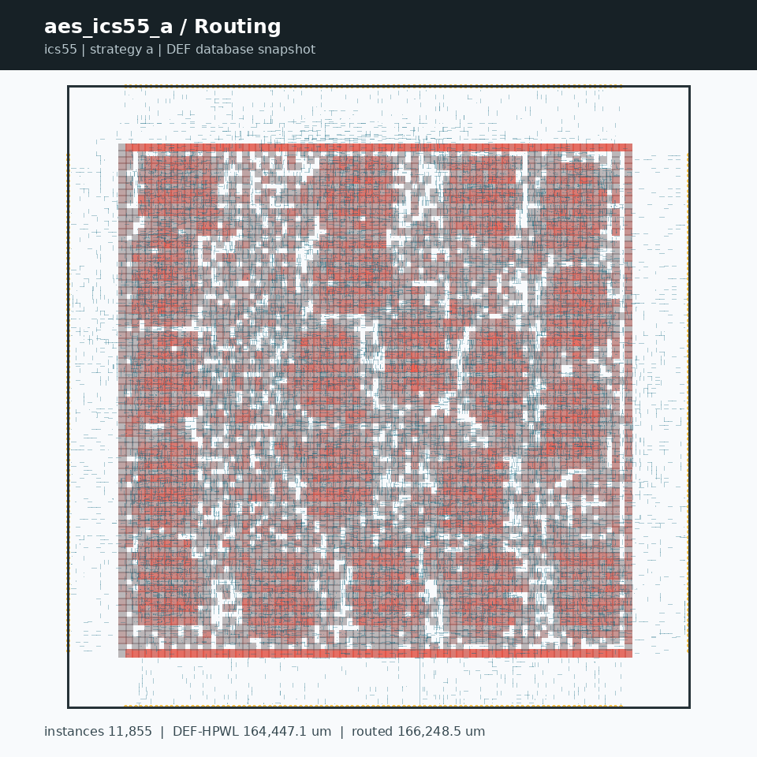</a></td><td><b>Filler</b> <a href="../reports/aes12_65pct_qor_wp_rt01b_comparison_assets/aes_ics55_a/filler.png">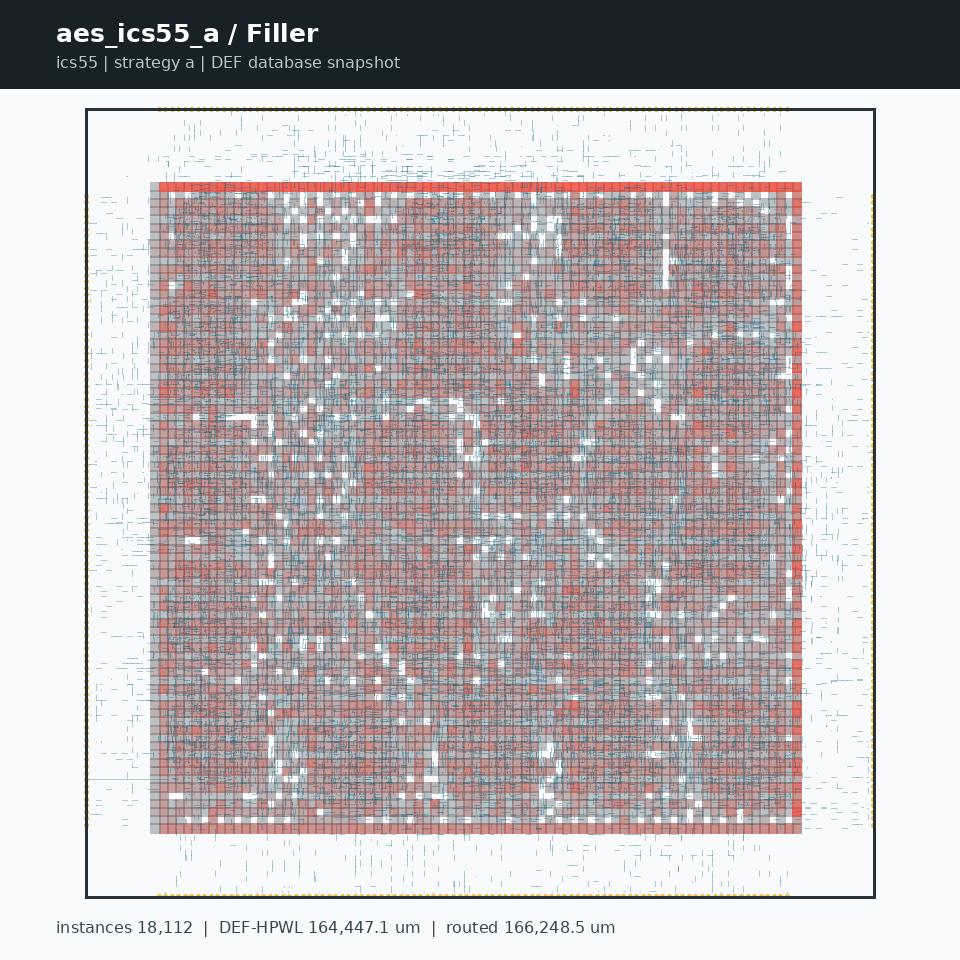</a></td><td><b>Final GDS</b> </td></tr>
</table>
CTS 专项图：[clock tree](../results/aes13_65pct_qor_wp_rt01b_20260731_1520/aes_ics55_a/workspace/result/cts/visualization/svg/cts_design.svg) / [flyline](../results/aes13_65pct_qor_wp_rt01b_20260731_1520/aes_ics55_a/workspace/result/cts/visualization/svg/cts_flyline.svg)

#### 空间 Map 证据

共发现 `37` 个原始 map 文件，渲染 `16` 张代表图。同类图使用跨 13 个设计的统一色标；DRC 使用统一对数色标。全零图保留并明确标注。

<table>
<tr><td><b>Std-cell density</b> <a href="../reports/aes12_65pct_qor_wp_rt01b_comparison_assets/aes_ics55_a/maps/stdcell_density.png">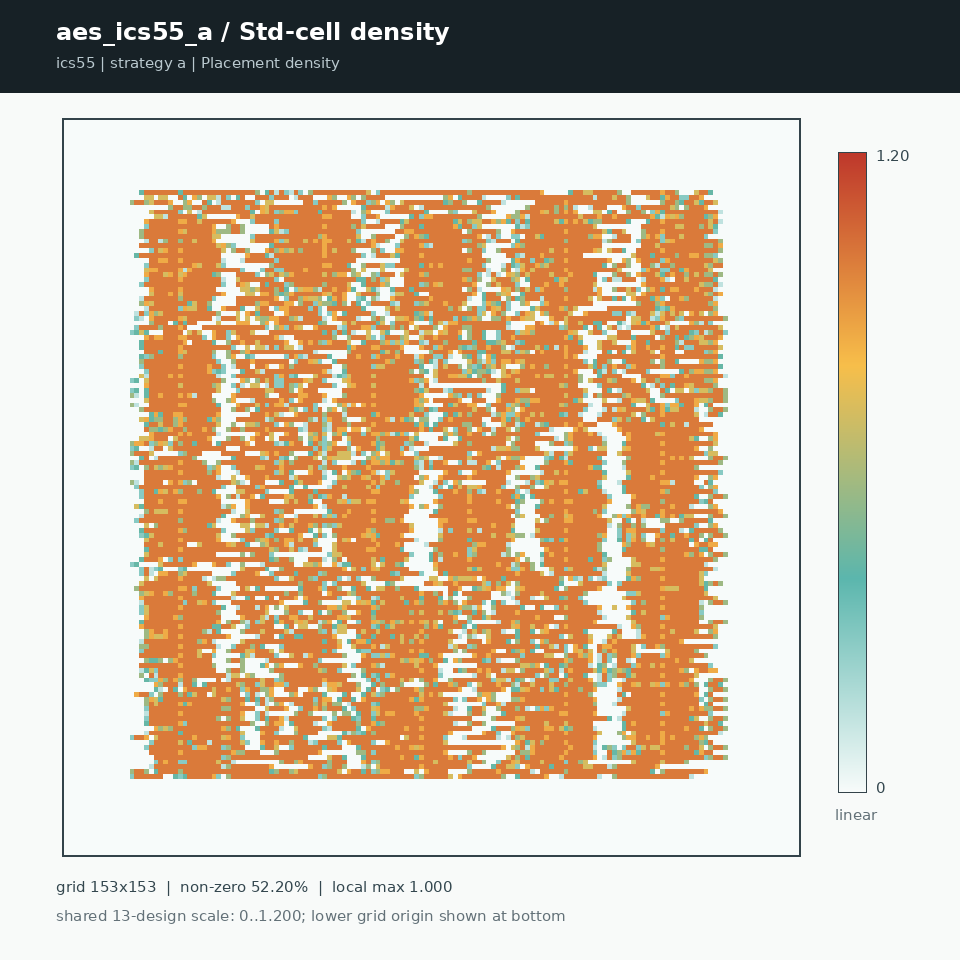</a> <small>non-zero 52.20%; max 1.000; <a href="../results/aes13_65pct_qor_wp_rt01b_20260731_1520/aes_ics55_a/workspace/result/density_map/place_stdcell_density.csv">raw</a></small></td><td><b>Macro density</b>  <small>non-zero 0.00%; max 0.000; <a href="../results/aes13_65pct_qor_wp_rt01b_20260731_1520/aes_ics55_a/workspace/result/density_map/place_macro_density.csv">raw</a></small></td><td><b>All-cell density</b> <a href="../reports/aes12_65pct_qor_wp_rt01b_comparison_assets/aes_ics55_a/maps/allcell_density.png">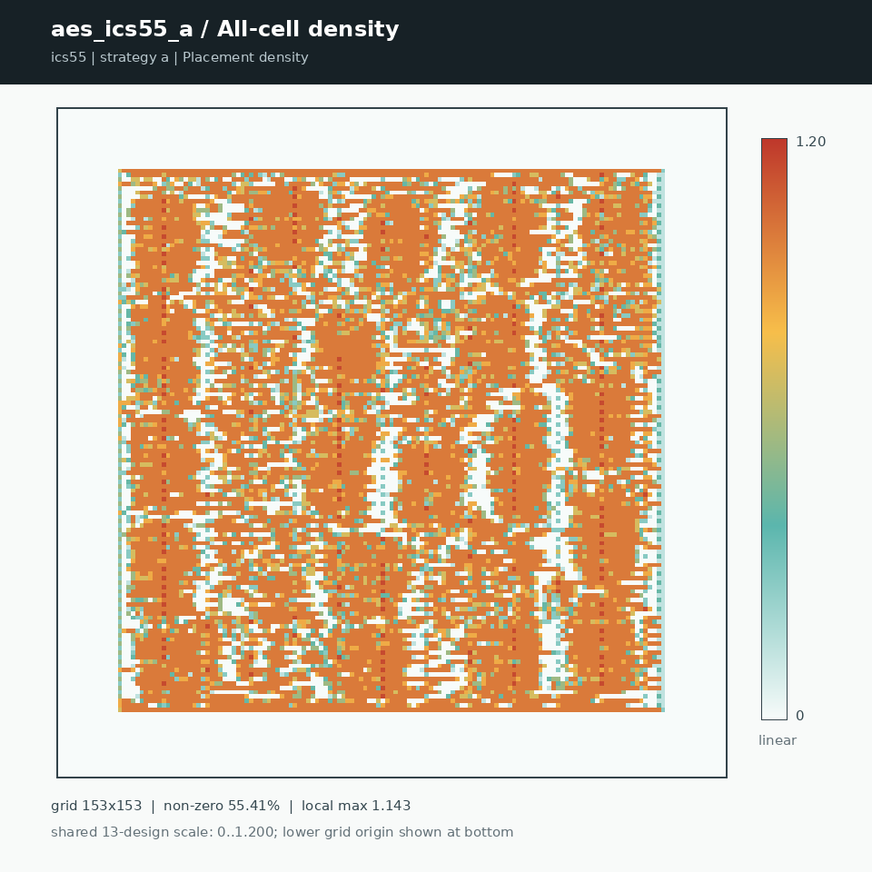</a> <small>non-zero 55.41%; max 1.143; <a href="../results/aes13_65pct_qor_wp_rt01b_20260731_1520/aes_ics55_a/workspace/result/density_map/place_allcell_density.csv">raw</a></small></td><td><b>Std-cell pin density</b> <a href="../reports/aes12_65pct_qor_wp_rt01b_comparison_assets/aes_ics55_a/maps/stdcell_pin_density.png">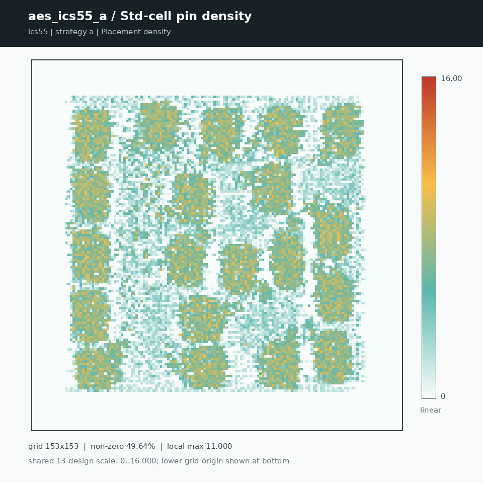</a> <small>non-zero 49.64%; max 11.000; <a href="../results/aes13_65pct_qor_wp_rt01b_20260731_1520/aes_ics55_a/workspace/result/density_map/place_stdcell_pin_density.csv">raw</a></small></td></tr>
<tr><td><b>Macro pin density</b> <a href="../reports/aes12_65pct_qor_wp_rt01b_comparison_assets/aes_ics55_a/maps/macro_pin_density.png">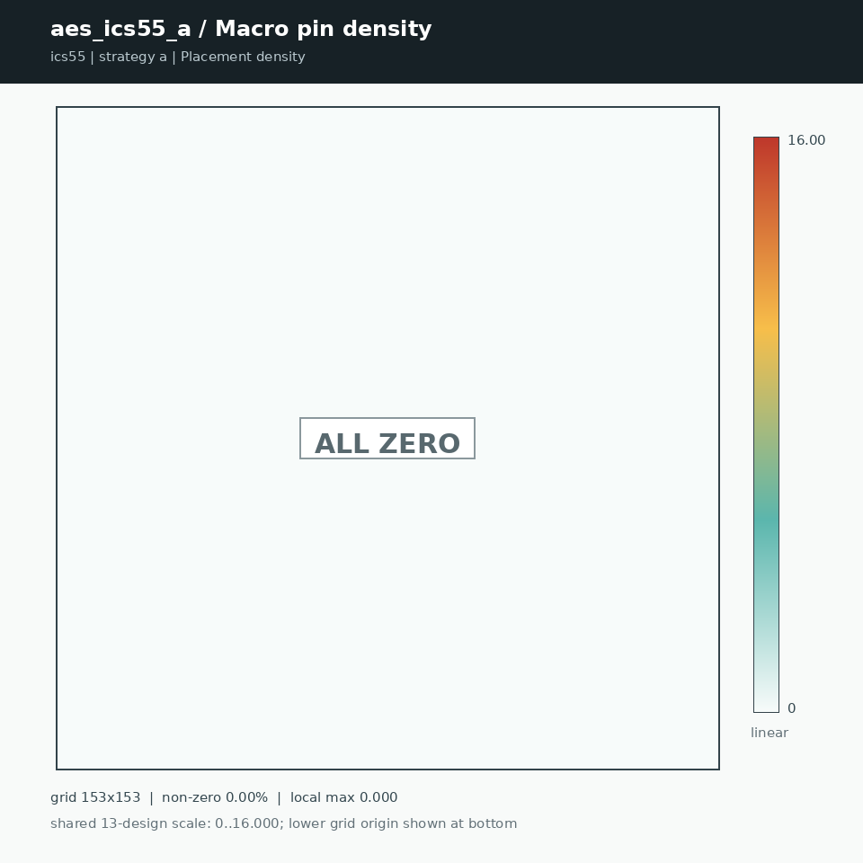</a> <small>non-zero 0.00%; max 0.000; <a href="../results/aes13_65pct_qor_wp_rt01b_20260731_1520/aes_ics55_a/workspace/result/density_map/place_macro_pin_density.csv">raw</a></small></td><td><b>All-cell pin density</b>  <small>non-zero 52.67%; max 11.000; <a href="../results/aes13_65pct_qor_wp_rt01b_20260731_1520/aes_ics55_a/workspace/result/density_map/place_allcell_pin_density.csv">raw</a></small></td><td><b>Local-net density</b>  <small>non-zero 1.88%; max 1.000; <a href="../results/aes13_65pct_qor_wp_rt01b_20260731_1520/aes_ics55_a/workspace/result/density_map/place_local_net_density.csv">raw</a></small></td><td><b>Global-net density</b> <a href="../reports/aes12_65pct_qor_wp_rt01b_comparison_assets/aes_ics55_a/maps/global_net_density.png">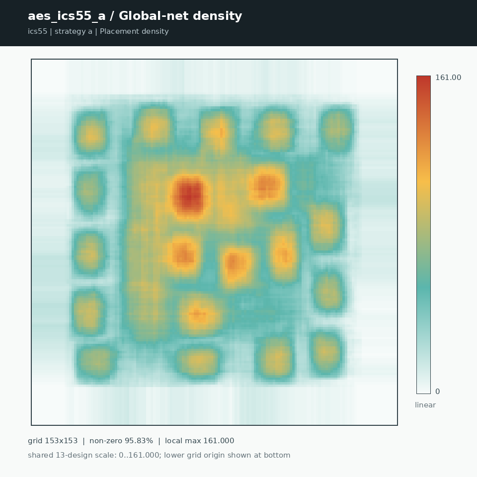</a> <small>non-zero 95.83%; max 161.000; <a href="../results/aes13_65pct_qor_wp_rt01b_20260731_1520/aes_ics55_a/workspace/result/density_map/place_global_net_density.csv">raw</a></small></td></tr>
<tr><td><b>All-net density</b> <a href="../reports/aes12_65pct_qor_wp_rt01b_comparison_assets/aes_ics55_a/maps/allnet_density.png">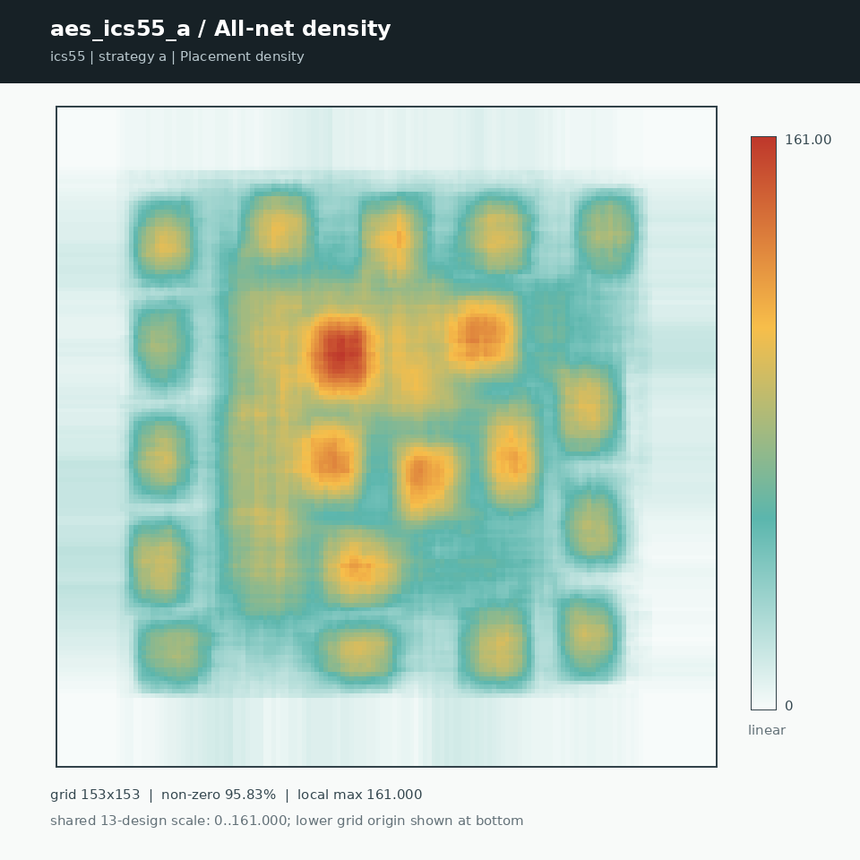</a> <small>non-zero 95.83%; max 161.000; <a href="../results/aes13_65pct_qor_wp_rt01b_20260731_1520/aes_ics55_a/workspace/result/density_map/place_allnet_density.csv">raw</a></small></td><td><b>EGR horizontal overflow</b> <a href="../reports/aes12_65pct_qor_wp_rt01b_comparison_assets/aes_ics55_a/maps/egr_horizontal_overflow.png">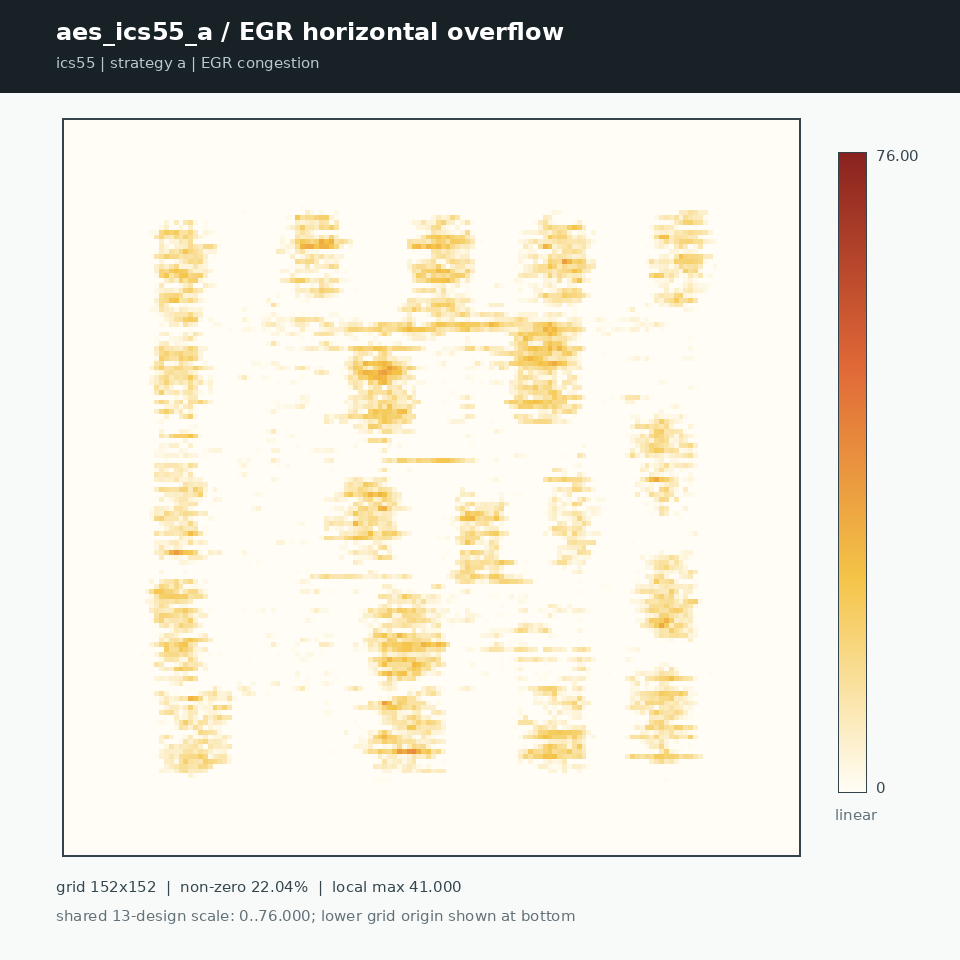</a> <small>non-zero 22.04%; max 41.000; <a href="../results/aes13_65pct_qor_wp_rt01b_20260731_1520/aes_ics55_a/workspace/result/egr_congestion_map/place_egr_horizontal_overflow.csv">raw</a></small></td><td><b>EGR vertical overflow</b> <a href="../reports/aes12_65pct_qor_wp_rt01b_comparison_assets/aes_ics55_a/maps/egr_vertical_overflow.png">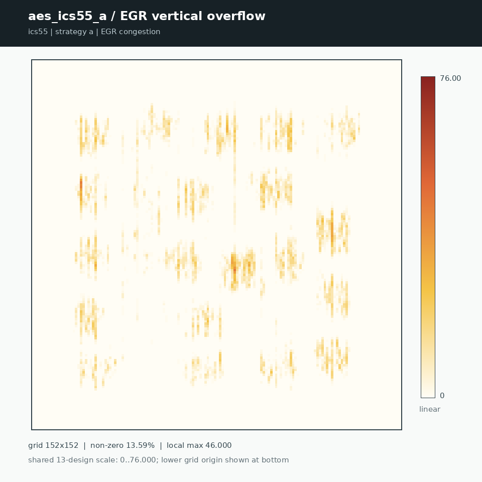</a> <small>non-zero 13.59%; max 46.000; <a href="../results/aes13_65pct_qor_wp_rt01b_20260731_1520/aes_ics55_a/workspace/result/egr_congestion_map/place_egr_vertical_overflow.csv">raw</a></small></td><td><b>EGR union overflow</b>  <small>non-zero 25.69%; max 61.000; <a href="../results/aes13_65pct_qor_wp_rt01b_20260731_1520/aes_ics55_a/workspace/result/egr_congestion_map/place_egr_union_overflow.csv">raw</a></small></td></tr>
<tr><td><b>Planar routing demand</b> <a href="../reports/aes12_65pct_qor_wp_rt01b_comparison_assets/aes_ics55_a/maps/early_net_planar.png">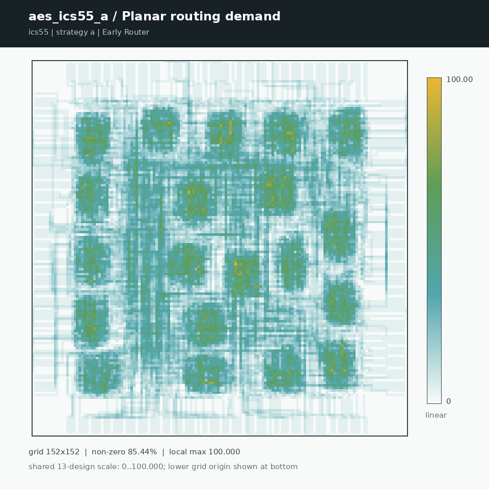</a> <small>non-zero 85.44%; max 100.000; <a href="../results/aes13_65pct_qor_wp_rt01b_20260731_1520/aes_ics55_a/workspace/result/rt/rt_temp_directory/early_router/net_map_planar.csv">raw</a></small></td><td><b>Planar routing supply</b>  <small>non-zero 100.00%; max 86.000; <a href="../results/aes13_65pct_qor_wp_rt01b_20260731_1520/aes_ics55_a/workspace/result/rt/rt_temp_directory/early_router/supply_map_planar.csv">raw</a></small></td><td><b>Planar routing overflow</b> <a href="../reports/aes12_65pct_qor_wp_rt01b_comparison_assets/aes_ics55_a/maps/early_overflow_planar.png">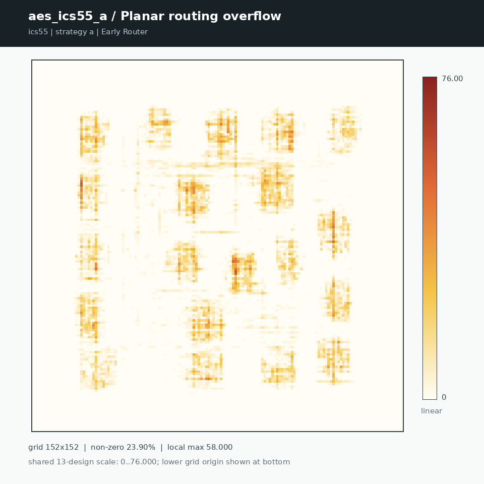</a> <small>non-zero 23.90%; max 58.000; <a href="../results/aes13_65pct_qor_wp_rt01b_20260731_1520/aes_ics55_a/workspace/result/rt/rt_temp_directory/early_router/overflow_map_planar.csv">raw</a></small></td><td><b>DRC violation-center density</b>  <small>non-zero 36.39%; max 13.000; <a href="../results/aes13_65pct_qor_wp_rt01b_20260731_1520/aes_ics55_a/workspace/drc_temp_directory/violation_map.json">raw</a></small></td></tr>
</table>

完整原始 map 文件索引

- **Placement density CSV (9)**：[place_allcell_density.csv](../results/aes13_65pct_qor_wp_rt01b_20260731_1520/aes_ics55_a/workspace/result/density_map/place_allcell_density.csv), [place_allcell_pin_density.csv](../results/aes13_65pct_qor_wp_rt01b_20260731_1520/aes_ics55_a/workspace/result/density_map/place_allcell_pin_density.csv), [place_allnet_density.csv](../results/aes13_65pct_qor_wp_rt01b_20260731_1520/aes_ics55_a/workspace/result/density_map/place_allnet_density.csv), [place_global_net_density.csv](../results/aes13_65pct_qor_wp_rt01b_20260731_1520/aes_ics55_a/workspace/result/density_map/place_global_net_density.csv), [place_local_net_density.csv](../results/aes13_65pct_qor_wp_rt01b_20260731_1520/aes_ics55_a/workspace/result/density_map/place_local_net_density.csv), [place_macro_density.csv](../results/aes13_65pct_qor_wp_rt01b_20260731_1520/aes_ics55_a/workspace/result/density_map/place_macro_density.csv), [place_macro_pin_density.csv](../results/aes13_65pct_qor_wp_rt01b_20260731_1520/aes_ics55_a/workspace/result/density_map/place_macro_pin_density.csv), [place_stdcell_density.csv](../results/aes13_65pct_qor_wp_rt01b_20260731_1520/aes_ics55_a/workspace/result/density_map/place_stdcell_density.csv), [place_stdcell_pin_density.csv](../results/aes13_65pct_qor_wp_rt01b_20260731_1520/aes_ics55_a/workspace/result/density_map/place_stdcell_pin_density.csv)
- **EGR congestion CSV (3)**：[place_egr_horizontal_overflow.csv](../results/aes13_65pct_qor_wp_rt01b_20260731_1520/aes_ics55_a/workspace/result/egr_congestion_map/place_egr_horizontal_overflow.csv), [place_egr_union_overflow.csv](../results/aes13_65pct_qor_wp_rt01b_20260731_1520/aes_ics55_a/workspace/result/egr_congestion_map/place_egr_union_overflow.csv), [place_egr_vertical_overflow.csv](../results/aes13_65pct_qor_wp_rt01b_20260731_1520/aes_ics55_a/workspace/result/egr_congestion_map/place_egr_vertical_overflow.csv)
- **Early-router layer CSV (24)**：[net_map_MET1.csv](../results/aes13_65pct_qor_wp_rt01b_20260731_1520/aes_ics55_a/workspace/result/rt/rt_temp_directory/early_router/net_map_MET1.csv), [net_map_MET2.csv](../results/aes13_65pct_qor_wp_rt01b_20260731_1520/aes_ics55_a/workspace/result/rt/rt_temp_directory/early_router/net_map_MET2.csv), [net_map_MET3.csv](../results/aes13_65pct_qor_wp_rt01b_20260731_1520/aes_ics55_a/workspace/result/rt/rt_temp_directory/early_router/net_map_MET3.csv), [net_map_MET4.csv](../results/aes13_65pct_qor_wp_rt01b_20260731_1520/aes_ics55_a/workspace/result/rt/rt_temp_directory/early_router/net_map_MET4.csv), [net_map_MET5.csv](../results/aes13_65pct_qor_wp_rt01b_20260731_1520/aes_ics55_a/workspace/result/rt/rt_temp_directory/early_router/net_map_MET5.csv), [net_map_RDL.csv](../results/aes13_65pct_qor_wp_rt01b_20260731_1520/aes_ics55_a/workspace/result/rt/rt_temp_directory/early_router/net_map_RDL.csv), [net_map_T4M2.csv](../results/aes13_65pct_qor_wp_rt01b_20260731_1520/aes_ics55_a/workspace/result/rt/rt_temp_directory/early_router/net_map_T4M2.csv), [net_map_planar.csv](../results/aes13_65pct_qor_wp_rt01b_20260731_1520/aes_ics55_a/workspace/result/rt/rt_temp_directory/early_router/net_map_planar.csv), [overflow_map_MET1.csv](../results/aes13_65pct_qor_wp_rt01b_20260731_1520/aes_ics55_a/workspace/result/rt/rt_temp_directory/early_router/overflow_map_MET1.csv), [overflow_map_MET2.csv](../results/aes13_65pct_qor_wp_rt01b_20260731_1520/aes_ics55_a/workspace/result/rt/rt_temp_directory/early_router/overflow_map_MET2.csv), [overflow_map_MET3.csv](../results/aes13_65pct_qor_wp_rt01b_20260731_1520/aes_ics55_a/workspace/result/rt/rt_temp_directory/early_router/overflow_map_MET3.csv), [overflow_map_MET4.csv](../results/aes13_65pct_qor_wp_rt01b_20260731_1520/aes_ics55_a/workspace/result/rt/rt_temp_directory/early_router/overflow_map_MET4.csv), [overflow_map_MET5.csv](../results/aes13_65pct_qor_wp_rt01b_20260731_1520/aes_ics55_a/workspace/result/rt/rt_temp_directory/early_router/overflow_map_MET5.csv), [overflow_map_RDL.csv](../results/aes13_65pct_qor_wp_rt01b_20260731_1520/aes_ics55_a/workspace/result/rt/rt_temp_directory/early_router/overflow_map_RDL.csv), [overflow_map_T4M2.csv](../results/aes13_65pct_qor_wp_rt01b_20260731_1520/aes_ics55_a/workspace/result/rt/rt_temp_directory/early_router/overflow_map_T4M2.csv), [overflow_map_planar.csv](../results/aes13_65pct_qor_wp_rt01b_20260731_1520/aes_ics55_a/workspace/result/rt/rt_temp_directory/early_router/overflow_map_planar.csv), [supply_map_MET1.csv](../results/aes13_65pct_qor_wp_rt01b_20260731_1520/aes_ics55_a/workspace/result/rt/rt_temp_directory/early_router/supply_map_MET1.csv), [supply_map_MET2.csv](../results/aes13_65pct_qor_wp_rt01b_20260731_1520/aes_ics55_a/workspace/result/rt/rt_temp_directory/early_router/supply_map_MET2.csv), [supply_map_MET3.csv](../results/aes13_65pct_qor_wp_rt01b_20260731_1520/aes_ics55_a/workspace/result/rt/rt_temp_directory/early_router/supply_map_MET3.csv), [supply_map_MET4.csv](../results/aes13_65pct_qor_wp_rt01b_20260731_1520/aes_ics55_a/workspace/result/rt/rt_temp_directory/early_router/supply_map_MET4.csv), [supply_map_MET5.csv](../results/aes13_65pct_qor_wp_rt01b_20260731_1520/aes_ics55_a/workspace/result/rt/rt_temp_directory/early_router/supply_map_MET5.csv), [supply_map_RDL.csv](../results/aes13_65pct_qor_wp_rt01b_20260731_1520/aes_ics55_a/workspace/result/rt/rt_temp_directory/early_router/supply_map_RDL.csv), [supply_map_T4M2.csv](../results/aes13_65pct_qor_wp_rt01b_20260731_1520/aes_ics55_a/workspace/result/rt/rt_temp_directory/early_router/supply_map_T4M2.csv), [supply_map_planar.csv](../results/aes13_65pct_qor_wp_rt01b_20260731_1520/aes_ics55_a/workspace/result/rt/rt_temp_directory/early_router/supply_map_planar.csv)
- **DRC violation JSON (1)**：[violation_map.json](../results/aes13_65pct_qor_wp_rt01b_20260731_1520/aes_ics55_a/workspace/drc_temp_directory/violation_map.json)

### aes_ics55_b (ics55 / b)

| Stage | Runtime (s) | Memory (MB) | Instances | Timing inst. | Core util. | DEF HPWL (um) | Routed (um) | Setup WNS (ns) | Power (mW) | Congestion | DRC | IR-drop |
|---|---:|---:|---:|---:|---:|---:|---:|---:|---:|---|---:|---|
| Floorplan | 0.21 | 0.0 | 11,419 | 0 | 65.0% | 0.0 | 0.0 | N/A | N/A | N/A | N/A | N/A |
| Fanout | 5.87 | 4,473.9 | 11,834 | 415 | 68.9% | 0.0 | 0.0 | N/A | N/A | N/A | N/A | N/A |
| Placement | 8.00 | N/A | 11,834 | N/A | N/A | 162,780.5 | 0.0 | N/A | N/A | N/A | N/A | N/A |
| CTS | 6.48 | 808.1 | 11,855 | 436 | 69.0% | 164,423.9 | 0.0 | N/A | N/A | N/A | N/A | N/A |
| Legalization | 3.63 | N/A | 11,855 | N/A | N/A | 164,447.1 | 0.0 | N/A | N/A | N/A | N/A | N/A |
| Routing | 1,695.70 | 0.0 | 11,855 | 436 | 69.0% | 164,447.1 | 166,248.5 | 0.845 | 190.800 | N/A | 26,899 | N/A |
| Filler | 3.81 | 83.1 | 18,112 | 436 | 97.8% | 164,447.1 | 166,248.5 | N/A | N/A | N/A | N/A | N/A |

Post-route：setup WNS `0.845 ns`，hold WNS `0.130 ns`，功耗 `190.800 mW`，DRC `26,899`。DRC 主项：minimum_area=21,723, metal_short=2,900, parallel_run_length_spacing=2,239。未约束端口 `5`，缺失 input slew pin `426`。

<table>
<tr><td><b>Floorplan</b> <a href="../reports/aes12_65pct_qor_wp_rt01b_comparison_assets/aes_ics55_b/floorplan.png">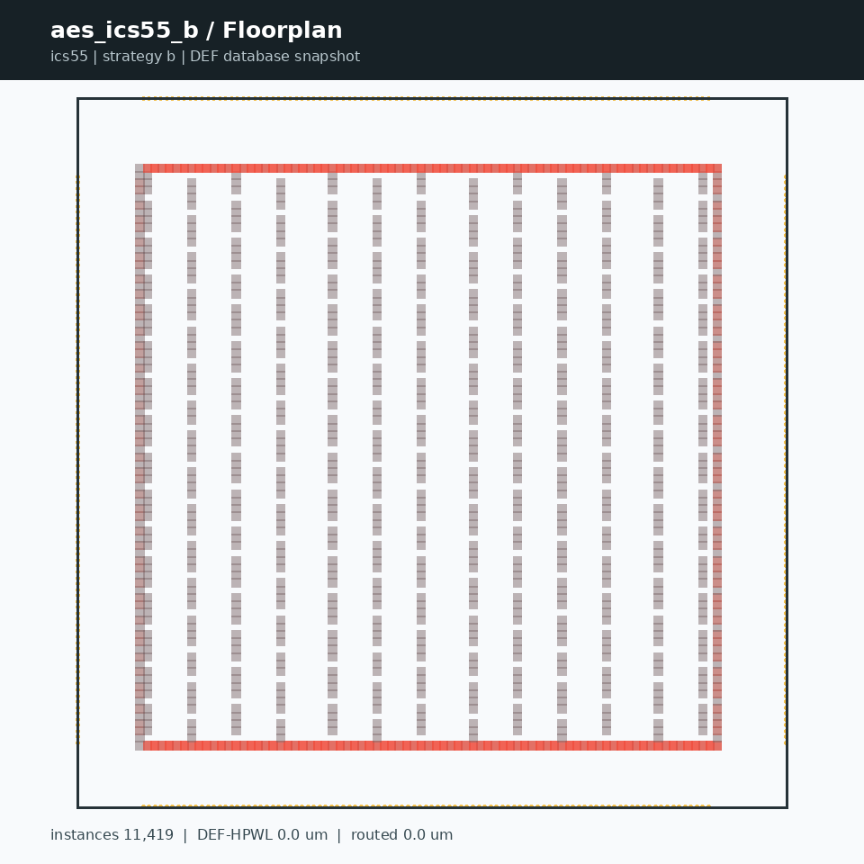</a></td><td><b>Fanout</b> </td><td><b>Placement</b> <a href="../reports/aes12_65pct_qor_wp_rt01b_comparison_assets/aes_ics55_b/placement.png">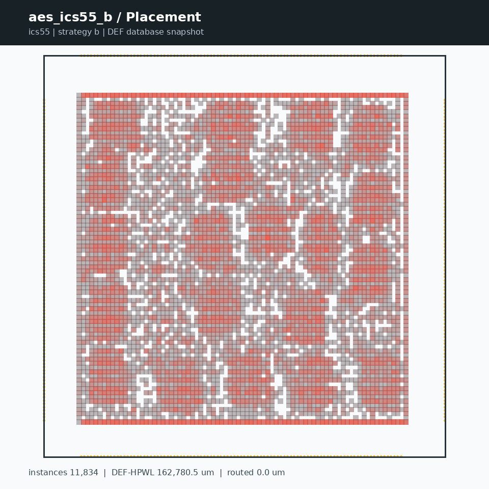</a></td><td><b>CTS</b> </td></tr>
<tr><td><b>Legalization</b> </td><td><b>Routing</b> </td><td><b>Filler</b> </td><td><b>Final GDS</b> </td></tr>
</table>
CTS 专项图：[clock tree](../results/aes13_65pct_qor_wp_rt01b_20260731_1520/aes_ics55_b/workspace/result/cts/visualization/svg/cts_design.svg) / [flyline](../results/aes13_65pct_qor_wp_rt01b_20260731_1520/aes_ics55_b/workspace/result/cts/visualization/svg/cts_flyline.svg)

#### 空间 Map 证据

共发现 `37` 个原始 map 文件，渲染 `16` 张代表图。同类图使用跨 13 个设计的统一色标；DRC 使用统一对数色标。全零图保留并明确标注。

<table>
<tr><td><b>Std-cell density</b>  <small>non-zero 52.20%; max 1.000; <a href="../results/aes13_65pct_qor_wp_rt01b_20260731_1520/aes_ics55_b/workspace/result/density_map/place_stdcell_density.csv">raw</a></small></td><td><b>Macro density</b>  <small>non-zero 0.00%; max 0.000; <a href="../results/aes13_65pct_qor_wp_rt01b_20260731_1520/aes_ics55_b/workspace/result/density_map/place_macro_density.csv">raw</a></small></td><td><b>All-cell density</b>  <small>non-zero 55.41%; max 1.143; <a href="../results/aes13_65pct_qor_wp_rt01b_20260731_1520/aes_ics55_b/workspace/result/density_map/place_allcell_density.csv">raw</a></small></td><td><b>Std-cell pin density</b>  <small>non-zero 49.64%; max 11.000; <a href="../results/aes13_65pct_qor_wp_rt01b_20260731_1520/aes_ics55_b/workspace/result/density_map/place_stdcell_pin_density.csv">raw</a></small></td></tr>
<tr><td><b>Macro pin density</b>  <small>non-zero 0.00%; max 0.000; <a href="../results/aes13_65pct_qor_wp_rt01b_20260731_1520/aes_ics55_b/workspace/result/density_map/place_macro_pin_density.csv">raw</a></small></td><td><b>All-cell pin density</b>  <small>non-zero 52.67%; max 11.000; <a href="../results/aes13_65pct_qor_wp_rt01b_20260731_1520/aes_ics55_b/workspace/result/density_map/place_allcell_pin_density.csv">raw</a></small></td><td><b>Local-net density</b> <a href="../reports/aes12_65pct_qor_wp_rt01b_comparison_assets/aes_ics55_b/maps/local_net_density.png">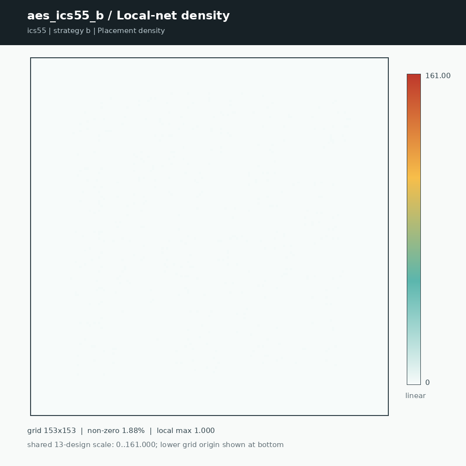</a> <small>non-zero 1.88%; max 1.000; <a href="../results/aes13_65pct_qor_wp_rt01b_20260731_1520/aes_ics55_b/workspace/result/density_map/place_local_net_density.csv">raw</a></small></td><td><b>Global-net density</b>  <small>non-zero 95.83%; max 161.000; <a href="../results/aes13_65pct_qor_wp_rt01b_20260731_1520/aes_ics55_b/workspace/result/density_map/place_global_net_density.csv">raw</a></small></td></tr>
<tr><td><b>All-net density</b>  <small>non-zero 95.83%; max 161.000; <a href="../results/aes13_65pct_qor_wp_rt01b_20260731_1520/aes_ics55_b/workspace/result/density_map/place_allnet_density.csv">raw</a></small></td><td><b>EGR horizontal overflow</b>  <small>non-zero 22.04%; max 41.000; <a href="../results/aes13_65pct_qor_wp_rt01b_20260731_1520/aes_ics55_b/workspace/result/egr_congestion_map/place_egr_horizontal_overflow.csv">raw</a></small></td><td><b>EGR vertical overflow</b>  <small>non-zero 13.59%; max 46.000; <a href="../results/aes13_65pct_qor_wp_rt01b_20260731_1520/aes_ics55_b/workspace/result/egr_congestion_map/place_egr_vertical_overflow.csv">raw</a></small></td><td><b>EGR union overflow</b>  <small>non-zero 25.69%; max 61.000; <a href="../results/aes13_65pct_qor_wp_rt01b_20260731_1520/aes_ics55_b/workspace/result/egr_congestion_map/place_egr_union_overflow.csv">raw</a></small></td></tr>
<tr><td><b>Planar routing demand</b>  <small>non-zero 85.44%; max 100.000; <a href="../results/aes13_65pct_qor_wp_rt01b_20260731_1520/aes_ics55_b/workspace/result/rt/rt_temp_directory/early_router/net_map_planar.csv">raw</a></small></td><td><b>Planar routing supply</b>  <small>non-zero 100.00%; max 86.000; <a href="../results/aes13_65pct_qor_wp_rt01b_20260731_1520/aes_ics55_b/workspace/result/rt/rt_temp_directory/early_router/supply_map_planar.csv">raw</a></small></td><td><b>Planar routing overflow</b>  <small>non-zero 23.90%; max 58.000; <a href="../results/aes13_65pct_qor_wp_rt01b_20260731_1520/aes_ics55_b/workspace/result/rt/rt_temp_directory/early_router/overflow_map_planar.csv">raw</a></small></td><td><b>DRC violation-center density</b>  <small>non-zero 36.39%; max 13.000; <a href="../results/aes13_65pct_qor_wp_rt01b_20260731_1520/aes_ics55_b/workspace/drc_temp_directory/violation_map.json">raw</a></small></td></tr>
</table>

完整原始 map 文件索引

- **Placement density CSV (9)**：[place_allcell_density.csv](../results/aes13_65pct_qor_wp_rt01b_20260731_1520/aes_ics55_b/workspace/result/density_map/place_allcell_density.csv), [place_allcell_pin_density.csv](../results/aes13_65pct_qor_wp_rt01b_20260731_1520/aes_ics55_b/workspace/result/density_map/place_allcell_pin_density.csv), [place_allnet_density.csv](../results/aes13_65pct_qor_wp_rt01b_20260731_1520/aes_ics55_b/workspace/result/density_map/place_allnet_density.csv), [place_global_net_density.csv](../results/aes13_65pct_qor_wp_rt01b_20260731_1520/aes_ics55_b/workspace/result/density_map/place_global_net_density.csv), [place_local_net_density.csv](../results/aes13_65pct_qor_wp_rt01b_20260731_1520/aes_ics55_b/workspace/result/density_map/place_local_net_density.csv), [place_macro_density.csv](../results/aes13_65pct_qor_wp_rt01b_20260731_1520/aes_ics55_b/workspace/result/density_map/place_macro_density.csv), [place_macro_pin_density.csv](../results/aes13_65pct_qor_wp_rt01b_20260731_1520/aes_ics55_b/workspace/result/density_map/place_macro_pin_density.csv), [place_stdcell_density.csv](../results/aes13_65pct_qor_wp_rt01b_20260731_1520/aes_ics55_b/workspace/result/density_map/place_stdcell_density.csv), [place_stdcell_pin_density.csv](../results/aes13_65pct_qor_wp_rt01b_20260731_1520/aes_ics55_b/workspace/result/density_map/place_stdcell_pin_density.csv)
- **EGR congestion CSV (3)**：[place_egr_horizontal_overflow.csv](../results/aes13_65pct_qor_wp_rt01b_20260731_1520/aes_ics55_b/workspace/result/egr_congestion_map/place_egr_horizontal_overflow.csv), [place_egr_union_overflow.csv](../results/aes13_65pct_qor_wp_rt01b_20260731_1520/aes_ics55_b/workspace/result/egr_congestion_map/place_egr_union_overflow.csv), [place_egr_vertical_overflow.csv](../results/aes13_65pct_qor_wp_rt01b_20260731_1520/aes_ics55_b/workspace/result/egr_congestion_map/place_egr_vertical_overflow.csv)
- **Early-router layer CSV (24)**：[net_map_MET1.csv](../results/aes13_65pct_qor_wp_rt01b_20260731_1520/aes_ics55_b/workspace/result/rt/rt_temp_directory/early_router/net_map_MET1.csv), [net_map_MET2.csv](../results/aes13_65pct_qor_wp_rt01b_20260731_1520/aes_ics55_b/workspace/result/rt/rt_temp_directory/early_router/net_map_MET2.csv), [net_map_MET3.csv](../results/aes13_65pct_qor_wp_rt01b_20260731_1520/aes_ics55_b/workspace/result/rt/rt_temp_directory/early_router/net_map_MET3.csv), [net_map_MET4.csv](../results/aes13_65pct_qor_wp_rt01b_20260731_1520/aes_ics55_b/workspace/result/rt/rt_temp_directory/early_router/net_map_MET4.csv), [net_map_MET5.csv](../results/aes13_65pct_qor_wp_rt01b_20260731_1520/aes_ics55_b/workspace/result/rt/rt_temp_directory/early_router/net_map_MET5.csv), [net_map_RDL.csv](../results/aes13_65pct_qor_wp_rt01b_20260731_1520/aes_ics55_b/workspace/result/rt/rt_temp_directory/early_router/net_map_RDL.csv), [net_map_T4M2.csv](../results/aes13_65pct_qor_wp_rt01b_20260731_1520/aes_ics55_b/workspace/result/rt/rt_temp_directory/early_router/net_map_T4M2.csv), [net_map_planar.csv](../results/aes13_65pct_qor_wp_rt01b_20260731_1520/aes_ics55_b/workspace/result/rt/rt_temp_directory/early_router/net_map_planar.csv), [overflow_map_MET1.csv](../results/aes13_65pct_qor_wp_rt01b_20260731_1520/aes_ics55_b/workspace/result/rt/rt_temp_directory/early_router/overflow_map_MET1.csv), [overflow_map_MET2.csv](../results/aes13_65pct_qor_wp_rt01b_20260731_1520/aes_ics55_b/workspace/result/rt/rt_temp_directory/early_router/overflow_map_MET2.csv), [overflow_map_MET3.csv](../results/aes13_65pct_qor_wp_rt01b_20260731_1520/aes_ics55_b/workspace/result/rt/rt_temp_directory/early_router/overflow_map_MET3.csv), [overflow_map_MET4.csv](../results/aes13_65pct_qor_wp_rt01b_20260731_1520/aes_ics55_b/workspace/result/rt/rt_temp_directory/early_router/overflow_map_MET4.csv), [overflow_map_MET5.csv](../results/aes13_65pct_qor_wp_rt01b_20260731_1520/aes_ics55_b/workspace/result/rt/rt_temp_directory/early_router/overflow_map_MET5.csv), [overflow_map_RDL.csv](../results/aes13_65pct_qor_wp_rt01b_20260731_1520/aes_ics55_b/workspace/result/rt/rt_temp_directory/early_router/overflow_map_RDL.csv), [overflow_map_T4M2.csv](../results/aes13_65pct_qor_wp_rt01b_20260731_1520/aes_ics55_b/workspace/result/rt/rt_temp_directory/early_router/overflow_map_T4M2.csv), [overflow_map_planar.csv](../results/aes13_65pct_qor_wp_rt01b_20260731_1520/aes_ics55_b/workspace/result/rt/rt_temp_directory/early_router/overflow_map_planar.csv), [supply_map_MET1.csv](../results/aes13_65pct_qor_wp_rt01b_20260731_1520/aes_ics55_b/workspace/result/rt/rt_temp_directory/early_router/supply_map_MET1.csv), [supply_map_MET2.csv](../results/aes13_65pct_qor_wp_rt01b_20260731_1520/aes_ics55_b/workspace/result/rt/rt_temp_directory/early_router/supply_map_MET2.csv), [supply_map_MET3.csv](../results/aes13_65pct_qor_wp_rt01b_20260731_1520/aes_ics55_b/workspace/result/rt/rt_temp_directory/early_router/supply_map_MET3.csv), [supply_map_MET4.csv](../results/aes13_65pct_qor_wp_rt01b_20260731_1520/aes_ics55_b/workspace/result/rt/rt_temp_directory/early_router/supply_map_MET4.csv), [supply_map_MET5.csv](../results/aes13_65pct_qor_wp_rt01b_20260731_1520/aes_ics55_b/workspace/result/rt/rt_temp_directory/early_router/supply_map_MET5.csv), [supply_map_RDL.csv](../results/aes13_65pct_qor_wp_rt01b_20260731_1520/aes_ics55_b/workspace/result/rt/rt_temp_directory/early_router/supply_map_RDL.csv), [supply_map_T4M2.csv](../results/aes13_65pct_qor_wp_rt01b_20260731_1520/aes_ics55_b/workspace/result/rt/rt_temp_directory/early_router/supply_map_T4M2.csv), [supply_map_planar.csv](../results/aes13_65pct_qor_wp_rt01b_20260731_1520/aes_ics55_b/workspace/result/rt/rt_temp_directory/early_router/supply_map_planar.csv)
- **DRC violation JSON (1)**：[violation_map.json](../results/aes13_65pct_qor_wp_rt01b_20260731_1520/aes_ics55_b/workspace/drc_temp_directory/violation_map.json)

### aes_ics55_t (ics55 / t)

| Stage | Runtime (s) | Memory (MB) | Instances | Timing inst. | Core util. | DEF HPWL (um) | Routed (um) | Setup WNS (ns) | Power (mW) | Congestion | DRC | IR-drop |
|---|---:|---:|---:|---:|---:|---:|---:|---:|---:|---|---:|---|
| Floorplan | 0.22 | 0.0 | 11,419 | 0 | 65.0% | 0.0 | 0.0 | N/A | N/A | N/A | N/A | N/A |
| Fanout | 5.84 | 4,473.9 | 11,834 | 415 | 68.9% | 0.0 | 0.0 | N/A | N/A | N/A | N/A | N/A |
| Placement | 7.84 | N/A | 11,834 | N/A | N/A | 162,780.5 | 0.0 | N/A | N/A | N/A | N/A | N/A |
| CTS | 6.46 | 808.1 | 11,855 | 436 | 69.0% | 164,423.9 | 0.0 | N/A | N/A | N/A | N/A | N/A |
| Legalization | 3.67 | N/A | 11,855 | N/A | N/A | 164,447.1 | 0.0 | N/A | N/A | N/A | N/A | N/A |
| Routing | 1,794.25 | 0.0 | 11,855 | 436 | 69.0% | 164,447.1 | 166,248.5 | 0.845 | 190.800 | N/A | 26,899 | N/A |
| Filler | 3.76 | 83.1 | 18,112 | 436 | 97.8% | 164,447.1 | 166,248.5 | N/A | N/A | N/A | N/A | N/A |

Post-route：setup WNS `0.845 ns`，hold WNS `0.130 ns`，功耗 `190.800 mW`，DRC `26,899`。DRC 主项：minimum_area=21,723, metal_short=2,900, parallel_run_length_spacing=2,239。未约束端口 `5`，缺失 input slew pin `426`。

<table>
<tr><td><b>Floorplan</b> <a href="../reports/aes12_65pct_qor_wp_rt01b_comparison_assets/aes_ics55_t/floorplan.png">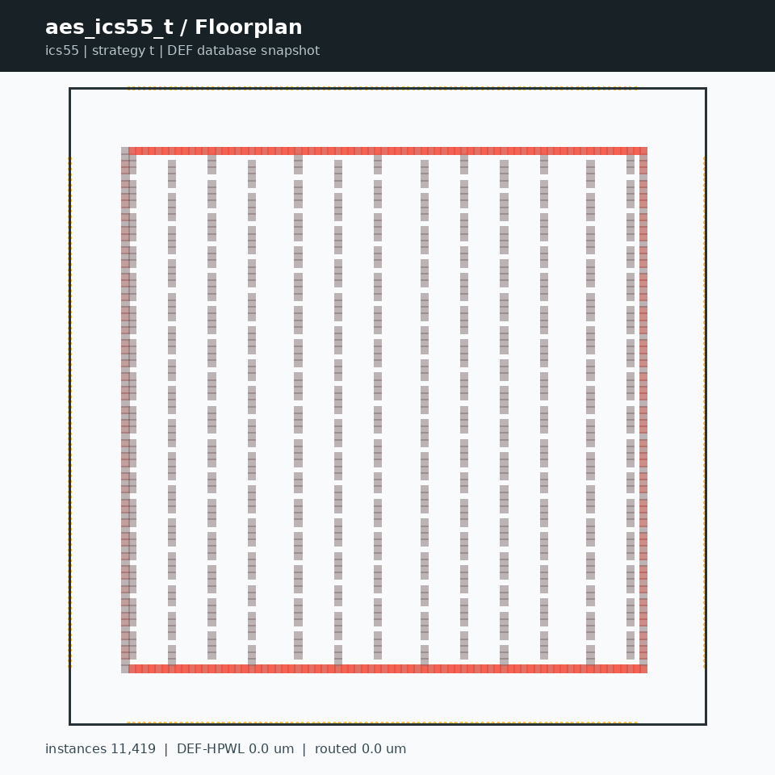</a></td><td><b>Fanout</b> <a href="../reports/aes12_65pct_qor_wp_rt01b_comparison_assets/aes_ics55_t/fanout.png">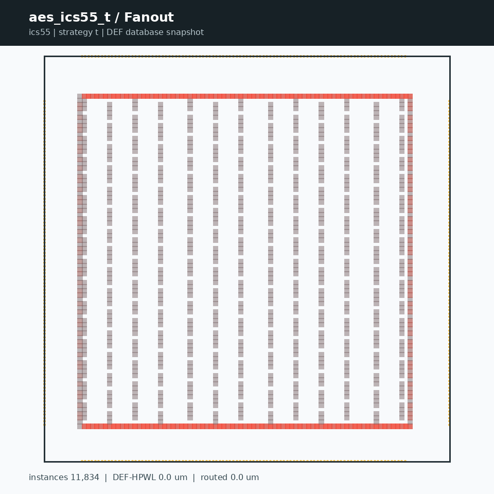</a></td><td><b>Placement</b> </td><td><b>CTS</b> <a href="../reports/aes12_65pct_qor_wp_rt01b_comparison_assets/aes_ics55_t/cts.png">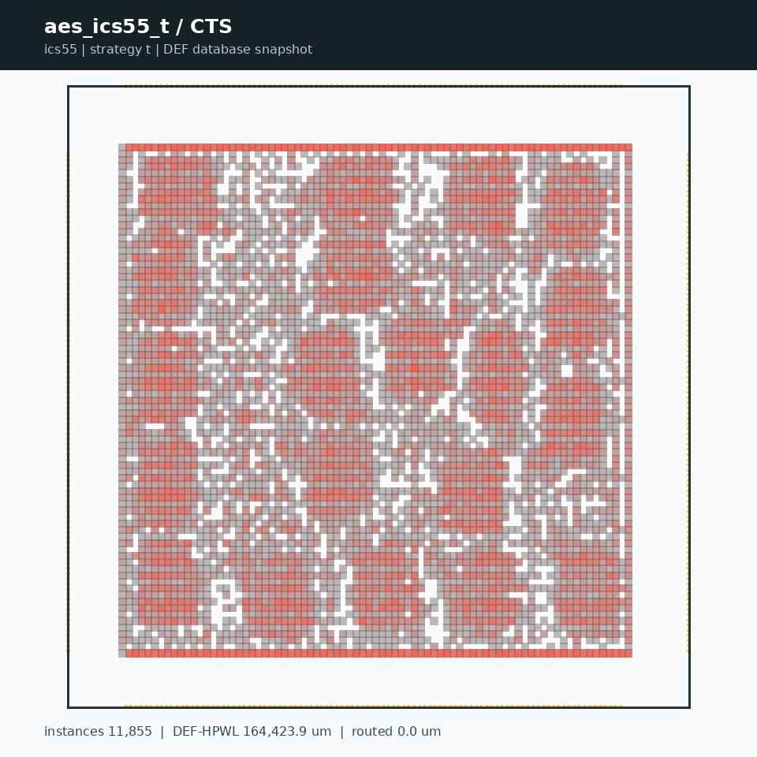</a></td></tr>
<tr><td><b>Legalization</b> </td><td><b>Routing</b> <a href="../reports/aes12_65pct_qor_wp_rt01b_comparison_assets/aes_ics55_t/routing.png">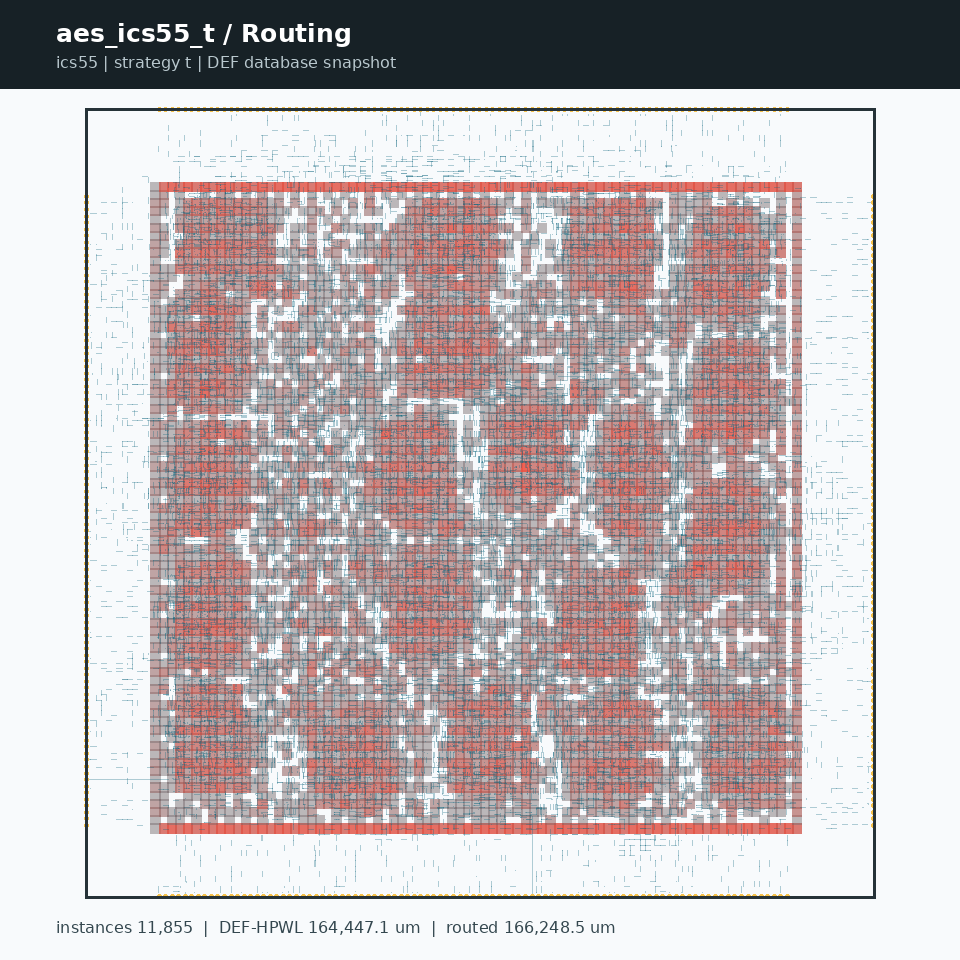</a></td><td><b>Filler</b> <a href="../reports/aes12_65pct_qor_wp_rt01b_comparison_assets/aes_ics55_t/filler.png">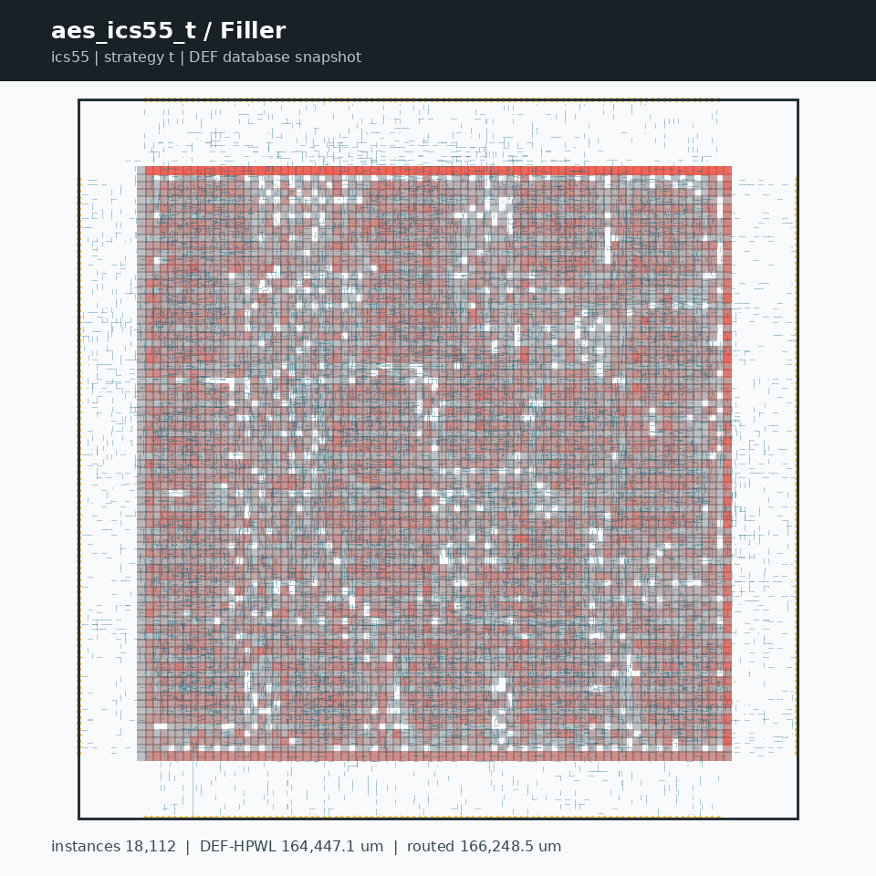</a></td><td><b>Final GDS</b> </td></tr>
</table>
CTS 专项图：[clock tree](../results/aes13_65pct_qor_wp_rt01b_20260731_1520/aes_ics55_t/workspace/result/cts/visualization/svg/cts_design.svg) / [flyline](../results/aes13_65pct_qor_wp_rt01b_20260731_1520/aes_ics55_t/workspace/result/cts/visualization/svg/cts_flyline.svg)

#### 空间 Map 证据

共发现 `37` 个原始 map 文件，渲染 `16` 张代表图。同类图使用跨 13 个设计的统一色标；DRC 使用统一对数色标。全零图保留并明确标注。

<table>
<tr><td><b>Std-cell density</b>  <small>non-zero 52.20%; max 1.000; <a href="../results/aes13_65pct_qor_wp_rt01b_20260731_1520/aes_ics55_t/workspace/result/density_map/place_stdcell_density.csv">raw</a></small></td><td><b>Macro density</b> <a href="../reports/aes12_65pct_qor_wp_rt01b_comparison_assets/aes_ics55_t/maps/macro_density.png">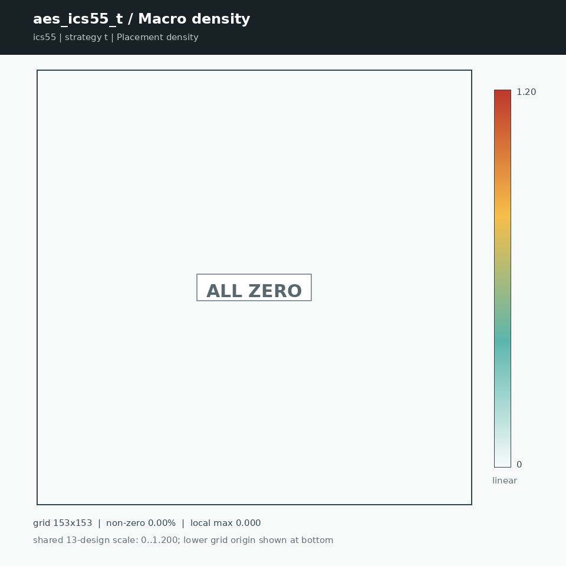</a> <small>non-zero 0.00%; max 0.000; <a href="../results/aes13_65pct_qor_wp_rt01b_20260731_1520/aes_ics55_t/workspace/result/density_map/place_macro_density.csv">raw</a></small></td><td><b>All-cell density</b>  <small>non-zero 55.41%; max 1.143; <a href="../results/aes13_65pct_qor_wp_rt01b_20260731_1520/aes_ics55_t/workspace/result/density_map/place_allcell_density.csv">raw</a></small></td><td><b>Std-cell pin density</b>  <small>non-zero 49.64%; max 11.000; <a href="../results/aes13_65pct_qor_wp_rt01b_20260731_1520/aes_ics55_t/workspace/result/density_map/place_stdcell_pin_density.csv">raw</a></small></td></tr>
<tr><td><b>Macro pin density</b>  <small>non-zero 0.00%; max 0.000; <a href="../results/aes13_65pct_qor_wp_rt01b_20260731_1520/aes_ics55_t/workspace/result/density_map/place_macro_pin_density.csv">raw</a></small></td><td><b>All-cell pin density</b> <a href="../reports/aes12_65pct_qor_wp_rt01b_comparison_assets/aes_ics55_t/maps/allcell_pin_density.png">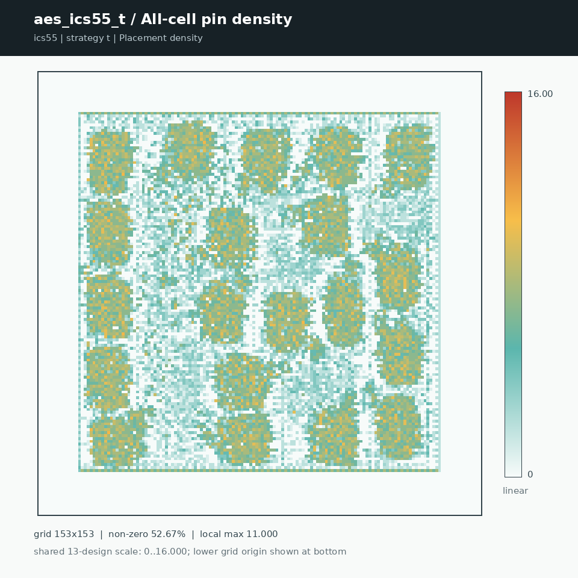</a> <small>non-zero 52.67%; max 11.000; <a href="../results/aes13_65pct_qor_wp_rt01b_20260731_1520/aes_ics55_t/workspace/result/density_map/place_allcell_pin_density.csv">raw</a></small></td><td><b>Local-net density</b>  <small>non-zero 1.88%; max 1.000; <a href="../results/aes13_65pct_qor_wp_rt01b_20260731_1520/aes_ics55_t/workspace/result/density_map/place_local_net_density.csv">raw</a></small></td><td><b>Global-net density</b>  <small>non-zero 95.83%; max 161.000; <a href="../results/aes13_65pct_qor_wp_rt01b_20260731_1520/aes_ics55_t/workspace/result/density_map/place_global_net_density.csv">raw</a></small></td></tr>
<tr><td><b>All-net density</b>  <small>non-zero 95.83%; max 161.000; <a href="../results/aes13_65pct_qor_wp_rt01b_20260731_1520/aes_ics55_t/workspace/result/density_map/place_allnet_density.csv">raw</a></small></td><td><b>EGR horizontal overflow</b> <a href="../reports/aes12_65pct_qor_wp_rt01b_comparison_assets/aes_ics55_t/maps/egr_horizontal_overflow.png">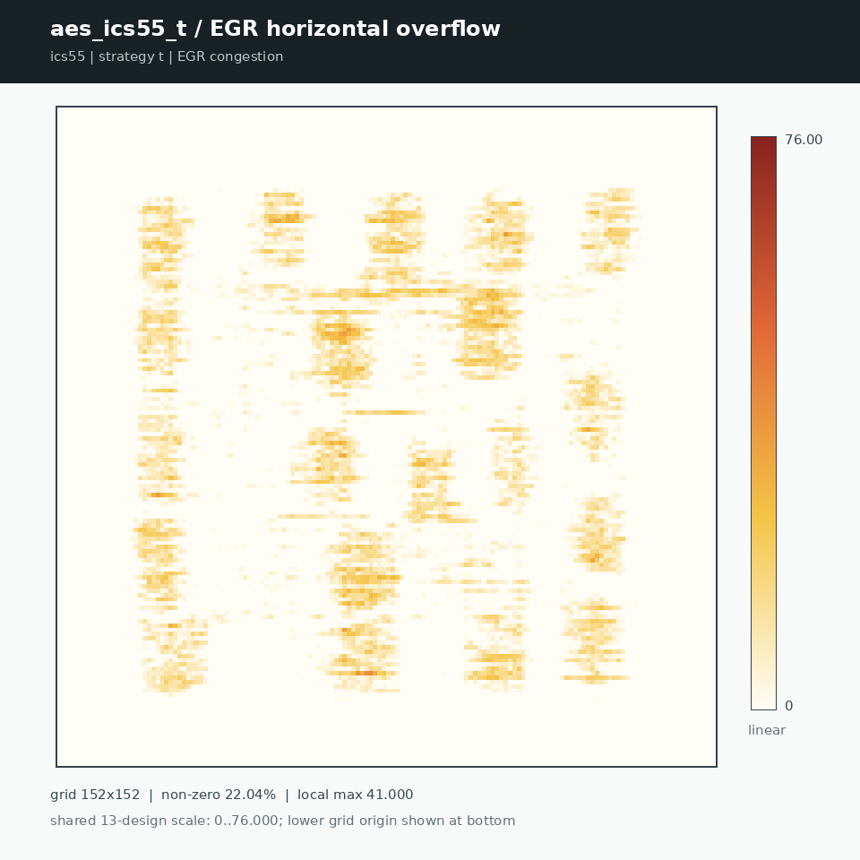</a> <small>non-zero 22.04%; max 41.000; <a href="../results/aes13_65pct_qor_wp_rt01b_20260731_1520/aes_ics55_t/workspace/result/egr_congestion_map/place_egr_horizontal_overflow.csv">raw</a></small></td><td><b>EGR vertical overflow</b>  <small>non-zero 13.59%; max 46.000; <a href="../results/aes13_65pct_qor_wp_rt01b_20260731_1520/aes_ics55_t/workspace/result/egr_congestion_map/place_egr_vertical_overflow.csv">raw</a></small></td><td><b>EGR union overflow</b> <a href="../reports/aes12_65pct_qor_wp_rt01b_comparison_assets/aes_ics55_t/maps/egr_union_overflow.png">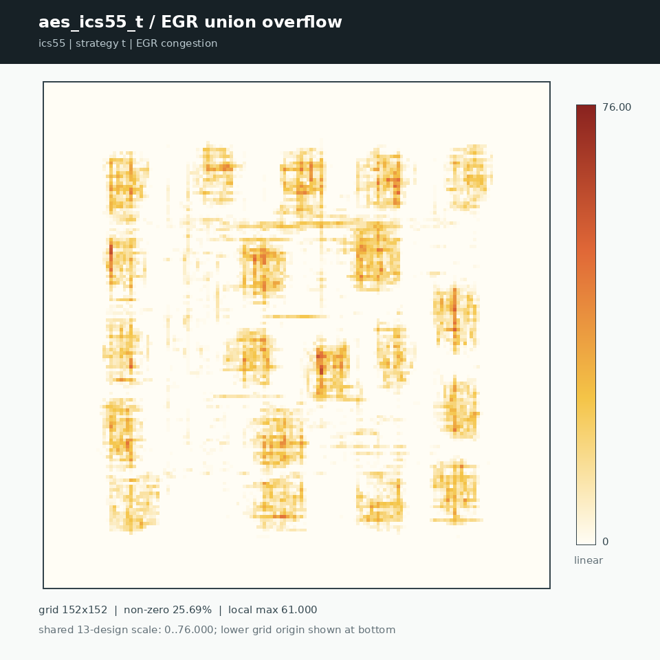</a> <small>non-zero 25.69%; max 61.000; <a href="../results/aes13_65pct_qor_wp_rt01b_20260731_1520/aes_ics55_t/workspace/result/egr_congestion_map/place_egr_union_overflow.csv">raw</a></small></td></tr>
<tr><td><b>Planar routing demand</b>  <small>non-zero 85.44%; max 100.000; <a href="../results/aes13_65pct_qor_wp_rt01b_20260731_1520/aes_ics55_t/workspace/result/rt/rt_temp_directory/early_router/net_map_planar.csv">raw</a></small></td><td><b>Planar routing supply</b> <a href="../reports/aes12_65pct_qor_wp_rt01b_comparison_assets/aes_ics55_t/maps/early_supply_planar.png">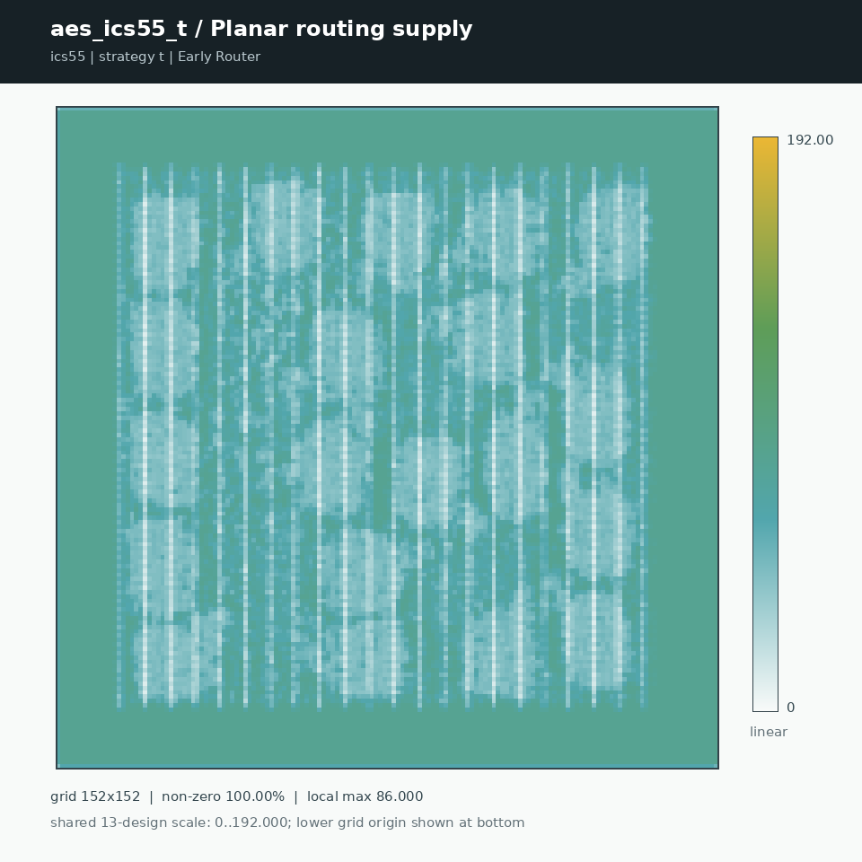</a> <small>non-zero 100.00%; max 86.000; <a href="../results/aes13_65pct_qor_wp_rt01b_20260731_1520/aes_ics55_t/workspace/result/rt/rt_temp_directory/early_router/supply_map_planar.csv">raw</a></small></td><td><b>Planar routing overflow</b>  <small>non-zero 23.90%; max 58.000; <a href="../results/aes13_65pct_qor_wp_rt01b_20260731_1520/aes_ics55_t/workspace/result/rt/rt_temp_directory/early_router/overflow_map_planar.csv">raw</a></small></td><td><b>DRC violation-center density</b> <a href="../reports/aes12_65pct_qor_wp_rt01b_comparison_assets/aes_ics55_t/maps/drc_violation_density.png">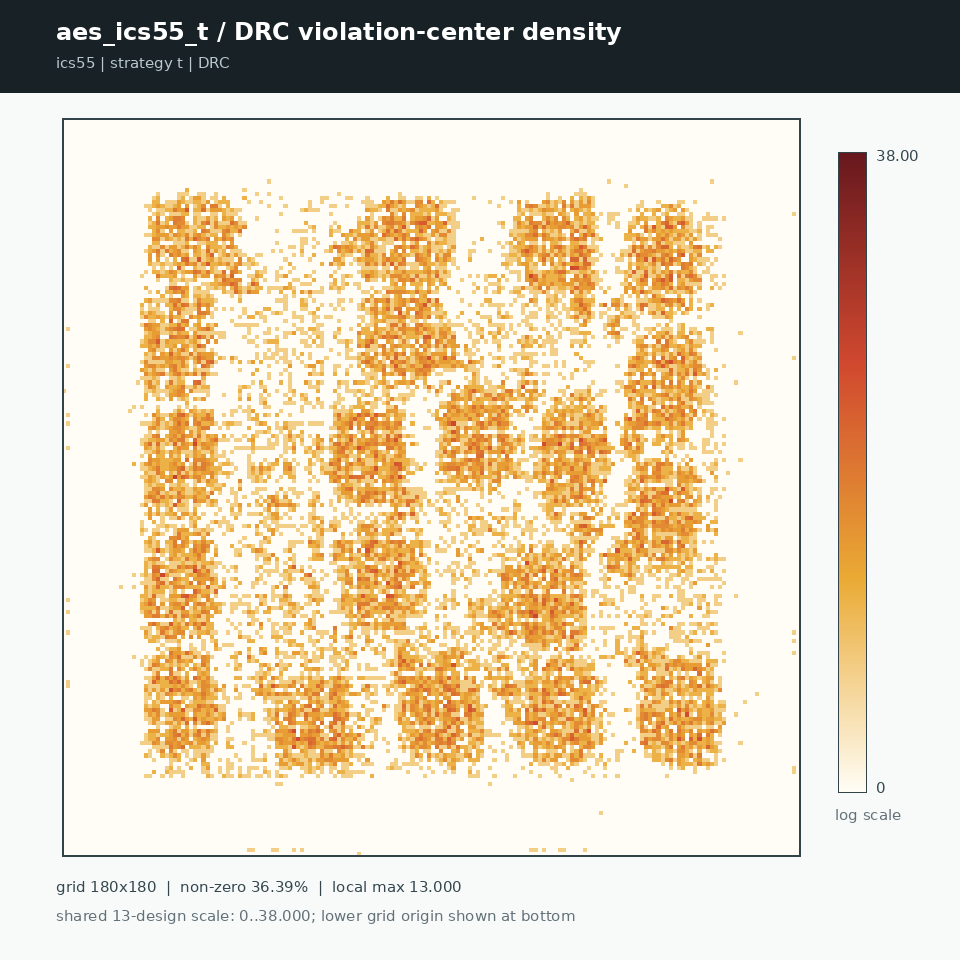</a> <small>non-zero 36.39%; max 13.000; <a href="../results/aes13_65pct_qor_wp_rt01b_20260731_1520/aes_ics55_t/workspace/drc_temp_directory/violation_map.json">raw</a></small></td></tr>
</table>

完整原始 map 文件索引

- **Placement density CSV (9)**：[place_allcell_density.csv](../results/aes13_65pct_qor_wp_rt01b_20260731_1520/aes_ics55_t/workspace/result/density_map/place_allcell_density.csv), [place_allcell_pin_density.csv](../results/aes13_65pct_qor_wp_rt01b_20260731_1520/aes_ics55_t/workspace/result/density_map/place_allcell_pin_density.csv), [place_allnet_density.csv](../results/aes13_65pct_qor_wp_rt01b_20260731_1520/aes_ics55_t/workspace/result/density_map/place_allnet_density.csv), [place_global_net_density.csv](../results/aes13_65pct_qor_wp_rt01b_20260731_1520/aes_ics55_t/workspace/result/density_map/place_global_net_density.csv), [place_local_net_density.csv](../results/aes13_65pct_qor_wp_rt01b_20260731_1520/aes_ics55_t/workspace/result/density_map/place_local_net_density.csv), [place_macro_density.csv](../results/aes13_65pct_qor_wp_rt01b_20260731_1520/aes_ics55_t/workspace/result/density_map/place_macro_density.csv), [place_macro_pin_density.csv](../results/aes13_65pct_qor_wp_rt01b_20260731_1520/aes_ics55_t/workspace/result/density_map/place_macro_pin_density.csv), [place_stdcell_density.csv](../results/aes13_65pct_qor_wp_rt01b_20260731_1520/aes_ics55_t/workspace/result/density_map/place_stdcell_density.csv), [place_stdcell_pin_density.csv](../results/aes13_65pct_qor_wp_rt01b_20260731_1520/aes_ics55_t/workspace/result/density_map/place_stdcell_pin_density.csv)
- **EGR congestion CSV (3)**：[place_egr_horizontal_overflow.csv](../results/aes13_65pct_qor_wp_rt01b_20260731_1520/aes_ics55_t/workspace/result/egr_congestion_map/place_egr_horizontal_overflow.csv), [place_egr_union_overflow.csv](../results/aes13_65pct_qor_wp_rt01b_20260731_1520/aes_ics55_t/workspace/result/egr_congestion_map/place_egr_union_overflow.csv), [place_egr_vertical_overflow.csv](../results/aes13_65pct_qor_wp_rt01b_20260731_1520/aes_ics55_t/workspace/result/egr_congestion_map/place_egr_vertical_overflow.csv)
- **Early-router layer CSV (24)**：[net_map_MET1.csv](../results/aes13_65pct_qor_wp_rt01b_20260731_1520/aes_ics55_t/workspace/result/rt/rt_temp_directory/early_router/net_map_MET1.csv), [net_map_MET2.csv](../results/aes13_65pct_qor_wp_rt01b_20260731_1520/aes_ics55_t/workspace/result/rt/rt_temp_directory/early_router/net_map_MET2.csv), [net_map_MET3.csv](../results/aes13_65pct_qor_wp_rt01b_20260731_1520/aes_ics55_t/workspace/result/rt/rt_temp_directory/early_router/net_map_MET3.csv), [net_map_MET4.csv](../results/aes13_65pct_qor_wp_rt01b_20260731_1520/aes_ics55_t/workspace/result/rt/rt_temp_directory/early_router/net_map_MET4.csv), [net_map_MET5.csv](../results/aes13_65pct_qor_wp_rt01b_20260731_1520/aes_ics55_t/workspace/result/rt/rt_temp_directory/early_router/net_map_MET5.csv), [net_map_RDL.csv](../results/aes13_65pct_qor_wp_rt01b_20260731_1520/aes_ics55_t/workspace/result/rt/rt_temp_directory/early_router/net_map_RDL.csv), [net_map_T4M2.csv](../results/aes13_65pct_qor_wp_rt01b_20260731_1520/aes_ics55_t/workspace/result/rt/rt_temp_directory/early_router/net_map_T4M2.csv), [net_map_planar.csv](../results/aes13_65pct_qor_wp_rt01b_20260731_1520/aes_ics55_t/workspace/result/rt/rt_temp_directory/early_router/net_map_planar.csv), [overflow_map_MET1.csv](../results/aes13_65pct_qor_wp_rt01b_20260731_1520/aes_ics55_t/workspace/result/rt/rt_temp_directory/early_router/overflow_map_MET1.csv), [overflow_map_MET2.csv](../results/aes13_65pct_qor_wp_rt01b_20260731_1520/aes_ics55_t/workspace/result/rt/rt_temp_directory/early_router/overflow_map_MET2.csv), [overflow_map_MET3.csv](../results/aes13_65pct_qor_wp_rt01b_20260731_1520/aes_ics55_t/workspace/result/rt/rt_temp_directory/early_router/overflow_map_MET3.csv), [overflow_map_MET4.csv](../results/aes13_65pct_qor_wp_rt01b_20260731_1520/aes_ics55_t/workspace/result/rt/rt_temp_directory/early_router/overflow_map_MET4.csv), [overflow_map_MET5.csv](../results/aes13_65pct_qor_wp_rt01b_20260731_1520/aes_ics55_t/workspace/result/rt/rt_temp_directory/early_router/overflow_map_MET5.csv), [overflow_map_RDL.csv](../results/aes13_65pct_qor_wp_rt01b_20260731_1520/aes_ics55_t/workspace/result/rt/rt_temp_directory/early_router/overflow_map_RDL.csv), [overflow_map_T4M2.csv](../results/aes13_65pct_qor_wp_rt01b_20260731_1520/aes_ics55_t/workspace/result/rt/rt_temp_directory/early_router/overflow_map_T4M2.csv), [overflow_map_planar.csv](../results/aes13_65pct_qor_wp_rt01b_20260731_1520/aes_ics55_t/workspace/result/rt/rt_temp_directory/early_router/overflow_map_planar.csv), [supply_map_MET1.csv](../results/aes13_65pct_qor_wp_rt01b_20260731_1520/aes_ics55_t/workspace/result/rt/rt_temp_directory/early_router/supply_map_MET1.csv), [supply_map_MET2.csv](../results/aes13_65pct_qor_wp_rt01b_20260731_1520/aes_ics55_t/workspace/result/rt/rt_temp_directory/early_router/supply_map_MET2.csv), [supply_map_MET3.csv](../results/aes13_65pct_qor_wp_rt01b_20260731_1520/aes_ics55_t/workspace/result/rt/rt_temp_directory/early_router/supply_map_MET3.csv), [supply_map_MET4.csv](../results/aes13_65pct_qor_wp_rt01b_20260731_1520/aes_ics55_t/workspace/result/rt/rt_temp_directory/early_router/supply_map_MET4.csv), [supply_map_MET5.csv](../results/aes13_65pct_qor_wp_rt01b_20260731_1520/aes_ics55_t/workspace/result/rt/rt_temp_directory/early_router/supply_map_MET5.csv), [supply_map_RDL.csv](../results/aes13_65pct_qor_wp_rt01b_20260731_1520/aes_ics55_t/workspace/result/rt/rt_temp_directory/early_router/supply_map_RDL.csv), [supply_map_T4M2.csv](../results/aes13_65pct_qor_wp_rt01b_20260731_1520/aes_ics55_t/workspace/result/rt/rt_temp_directory/early_router/supply_map_T4M2.csv), [supply_map_planar.csv](../results/aes13_65pct_qor_wp_rt01b_20260731_1520/aes_ics55_t/workspace/result/rt/rt_temp_directory/early_router/supply_map_planar.csv)
- **DRC violation JSON (1)**：[violation_map.json](../results/aes13_65pct_qor_wp_rt01b_20260731_1520/aes_ics55_t/workspace/drc_temp_directory/violation_map.json)

## 8. iEDA.ai 当前完成质量

| 维度 | 评级 | 证据 | 判断 |
|---|---|---|---|
| 多 PDK 流程贯通 | B | 4 PDK、13/13 GDS | 数据准备、映射、放置、CTS、布线和导出已可重复运行 |
| 布局/CTS 工程完整性 | B- | 每阶段 DEF、CTS 专项图、合法化结果齐全 | 可做算法迭代，但需增加阶段质量门禁 |
| 布线/DRC | D | 0/13 clean，且数量级随 PDK 差异很大 | 目前不具备签核闭环 |
| STA | D+ | WNS/TNS 文件齐全，但 net delay=0、I/O 未全约束 | 只能做早期逻辑/库延迟代理 |
| Power | D | switch power=0、无活动率 | 不可用于动态功耗或 IR 结论 |
| Congestion / maps | C- | 13/13 有密度、EGR、early-router 空间图，但 Average=-1 | 热点可审计，汇总指标与门禁仍不可用 |
| PDN / IR-drop | F | 0/13 数据 | 尚未进入质量闭环 |
| 可观测性/可追溯性 | B- | 日志、阶段图、208 张代表 map 和全部原始 map 索引齐全 | 已能空间审计，尚不能逐阶段自动判退 |

## 9. 后续优化方案

### P0：先修测量可信度（1-2 周）

1. 在 routing 后运行 iRCX/SPEF，强制 post-route STA 读取 SPEF；质量门禁要求关键路径 `net delay > 0`。
2. 完整化 SDC：约束所有输入/输出 delay、clock uncertainty、driving cell/load，逐项清零 unconstrained endpoint；明确 false/multicycle path。
3. 功耗接入 VCD/SAIF 或经过校准的 vectorless activity，门禁要求 `switch_power > 0`，并记录活动率来源。
4. 修复 congestion report 的 `-1` sentinel；将 global-route overflow、top-1%/top-5% utilization 和热点图纳入统一 JSON。
5. 接通 iPNP/iIR：生成真实 PDN、定义电源 bump/pad/source 和电流模型，输出 worst/avg IR、超阈值面积与热图。

### P1：DRC 闭环与路由收敛（2-4 周）

1. 按本报告各 PDK 的 top violation 分类建回归：short、PRL spacing、same-layer cut、min-area/overlap 分别设专项用例。
2. 将 `IEDA_RT_MAX_ITERATIONS=1` 改成可扫参数，至少比较 1/3/5 轮的 DRC、runtime、wirelength；只有 DRC 单调下降才保留更多迭代。
3. 校准 tech LEF 层方向、track pitch/offset、via rule、min-area 和 cut spacing；ASAP7 特别验证当前补写 RC 和 layer range 的一致性。
4. 增加 post-route repair：short/spacing rip-up、min-area patch、via enclosure repair；以“DRC=0 或已签核 waiver”作为 GDS 成功条件，而不是仅检查文件存在。

### P2：PPA 与状态策略优化（4-8 周）

1. 对每个 PDK 做 utilization × padding × congestion-weight 三维小型 DOE；a/b/t 只改变利用率不足以定位根因。
2. CTS 扫 buffer set、cluster size、max fanout/cap；用 insertion delay、skew、clock wirelength、buffer area 和 post-CTS setup/hold 联合评分。
3. 逐阶段保存 STA/power/congestion/HPWL 快照，形成 `floorplan -> placement -> CTS -> route` delta，超过阈值自动回退。
4. 跨 PDK 只比较归一化指标（per-cell、per-mm2、相对各自 target），并固定 RTL、时钟、约束语义和工具版本。

### P3：Agent 化闭环（8 周以后）

1. 将报告 JSON 作为 agent 观测面，动作限定为有边界的参数变更；每次实验记录输入 hash、工具 hash、PPA/DRC/IR delta。
2. 建 Pareto archive，目标至少包含 WNS/TNS、power、area、wirelength、DRC、worst IR 和 runtime，禁止用单一加权分掩盖硬约束失败。
3. 建立工艺专属策略库与跨工艺共享策略，只有通过重复试验和 holdout design 验证的规则才晋升为默认。

## 10. 建议验收门禁

| Gate | 当前 | 下一里程碑 |
|---|---:|---:|
| Flow completion | 13/13 | 保持 13/13 可重复 |
| DRC clean | 0/13 | 每 PDK 至少 1 个 clean，再扩至 13/13 |
| SPEF-backed STA | 0/13 | 13/13，net delay 非零 |
| Fully constrained timing | 0/13 | unconstrained=0 |
| Activity-backed power | 0/13 | 13/13 有来源标签 |
| Valid congestion summary | 0/13 | 无 -1/NaN；与现有 EGR/early-router map 数值一致 |
| IR-drop | 0/13 | 13/13 有 worst/avg/map |
| Spatial maps | 13/13，208 张代表图 | 增加逐阶段 STA/power/congestion delta JSON |

## 11. 产物索引

- 机器可读数据：[`aes12_65pct_qor_wp_rt01b_comparison.json`](aes12_65pct_qor_wp_rt01b_comparison.json)
- 扁平对比数据：[`aes12_65pct_qor_wp_rt01b_comparison.csv`](aes12_65pct_qor_wp_rt01b_comparison.csv)
- 交互式/打印版：[`aes12_65pct_qor_wp_rt01b_comparison.html`](aes12_65pct_qor_wp_rt01b_comparison.html)
- 阶段与 map 图片：[`aes11_assets/`](aes11_assets/)
