# AES 1 项 @ 65% 利用率 iEDA.ai 物理设计详细对比报告

生成时间：2026-08-05T17:48:10+08:00
数据根：`/home/lxq/AiEDA/iEDA.ai/benchmarks/results/aes12_m0_smoke_e1_cap32_20260805`
范围：`aes_ics55_a`。

## 1. 执行结论

- 流程完成度：**1/1** 已生成 post-route DEF、GDS（及阶段报告）；可选功耗阶段在无 VCD 时使用 vectorless toggle。
- **实测 Floorplan CORE Usage**：65.0% – 65.0% （目标 65%；Die/Core 由 `cell_area/target` 严格定边，已去掉旧版 MIN_CORE_SIDE 膨胀）。
- 物理签核质量：**0/1 DRC clean**；违例总数范围 25,952 至 25,952。当前结果是流程贯通样本，不是 tapeout-ready 结果。
- 时序可信度：低。所有抽查路径的 `path net delay` 为 0，且存在未约束 I/O；正 slack 只能说明库内单元延迟下的代理检查通过。
- 功耗可信度：低。vectorless 活动率仅为代理；无 VCD/SAIF 时不能用于动态功耗决策。
- 拥塞可信度：**1/1 summary 有效**；summary 从 EGR/early-router map 归约，旧版 `Average Congestion=-1` sentinel 不再作为本报告口径。
- IR-drop：**0/1 执行**。没有电压降数据，报告显式记为 `N/A`。

> 结论分为“流程工程完成度”和“物理签核完成度”。前者以 DEF/GDS 贯通为准；后者仍受 DRC、寄生、约束和 PDN/IR 缺失限制。

## 2. 数据口径与覆盖

| 指标 | Floorplan | Fanout | Placement | CTS | Legalization | Routing/Post-route | 口径 |
|---|---:|---:|---:|---:|---:|---:|---|
| DEF/结构/利用率 | 实测 | 实测 | 实测 | 实测 | 实测 | 实测 | iDB/DEF |
| 阶段耗时/内存 | 实测 | 实测 | 实测 | 实测 | 实测 | 实测 | stage log / db report |
| HPWL | 推导 | 推导 | 推导 | 推导 | 推导 | 推导 | 单元原点 bbox，适合趋势比较 |
| Routed wirelength | N/A | N/A | N/A | 局部可见 | 局部可见 | 推导+EGR报告 | DEF ROUTED/FIXED 路径 |
| STA | 未运行 | 未运行 | 未运行 | 未运行 | 未运行 | 实测但低置信 | 未回标 SPEF，报告 net delay 为 0 |
| Power | 未运行 | 未运行 | 未运行 | 未运行 | 未运行 | 实测但低置信 | 无 VCD/SAIF，switch power 为 0 |
| Congestion / maps | 未运行 | 未运行 | 9 类密度 CSV | 沿用布局 map | 沿用布局 map | EGR/early-router map 与 summary JSON 可用 | summary 从 map 归约，避免旧版 Average=-1 sentinel |
| DRC | 不适用 | 不适用 | 不适用 | 不适用 | 不适用 | 实测 | iDRC post-route |
| IR-drop | 未运行 | 未运行 | 未运行 | 未运行 | 未运行 | 未运行 | 无 iPNP/iIR 结果，不填 0 |

## 2.1 M0 实验元数据

| 字段 | 值 |
|---|---|
| Manifest | `/home/lxq/AiEDA/iEDA.ai/benchmarks/results/aes12_m0_smoke_e1_cap32_20260805/experiment_manifest.json` |
| Budget profile | `E1_final_minarea` - Run final min-area patch under the E0 best-effort budget. |
| DR/SR budget | DR iter=1, SR iter=1, SR seconds=60, tasks/box=64, final min-area tasks=32, skip final min-area=False |
| Git | branch `commercial-parity`, commit `8cf7f68efd46c65603e2376d8fb9befa244c0e2b`, dirty=True (1385 paths) |
| Flow diff hash | `c77e8a61fd170b74b52e4e855857bb23c85e4a29eb7da4e001c167f8cfaff120` |
| iEDA binary | `/home/lxq/AiEDA/iEDA.ai/bin/iEDA`, sha256 `a0d79c1975011964...` |
| Runtime env | `IEDA_QOR_BUDGET_PROFILE=E1_final_minarea`, `ROUTING_THREADS=pdk_default`, `JOBS=1` |
| Baseline ref | `N/A` (unlabeled) |
| Acceptance | Reject expansion when DRC improvement is <5% and routing runtime growth is >20%. |

`DEF HPWL` 由每个 net 的实例放置原点 bbox 推导，不含 LEF pin offset，适用于同一 PDK/网表的阶段趋势；跨 PDK 只作方向性参考。面积、功耗、DRC 规则集合也不同，跨 PDK 排名不能解释为工艺优劣。

Map 图采用 CSV 原始网格，row 0 按笛卡尔坐标显示在底部。同一 map 类型在 1 个设计间使用统一色标，DRC 违例中心密度使用统一对数色标；因此颜色可横向比较，全零图不会被自动拉伸成伪热点。

## 3. 横向总表

| Design | PDK | 状态 | Die (um) | Cells | Setup WNS (ns) | Fmax (MHz) | Power (mW) | EGR WL (um) | DRC | DRC vs base | Route (s) | Route vs base | Place HPWL vs base | Cong. avg/max | IR-drop |
|---|---|---|---:|---:|---:|---:|---:|---:|---:|---:|---:|---:|---:|---:|---|
| aes_ics55_a | ics55 | success | 213.510 | 9,453 | 0.845 | 604.3 | 190.800 | 191,812.0 | 25,952 | -7.8% | 470.6 | -19.0% | +0.0% | 2.86/61 | 未运行 |

## 4. 关键横向图

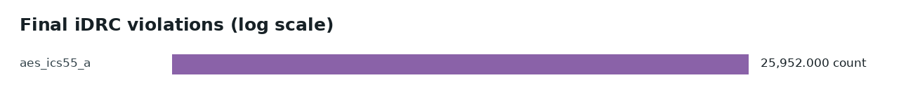

## 4.1 与上一版基线对比

| Design | PDK | DRC old -> new | DRC delta | Route old -> new (s) | Route delta | Place HPWL delta | EGR WL delta |
|---|---|---:|---:|---:|---:|---:|---:|
| aes_ics55_a | ics55 | 28,133 -> 25,952 | -7.8% | 581.0 -> 470.6 | -19.0% | +0.0% | +0.0% |

- DRC：1/1 下降，0/1 上升；说明本轮配置/算法并非没有生效，而是存在 PDK 分化。
- Runtime：1/1 下降；best-effort 和 SR cap 对 get-through 成本有明显作用。
- WNS/Fmax/Power/Die/Cells 大体不变是预期现象：这些指标当前主要由同一 RTL/netlist、同一 floorplan、无 SPEF STA、无真实 activity 决定。
- 最大 DRC 退化是 `aes_ics55_a` (-7.8%)；最大改善是 `aes_ics55_a` (-7.8%)。

## 5. 空间 Map 横向对比

每个设计渲染 16 张代表图：9 张布局密度、3 张 EGR overflow、3 张 early-router planar、1 张 DRC 违例中心密度。所有按层 net/supply/overflow CSV 均保留在逐设计原始文件索引中。

| Design | Raw maps | Rendered | EGR union non-zero | EGR max | Planar overflow non-zero | Planar max | DRC non-zero bins | DRC bin max |
|---|---:|---:|---:|---:|---:|---:|---:|---:|
| aes_ics55_a | 37 | 16 | 25.69% | 61 | 23.90% | 58 | 11,469 | 13 |

- ASAP7 a/b/t 的 EGR union 近似全零、planar overflow 为全零或近似全零；这是原始网格事实，summary 会按 map 原值归约。
- Sky130 的 EGR union 非零区域最广且峰值最高；ICS55 次之；Nangate45 的 planar overflow 很稀疏。不同 PDK 的 track/layer 资源定义不同，map 只用于工艺内状态趋势和热点定位。
- DRC 图按违例矩形中心落入 180x180 网格，展示空间聚集度；它不替代按规则类型和几何面积的签核分析。

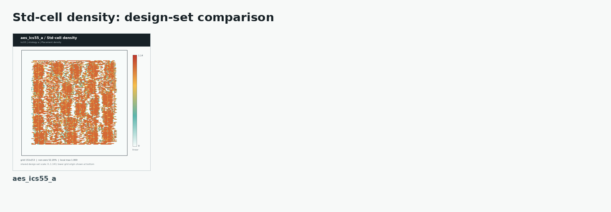

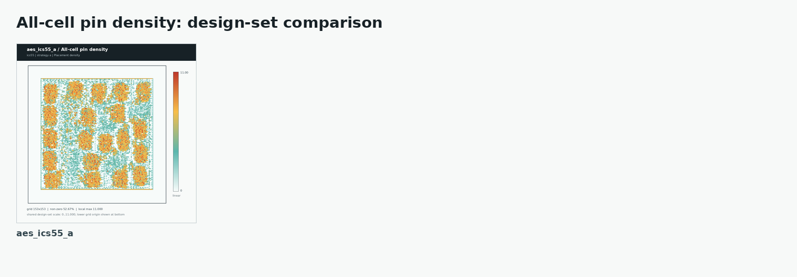

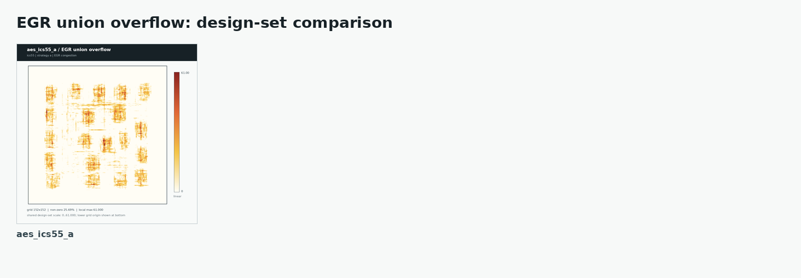

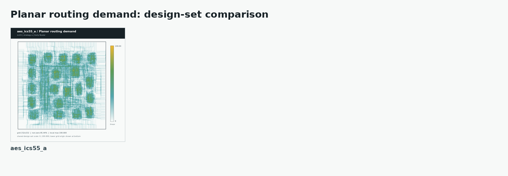

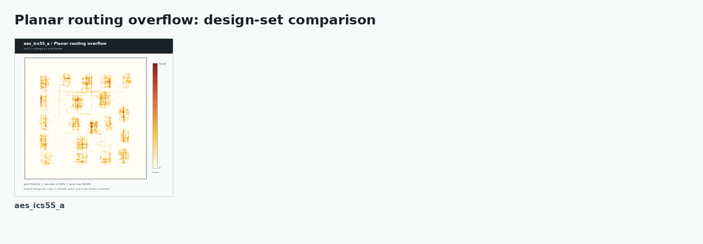

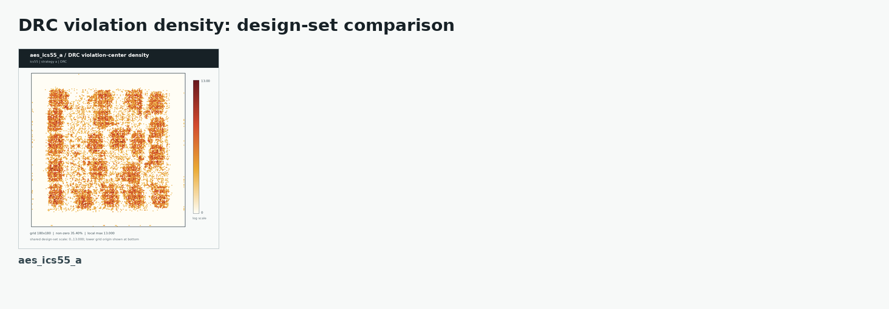

## 6. 同工艺纵向结论

- **ics55**：1/1 完成 GDS；最低 DRC 为 `aes_ics55_a` (25,952)，最快布线为 `aes_ics55_a` (470.6 s)。目前只有 a 状态，无法判断 utilization 趋势；其极端负 setup slack 需要优先核对 liberty/RC 单位和时钟约束。

- 本批 a/b/t 的 floorplan 目标利用率均为 65%，它们主要用于跨 PDK/状态重复性和稳定性检查，不能当作 35%/30%/25% 利用率 DOE。
- 当前单轮详细布线 (`IEDA_RT_MAX_ITERATIONS=1`) 与 best-effort SpaceRouter 预算优先保证流程贯通；DRC 数值应作为下一轮修复基线，而不是签核通过证据。
## 7. 各设计阶段纵向对比、版图与 Maps

### aes_ics55_a (ics55 / a)

| Stage | Runtime (s) | Memory (MB) | Instances | Timing inst. | Core util. | DEF HPWL (um) | Routed (um) | Setup WNS (ns) | Power (mW) | Congestion | DRC | IR-drop |
|---|---:|---:|---:|---:|---:|---:|---:|---:|---:|---|---:|---|
| Floorplan | 0.71 | 0.0 | 11,419 | 0 | 65.0% | 0.0 | 0.0 | N/A | N/A | N/A | N/A | N/A |
| Fanout | 21.78 | 4,473.5 | 11,834 | 415 | 68.9% | 0.0 | 0.0 | N/A | N/A | N/A | N/A | N/A |
| Placement | 12.83 | N/A | 11,834 | N/A | N/A | 162,780.5 | 0.0 | N/A | N/A | N/A | N/A | N/A |
| CTS | 23.01 | 873.5 | 11,855 | 436 | 69.0% | 164,423.9 | 0.0 | N/A | N/A | N/A | N/A | N/A |
| Legalization | 5.47 | N/A | 11,855 | N/A | N/A | 164,447.1 | 0.0 | N/A | N/A | N/A | N/A | N/A |
| Routing | 470.59 | 0.0 | 11,855 | 436 | 69.0% | 164,447.1 | 161,683.9 | 0.845 | 190.800 | avg 2.86, max 61 | 25,952 | N/A |
| Filler | 3.73 | 83.2 | 18,112 | 436 | 97.8% | 164,447.1 | 161,683.9 | N/A | N/A | N/A | N/A | N/A |

Post-route：setup WNS `0.845 ns`，hold WNS `0.130 ns`，功耗 `190.800 mW`，DRC `25,952`。DRC 主项：minimum_area=21,120, metal_short=3,050, parallel_run_length_spacing=1,761。未约束端口 `5`，缺失 input slew pin `426`。

<table>
<tr><td><b>Floorplan</b> <a href="../reports/aes12_m0_smoke_e1_cap32_20260805_detailed_comparison_assets/aes_ics55_a/floorplan.png">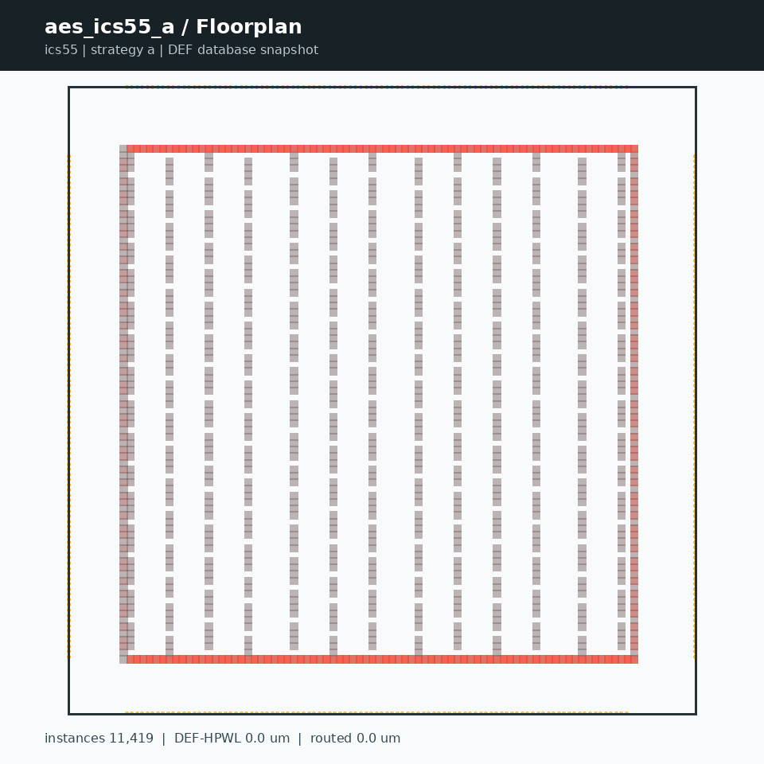</a></td><td><b>Fanout</b> </td><td><b>Placement</b> <a href="../reports/aes12_m0_smoke_e1_cap32_20260805_detailed_comparison_assets/aes_ics55_a/placement.png">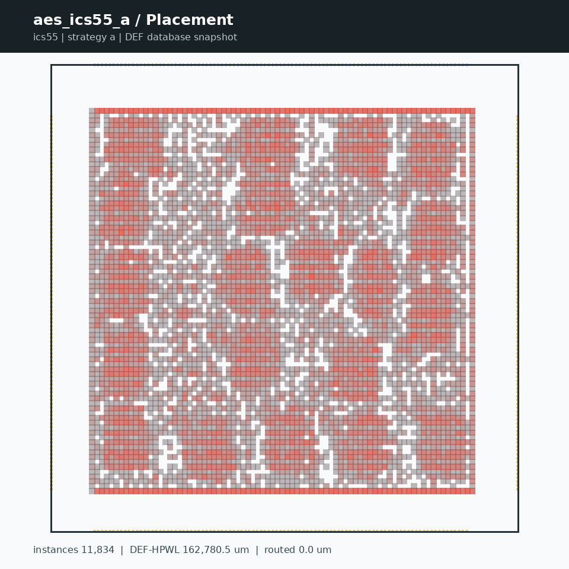</a></td><td><b>CTS</b> <a href="../reports/aes12_m0_smoke_e1_cap32_20260805_detailed_comparison_assets/aes_ics55_a/cts.png">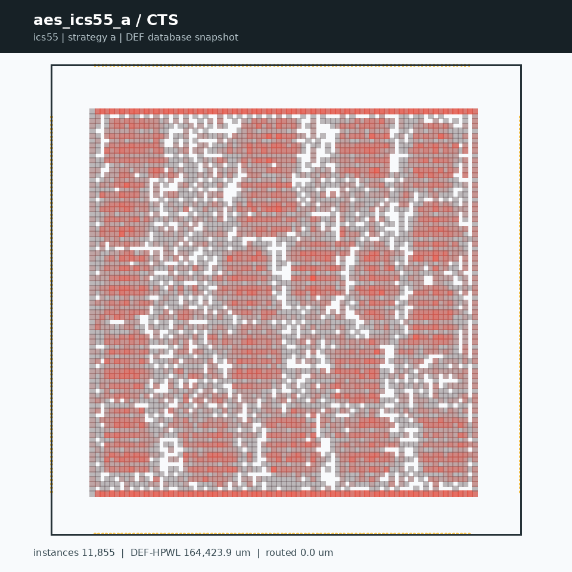</a></td></tr>
<tr><td><b>Legalization</b> </td><td><b>Routing</b> <a href="../reports/aes12_m0_smoke_e1_cap32_20260805_detailed_comparison_assets/aes_ics55_a/routing.png">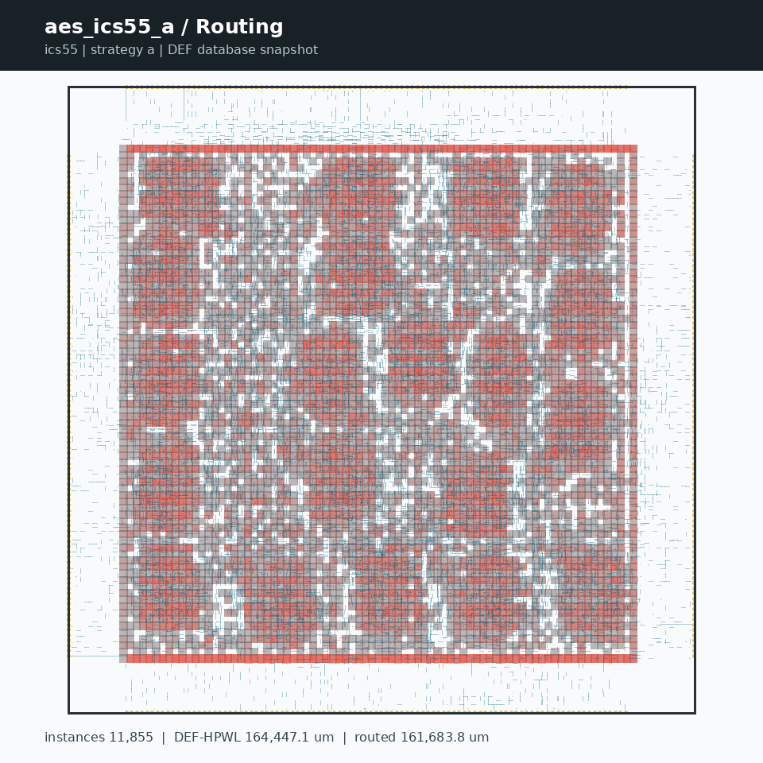</a></td><td><b>Filler</b> <a href="../reports/aes12_m0_smoke_e1_cap32_20260805_detailed_comparison_assets/aes_ics55_a/filler.png">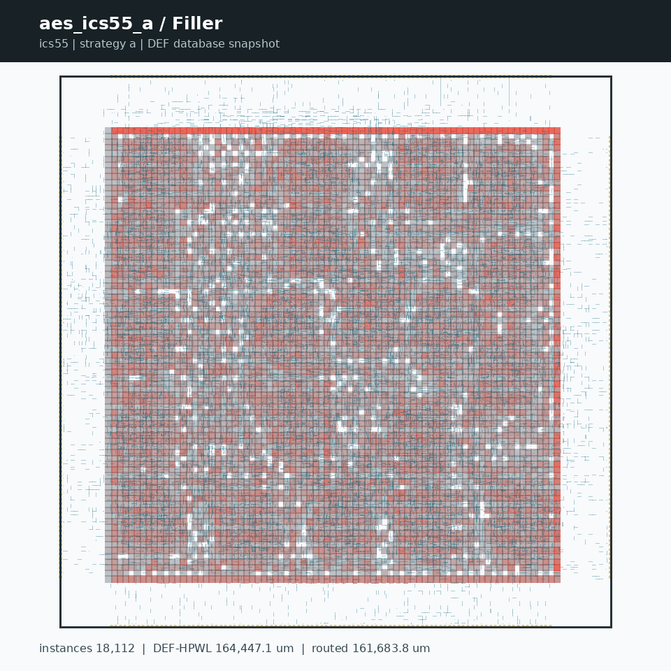</a></td><td><b>Final GDS</b> </td></tr>
</table>
CTS 专项图：[clock tree](../results/aes12_m0_smoke_e1_cap32_20260805/aes_ics55_a/workspace/result/cts/visualization/svg/cts_design.svg) / [flyline](../results/aes12_m0_smoke_e1_cap32_20260805/aes_ics55_a/workspace/result/cts/visualization/svg/cts_flyline.svg)

#### 空间 Map 证据

共发现 `37` 个原始 map 文件，渲染 `16` 张代表图。同类图使用跨 1 个设计的统一色标；DRC 使用统一对数色标。全零图保留并明确标注。

<table>
<tr><td><b>Std-cell density</b>  <small>non-zero 52.20%; max 1.000; <a href="../results/aes12_m0_smoke_e1_cap32_20260805/aes_ics55_a/workspace/result/density_map/place_stdcell_density.csv">raw</a></small></td><td><b>Macro density</b> <a href="../reports/aes12_m0_smoke_e1_cap32_20260805_detailed_comparison_assets/aes_ics55_a/maps/macro_density.png">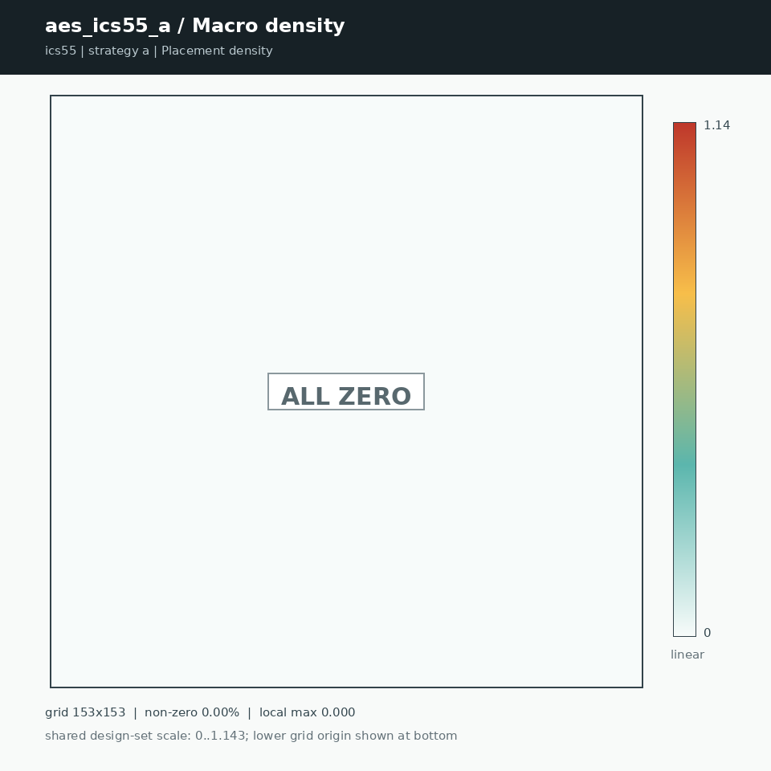</a> <small>non-zero 0.00%; max 0.000; <a href="../results/aes12_m0_smoke_e1_cap32_20260805/aes_ics55_a/workspace/result/density_map/place_macro_density.csv">raw</a></small></td><td><b>All-cell density</b> <a href="../reports/aes12_m0_smoke_e1_cap32_20260805_detailed_comparison_assets/aes_ics55_a/maps/allcell_density.png">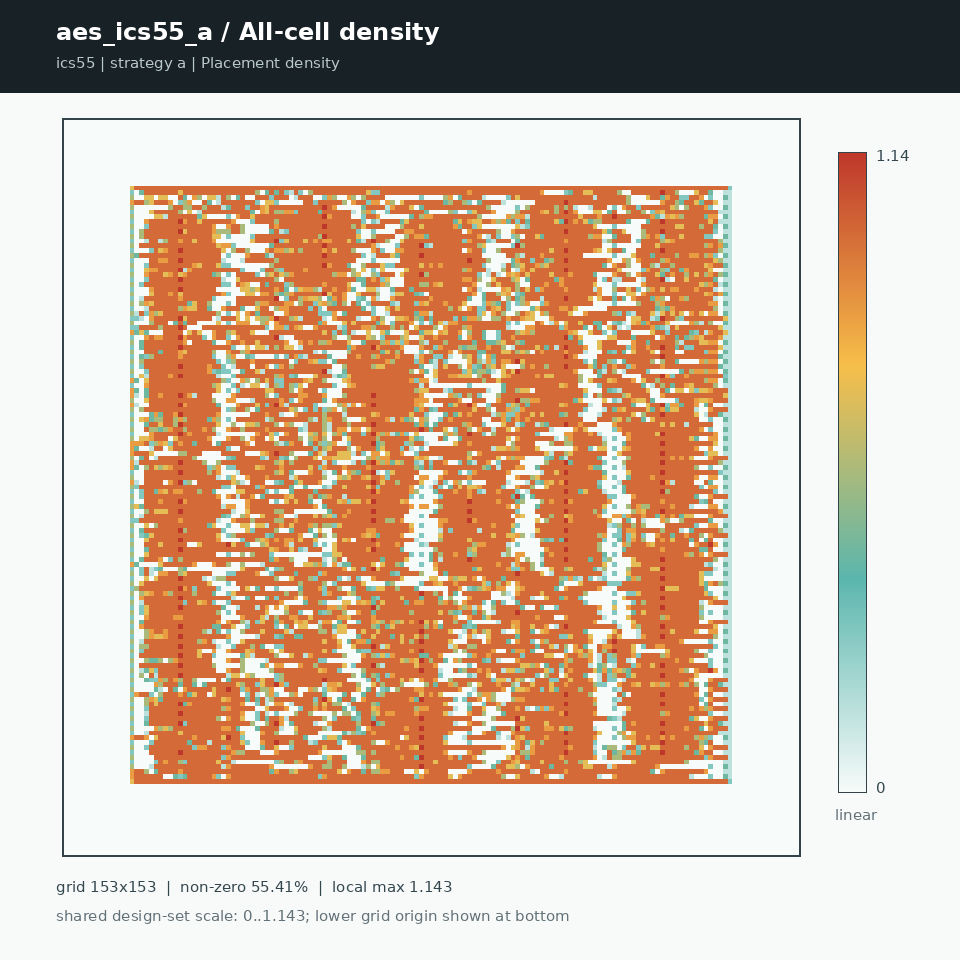</a> <small>non-zero 55.41%; max 1.143; <a href="../results/aes12_m0_smoke_e1_cap32_20260805/aes_ics55_a/workspace/result/density_map/place_allcell_density.csv">raw</a></small></td><td><b>Std-cell pin density</b> <a href="../reports/aes12_m0_smoke_e1_cap32_20260805_detailed_comparison_assets/aes_ics55_a/maps/stdcell_pin_density.png">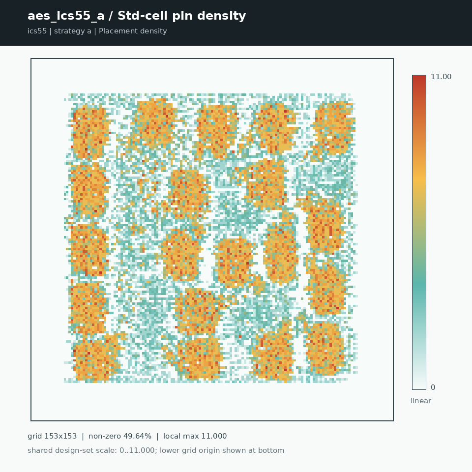</a> <small>non-zero 49.64%; max 11.000; <a href="../results/aes12_m0_smoke_e1_cap32_20260805/aes_ics55_a/workspace/result/density_map/place_stdcell_pin_density.csv">raw</a></small></td></tr>
<tr><td><b>Macro pin density</b> <a href="../reports/aes12_m0_smoke_e1_cap32_20260805_detailed_comparison_assets/aes_ics55_a/maps/macro_pin_density.png">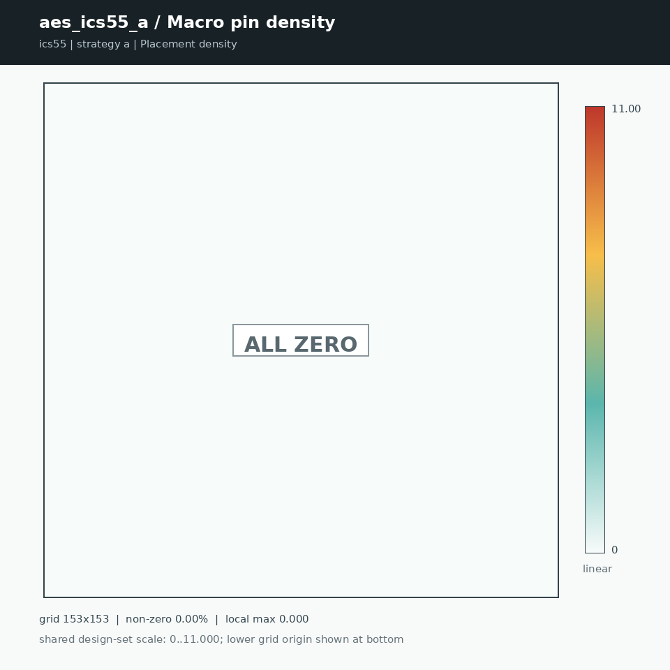</a> <small>non-zero 0.00%; max 0.000; <a href="../results/aes12_m0_smoke_e1_cap32_20260805/aes_ics55_a/workspace/result/density_map/place_macro_pin_density.csv">raw</a></small></td><td><b>All-cell pin density</b> <a href="../reports/aes12_m0_smoke_e1_cap32_20260805_detailed_comparison_assets/aes_ics55_a/maps/allcell_pin_density.png">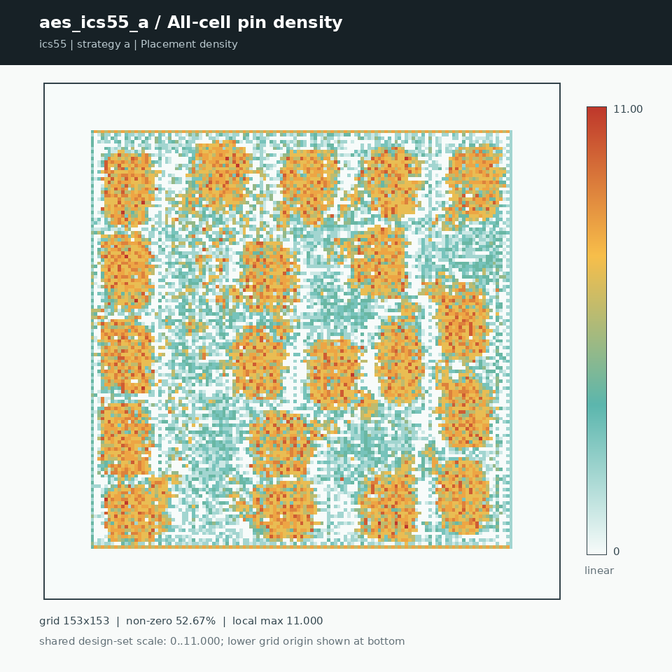</a> <small>non-zero 52.67%; max 11.000; <a href="../results/aes12_m0_smoke_e1_cap32_20260805/aes_ics55_a/workspace/result/density_map/place_allcell_pin_density.csv">raw</a></small></td><td><b>Local-net density</b> <a href="../reports/aes12_m0_smoke_e1_cap32_20260805_detailed_comparison_assets/aes_ics55_a/maps/local_net_density.png">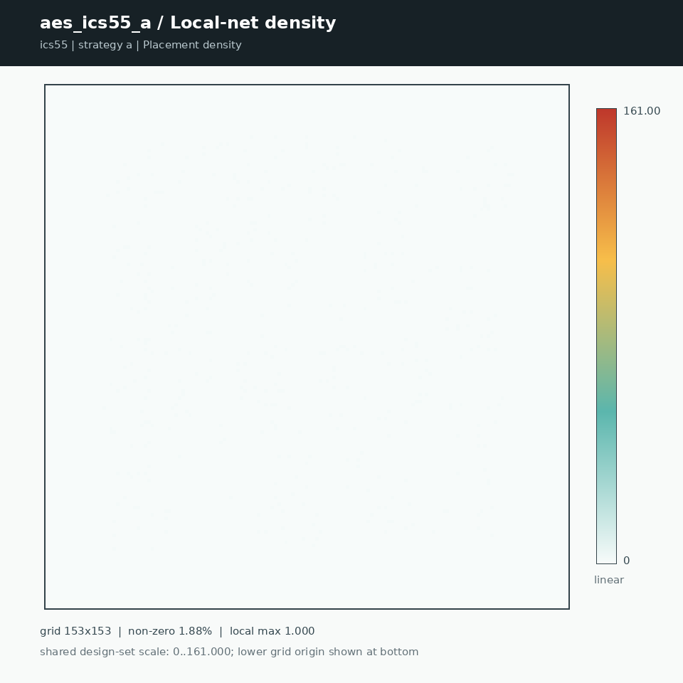</a> <small>non-zero 1.88%; max 1.000; <a href="../results/aes12_m0_smoke_e1_cap32_20260805/aes_ics55_a/workspace/result/density_map/place_local_net_density.csv">raw</a></small></td><td><b>Global-net density</b> <a href="../reports/aes12_m0_smoke_e1_cap32_20260805_detailed_comparison_assets/aes_ics55_a/maps/global_net_density.png">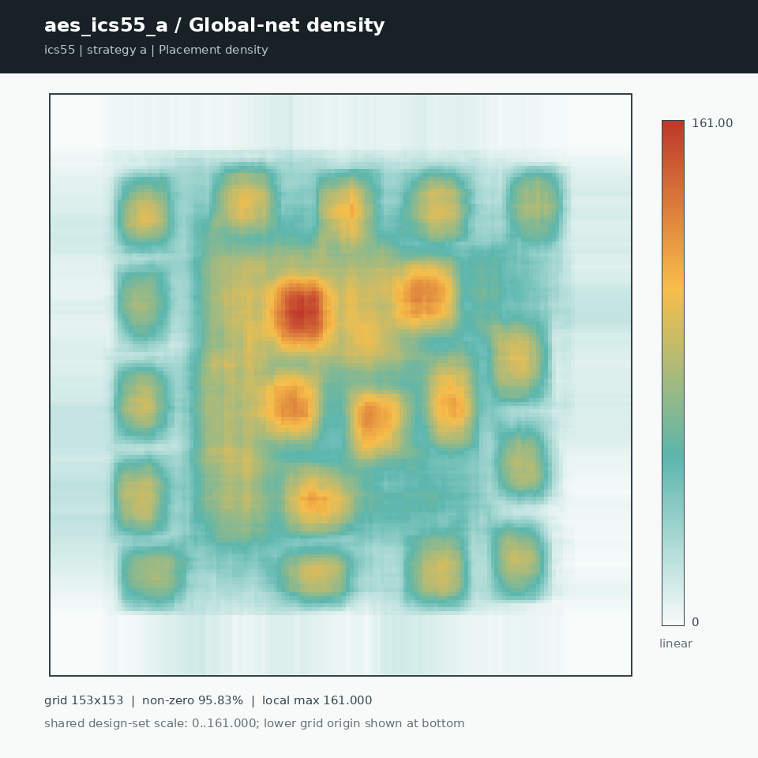</a> <small>non-zero 95.83%; max 161.000; <a href="../results/aes12_m0_smoke_e1_cap32_20260805/aes_ics55_a/workspace/result/density_map/place_global_net_density.csv">raw</a></small></td></tr>
<tr><td><b>All-net density</b> <a href="../reports/aes12_m0_smoke_e1_cap32_20260805_detailed_comparison_assets/aes_ics55_a/maps/allnet_density.png">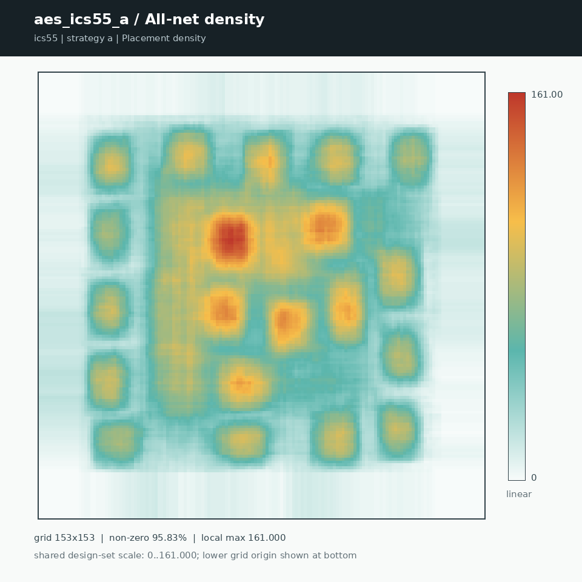</a> <small>non-zero 95.83%; max 161.000; <a href="../results/aes12_m0_smoke_e1_cap32_20260805/aes_ics55_a/workspace/result/density_map/place_allnet_density.csv">raw</a></small></td><td><b>EGR horizontal overflow</b> <a href="../reports/aes12_m0_smoke_e1_cap32_20260805_detailed_comparison_assets/aes_ics55_a/maps/egr_horizontal_overflow.png">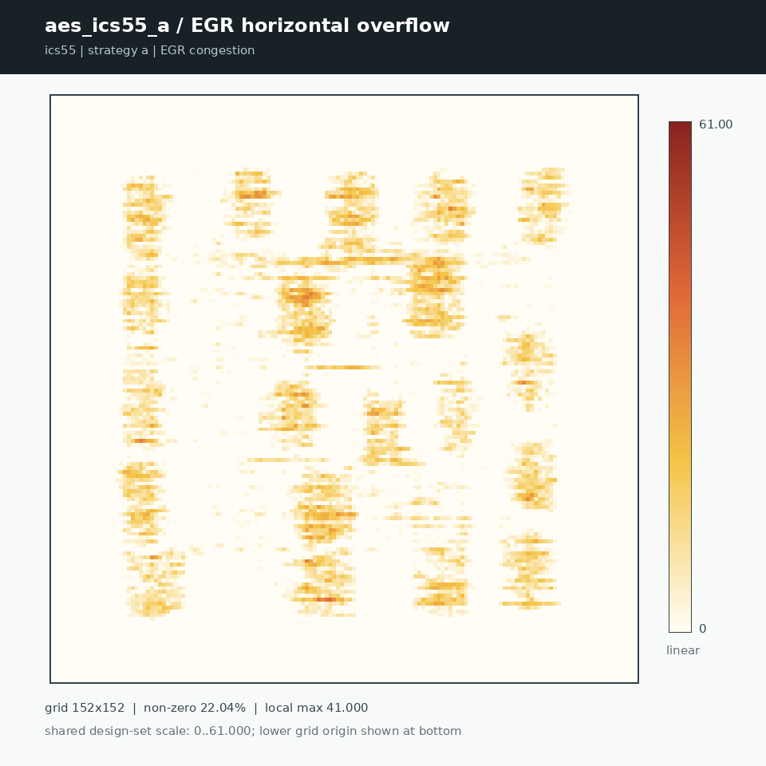</a> <small>non-zero 22.04%; max 41.000; <a href="../results/aes12_m0_smoke_e1_cap32_20260805/aes_ics55_a/workspace/result/egr_congestion_map/place_egr_horizontal_overflow.csv">raw</a></small></td><td><b>EGR vertical overflow</b> <a href="../reports/aes12_m0_smoke_e1_cap32_20260805_detailed_comparison_assets/aes_ics55_a/maps/egr_vertical_overflow.png">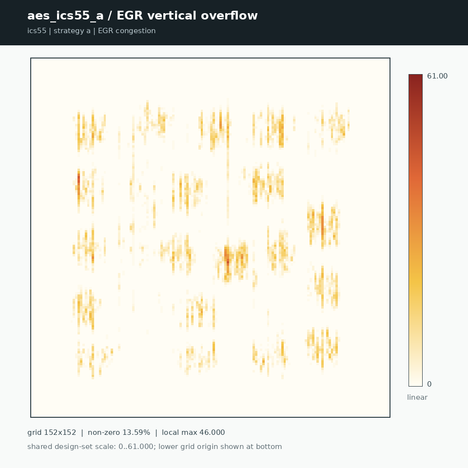</a> <small>non-zero 13.59%; max 46.000; <a href="../results/aes12_m0_smoke_e1_cap32_20260805/aes_ics55_a/workspace/result/egr_congestion_map/place_egr_vertical_overflow.csv">raw</a></small></td><td><b>EGR union overflow</b> <a href="../reports/aes12_m0_smoke_e1_cap32_20260805_detailed_comparison_assets/aes_ics55_a/maps/egr_union_overflow.png">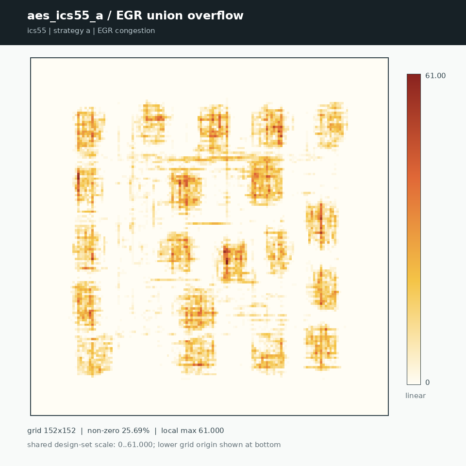</a> <small>non-zero 25.69%; max 61.000; <a href="../results/aes12_m0_smoke_e1_cap32_20260805/aes_ics55_a/workspace/result/egr_congestion_map/place_egr_union_overflow.csv">raw</a></small></td></tr>
<tr><td><b>Planar routing demand</b> <a href="../reports/aes12_m0_smoke_e1_cap32_20260805_detailed_comparison_assets/aes_ics55_a/maps/early_net_planar.png">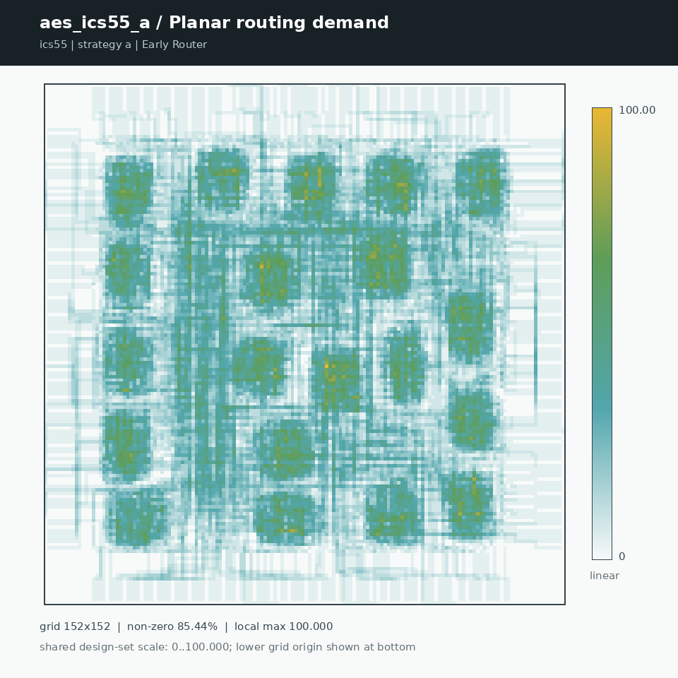</a> <small>non-zero 85.44%; max 100.000; <a href="../results/aes12_m0_smoke_e1_cap32_20260805/aes_ics55_a/workspace/result/rt/rt_temp_directory/early_router/net_map_planar.csv">raw</a></small></td><td><b>Planar routing supply</b> <a href="../reports/aes12_m0_smoke_e1_cap32_20260805_detailed_comparison_assets/aes_ics55_a/maps/early_supply_planar.png">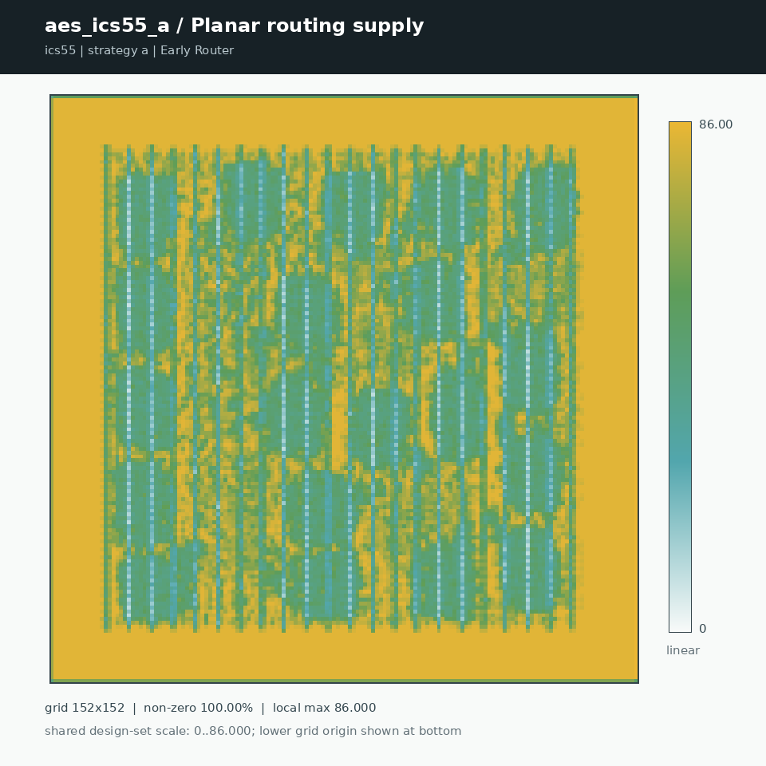</a> <small>non-zero 100.00%; max 86.000; <a href="../results/aes12_m0_smoke_e1_cap32_20260805/aes_ics55_a/workspace/result/rt/rt_temp_directory/early_router/supply_map_planar.csv">raw</a></small></td><td><b>Planar routing overflow</b> <a href="../reports/aes12_m0_smoke_e1_cap32_20260805_detailed_comparison_assets/aes_ics55_a/maps/early_overflow_planar.png">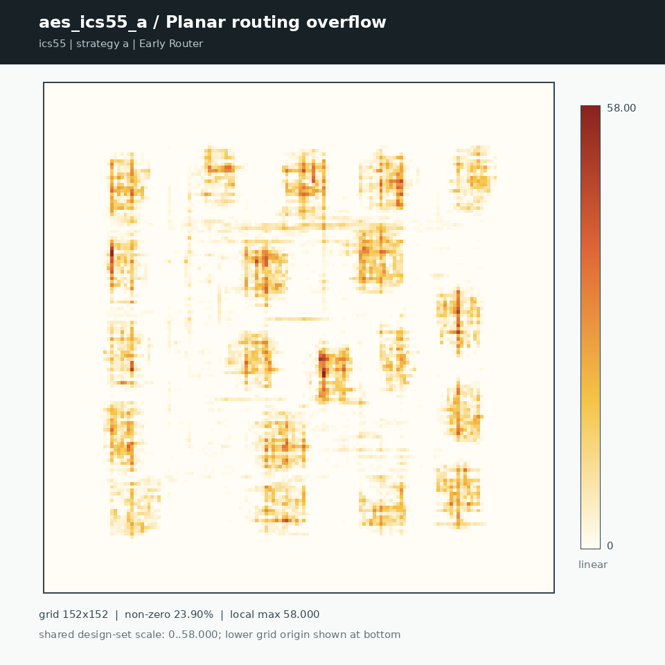</a> <small>non-zero 23.90%; max 58.000; <a href="../results/aes12_m0_smoke_e1_cap32_20260805/aes_ics55_a/workspace/result/rt/rt_temp_directory/early_router/overflow_map_planar.csv">raw</a></small></td><td><b>DRC violation-center density</b> <a href="../reports/aes12_m0_smoke_e1_cap32_20260805_detailed_comparison_assets/aes_ics55_a/maps/drc_violation_density.png">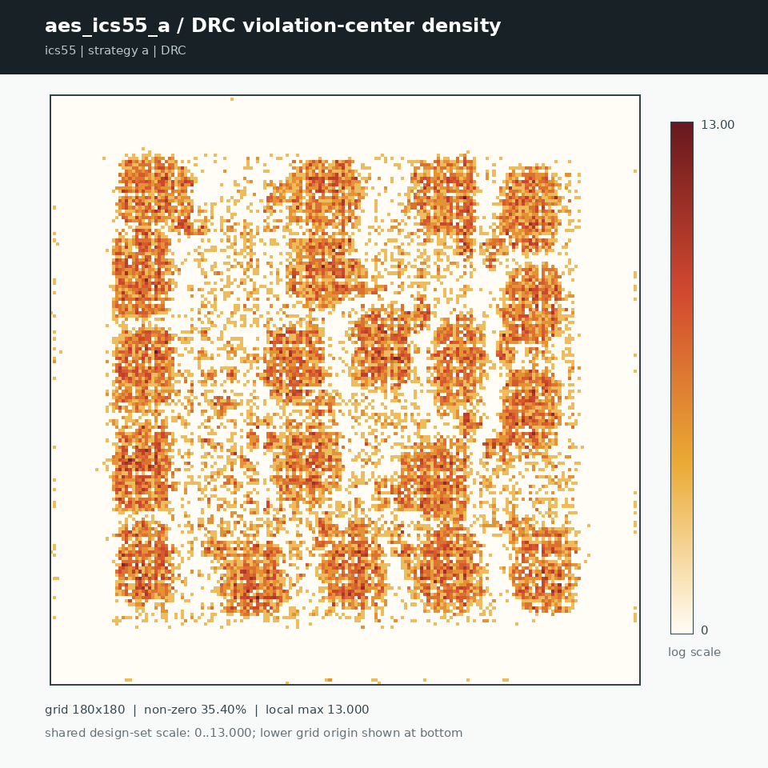</a> <small>non-zero 35.40%; max 13.000; <a href="../results/aes12_m0_smoke_e1_cap32_20260805/aes_ics55_a/workspace/drc_temp_directory/violation_map.json">raw</a></small></td></tr>
</table>

完整原始 map 文件索引

- **Placement density CSV (9)**：[place_allcell_density.csv](../results/aes12_m0_smoke_e1_cap32_20260805/aes_ics55_a/workspace/result/density_map/place_allcell_density.csv), [place_allcell_pin_density.csv](../results/aes12_m0_smoke_e1_cap32_20260805/aes_ics55_a/workspace/result/density_map/place_allcell_pin_density.csv), [place_allnet_density.csv](../results/aes12_m0_smoke_e1_cap32_20260805/aes_ics55_a/workspace/result/density_map/place_allnet_density.csv), [place_global_net_density.csv](../results/aes12_m0_smoke_e1_cap32_20260805/aes_ics55_a/workspace/result/density_map/place_global_net_density.csv), [place_local_net_density.csv](../results/aes12_m0_smoke_e1_cap32_20260805/aes_ics55_a/workspace/result/density_map/place_local_net_density.csv), [place_macro_density.csv](../results/aes12_m0_smoke_e1_cap32_20260805/aes_ics55_a/workspace/result/density_map/place_macro_density.csv), [place_macro_pin_density.csv](../results/aes12_m0_smoke_e1_cap32_20260805/aes_ics55_a/workspace/result/density_map/place_macro_pin_density.csv), [place_stdcell_density.csv](../results/aes12_m0_smoke_e1_cap32_20260805/aes_ics55_a/workspace/result/density_map/place_stdcell_density.csv), [place_stdcell_pin_density.csv](../results/aes12_m0_smoke_e1_cap32_20260805/aes_ics55_a/workspace/result/density_map/place_stdcell_pin_density.csv)
- **EGR congestion CSV (3)**：[place_egr_horizontal_overflow.csv](../results/aes12_m0_smoke_e1_cap32_20260805/aes_ics55_a/workspace/result/egr_congestion_map/place_egr_horizontal_overflow.csv), [place_egr_union_overflow.csv](../results/aes12_m0_smoke_e1_cap32_20260805/aes_ics55_a/workspace/result/egr_congestion_map/place_egr_union_overflow.csv), [place_egr_vertical_overflow.csv](../results/aes12_m0_smoke_e1_cap32_20260805/aes_ics55_a/workspace/result/egr_congestion_map/place_egr_vertical_overflow.csv)
- **Early-router layer CSV (24)**：[net_map_MET1.csv](../results/aes12_m0_smoke_e1_cap32_20260805/aes_ics55_a/workspace/result/rt/rt_temp_directory/early_router/net_map_MET1.csv), [net_map_MET2.csv](../results/aes12_m0_smoke_e1_cap32_20260805/aes_ics55_a/workspace/result/rt/rt_temp_directory/early_router/net_map_MET2.csv), [net_map_MET3.csv](../results/aes12_m0_smoke_e1_cap32_20260805/aes_ics55_a/workspace/result/rt/rt_temp_directory/early_router/net_map_MET3.csv), [net_map_MET4.csv](../results/aes12_m0_smoke_e1_cap32_20260805/aes_ics55_a/workspace/result/rt/rt_temp_directory/early_router/net_map_MET4.csv), [net_map_MET5.csv](../results/aes12_m0_smoke_e1_cap32_20260805/aes_ics55_a/workspace/result/rt/rt_temp_directory/early_router/net_map_MET5.csv), [net_map_RDL.csv](../results/aes12_m0_smoke_e1_cap32_20260805/aes_ics55_a/workspace/result/rt/rt_temp_directory/early_router/net_map_RDL.csv), [net_map_T4M2.csv](../results/aes12_m0_smoke_e1_cap32_20260805/aes_ics55_a/workspace/result/rt/rt_temp_directory/early_router/net_map_T4M2.csv), [net_map_planar.csv](../results/aes12_m0_smoke_e1_cap32_20260805/aes_ics55_a/workspace/result/rt/rt_temp_directory/early_router/net_map_planar.csv), [overflow_map_MET1.csv](../results/aes12_m0_smoke_e1_cap32_20260805/aes_ics55_a/workspace/result/rt/rt_temp_directory/early_router/overflow_map_MET1.csv), [overflow_map_MET2.csv](../results/aes12_m0_smoke_e1_cap32_20260805/aes_ics55_a/workspace/result/rt/rt_temp_directory/early_router/overflow_map_MET2.csv), [overflow_map_MET3.csv](../results/aes12_m0_smoke_e1_cap32_20260805/aes_ics55_a/workspace/result/rt/rt_temp_directory/early_router/overflow_map_MET3.csv), [overflow_map_MET4.csv](../results/aes12_m0_smoke_e1_cap32_20260805/aes_ics55_a/workspace/result/rt/rt_temp_directory/early_router/overflow_map_MET4.csv), [overflow_map_MET5.csv](../results/aes12_m0_smoke_e1_cap32_20260805/aes_ics55_a/workspace/result/rt/rt_temp_directory/early_router/overflow_map_MET5.csv), [overflow_map_RDL.csv](../results/aes12_m0_smoke_e1_cap32_20260805/aes_ics55_a/workspace/result/rt/rt_temp_directory/early_router/overflow_map_RDL.csv), [overflow_map_T4M2.csv](../results/aes12_m0_smoke_e1_cap32_20260805/aes_ics55_a/workspace/result/rt/rt_temp_directory/early_router/overflow_map_T4M2.csv), [overflow_map_planar.csv](../results/aes12_m0_smoke_e1_cap32_20260805/aes_ics55_a/workspace/result/rt/rt_temp_directory/early_router/overflow_map_planar.csv), [supply_map_MET1.csv](../results/aes12_m0_smoke_e1_cap32_20260805/aes_ics55_a/workspace/result/rt/rt_temp_directory/early_router/supply_map_MET1.csv), [supply_map_MET2.csv](../results/aes12_m0_smoke_e1_cap32_20260805/aes_ics55_a/workspace/result/rt/rt_temp_directory/early_router/supply_map_MET2.csv), [supply_map_MET3.csv](../results/aes12_m0_smoke_e1_cap32_20260805/aes_ics55_a/workspace/result/rt/rt_temp_directory/early_router/supply_map_MET3.csv), [supply_map_MET4.csv](../results/aes12_m0_smoke_e1_cap32_20260805/aes_ics55_a/workspace/result/rt/rt_temp_directory/early_router/supply_map_MET4.csv), [supply_map_MET5.csv](../results/aes12_m0_smoke_e1_cap32_20260805/aes_ics55_a/workspace/result/rt/rt_temp_directory/early_router/supply_map_MET5.csv), [supply_map_RDL.csv](../results/aes12_m0_smoke_e1_cap32_20260805/aes_ics55_a/workspace/result/rt/rt_temp_directory/early_router/supply_map_RDL.csv), [supply_map_T4M2.csv](../results/aes12_m0_smoke_e1_cap32_20260805/aes_ics55_a/workspace/result/rt/rt_temp_directory/early_router/supply_map_T4M2.csv), [supply_map_planar.csv](../results/aes12_m0_smoke_e1_cap32_20260805/aes_ics55_a/workspace/result/rt/rt_temp_directory/early_router/supply_map_planar.csv)
- **DRC violation JSON (1)**：[violation_map.json](../results/aes12_m0_smoke_e1_cap32_20260805/aes_ics55_a/workspace/drc_temp_directory/violation_map.json)

## 8. iEDA.ai 当前完成质量

| 维度 | 评级 | 证据 | 判断 |
|---|---|---|---|
| 多 PDK 流程贯通 | B | 1 PDK、1/1 GDS | 数据准备、映射、放置、CTS、布线和导出已可重复运行 |
| 布局/CTS 工程完整性 | B- | 每阶段 DEF、CTS 专项图、合法化结果齐全 | 可做算法迭代，但需增加阶段质量门禁 |
| 布线/DRC | D | 0/1 clean，且数量级随 PDK 差异很大 | 目前不具备签核闭环 |
| STA | D+ | WNS/TNS 文件齐全，但 net delay=0、I/O 未全约束 | 只能做早期逻辑/库延迟代理 |
| Power | D | switch power=0、无活动率 | 不可用于动态功耗或 IR 结论 |
| Congestion / maps | B- | 1/1 有有效 summary，1/1 有空间图 | 热点可审计，summary 已避免 -1 sentinel，但仍需进入自动判退 |
| PDN / IR-drop | F | 0/1 数据 | 尚未进入质量闭环 |
| 可观测性/可追溯性 | B- | 日志、阶段图、16 张代表 map 和全部原始 map 索引齐全 | 已能空间审计，尚不能逐阶段自动判退 |

## 9. 后续优化方案

### P0：先修测量可信度（1-2 周）

1. 在 routing 后运行 iRCX/SPEF，强制 post-route STA 读取 SPEF；质量门禁要求关键路径 `net delay > 0`。
2. 完整化 SDC：约束所有输入/输出 delay、clock uncertainty、driving cell/load，逐项清零 unconstrained endpoint；明确 false/multicycle path。
3. 功耗接入 VCD/SAIF 或经过校准的 vectorless activity，门禁要求 `switch_power > 0`，并记录活动率来源。
4. 修复 congestion report 的 `-1` sentinel；将 global-route overflow、top-1%/top-5% utilization 和热点图纳入统一 JSON。
5. 接通 iPNP/iIR：生成真实 PDN、定义电源 bump/pad/source 和电流模型，输出 worst/avg IR、超阈值面积与热图。

### P1：DRC 闭环与路由收敛（2-4 周）

1. 按本报告各 PDK 的 top violation 分类建回归：short、PRL spacing、same-layer cut、min-area/overlap 分别设专项用例。
2. 将 `IEDA_RT_MAX_ITERATIONS=1` 改成可扫参数，至少比较 1/3/5 轮的 DRC、runtime、wirelength；只有 DRC 单调下降才保留更多迭代。
3. 校准 tech LEF 层方向、track pitch/offset、via rule、min-area 和 cut spacing；ASAP7 特别验证当前补写 RC 和 layer range 的一致性。
4. 增加 post-route repair：short/spacing rip-up、min-area patch、via enclosure repair；以“DRC=0 或已签核 waiver”作为 GDS 成功条件，而不是仅检查文件存在。

### P2：PPA 与状态策略优化（4-8 周）

1. 对每个 PDK 做 utilization × padding × congestion-weight 三维小型 DOE；a/b/t 只改变利用率不足以定位根因。
2. CTS 扫 buffer set、cluster size、max fanout/cap；用 insertion delay、skew、clock wirelength、buffer area 和 post-CTS setup/hold 联合评分。
3. 逐阶段保存 STA/power/congestion/HPWL 快照，形成 `floorplan -> placement -> CTS -> route` delta，超过阈值自动回退。
4. 跨 PDK 只比较归一化指标（per-cell、per-mm2、相对各自 target），并固定 RTL、时钟、约束语义和工具版本。

### P3：Agent 化闭环（8 周以后）

1. 将报告 JSON 作为 agent 观测面，动作限定为有边界的参数变更；每次实验记录输入 hash、工具 hash、PPA/DRC/IR delta。
2. 建 Pareto archive，目标至少包含 WNS/TNS、power、area、wirelength、DRC、worst IR 和 runtime，禁止用单一加权分掩盖硬约束失败。
3. 建立工艺专属策略库与跨工艺共享策略，只有通过重复试验和 holdout design 验证的规则才晋升为默认。

## 10. 建议验收门禁

| Gate | 当前 | 下一里程碑 |
|---|---:|---:|
| Flow completion | 1/1 | 保持 1/1 可重复 |
| DRC clean | 0/1 | 每 PDK 至少 1 个 clean，再扩至 1/1 |
| SPEF-backed STA | 0/1 | 1/1，net delay 非零 |
| Fully constrained timing | 0/1 | unconstrained=0 |
| Activity-backed power | 0/1 | 1/1 有来源标签 |
| Valid congestion summary | 1/1 | 保持无 -1/NaN，并与 EGR/early-router map 数值一致 |
| IR-drop | 0/1 | 1/1 有 worst/avg/map |
| Spatial maps | 1/1，16 张代表图 | 增加逐阶段 STA/power/congestion delta JSON |

## 11. 产物索引

- 机器可读数据：[`aes12_m0_smoke_e1_cap32_20260805_detailed_comparison.json`](aes12_m0_smoke_e1_cap32_20260805_detailed_comparison.json)
- 扁平对比数据：[`aes12_m0_smoke_e1_cap32_20260805_detailed_comparison.csv`](aes12_m0_smoke_e1_cap32_20260805_detailed_comparison.csv)
- 交互式/打印版：[`aes12_m0_smoke_e1_cap32_20260805_detailed_comparison.html`](aes12_m0_smoke_e1_cap32_20260805_detailed_comparison.html)
- 阶段与 map 图片：[`aes12_m0_smoke_e1_cap32_20260805_detailed_comparison_assets/`](aes12_m0_smoke_e1_cap32_20260805_detailed_comparison_assets/)
