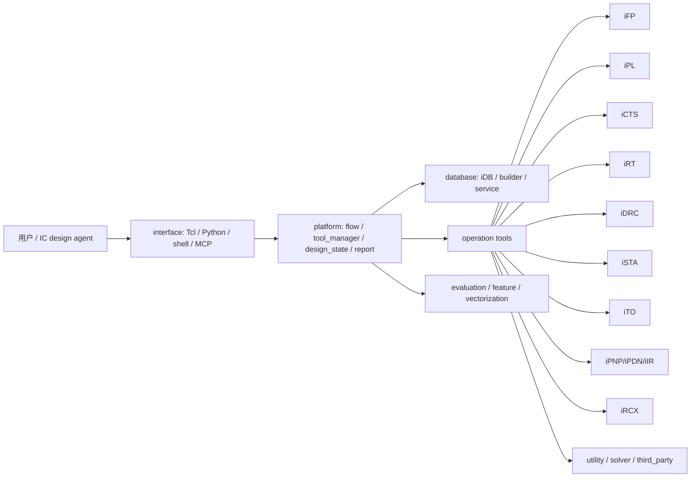

# iEDA.ai 深度代码审查与 Agent 适配性报告

生成时间：2026-08-13 11:35:32 CST
审查对象：`/home/lxq/AiEDA/iEDA.ai`
分支：`commercial-parity`
HEAD：`e527673`
报告位置：`docs/opt/ieda_ai_deep_code_review_20260813.md`

## 1. 执行摘要

本次审查按“专业代码审查 agent + 主线程复核”的方式进行，覆盖软件结构和风格、可靠性、安全性、编译/测试稳定性、数据泄露风险，以及是否适合 IC design agent 调用、修改和扩展。

总体结论：

- iEDA.ai 已经具备较完整的 EDA 工具链结构：`database`、`operation`、`platform`、`interface`、`evaluation`、`feature`、`vectorization` 等层次清晰，主工具包括 iFP/iPL/iCTS/iRT/iDRC/iSTA/iTO/iPNP/iIR/iRCX/iPA/iNO/iECO 等。
- 当前已有面向 agent/orchestration 的正向基础：`CommandContract`、`EngineContract`、`tool_contracts.json`、产品 schema、依赖关系、失败传播、skip 语义和质量 gate 测试。
- 但代码还不适合直接作为“无人值守、长期运行、多设计并发”的 IC design agent 后端。主要阻塞项是：全局单例生命周期、库层 `LOG_FATAL`/`exit()`、命令拼接 `system()`、硬编码绝对路径、源码树内二进制/构建产物、部分空指针崩溃路径、日志/崩溃 dump 泄露路径、CTest/构建产物可见性不稳定。
- 编译层面：一次 rebuild 过程中曾出现 transient header include 失败，随后同一源码状态 rebuild 成功；CTest 曾有 92/92 全通过记录，但本次最新完整复跑出现 2 个 iCTS 测试 `BAD_COMMAND permission denied`，隔离复跑这 2 个测试又 100% 通过。结论不是算法失败，而是构建/测试目录状态、并发可见性或产物刷新存在稳定性风险。
- 安全层面：未发现明显私钥或凭据文件，但存在多处个人绝对路径、构建 `.d` 文件泄露本机路径、日志输出完整源码/工艺库/设计路径的风险；当前仅为启发式 grep，不等价于专业 secret scanner。

建议优先级：

| 优先级 | 结论 | 原因 |
|---|---|---|
| P0 | 禁止源码树和默认 `bin/` 被构建/测试污染 | 已观测 `build-aes13`、Rust `target`、repo `bin` 产物、`.a/.so/.o/.d` 路径泄露 |
| P0 | 替换项目代码中的 `system()`/`os.system()` | `iPL Hmetis.cc` 可由字符串拼接进入 shell，存在注入和旧结果污染风险 |
| P0 | 库层 API 不得用 `LOG_FATAL`/`exit()` 处理用户输入错误 | agent 服务中一个错误 pin/net/lib/RC 不应杀死整个进程 |
| P0 | 修复明确空指针/空 optional 崩溃路径 | iSTA/io/report 路径存在可由异常设计触发的崩溃点 |
| P1 | 建立 sanitizer、secret scan、路径脱敏、构建目录清洁 gate | 目前测试通过率不能覆盖内存安全和信息泄露 |
| P1 | 将 agent contract 扩展到 artifact schema、状态隔离、回滚和 POSIX rc 映射 | 现有 contract 是好基础，但还不足以支撑自主修改扩展 |

## 2. 本次审查组织

### 2.1 agent 分工

| 审查单元 | 任务 | 状态 | 主要产出 |
|---|---|---|---|
| 可靠性/安全审查 agent | 审查 `src` 可靠性、安全、资源生命周期、崩溃路径、命令执行、日志泄露 | 已回传完整结论 | 发现 `Hmetis system()`、`LOG_FATAL/exit()`、空指针、JSON/gz 内存问题、全局单例并发风险、日志泄露和删除/覆盖风险 |
| 结构/风格审查 agent | 审查软件结构、模块边界、接口风格、agent 扩展性 | 等待窗口内未回传 | 由主线程基于源码和接口契约补充复核 |
| 主线程复核 | 编译/CTest、静态 grep、接口 contract、源码树产物、报告整合 | 已完成 | 形成本报告和可复查证据 |

说明：本报告中的结论均基于已回传 agent 结果和主线程本地复核。未回传 agent 不作为阻塞项；建议后续单独安排更长窗口做结构风格专项审查。

### 2.2 审查范围

| 范围 | 结果 |
|---|---:|
| `src` 下源码/脚本/CMake/Rust 文件数 | 5,479 |
| `src/interface/scripts/benchmarks/dev` 下源码/脚本/CMake/Rust 文件数 | 40,702 |
| `src` 下总文件数 | 17,180 |
| 主要语言 | C++20、Python、Tcl、Rust、CMake |
| 主要模块 | database、operation、platform、interface、evaluation、feature、vectorization、utility、solver、third_party |

文件数包含测试、脚本和部分生成文件；`third_party` 未作为自研安全问题主体审查，只记录供应链/体积风险。

## 3. 软件结构与调用链

### 3.1 当前结构

正面观察：

- `src/operation` 将 EDA 工具按领域拆分，模块定位清楚。
- `src/platform/flow` 提供流程调度、stage、contract、quality gate 的基础。
- `src/interface/contract` 同时有 C++ 和 Python contract，对 agent 调用非常有价值。
- `src/platform/flow/config/tool_contracts.json` 已描述工具依赖和产品，例如 `irt` 依赖 `ipl/icts/ipdn`，`idrc` 依赖 `irt`，`ieval` 依赖 `ista/ircx`。

主要结构问题：

| 问题 | 影响 | 证据 |
|---|---|---|
| 工具层大量全局单例/全局状态 | 不适合多设计、多 agent 会话、长期服务 | iSTA `TimingEngine/Sta`、iNO `NoApi`、iPNP `PNPConfig` 等 |
| CLI/Tcl 工具语义和库 API 语义混杂 | 错误处理难以被 agent 精准恢复 | 多处库层直接 fatal/exit |
| 构建默认输出仍可能进入 repo `bin` | 破坏源码树清洁、影响测试复现 | CMake 默认 runtime output，部分测试/工具链接进入 `/home/lxq/AiEDA/iEDA.ai/bin` |
| 源码树包含二进制和构建缓存 | 审查、打包、secret scan、diff 噪声巨大 | `iRCX/ics55/lib/*.so`、`iIR/.../target` |
| tool contract 覆盖面不完整 | agent 只能部分判断成功/失败和 artifact 可信度 | 已有 JSON schema，但缺状态隔离、rollback、artifact manifest、hash 实际校验闭环 |

## 4. 编译与测试稳定性

### 4.1 已执行验证

| 时间 | 命令/动作 | 结果 | 结论 |
|---|---|---|---|
| 2026-08-13 | `cmake --build /tmp/ieda-ai-aes12-65pct-build --target all -j 12` 首次执行 | 曾失败：`StaPathBased.hh: No such file or directory` | 同一文件随后存在，判断为 transient 状态/并发/未提交变更导致的不稳定 |
| 2026-08-13 | 同一 build directory 第二次 rebuild | 成功 | 编译可通过，但首轮失败暴露可复现性风险 |
| 2026-08-13 | `ctest --test-dir /tmp/ieda-ai-aes12-65pct-build -N` | 92 tests | 测试集合完整 |
| 2026-08-13 | rebuild 后 CTest 记录 | 92/92 passed | 已有一次完整通过记录 |
| 2026-08-13 11:35 CST 后 | 最新完整 `ctest --output-on-failure` | 90/92 passed，2 个 iCTS topology 测试 `BAD_COMMAND permission denied` | 完整 CTest 存在产物可见性/执行状态不稳定 |
| 2026-08-13 | 隔离复跑 `icts_test_module_topology_gen` 和 `icts_test_module_topology_fast_clustering` | 2/2 passed，1.37 sec | 测试二进制自身和算法逻辑通过 |

### 4.2 最新 CTest 异常细节

| 测试 | 完整 CTest 结果 | 隔离复跑结果 | 风险判断 |
|---|---|---|---|
| `icts_test_module_topology_gen` | `BAD_COMMAND [permission denied]` | 10 tests passed | 非算法失败；可能是全量运行时构建产物刚刷新、权限/文件可见性或并发状态问题 |
| `icts_test_module_topology_fast_clustering` | `BAD_COMMAND [permission denied]` | 3 tests passed | 同上 |

隔离复跑时二进制权限为 `775`，`file` 显示为 ELF executable，`ldd` 依赖来自 `/tmp/ieda-ai-aes12-65pct-build` 和 micromamba 环境。因此问题更像“完整 CTest 运行期间的 transient 执行状态”，而不是测试内容错误。

### 4.3 编译警告

| 模块 | 文件/位置 | 警告类型 |
|---|---|---|
| iTO | `HoldOptimizer_process.cpp:179-180` | signed/unsigned compare |
| iTO | `SetupOptimizer_gate_sizing.cpp:65` | unused variable `eq_input_port` |
| iTO | `TreeBuild.cpp:160` | signed/unsigned compare |
| iTO | `ShallowLightTree.cpp:36` | signed/unsigned compare |
| iIR Rust | `OwnedIRPGNode` 字段、`RCOneNetData::print_to_yaml` | dead_code |

建议：P0/P1 模块先启用 warning budget；核心 API、contract、文件/安全模块应逐步开启 `-Werror`，但不能一次性对全仓库开启。

## 5. 安全与可靠性风险矩阵

### 5.1 P0 风险

| 编号 | 风险 | 证据 | 影响 | 建议 |
|---|---|---|---|---|
| P0-1 | shell 命令注入和旧结果污染 | `src/operation/iPL/source/solver/partition/Hmetis.cc:49` 拼接字符串后 `system(hmetis_command.c_str())`；`Hmetis.hh` 暴露字符串 setter；失败后仍可能读 `.part.*` | agent/脚本输入可执行任意 shell；外部命令失败后读旧结果导致错误 placement partition | 改 `posix_spawn`/`execv` argv；参数白名单；唯一临时目录；失败清理结果；校验输出行数 |
| P0-2 | 库层 API 直接 `LOG_FATAL`/`exit()` | `TimingEngine.cc` 对缺 lib/pin/net/RC fatal；iRT/iDRC logger error 直接 `std::exit` | 单个异常设计或错误 agent 调用杀死服务进程 | 库层返回 `Result/Error` 或受控异常；CLI/Tcl 层再映射 rc |
| P0-3 | 明确空指针/空 optional 崩溃路径 | `ista_io.cpp:444-451` 空 `instance/pin` 后仍解引用；`StaReport.cc:1034-1038/1090-1094` 空 arc 后 `exec()` | ECO 后断连、缺 timing arc、错误对象名可触发崩溃 | 日志使用输入字符串；optional 显式检查；增加负向测试 |
| P0-4 | JSON/gz 工具有内存泄漏、越界读、use-after-free | `src/utility/json/json_parser.h` 中 `new T` 返回引用、`new istringstream` 不释放、`malloc(file_length)` 后按 C-string 构造、读失败后 `free` 再返回 | 长期 agent 服务泄漏；损坏 gz 可触发崩溃或读取邻近内存 | RAII/`unique_ptr`；按 `bytes_read` 构造 `std::string`；失败返回错误；ASAN/UBSAN 回归 |
| P0-5 | 全局单例生命周期不适合多 agent 并发 | iSTA `TimingEngine/Sta`、iNO `NoApi`、iPNP `PNPConfig` 全局裸单例无线程保护 | 跨设计状态污染、destroy 中 use-after-free、日志重初始化互相覆盖 | 引入 per-design/session context；单例只保留无状态服务；TSAN 测试 |

### 5.2 P1 风险

| 编号 | 风险 | 证据 | 影响 | 建议 |
|---|---|---|---|---|
| P1-1 | 日志泄露绝对路径、工艺库、设计 workspace | iRT/iDRC logger 输出源码路径；`glog_dump.log`；iSTA 输出完整 liberty 文件名 | 客户路径、PDK 名、设计结构进入共享 artifact | service/agent 模式默认脱敏；配置 log root；崩溃 dump 权限受控 |
| P1-2 | 文件发布/删除逻辑可能误删或覆盖 | iSTA 清空 `wire_paths`；iPNP restore 删除 artifact；idrc rename 失败后删除 destination；FlowScheduler publish 前 remove | 配置错误、symlink、跨 FS rename 失败可能破坏用户文件 | manifest-owned artifact root；同目录临时文件原子 rename；禁止删除非自有文件 |
| P1-3 | 日志器生命周期 double-close/dangling pointer | iRT/iDRC logger `openLogFileStream` 覆盖旧指针，`close` 后不置空 | 重复 open/close 可能泄漏或二次 delete | 改 RAII `std::ofstream` 成员或 `unique_ptr`，close 后置空 |
| P1-4 | 硬编码个人路径 | iPNP config/main、iSTA tests、iIR scripts/notebooks、iRT benchmark test 等 | 复现失败、路径泄露、agent 沙箱不兼容 | 全部参数化为 workspace/config/env；测试改 fixture/tempdir |
| P1-5 | 源码树内二进制和构建缓存 | `src/operation/iRCX/ics55/lib/libircx_ics55.so`、`src/operation/iIR/source/iir-rust/iir/target/...` | 供应链不可审计、路径泄露、仓库膨胀、diff 噪声 | 移到外部 artifact/deps；`.gitignore` 和 CI 禁止提交 |

### 5.3 P2 风险

| 编号 | 风险 | 证据 | 影响 | 建议 |
|---|---|---|---|---|
| P2-1 | TODO/未完成算法债务较多 | iSTA SDC/timing arc/crosstalk/mpw TODO；iTO “path-based optimization”；iRCX 模型 TODO；iPL electrostatic TODO | 功能边界不清，agent 容易误用未完成能力 | 每个 TODO 归档到 issue/roadmap，报告中标注功能状态 |
| P2-2 | 测试对 sanitizers、fuzz、负向输入覆盖不足 | 当前 CTest 偏功能和 contract；未见 ASAN/UBSAN/TSAN gate | 内存/并发/异常输入问题难提前发现 | nightly sanitizer + 最小 fuzz corpus |
| P2-3 | 第三方依赖体积大且版本/许可证/漏洞审计缺少统一视图 | `src/third_party` 包含 abseil、lefdef、highs、onnxruntime、yaml-cpp 等 | 商业集成和安全审计成本高 | 生成 SBOM；版本锁定；license/vulnerability scan |

## 6. 数据泄露与秘密扫描

### 6.1 已观察风险

| 类型 | 示例 | 风险 |
|---|---|---|
| 个人绝对路径 | `/home/sujianrong`、`/home/taosimin`、`/home/longshuaiying`、`/home/ieda`、`/home/zengzhisheng`、`/home/lxq/.cargo` | 泄露开发机结构、复现路径、人员/环境信息 |
| 构建依赖文件 | Rust `target/**/*.d`、CMake/build 产物 | `.d` 文件记录 include/dependency 绝对路径 |
| 日志/崩溃 dump | `glog_dump.log`、logger 输出源码文件和行号 | 共享报告可能包含客户设计/PDK 路径 |
| 二进制库 | `src/operation/iRCX/ics55/lib/libircx_ics55.so` | 无源码时难审计内容、license 和 provenance |

### 6.2 未发现但仍需补强

本次启发式 grep 未看到明显私钥块、token 或密码文件；但这不是完整 secret audit。建议在 CI 中加入：

- `gitleaks` 或同类 secret scanner；
- artifact redaction test；
- 禁止 `/home/`、`/mnt/`、客户设计目录、PDK 根路径进入默认 report；
- 禁止 `.a/.so/.o/.d/CMakeCache/Ninja state` 进入提交。

## 7. IC design agent 调用与扩展适配性

### 7.1 正向基础

| 能力 | 当前证据 | 评价 |
|---|---|---|
| 命令 contract | `src/interface/contract/CommandContract.hpp`、`command_contract.py` | 已有 C++/Python 双实现 |
| 结果 JSON schema | `ieda.interface.command_result.v1` | 可供 agent 解析 |
| 工具 contract | `src/platform/flow/tool_flow/EngineContract.hh/.cpp` | 有注册、加载、校验、应用逻辑 |
| 工具依赖和产物 | `src/platform/flow/config/tool_contracts.json` | 覆盖 ifp/ipl/icts/irt/idrc/ista/ito/ipnp/ipdn/ipw/ino/ieval |
| 失败传播和 skip 语义 | `failure.propagate_rc`、`abort_chain`、`stamp_success_on_failure`、`skip.allowed` | 有利于 agent 避免把失败 stage 当成功 |
| 质量 gate 测试 | `ieda_quality_gate_test`、`engine_contract_test` 等 | contract 基础已有回归 |

### 7.2 关键适配缺口

| 缺口 | 影响 | 建议 |
|---|---|---|
| `CommandResult::tclRc()` 成功返回 `1`、失败返回 `0`，与 POSIX `rc=0 success` 相反 | agent wrapper 若按 shell 语义解析会误判 | 明确命名为 `tclBoolRc()` 或在 shell/Python wrapper 中统一转换；文档中强制说明 |
| contract 对 artifact hash/schema 的执行闭环不足 | agent 无法完全判断 artifact 是否可信、是否由本轮生成 | 增加 manifest，记录 input hash、tool hash、config diff、artifact hash、生成时间 |
| 缺少 per-design session isolation | agent 并发跑多个 design 易交叉污染 | `DesignSession`/`ToolContext` 显式传递 DB、logger、workspace |
| 缺少统一 rollback/transaction | agent 自动修改参数或 ECO 后难恢复 | 文件和 DB mutation 统一 transaction，失败自动 rollback |
| 库层 fatal/exit 不可恢复 | agent 服务进程被单次错误杀死 | 库 API 返回结构化错误，CLI 负责退出 |
| 工具能力状态不够结构化 | agent 可能误用 placeholder 或 fallback 指标 | 每个 tool 输出 capability/status：real/fallback/not_run/waived |

### 7.3 Agent readiness 结论

| 使用场景 | 当前适配等级 | 结论 |
|---|---|---|
| 人工监督下跑固定 flow | B | 可用；需注意 dirty worktree 和构建目录污染 |
| agent 读取报告、做参数建议 | B- | 可用；需要区分真实指标和 fallback/zero 指标 |
| agent 调用 contract 化工具链 | C+ | 有基础；rc 语义、artifact manifest、错误恢复需补齐 |
| agent 自动修改源码并长期回归 | C- | 风险较高；需先完成构建清洁、单例隔离、fatal/exit 改造、sanitizer gate |
| 多 agent 并发服务多个 design | D | 当前全局状态和日志生命周期不支持 |

## 8. 模块级审查表

| 模块 | 结构/风格 | 可靠性 | 安全/泄露 | Agent 适配 | 主要整改 |
|---|---|---|---|---|---|
| database/iDB | 模块分层较清楚 | 需检查事务边界 | 路径随 flow/report 泄露 | C+ | 强化 DB mutation transaction 和 artifact manifest |
| platform/flow | contract 基础较好 | 产物 publish/remove 风险 | report/log 路径泄露 | B- | 原子发布、manifest-owned delete、POSIX rc 映射 |
| interface/contract | 结构清楚 | schema 基础好 | 风险较低 | B | 明确 Tcl rc 语义，扩展 artifact hash 校验 |
| iSTA | 功能核心复杂 | fatal/空指针/全局状态风险高 | liberty/report 路径泄露 | C- | Result/Error API、PBA/CPPR 状态标识、负向测试 |
| iTO | 有质量报告和测试 | 编译警告、历史摘要 zero/fallback 风险 | 风险中等 | C+ | 区分真实 timing artifact 与 deterministic summary |
| iPL | placement 能力完整 | Hmetis 外部命令风险 | shell 注入 P0 | C | execv 替代 system、临时目录隔离、输出校验 |
| iCTS | 测试覆盖较多 | 最新完整 CTest 存在 transient BAD_COMMAND | 测试中有 `std::system` | C+ | 稳定 CTest artifact，测试外部命令隔离 |
| iRT | DRC/route 能力关键 | logger exit、状态复杂 | 日志路径泄露 | C | 错误返回、日志 RAII、rule repair contract |
| iDRC | coverage/report 基础存在 | logger exit | 路径和 report 泄露 | C+ | rule coverage gate、日志脱敏 |
| iRCX | 签核闭环关键 | 工艺/模型 TODO | 源码树二进制库风险 | C- | 工艺表 provenance、SPEF 回标 gate、二进制治理 |
| iPNP/iPDN/iIR | IR/PDN 方向重要 | 全局单例、hardcoded path、Rust dead code | Rust target 泄露路径 | C- | 参数化路径、target 外置、session context |
| iPA/iPW | activity/power 基础 | 缺 VCD/SAIF 时指标可信度不足 | report provenance 风险 | C | activity source schema 和 fallback 标识 |
| feature/vectorization/AI | 可作为观测/特征层 | 需防止消费 fallback 指标 | 风险中等 | C+ | 结构化 capability，禁止把 zero placeholder 当真实 QoR |
| third_party | 依赖齐全 | 版本/漏洞需集中审计 | license/provenance 风险 | C | SBOM、license、CVE scan |

## 9. 与既有优化任务的衔接

前序代码审查和优化任务中已指出若干仍未闭环事项，本次审查后状态如下：

| 事项 | 当前状态 | 对 agent/代码质量的含义 |
|---|---|---|
| PBA 完整路径重算/CPPR | 仍需继续实现和验证 | iSTA/iTO 不能把 placeholder 或 partial PBA 当签核级结果 |
| iPNP region 优化 | 仍是可观测 global fallback | agent 应读取 capability/status，不应误判为 region-aware 优化已完成 |
| `feature_tool` 的 iTO 历史摘要 | deterministic zero 值仍需标识 | 真实 iTO timing quality 应以 phase artifact/provenance 为准 |
| foundry DRC coverage | 仍需外部规则/签核输入 | iDRC coverage 不能等同 foundry signoff |
| 可信 RCX 工艺表 | 仍需外部输入 | SPEF/STA 可信闭环依赖工艺数据 |
| SPEF 回标 | 需要默认 flow gate | 无 SPEF 时 WNS/TNS/Fmax 不应驱动 PPA 决策 |
| VCD/SAIF 活动数据 | 仍需外部输入 | power/IR 只可标为 vectorless 或 fallback |

## 10. 建议整改路线

### P0：1 周内

| 工作包 | 交付物 | 验收标准 |
|---|---|---|
| 构建目录清洁 | out-of-tree build 强制；默认 runtime 不写 repo `bin`；`.gitignore`/CI 禁止 build artifact | `git status` 不再出现 build tree、`.a/.so/.o/.d/CMakeCache/Ninja` |
| 替换 `system()` | `Hmetis` argv 执行器；脚本 `os.system` 改 subprocess argv | 注入字符串测试不产生 sentinel 文件，失败不读取旧结果 |
| fatal/exit 分类 | 库层用户错误返回 `Result/Error`；CLI/Tcl 层映射退出 | 缺 pin/net/lib/RC 负向测试不杀进程 |
| 空指针修复 | `ista_io`、`StaReport` 等明确崩溃点修复 | ASAN 下负向 testcase 通过 |
| JSON/gz RAII 修复 | `json_parser.h` 无泄漏、无 UAF、按 bytes_read 构造 | ASAN/UBSAN 覆盖空 gz、截断 gz、大 gz |

### P1：2-4 周

| 工作包 | 交付物 | 验收标准 |
|---|---|---|
| sanitizer CI | ASAN/UBSAN nightly，TSAN smoke | 核心 utility/interface/platform/iSTA/iPL/iRT/iDRC 通过 |
| 日志脱敏 | service/agent mode log policy | 默认 report 不含 `/home/`、PDK 绝对根路径、客户 workspace |
| secret/artifact scan | gitleaks/SBOM/license scan | CI 阻止 secret、二进制私货、构建缓存 |
| agent manifest | `experiment_manifest.json`、artifact hash、tool hash、input hash | agent 可复现每次工具调用 |
| session isolation | `DesignSession`/`ToolContext` 原型 | 两个 design 并发 smoke 不互相污染 |

### P2：4-8 周

| 工作包 | 交付物 | 验收标准 |
|---|---|---|
| contract 全覆盖 | 每个工具的 capability/status、real/fallback/not_run/waived | agent 不再消费未标识 fallback 指标 |
| rollback/transaction | 文件和 DB mutation 统一 transaction | 故障注入后 workspace 可恢复 |
| 第三方治理 | SBOM、license、CVE、源码/二进制 provenance | 商业集成审计可追溯 |
| 结构风格专项 | 模块 ownership、API 风格、依赖方向、dead code 列表 | 每个 P1/P2 dead code 有删除或保留依据 |

## 11. 建议新增测试

| 测试 | 目标 | 建议位置 |
|---|---|---|
| Hmetis 注入回归 | 路径/参数含 `; touch sentinel`、空格、非法枚举，不执行 shell | `src/operation/iPL/test` |
| Hmetis 旧结果污染 | 外部命令失败后不读取旧 `.part.*` | `src/operation/iPL/test` |
| iSTA API 负向输入 | 缺 pin/net/lib/RC、断连 fanout、缺 timing arc 不退出进程 | `src/operation/iSTA/test` |
| JSON/gz fuzz/sanitizer | 空 gz、截断 gz、大 gz、普通文件失败 | `src/utility/json/test` |
| logger 生命周期 | 重复 open/close、并发 open/close 不泄漏不崩溃 | `src/operation/iRT/test`、`src/operation/iDRC/test` |
| 文件安全 | symlink、跨 FS、已有目标、只读目录不误删 | `src/platform/flow/tool_flow/tests` |
| agent rc 映射 | Tcl bool rc、POSIX rc、Python exception 三者一致可解释 | `src/interface/contract/tests` |
| 双 design 并发 | 两个 workspace 同时 run，DB/log/artifact 不串扰 | `src/platform/flow/tests` |

## 12. 结论

iEDA.ai 当前已经有成为 IC design agent 后端的工程基础：模块化工具链、flow scheduler、command contract、tool contract 和部分质量 gate 都已存在。但它还没有达到“安全、可恢复、可并发、可审计”的 agent-native 标准。

短期最需要处理的不是继续扩大功能面，而是先把 P0 工程风险压下去：构建清洁、命令执行安全、错误不杀进程、空指针和 JSON/gz 内存安全、日志/路径脱敏。完成这些后，再把 artifact manifest、session isolation、rollback、capability/status schema 接入平台层，才能让 IC design agent 安全地调用、修改和扩展 iEDA.ai。
